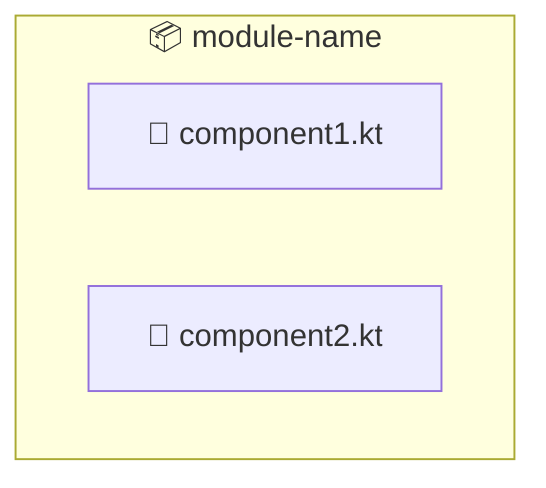
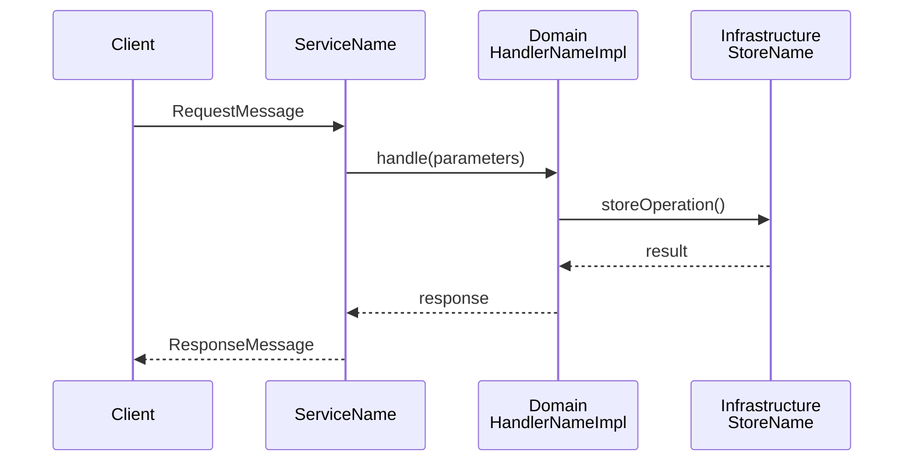
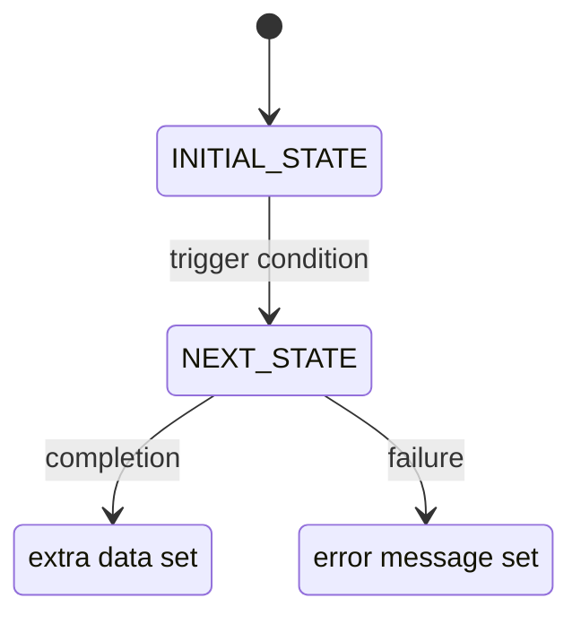

## What I do

Write and update technical documentation for ISMA modules following the established project style. Documentation is **architecture-focused**, **code-heavy**, and **diagram-rich** — it explains how the code works rather than describing what the code is.

## Style Rules

### Document Structure

Every module documentation set follows this file naming convention:

```
docs/<module-name>/
  README.md             — Quick navigation + quick start + key files
  01-overview.md        — Architecture overview, module structure, design principles, communication flows
  02-grpc-api.md        — API reference (RPCs, messages, error mapping) — only if module has gRPC
  03-domain-layer.md    — Domain entities, handlers, interfaces, DI
  04-infrastructure-layer.md — Concrete implementations, stores, executors, translators
  05-app-layer.md       — Entry point, service wiring, configuration, DI
  06-build-and-deployment.md — Build scripts, dependencies, startup/shutdown, deployment
```

Numbered files are ordered by dependency depth (infrastructure first, app last).

### Content Rules

1. **Start with purpose, not history.** First section after the title: "Purpose" or "Overview" — one paragraph explaining what the module does and why it exists.

2. **Show structure visually.** Always include a module tree diagram (text-based) or mermaid diagram early in the document. Use text trees for simple structures, mermaid for relationships or flows.

3. **Code over prose.** When explaining a class, interface, or function, show the code signature or body. Use fenced code blocks with the correct language tag (`kotlin`, `protobuf`, `kotlin`, `bash`, `xml`).

4. **Tables for structured data.** Use markdown tables for:
   - Handler/service method references (Parameter | Interface | Resolved from)
   - Error mappings (Exception | Status | Meaning)
   - Configuration parameters (Argument | Default | Description)
   - Dependency listings (Module | Provides | Used by)
   - API field definitions (Field | Type | Required | Description)

5. **Mermaid diagrams are mandatory** for:
   - Module dependency graphs (`flowchart LR` or `flowchart TB`)
   - Communication/sequence flows (`sequenceDiagram`)
   - State transitions (`stateDiagram-v2`)
   - Execution architecture (`flowchart TB` with class definitions)

6. **Reference concrete file paths.** Always cite exact paths:
   - `app/src/main/kotlin/.../Application.kt`
   - `domain/src/main/kotlin/.../DomainModule.kt`
   - `grpc/build.gradle.kts`

7. **Trace DI resolution.** When documenting the app layer, show the full dependency injection chain — which module provides which binding, and how services resolve their handlers.

8. **Error handling section.** Every module doc must include an "Error Mapping" or "Error Handling" section listing:
   - Which exceptions map to which gRPC statuses / HTTP codes
   - The exception-to-status mapping table

### Code Block Conventions

- Use `kotlin` for Kotlin code (all source files)
- Use `protobuf` for proto definitions
- Use `kotlin` for Gradle Kotlin DSL (`build.gradle.kts`)
- Use `bash` for commands and shell snippets
- Use `xml` for configuration files (logback.xml)

### Diagram Conventions



Use colored class definitions for:
- `grpc` — gRPC service implementations (blue)
- `handler` — domain handlers (purple)
- `store` — store/manager classes (orange)
- `external` — third-party / external dependencies (green)
- `hook` — lifecycle hooks (red)
- `action` — runtime operations (orange)

### Writing Style

- **Tense:** Present tense ("The handler retrieves...", "The server creates...")
- **Voice:** Active ("SimulationExecutorImpl orchestrates...", not "The simulation is orchestrated by...")
- **Brevity:** Prefer short paragraphs (2-4 sentences). Use bullet lists and tables over prose.
- **No filler words.** No introductions like "This document describes..." or "In this section we will...". Start directly with content.
- **Use `→` for flow.** Write "Component A → Component B → Component C" instead of "Component A calls Component B which then calls Component C".
- **Inline code:** Use backticks for code elements: `ConcurrentHashMap`, `single()`, `@get`, `.start()`

## Flow

### When creating new documentation

1. **Explore the source.** Read the module's `build.gradle.kts`, main class, DI modules, handler implementations, and store implementations.

2. **Identify the module's purpose.** What does it do? What does it depend on? What depends on it?

3. **Map the architecture.** Create a text tree of the directory structure. Identify mermaid diagram opportunities (dependencies, flows, state machines).

4. **Document in order:**
   - `README.md` — navigation, quick start commands, key file paths
   - Numbered docs following dependency order (infrastructure → domain → app)
   - Start each doc with a one-paragraph "Overview" or "Purpose" section

5. **Include these sections** (adapt per module):
   - Overview / Purpose
   - Module structure (text tree or mermaid)
   - Dependency diagram (mermaid `flowchart LR`)
   - Key interfaces and implementations (with code)
   - DI configuration (show the Koin module)
   - Communication flows (mermaid `sequenceDiagram`)
   - Error handling / error mapping
   - Build commands and configuration

6. **Verify completeness:**
   - [ ] README has navigation table and quick start
   - [ ] Each module has a text directory tree
   - [ ] Mermaid diagrams for dependencies, flows, or state
   - [ ] DI registration shown with `val xxxModule = module { ... }`
   - [ ] Handler/service method tables with parameters and return types
   - [ ] Error mapping section
   - [ ] Concrete file paths for all key files
   - [ ] Build commands in code blocks
   - [ ] Class styling in diagrams (`.classDef` blocks)

### When updating existing documentation

1. Read the existing doc and the current source code.
2. Identify stale sections — code blocks that no longer match the source, missing new methods/handlers, outdated diagrams.
3. Update affected sections in place. Add new sections only for genuinely new functionality.
4. Run `git diff` to verify only documentation files changed.

## Common Patterns

### Handler Reference Pattern

```markdown
### IHandlerName / HandlerNameImpl

**Purpose:** One-line description of what the handler does.

**Dependencies:**
- `IDependency` — what it provides and why
- `IAnotherDependency` — what it provides and why

**Flow:**
1. Step one description
2. Step two description
3. Step three description

**Parameters:** `ParameterClassName` data class:

```kotlin
data class ParameterClassName(
    val field1: Type,
    val field2: Type,
)
```

**Return:** `ReturnType` — description
```

### Interface Contract Pattern

```markdown
### IInterfaceName

```kotlin
interface IInterfaceName {
    fun method1(param: Type): ReturnType
    fun method2(param: Type): AnotherType
}
```

**Purpose:** One-line description of the contract's role.

**Implementation:** `ConcreteClassName` — brief note about the implementation.
```

### DI Registration Pattern

```markdown
### DI Configuration (`ModuleFile.kt`)

```kotlin
val moduleName = module {
    single<IHandler> { HandlerImpl(get(), get()) }
    single<IStore> { StoreImpl() }
}
```

All registrations use `single()` — singleton lifecycle.
```

### Sequence Diagram Pattern



### State Diagram Pattern



## References

- Project convention: `docs/isma-server/` — full example set
- Module doc entry point: `isma-server/AGENTS.md` — compact reference version
