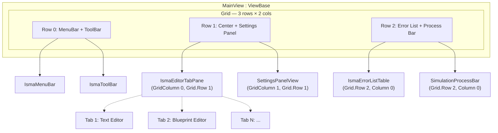
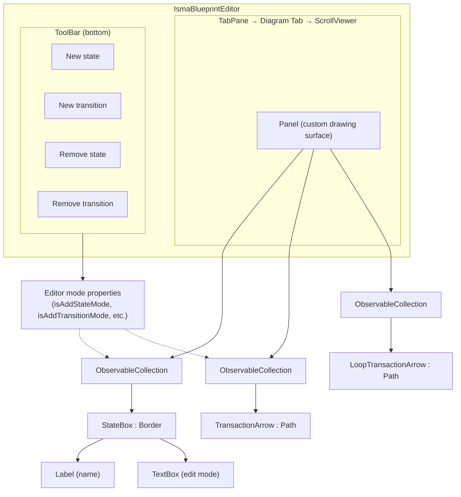
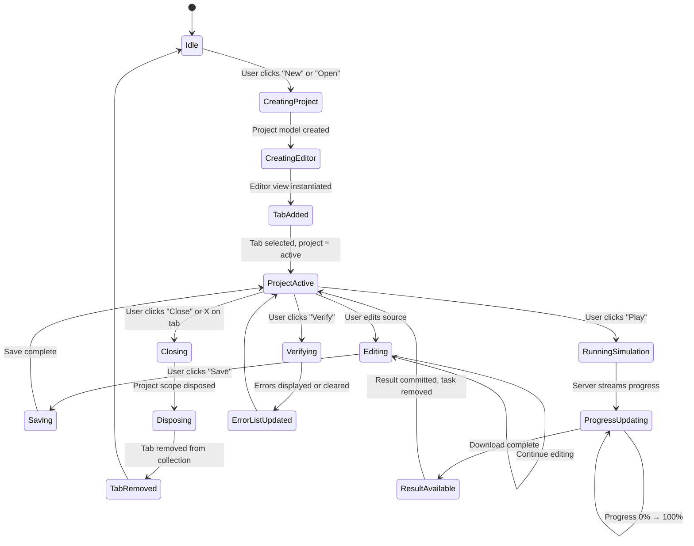

# ISMA-UI .NET/Avalonia Migration Plan

Complete guide for rewriting the Kotlin/JavaFX `isma-ui` application in C# using Avalonia with the `Avalonia.Markup.Declarative` library for code-only UI definition.

---

## Table of Contents

1. [Overview](#1-overview)
2. [Architecture Mapping](#2-architecture-mapping)
3. [Module Structure](#3-module-structure)
4. [Build System Migration](#4-build-system-migration)
5. [Phase-by-Phase Plan](#5-phase-by-phase-plan)
6. [Module Details](#6-module-details)
7. [UI/UX Implementation — Avalonia Fluent Design](#7-uiux-implementation--avalonia-fluent-design)
8. [Communication with Server](#8-communication-with-server)
9. [Known Challenges and Solutions](#9-known-challenges-and-solutions)
10. [Migration Checklist](#10-migration-checklist)

---

## 1. Overview

### Current State

| Aspect | Current (Kotlin/JavaFX) | Target (.NET/Avalonia) |
|---|---|---|
| Language | Kotlin 2.3.20 | C# 13 / .NET 10 |
| UI Framework | JavaFX 25.0.2 + TornadoFX | Avalonia 12 + Avalonia.Markup.Declarative |
| Rich Text Editor | RichTextFX (`CodeArea`) | Avalonia TextEditor / custom `TextInput` |
| Visual Canvas | JavaFX `Canvas` / `Region` | Avalonia `DrawingContext` / `Webview` / custom `Panel` |
| DI | Koin 4.2.0 | Microsoft.Extensions.DependencyInjection |
| MVVM | Manual (INotifyPropertyChanged) | CommunityToolkit.Mvvm 8.4+ or ReactiveUI |
| Build | Gradle Kotlin DSL | MSBuild (.csproj) |
| IPC | gRPC over Unix Domain Sockets (Netty/Epoll) | gRPC over Unix Domain Sockets (Grpc.Net.Client) |
| HTTP Client | Ktor CIO | HttpClient / Grpc.Net.Client |
| Reactive | Kotlinx Coroutines Flow | System.Reactive / CommunityToolkit.Mvvm Observables |

### Core Principle

Use **Avalonia.Markup.Declarative** for all UI definition — zero XAML files. UI is built entirely in C# using fluent builder methods:

```csharp
// Current Kotlin/JavaFX (TornadoFX style)
class MainView : View(BorderPane::class) {
    val menuBar by buttonBar {
        menuBar()
    }
    center = ismaEditorTabPane
}

// Target C# (Avalonia.Markup.Declarative)
public class MainView : ViewBase<MainViewModel>
{
    protected override object Build(MainViewModel vm) =>
        new BorderPanel()
            .Top(new IsmaMenuBar().DataContext(vm))
            .Center(new IsmaEditorTabPane().DataContext(vm));
}
```

### Migration Strategy

- **Module-by-module port**: Each isma-ui Gradle subproject maps to a separate .NET project
- **Vertical slice approach**: Start with the app shell, then add editors, then domain features
- **No XAML**: All views use `ViewBase` / `ViewBase<TViewModel>` with `Build()` methods
- **Keep server communication intact**: gRPC and HTTP clients use the same protobuf contracts

---

## 2. Architecture Mapping

### 2.1 MVVM Architecture

```
+------------------+     +---------------------+     +-------------------+
|   View Layer     |     |   ViewModel Layer   |     |   Service Layer   |
|  (Avalonia UI)   |     |  (CTK.MVVM / RxUI)  |     |  (Business Logic) |
|                  |     |                     |     |                   |
| MainView         |<--->| MainViewModel       |<--->| SimulationService |
| IsmaMenuBar      |<--->| SettingsViewModel   |<--->| ProjectService    |
| IsmaEditorTabPane|<--->| EditorTabViewModel  |<--->| LismaPdeService   |
| IsmaToolBar      |<--->| SimulationViewModel |<--->| PreferencesMgr    |
| SimulationProgress|<--->| ErrorListViewModel |<--->|                   |
+------------------+     +---------------------+     +-------------------+
```

### 2.2 Component Dependencies (Target)

```
isima-grpc/              (Grpc.Core.Api, Google.Protobuf, Grpc.Net.Client)
   ^
   |
external-services/       (depends on grpc, domain, Grpc.Net.Client, HttpClient)
   ^
   |
domain/                  (pure C#, only System.Text.Json + System.Reactive)
   ^
   |
text-editor/             (depends on Avalonia, CommunityToolkit.Mvvm)
   ^
   |
blueprint-editor/        (depends on Avalonia, System.Text.Json)
   ^
   |
toolkit/                 (depends on Avalonia)
   ^
   |
app/                     (depends on ALL above + Microsoft.Extensions.DependencyInjection)
```

---

## 3. Module Structure

### 3.1 Gradle → MSBuild Mapping

| Gradle Module | .NET Project | Namespace |
|---|---|---|
| `isma-ui/grpc/` | `Isma.Grpc` | `Nsqt.Isma.Contracts.Simulation` |
| `isma-ui/domain/` | `Isma.Domain` | `Nsqt.Isma.Domain` |
| `isma-ui/external-services/` | `Isma.ExternalServices` | `Nsqt.Isma.ExternalServices` |
| `isma-ui/toolkit/` | `Isma.Toolkit` | `Nsqt.Isma.Toolkit` |
| `isma-ui/text-editor/` | `Isma.TextEditor` | `Nsqt.Isma.TextEditor` |
| `isma-ui/blueprint-editor/` | `Isma.BlueprintEditor` | `Nsqt.Isma.BlueprintEditor` |
| `isma-ui/app/` | `Isma.App` | `Nsqt.Isma.App` |

### 3.2 Directory Layout

```
isma-dotnet/
  Isma.Domain/
    SimulationResult.cs
    SimulationPoint.cs
    SimulationMetadata.cs
    SimulationProgress.cs
    MetricData.cs
    SimulationResultReader.cs
    IEquationIndexProvider.cs
  Isma.Grpc/
    (generated gRPC stubs from protobuf)
  Isma.ExternalServices/
    GrpcSimulationClient.cs
    GrpcLismaCompilerClient.cs
    HttpSimulationClient.cs
    SimulationServerManager.cs
    SimulationServerFacade.cs
    RunSimulationParams.cs
    BinaryFilePointProvider.cs
    BinaryEquationIndexProvider.cs
  Isma.Toolkit/
    PropertiesGrid.cs
    Extensions/
      ListViewExtensions.cs
      ComboBoxExtensions.cs
      PropertiesExtensions.cs
      FlowExtensions.cs
  Isma.TextEditor/
    IsmaTextEditor.cs          (extends Avalonia TextInput)
    IHighlightingService.cs
    RemoteLismaHighlightingService.cs
    ISyntaxHighlighter.cs
  Isma.BlueprintEditor/
    IsmaBlueprintEditor.cs     (custom Panel with drawing)
    StateBox.cs                (Border-based node)
    TransactionArrow.cs        (Path-based arrow)
    LoopTransactionArrow.cs    (Path-based loop arrow)
    EditArrowPopOver.cs        (ContentControl popover)
    BlueprintModel.cs
    BlueprintStateModel.cs
    BlueprintTransactionModel.cs
    BlueprintLoopTransactionModel.cs
    NameChangingMonitor.cs
  Isma.App/
    App.axaml                  (only theme/resources — no views)
    App.xaml.cs                 (startup, DI, server lifecycle)
    MainView.cs                 (ViewBase<MainViewModel>)
    MainViewModel.cs
    IsmaEditorTabPane.cs
    IsmaMenuBar.cs
    IsmaToolBar.cs
    SimulationProcessBar.cs
    IsmaErrorListTable.cs
    SettingsPanelView.cs
    ProjectService.cs
    SimulationService.cs
    LismaPdeService.cs
    PreferencesProvider.cs
    DependecyInjectionRootModule.cs
```

> **Note:** `App.axaml` is the *only* XAML file needed — for application-level resources and theme. All views are declarative C#.

---

## 4. Build System Migration

### 4.1 Directory Structure

```
isma-ui-dotnet/
  Isma.sln
  Directory.Build.props          (common properties)
  Directory.Packages.props       (central package management)
  Isma.Domain/Isma.Domain.csproj
  Isma.Grpc/Isma.Grpc.csproj
  Isma.ExternalServices/Isma.ExternalServices.csproj
  Isma.Toolkit/Isma.Toolkit.csproj
  Isma.TextEditor/Isma.TextEditor.csproj
  Isma.BlueprintEditor/Isma.BlueprintEditor.csproj
  Isma.App/Isma.App.csproj
  protobuf-contracts/            (shared, unchanged)
```

### 4.2 Key csproj Examples

**Isma.Domain.csproj** — Pure domain, no UI:
```xml
<Project Sdk="Microsoft.NET.Sdk">
  <PropertyGroup>
    <TargetFramework>net10.0</TargetFramework>
    <OutputType>Library</OutputType>
    <ImplicitUsings>enable</ImplicitUsings>
    <Nullable>enable</Nullable>
  </PropertyGroup>
  <ItemGroup>
    <PackageReference Include="System.Reactive" Version="6.1.0" />
  </ItemGroup>
</Project>
```

**Isma.Grpc.csproj** — gRPC stubs from protobuf:
```xml
<Project Sdk="Microsoft.NET.Sdk">
  <PropertyGroup>
    <TargetFramework>net10.0</TargetFramework>
    <OutputType>Library</OutputType>
    <ProduceReferenceAssembly>true</ProduceReferenceAssembly>
  </PropertyGroup>
  <ItemGroup>
    <PackageReference Include="Google.Protobuf" Version="3.29.3" />
    <PackageReference Include="Grpc.Net.Client" Version="2.67.0" />
    <PackageReference Include="Grpc.Tools" Version="2.67.0" PrivateAssets="All" />
  </ItemGroup>
  <ItemGroup>
    <Protobuf Include="..\protobuf-contracts\simulation\*.proto" GrpcServices="Client" />
  </ItemGroup>
</Project>
```

**Isma.App.csproj** — Main application:
```xml
<Project Sdk="Microsoft.NET.Sdk">
  <PropertyGroup>
    <TargetFramework>net10.0</TargetFramework>
    <OutputType>WinExe</OutputType>
    <Nullable>enable</Nullable>
    <Configurations>Debug;Release</Configurations>
    <BaseOutputPath>..\build\</BaseOutputPath>
  </PropertyGroup>
  <ItemGroup>
    <PackageReference Include="Avalonia.Desktop" Version="12.0.0" />
    <PackageReference Include="Avalonia.Themes.Fluent" Version="12.0.0" />
    <PackageReference Include="Avalonia.Diagnostics" Version="12.0.0" Condition="'$(Configuration)'=='Debug'" />
    <PackageReference Include="Avalonia.Markup.Declarative" Version="latest" />
    <PackageReference Include="Avalonia.Markup.Declarative.SourceGenerator" Version="latest" OutputItemType="Analyzer" />
    <PackageReference Include="CommunityToolkit.Mvvm" Version="8.4.2" />
    <PackageReference Include="Microsoft.Extensions.DependencyInjection" Version="10.0.5" />
  </ItemGroup>
  <ItemGroup>
    <ProjectReference Include="..\Isma.ExternalServices\Isma.ExternalServices.csproj" />
    <ProjectReference Include="..\Isma.BlueprintEditor\Isma.BlueprintEditor.csproj" />
    <ProjectReference Include="..\Isma.TextEditor\Isma.TextEditor.csproj" />
    <ProjectReference Include="..\Isma.Toolkit\Isma.Toolkit.csproj" />
    <ProjectReference Include="..\Isma.Domain\Isma.Domain.csproj" />
    <ProjectReference Include="..\Isma.Grpc\Isma.Grpc.csproj" />
  </ItemGroup>
</Project>
```

### 4.3 Central Package Management

**Directory.Packages.props:**
```xml
<Project>
  <PropertyGroup>
    <ManagePackageVersionsPerTargetFramework>true</ManagePackageVersionsPerTargetFramework>
  </PropertyGroup>
  <ItemGroup>
    <PackageVersion Include="Avalonia.Desktop" Version="12.0.0" />
    <PackageVersion Include="Avalonia.Themes.Fluent" Version="12.0.0" />
    <PackageVersion Include="Avalonia.Diagnostics" Version="12.0.0" />
    <PackageVersion Include="Avalonia.Markup.Declarative" Version="1.0.0" />
    <PackageVersion Include="Avalonia.Markup.Declarative.SourceGenerator" Version="1.0.0" />
    <PackageVersion Include="CommunityToolkit.Mvvm" Version="8.4.2" />
    <PackageVersion Include="Microsoft.Extensions.DependencyInjection" Version="10.0.5" />
    <PackageVersion Include="Grpc.Net.Client" Version="2.67.0" />
    <PackageVersion Include="Google.Protobuf" Version="3.29.3" />
    <PackageVersion Include="Grpc.Tools" Version="2.67.0" />
    <PackageVersion Include="System.Reactive" Version="6.1.0" />
    <PackageVersion Include="Tmds.DBus" Version="4.0.0" />
  </ItemGroup>
</Project>
```

---

## 5. Phase-by-Phase Plan

### Phase 0: Foundation and Validation

**Goal:** Verify the .NET runtime and Avalonia toolchain works on the target system.

1. Install .NET 10 SDK
2. Create `Isma.App` with minimal `App.axaml` + `App.xaml.cs`
3. Verify Avalonia renders a window
4. Set up `Directory.Build.props` and `Directory.Packages.props`
5. Configure DI container (`IServiceProvider`)
6. Integrate `Avalonia.Markup.Declarative` source generator
7. Verify hot reload works

**Deliverable:** Empty window with Fluent theme, DI working, source generator producing extension methods.

---

### Phase 1: Domain and gRPC Layer

**Goal:** Port the pure domain models and gRPC communication layer — these have no UI dependencies.

#### 1.1 Domain Models (`Isma.Domain`)

| Kotlin Type | C# Equivalent |
|---|---|
| `SimulationResult` | `record SimulationResult(Guid SimulationId, byte[] Data)` |
| `SimulationPoint` | `record SimulationPoint(double[] X, double[] YForDe, double[] Rhs)` |
| `SimulationMetadata` | `record SimulationMetadata(IReadOnlyList<string> ColumnNames)` |
| `SimulationProgress` | `record SimulationProgress(DateTime StartTime, DateTime EndTime, DateTime CurrentTime)` |
| `MetricData` | `record MetricData(string Name, double ElapsedTime)` |
| `SimulationResultReader` (interface) | `ISimulationResultReader` interface |
| `SimulationPoint` (interface) | `ISimulationPointProvider` interface |
| `IEquationIndexProvider` (interface) | `IEquationIndexProvider` interface |

Use `record` types for immutable data models (equivalent to Kotlin data classes).

#### 1.2 gRPC Clients (`Isma.Grpc`)

- Re-generate gRPC stubs from `protobuf-contracts/simulation/` using `Grpc.Tools`
- The proto files are shared with the server — no changes needed

#### 1.3 External Services (`Isma.ExternalServices`)

| Kotlin Class | C# Equivalent | Changes |
|---|---|---|
| `GrpcSimulationClient` | `GrpcSimulationClient` | Use `Grpc.Net.Client` with `HttpHandler` for Unix sockets (`UnixDomainSocketConnectionFactory`) |
| `GrpcLismaCompilerClient` | `GrpcLismaCompilerClient` | Same pattern |
| `HttpSimulationClient` | `HttpSimulationClient` | Use `HttpClient` with `SocketsHttpHandler` + Unix socket |
| `SimulationServerManager` | `SimulationServerManager` | `Process.Start()` instead of `ProcessBuilder` |
| `SimulationServerFacade` | `SimulationServerFacade` | Same orchestration, use `Task` instead of `Flow` |
| `BinaryFilePointProvider` | `BinaryFilePointProvider` | Same binary reader logic |
| `BinaryEquationIndexProvider` | `BinaryEquationIndexProvider` | Same logic |

**Coroutines → Task/async-await mapping:**

| Kotlin | C# |
|---|---|
| `suspend fun` | `async Task<T>` |
| `Flow<T>` | `IObservable<T>` (System.Reactive) or `Channel<T>` (System.Threading.Channels) |
| `launch { }` | `Task.Run(async () => { })` or `CancellationToken`-based cancellation |
| `CoroutineDispatcher` | `SynchronizationContext` or `TaskScheduler` |
| `VirtualThreadPerTaskExecutor` | `ThreadPool` (virtual threads not needed in .NET) |

---

### Phase 2: Toolkit and Shared UI Components

**Goal:** Port shared utility components with no business logic.

#### 2.1 PropertiesGrid (`Isma.Toolkit`)

| Kotlin | C# |
|---|---|
| `GridPane` | `Grid` |
| `DoubleProperty` | `BindableBase` property + `NumericUpDown` |
| `IntegerProperty` | `BindableBase` property + `NumericUpDown` |
| `StringProperty` | `BindableBase` property + `TextBox` |
| `BooleanProperty` | `BindableBase` property + `CheckBox` |
| `ColorProperty` | `BindableBase` property + `ColorPicker` |
| `ComboBox` | `ComboBox` |

Implementation pattern:
```csharp
public class PropertiesGrid : ViewBase<PropertiesGridViewModel>
{
    private readonly Dictionary<PropertyItem, Grid> _rows = new();

    protected override object Build(PropertiesGridViewModel vm) =>
        new ScrollViewer()
            .Content(
                new Grid()
                    .Rows(vm!.PropertyItems.Select(_ => "Auto").ToArray())
                    .ColumnDefinitions(
                        new ColumnDefinition().Width(150),
                        new ColumnDefinition().Width(GridLength.Star)
                    )
                    .Children(vm.PropertyItems.Select((item, row) =>
                        CreatePropertyRow(item, row)
                    ).ToArray())
            );

    private Grid CreatePropertyRow(PropertyItem item, int row)
    {
        var nameLabel = new TextBlock()
            .Text(item.Label)
            .Grid().Row(row).Column(0);

        var control = item switch
        {
            DoubleProperty p => new NumericUpDown()
                .Minimum(0)
                .ValueChanged((_, e) => p.Value = e.NewValue),
            // ... other cases
        };

        return new Grid()
            .Children(nameLabel, control)
            .Grid().Row(row);
    }
}
```

#### 2.2 Extensions

| Kotlin Extension | C# Extension |
|---|---|
| `ListView<T>.bindItems()` | `ObservableCollection<T>.ToObservable()` + `ItemsControl.ItemsSource` binding |
| `ComboBox` helpers | `ComboBox.ItemsSource` + `SelectedValuePath` / `DisplayMemberPath` bindings |

---

### Phase 3: Text Editor

**Goal:** Port the LISMA source code text editor with remote syntax highlighting.

#### 3.1 IsmaTextEditor

| Kotlin | C# |
|---|---|
| `CodeArea` (RichTextFX) | `TextInput` (Avalonia) or `TextEditor` (AvaloniaEdit) |
| `InlineCssTextArea` | `TextEditor` with `ICSharpCode.AvalonEdit` highlighting |
| `Gutter` (line numbers) | `TextEditor.LeftMargin` or custom `LineNumbers` gutter |

**Recommendation:** Use **AvaloniaEdit** (`ICSharpCode.AvalonEdit`) for rich text editing with syntax highlighting. It is the equivalent of RichTextFX for Avalonia.

```csharp
// IsmaTextEditor.cs
public class IsmaTextEditor : ViewBase<LismaProjectViewModel>
{
    private TextEditor _textEditor = null!;
    private TextArea _textArea = null!;

    protected override object Build(LismaProjectViewModel vm)
    {
        _textEditor = new TextEditor()
            .SyntaxHighlighting(new XmlSyntaxHighlighting()) // replaced by RemoteLismaHighlightingService
            .FontFamily(FontFamily.GenericMonospace)
            .FontSize(14)
            .Text(vm!.SourceText)
            .TextChanged((_, _) => vm.OnTextChanged(_textEditor.Text))
            .With(_textArea => _textArea = _textEditor.TextArea);

        return _textEditor;
    }
}
```

#### 3.2 RemoteLismaHighlightingService

The service calls the server for tokenization and maps tokens to AvaloniaEdit highlight spans.

| Kotlin | C# |
|---|---|
| `IHighlightingService` interface | `IHighlightingService` interface |
| `RemoteLismaHighlightingService` | Same — gRPC call → syntax color mapping |
| `ISyntaxHighlighter` | Same — generated gRPC client interface |

---

### Phase 4: Blueprint Editor (Visual Statechart)

**Goal:** Port the visual statechart/canvas editor.

#### 4.1 Canvas Architecture

| Kotlin | C# |
|---|---|
| JavaFX `Canvas` + `GraphicsContext` | Avalonia `Panel` + override `OnRender(DrawingContext)` |
| `Region`-based nodes (`StateBox`) | Avalonia `Border` with `DragDelta` handlers |
| `Path` for arrows | Avalonia `Path` control |
| `Popup` for popover | Avalonia `Popup` or `ContentControl` with `IsVisible` |

#### 4.2 IsmaBlueprintEditor

```csharp
public class IsmaBlueprintEditor : ViewBase<BlueprintEditorViewModel>
{
    // All visual children are drawn in OnRender
    // StateBox, TransactionArrow, etc. are Border/Path controls

    protected override object Build(BlueprintEditorViewModel vm)
    {
        // Container for interactive elements
        var canvas = new Panel()
            .Background(Brushes.White)
            .PointerWheelChanged((_, e) => HandleScroll(e))
            .With(() => RegisterDragDrop(canvas, vm));

        // Add state boxes
        foreach (var state in vm!.States)
        {
            var stateBox = new StateBox()
                .DataContext(state)
                .Position(state.X, state.Y)
                .Size(150, 80);

            canvas.Children.Add(stateBox);
        }

        return canvas;
    }
}
```

#### 4.3 StateBox

```csharp
public class StateBox : Border
{
    public StateBox()
    {
        this.CornerRadius = new CornerRadius(8);
        this.BorderBrush = Brushes.Black;
        this.BorderThickness = new Thickness(2);
        this.Background = Brushes.White;
        this.Padding = new Thickness(12);

        // Drag behavior
        this.PointerMoved += (s, e) => { /* drag logic */ };
        this.PointerPressed += (s, e) => { /* start drag */ };
        this.PointerReleased += (s, e) => { /* end drag */ };
    }
}
```

#### 4.4 TransactionArrow / LoopTransactionArrow

Use Avalonia `Path` with custom `PathGeometry`:

```csharp
public class TransactionArrow : ViewBase<TransactionModel>
{
    protected override object Build(TransactionModel vm) =>
        new Path()
            .Data(CreateArrowGeometry(vm.StartX, vm.StartY, vm.EndX, vm.EndY))
            .Stroke(Brushes.Black)
            .StrokeThickness(2)
            .Fill(Brushes.Transparent);

    private StreamGeometry CreateArrowGeometry(double x1, double y1, double x2, double y2)
    {
        // Compute arrow path geometry with arrowhead
        // Equivalent to JavaFX Path.moveTo() / hLineTo() / vLineTo()
        var fig = new PathFigure();
        fig.StartPoint = new Point(x1, y1);
        // ... build segments
        return new StreamGeometry(new[] { fig });
    }
}
```

#### 4.5 EditArrowPopOver

```csharp
public class EditArrowPopOver : ViewBase<TransitionEditViewModel>
{
    protected override object Build(TransitionEditViewModel vm) =>
        new Popup()
            .IsOpen(vm.IsVisible)
            .PlacementTarget(this)
            .PlacementMode(PopupPlacementMode.Pointer)
            .Child(
                new BorderPanel()
                    .Padding(8)
                    .Background(Brushes.White)
                    .BorderBrush(Brushes.Gray)
                    .BorderThickness(1)
                    .CornerRadius(new CornerRadius(4))
                    .Child(
                        new StackPanel()
                            .Children(
                                new TextBox()
                                    .Text(vm, x => x.Condition)
                                    .Margin(0, 0, 0, 8),
                                new Button()
                                    .Content("OK")
                                    .OnClick(_ => vm.Confirm())
                            )
                    )
            );
}
```

#### 4.6 BlueprintModel (Serialization)

| Kotlin | C# |
|---|---|
| `@Serializable` | `[JsonSerializable]` or `[DataContract]` |
| Kotlinx Serialization | `System.Text.Json` with `JsonSerializer` |
| `BlueprintModel` | `record BlueprintModel(...)` with `[JsonPropertyName]` |

---

### Phase 5: Application Shell and Main View

**Goal:** Port the main application window, menu bar, toolbar, tab pane, simulation progress, error list, and settings panel.

#### 5.1 Application Entry Point

| Kotlin | C# |
|---|---|
| `IsmaApplication : Application()` | `Program.cs` with `AppBuilder.Configure<App>()` |
| `application.start(primaryStage)` | `AppBuilder.StartDesktop()` |

**Program.cs:**
```csharp
using Avalonia;
using Avalonia.Markup.Declarative;
using Microsoft.Extensions.DependencyInjection;

namespace Nsqt.Isma.App;

public static class Program
{
    public static AppBuilder BuildAvaloniaApp() =>
        AppBuilder.Configure<App>()
            .UsePlatformDetect()
            .With(new Win32Options() { UseWsi = true })
            .LogToTrace();

    public static int Main(string[] args)
    {
        var services = new ServiceCollection();
        // Register all services (equivalent to Koin modules)
        services.AddIsmaServices();

        var serviceProvider = services.BuildServiceProvider();

        return BuildAvaloniaApp()
            .UseServiceProvider(serviceProvider)
            .UseComponentControlFactory(
                (type, factory) => (Control)ActivatorUtilities.CreateInstance(serviceProvider, type))
            .StartWithLifetime(typeof(Program).Assembly, args);
    }
}
```

#### 5.2 App.axaml (Only XAML file)

```xml
<Application xmlns="https://github.com/avaloniaui"
             xmlns:x="http://schemas.microsoft.com/winfx/2006/xaml"
             x:Class="Nsqt.Isma.App.App">
    <Application.Styles>
        <FluentTheme />
    </Application.Styles>
    <Application.Resources>
        <!-- Shared resources -->
    </Application.Resources>
</Application>
```

#### 5.3 DI Registration (equivalent to Koin modules)

| Kotlin Koin Module | C# Extension Method |
|---|---|
| `simulationServerModule` | `AddSimulationServerServices(this IServiceCollection)` |
| `appServicesModule` | `AddAppServices(this IServiceCollection)` |
| `toolbarsModule` | `AddToolbarComponents(this IServiceCollection)` |
| `mainViewModule` | `AddMainViewComponents(this IServiceCollection)` |
| `settingsPanelModule` | `AddSettingsPanelComponents(this IServiceCollection)` |
| `editorTabPaneModule` | `AddEditorTabPaneComponents(this IServiceCollection)` |
| `lismaTextEditorModule` | `AddLismaEditorComponents(this IServiceCollection)` |
| `blueprintEditorModule` | `AddBlueprintEditorComponents(this IServiceCollection)` |

**Koin scoping** (`scope<ProjectModel> { scoped { IsmaTextEditor } }`) maps to scoped DI:

```csharp
// Koin: scope<ProjectModel> { scoped { ismaTextEditor() } }
// C#:
services.AddScoped<LismaTextEditor>(); // Scoped per project (managed manually)
```

#### 5.4 MainView

```csharp
public class MainView : ViewBase<MainViewModel>
{
    protected override object Build(MainViewModel vm) =>
        new BorderPanel()
            .Top(
                new IsmaMenuBar()
                    .DataContext(vm)
            )
            .Center(
                new IsmaEditorTabPane()
                    .DataContext(vm)
            )
            .Bottom(
                new Grid()
                    .Children(
                        new SimulationProcessBar()
                            .DataContext(vm)
                            .Grid().Row(0).Column(0),
                        new IsmaErrorListTable()
                            .DataContext(vm)
                            .Grid().Row(1).Column(0),
                        new SettingsPanelView()
                            .DataContext(vm)
                            .Grid().Row(0).Column(1)
                    )
                    .Grid().Rows("*, Auto")
            );
}
```

#### 5.5 ViewModels

| Kotlin ViewModel | C# ViewModel | Pattern |
|---|---|---|
| `CauchyInitialsViewModel` | `CauchyInitialsViewModel` | `[ObservableProperty]` |
| `EventDetectionParametersViewModel` | `EventDetectionParametersViewModel` | `[ObservableProperty]` |
| `IntegrationMethodParametersViewModel` | `IntegrationMethodParametersViewModel` | `[ObservableProperty]` |
| `SimulationParametersViewModel` | `SimulationParametersViewModel` | `[ObservableProperty]` |
| `MainViewModel` | `MainViewModel` | `[INotifyPropertyChanged]` |

**CTK.MVVM property pattern:**

```kotlin
// Kotlin
class CauchyInitialsViewModel : ViewModel() {
    val initialValues: ObservableList<InitialValueModel> = observableArrayList()
    var selectedMethod: IntegrationMethod? = null
}
```

```csharp
// C#
public partial class CauchyInitialsViewModel : ObservableObject
{
    [ObservableProperty]
    private ObservableCollection<InitialValueModel> _initialValues = new();

    [ObservableProperty]
    private IntegrationMethod? _selectedMethod;

    // [ObservableProperty] handles INotifyPropertyChanged automatically
}
```

---

### Phase 6: Server Lifecycle Integration

**Goal:** Replicate the out-of-process server launch and Unix socket communication.

#### 6.1 SimulationServerManager

| Kotlin | C# |
|---|---|
| `ProcessBuilder` | `Process.Start()` |
| `stdout` parsing for socket paths | `Process.StandardOutput` with `StreamReader` |
| `Runtime.getRuntime().addShutdownHook` | `AppDomain.CurrentDomain.ProcessExit` |
| `serverFacade.shutdown()` | `Process.Kill()` / graceful stop via gRPC |

```csharp
public class SimulationServerManager : IDisposable
{
    private Process? _serverProcess;

    public async Task StartAsync()
    {
        var startInfo = new ProcessStartInfo
        {
            FileName = ServerScriptPath,
            RedirectStandardOutput = true,
            RedirectStandardError = true,
            UseShellExecute = false
        };

        _serverProcess = Process.Start(startInfo);

        // Parse Unix socket paths from stdout
        var output = await _serverProcess!.StandardOutput.ReadToEndAsync();
        var socketPaths = ParseSocketPaths(output);

        // Connect gRPC and HTTP clients
        _grpcClient = new GrpcSimulationClient(socketPaths.GrpcSocket);
        _httpClient = new HttpSimulationClient(socketPaths.HttpSocket);
    }

    public void Dispose()
    {
        _serverProcess?.Kill();
        _serverProcess?.Dispose();
    }
}
```

#### 6.2 Unix Domain Socket for gRPC

```csharp
// UnixDomainSocketConnectionFactory.cs
public class UnixDomainSocketConnectionFactory : HttpConnectionFactoryBase
{
    private readonly string _socketPath;

    public UnixDomainSocketConnectionFactory(string socketPath)
    {
        _socketPath = socketPath;
    }

    protected override async Task<Stream> CreateStreamAsync(SocketsHttpConnectionContext context, CancellationToken cancellationToken)
    {
        var socket = new Socket(AddressFamily.Unix, SocketType.Stream, ProtocolType.Unspecified);
        await socket.ConnectAsync(_socketPath, cancellationToken);
        return new NetworkStream(socket);
    }
}

// Usage in GrpcSimulationClient:
var handler = new SocketsHttpHandler
{
    ConnectionFactory = new UnixDomainSocketConnectionFactory(socketPath)
};
var channel = GrpcChannel.ForAddress("http://localhost", new GrpcChannelOptions { HttpHandler = handler });
var client = new SimulationService.SimulationServiceClient(channel);
```

---

### Phase 7: Polish and Cross-Platform

**Goal:** Finalize the migration — cross-platform testing, theming, error handling.

1. Test on Windows (using named pipes or TCP for IPC)
2. Test on macOS
3. Add dark/light theme support (FluentTheme has built-in variants)
4. Add application icons
5. Add window management (minimize, maximize, close)
6. Add tray icon (optional)
7. Add about dialog
8. Error handling and logging (Serilog or Microsoft.Extensions.Logging)
9. Unit tests (xUnit or NUnit)

---

## 6. Module Details

### 6.1 Domain Module

**Key type conversions:**

```kotlin
// Kotlin
data class SimulationPoint(
    val x: DoubleArray,
    val yForDe: DoubleArray,
    val rhs: DoubleArray
) : Serializable
```

```csharp
// C#
public record SimulationPoint(
    double[] X,
    double[] YForDe,
    double[] Rhs
);
```

### 6.2 Reactive/Async Mapping

| Kotlin/Coroutines | C# / .NET |
|---|---|
| `Flow<T>` | `IObservable<T>` (System.Reactive) |
| `MutableStateFlow<T>` | `Subject<T>` (Rx) or `Channel<T>` |
| `collect { }` | `Subscribe()` (Rx) or `await foreach` (Channel) |
| `lifecycleScope.launch` | `using var ct = CancellationTokenSource(); Task.Run(...)` |
| `withContext(Dispatchers.Main)` | `Dispatcher.UIThread.Post(() => ...)` or `SynchronizationContext` |
| `ViewModel.viewModelScope` | `IDisposable` / `CancellationToken` in ViewModel |

### 6.3 Collection Types

| Kotlin | C# |
|---|---|
| `ObservableList<T>` | `ObservableCollection<T>` |
| `MutableMap<K, V>` | `Dictionary<K, V>` |
| `Map<K, V>` | `ImmutableDictionary<K, V>` or ` IReadOnlyDictionary<K, V>` |
| `mutableListOf()` | `new ObservableCollection<T>()` |

---

## 7. UI/UX Implementation — Avalonia Fluent Design

This section bridges the UX specification (`docs/isma-ui/06-ux-reference.md`) with concrete Avalonia implementation steps. The goal is **feature parity with the original JavaFX UI** while using **Avalonia Fluent design** for a native Windows/macOS/Linux appearance.

### 7.0 Fluent Theming Strategy

The original JavaFX UI uses minimal custom CSS (only syntax highlighting colors). The Avalonia replacement leverages `Avalonia.Themes.Fluent` for all chrome while preserving the original layout, interaction patterns, and feature set.

```xml
<!-- App.axaml — only XAML file, theme entry point -->
<Application xmlns="https://github.com/avaloniaui"
             xmlns:x="http://schemas.microsoft.com/winfx/2006/xaml"
             x:Class="Nsqt.Isma.App.App">
    <Application.Styles>
        <FluentTheme />
        <!-- Dark theme variant — uncomment for dark mode -->
        <!-- <FluentTheme ThemeVariant="Dark" /> -->
    </Application.Styles>
    <Application.Resources>
        <Thickness x:Key="WindowContentMargin">8</Thickness>
        <cor:DoubleCollection x:Key="TabItemCornerRadius">4</cor:DoubleCollection>
    </Application.Resources>
</Application>
```

**Theme behavior:**
- Fluent theme auto-detects OS theme preference (light/dark) on Windows 10/11, macOS, and Linux
- Syntax highlighting colors (orange keywords, gray comments, blue numbers) remain unchanged — they are editor-level, not theme-level
- All window chrome uses the OS-native title bar (Fluent handles this automatically)
- Minimum window size: 500×600

### 7.1 Main Window Layout

#### 7.1.1 Shell Architecture

The original JavaFX `MainView` uses `BorderPane`. In Avalonia, there is no direct `BorderPane` — we replicate the five-region layout using a `Grid`:



**Implementation — `MainView.cs`:**

```csharp
public class MainView : ViewBase<MainViewModel>
{
    protected override object Build(MainViewModel vm) =>
        new Grid()
            .ColumnDefinitions(
                new ColumnDefinition().Width(GridLength.Star),  // Editor area
                new ColumnDefinition().Width(240)                // Settings panel
            )
            .Rows(
                "Auto",  // Row 0: MenuBar + ToolBar
                "*",    // Row 1: Editor + Settings
                "Auto"   // Row 2: Error List + Process Bar
            )
            .Children(
                // Row 0: Menu bar stacked above toolbar
                new Panel()
                    .Margin(0, 4, 0, 4)
                    .Children(
                        new IsmaMenuBar().DataContext(vm),
                        new IsmaToolBar().DataContext(vm)
                    )
                    .Grid().Row(0).Column(0).ColumnSpan(2),

                // Row 1: Editor area (left) + Settings panel (right)
                new IsmaEditorTabPane().DataContext(vm)
                    .Grid().Row(1).Column(0),

                new SettingsPanelView().DataContext(vm)
                    .Grid().Row(1).Column(1),

                // Row 2: Error list (top) + Process bar (bottom)
                new IsmaErrorListTable().DataContext(vm)
                    .Grid().Row(2).Column(0),

                new SimulationProcessBar().DataContext(vm)
                    .Grid().Row(2).Column(0)
            );
}
```

**Key layout decisions:**
- **MenuBar + ToolBar** in a nested `Panel` (both `Auto` height, stacked vertically). The original JavaFX uses a `VBox` for this.
- **Settings panel** is a fixed-width 240px column on the right. It uses Avalonia's built-in `ScrollViewer` when content overflows.
- **Error list + Process bar** share the bottom row. The original JavaFX uses a nested `BorderPane` with `ErrorList` in `top` and `ProcessBar` in `bottom`. We replicate this with a nested `Grid` inside Row 2.

#### 7.1.2 Bottom Row Nested Layout (Error List + Process Bar)

```csharp
// Inside MainView.Build() — Row 2
new Grid()
    .Rows("Auto", "Auto")
    .Children(
        new IsmaErrorListTable()
            .MaxHeight(200)
            .Grid().Row(0),
        new SimulationProcessBar()
            .Grid().Row(1)
    )
    .Grid().Row(2).Column(0)
    .ColumnSpan(2)
```

**Error List behavior:**
- `MaxHeight(200)` matches the original JavaFX `maxHeight = 200.0`
- The error list is **collapsible** in the original (TornadoFX `drawer{}`). In Avalonia, add a toggle button:

```csharp
// Error list drawer with collapse toggle
new Grid()
    .Rows("Auto", "Auto")
    .Children(
        // Row 0: Title bar with toggle
        new Grid()
            .ColumnDefinitions(new ColumnDefinition().Width(GridLength.Star), new ColumnDefinition().Width(40))
            .Children(
                new TextBlock()
                    .Text("Error list")
                    .FontSize(12)
                    .Bold()
                    .Grid().Column(0),
                new Button()
                    .Content("\u25B2")  // Up arrow when collapsed, ▼ when expanded
                    .Width(40)
                    .OnClick(_ => vm.ToggleErrorList())
                    .Grid().Column(1)
            )
            .Grid().Row(0),

        // Row 1: Error table (hidden when collapsed)
        new IsmaErrorListTable()
            .MaxHeight(200)
            .IsVisible(vm, x => x.IsErrorListVisible)
            .Grid().Row(1)
    )
```

### 7.2 Menu Bar

#### 7.2.1 Menu Structure

| Menu | Items | Keyboard Shortcut |
|------|-------|-------------------|
| **File** | New text, New Statechart, Open…, Save, Save as…, Save all, Close, Close all, Exit | Ctrl+N, Ctrl+B, Ctrl+O, Ctrl+S, Ctrl+W |
| **Edit** | Cut, Copy, Paste | Ctrl+X, Ctrl+C, Ctrl+V |
| **Simulation** | Verify, Run, Store Settings, Load Settings | Ctrl+F4, Ctrl+F5 |

**Implementation — `IsmaMenuBar.cs`:**

```csharp
public class IsmaMenuBar : ViewBase<MainViewModel>
{
    protected override object Build(MainViewModel vm) =>
        new MenuBar()
            .Items(
                // File Menu
                new Menu()
                    .Header("File")
                    .Items(
                        new MenuItem()
                            .Header("New text")
                            .InputGesture(new KeyGesture(Key.N, ConfigModifier))
                            .OnClick(_ => vm.CreateNewProject()),
                        new MenuItem()
                            .Header("New Statechart")
                            .InputGesture(new KeyGesture(Key.B, ConfigModifier))
                            .OnClick(_ => vm.CreateNewBlueprint()),
                        new MenuItem()
                            .Header("Open…")
                            .InputGesture(new KeyGesture(Key.O, ConfigModifier))
                            .OnClick(_ => vm.OpenProject()),
                        new MenuItem()
                            .Header("Save")
                            .InputGesture(new KeyGesture(Key.S, ConfigModifier))
                            .OnClick(_ => vm.SaveProject()),
                        new MenuItem()
                            .Header("Save as…")
                            .OnClick(_ => vm.SaveProjectAs()),
                        new MenuItem()
                            .Header("Save all")
                            .OnClick(_ => vm.SaveAllProjects()),
                        new MenuItem()
                            .Header("Close")
                            .OnClick(_ => vm.CloseActiveProject()),
                        new MenuItem()
                            .Header("Close all")
                            .OnClick(_ => vm.CloseAllProjects()),
                        new MenuItem()
                            .Header("Exit")
                            .InputGesture(new KeyGesture(Key.W, ConfigModifier))
                            .OnClick(_ => vm.ExitApplication())
                    ),

                // Edit Menu
                new Menu()
                    .Header("Edit")
                    .Items(
                        new MenuItem()
                            .Header("Cut")
                            .InputGesture(new KeyGesture(Key.X, ConfigModifier))
                            .OnClick(_ => vm.Cut()),
                        new MenuItem()
                            .Header("Copy")
                            .InputGesture(new KeyGesture(Key.C, ConfigModifier))
                            .OnClick(_ => vm.Copy()),
                        new MenuItem()
                            .Header("Paste")
                            .InputGesture(new KeyGesture(Key.V, ConfigModifier))
                            .OnClick(_ => vm.Paste())
                    ),

                // Simulation Menu
                new Menu()
                    .Header("Simulation")
                    .Items(
                        new MenuItem()
                            .Header("Verify")
                            .InputGesture(new KeyGesture(Key.F4))
                            .OnClick(_ => vm.VerifyModel()),
                        new MenuItem()
                            .Header("Run")
                            .InputGesture(new KeyGesture(Key.F5))
                            .OnClick(_ => vm.RunSimulation()),
                        new MenuItem()
                            .Header("Store Settings…")
                            .OnClick(_ => vm.StoreSettings()),
                        new MenuItem()
                            .Header("Load Settings…")
                            .OnClick(_ => vm.LoadSettings())
                    )
            );

    private static KeyModifier ConfigModifier =>
        OperatingSystem.IsMacOS() ? KeyModifier.Meta : KeyModifier.Control;
}
```

**Fluent design notes:**
- Avalonia's `MenuBar` uses the OS-native menu style automatically (Windows Fluent, macOS native, Linux GTK)
- `InputGesture` binds keyboard shortcuts — they render in the menu items automatically on Windows
- The `…` ellipsis suffix is preserved on "Open…", "Save as…", etc. to match the original UX convention
- Menu items that share actions with toolbar buttons call the **same ViewModel command** — no duplication of logic

### 7.3 Toolbar

#### 7.3.1 Main Toolbar

| # | Icon | Tooltip | Action |
|---|------|---------|--------|
| 1 | `&#xE8FD;` (add_circle_outline) | "New model" | `vm.CreateNewProject()` |
| 2 | `&#xED6D;` (add_box) | "New statechart" | `vm.CreateNewBlueprint()` |
| 3 | `&#xE899;` (folder_open) | "Open model" | `vm.OpenProject()` |
| 4 | `&#xE8E8;` (save) | "Save current model" | `vm.SaveProject()` |
| 5 | `&#xE8E9;` (save_alt) | "Save all models" | `vm.SaveAllProjects()` |
| — | *(separator)* | | |
| 6 | `&#xEDD5;` (content_cut) | "Cut" | `vm.Cut()` |
| 7 | `&#xEDD4;` (content_copy) | "Copy" | `vm.Copy()` |
| 8 | `&#xEDD6;` (content_paste) | "Paste" | `vm.Paste()` |
| — | *(separator)* | | |
| 9 | `&#xE893;` (check_circle) | "Verify" | `vm.VerifyModel()` |
| — | *(separator)* | | |
| 10 | `&#xE935;` (bookmark) | "Store Settings" | `vm.StoreSettings()` |
| 11 | `&#xE936;` (bookmark_border) | "Load Settings" | `vm.LoadSettings()` |

**Implementation — `IsmaToolBar.cs`:**

```csharp
public class IsmaToolBar : ToolBar
{
    private readonly MainViewModel _vm;

    public IsmaToolBar(MainViewModel vm)
    {
        _vm = vm;

        // Icon glyphs from Material Design (Unicode)
        const string addCircle = "\xE8FD";
        const string addBox = "\xED6D";
        const string folderOpen = "\xE899";
        const string save = "\xE8E8";
        const string saveAlt = "\xE8E9";
        const string cut = "\xEDD5";
        const string copy = "\xEDD4";
        const string paste = "\xEDD6";
        const string checkCircle = "\xE893";
        const string bookmark = "\xE935";
        const string bookmarkBorder = "\xE936";

        Content = new StackPanel()
            .Orientation(Orientation.Horizontal)
            .Children(
                // File operations
                new Button()
                    .Content(addCircle)
                    .ToolTip(new Tooltip() { Content = "New model" })
                    .OnClick(_ => _vm.CreateNewProject()),

                new Button()
                    .Content(addBox)
                    .ToolTip(new Tooltip() { Content = "New statechart" })
                    .OnClick(_ => _vm.CreateNewBlueprint()),

                new Button()
                    .Content(folderOpen)
                    .ToolTip(new Tooltip() { Content = "Open model" })
                    .OnClick(_ => _vm.OpenProject()),

                new Button()
                    .Content(save)
                    .ToolTip(new Tooltip() { Content = "Save current model" })
                    .OnClick(_ => _vm.SaveProject()),

                new Button()
                    .Content(saveAlt)
                    .ToolTip(new Tooltip() { Content = "Save all models" })
                    .OnClick(_ => _vm.SaveAllProjects()),

                // Separator
                new Panel()
                    .Width(1)
                    .Background(brushes => brushes.Add(ThemeVariantManager.Current,
                        new SolidColorBrush(Color.Parse("#C0C0C0")),
                        new SolidColorBrush(Color.Parse("#404040"))))
                    .Margin(4, 2),

                // Edit operations
                new Button()
                    .Content(cut)
                    .ToolTip(new Tooltip() { Content = "Cut" })
                    .OnClick(_ => _vm.Cut()),

                new Button()
                    .Content(copy)
                    .ToolTip(new Tooltip() { Content = "Copy" })
                    .OnClick(_ => _vm.Copy()),

                new Button()
                    .Content(paste)
                    .ToolTip(new Tooltip() { Content = "Paste" })
                    .OnClick(_ => _vm.Paste()),

                new Panel()
                    .Width(1)
                    .Background(brushes => brushes.Add(ThemeVariantManager.Current,
                        new SolidColorBrush(Color.Parse("#C0C0C0")),
                        new SolidColorBrush(Color.Parse("#404040"))))
                    .Margin(4, 2),

                // Verify
                new Button()
                    .Content(checkCircle)
                    .ToolTip(new Tooltip() { Content = "Verify" })
                    .OnClick(_ => _vm.VerifyModel()),

                new Panel()
                    .Width(1)
                    .Background(brushes => brushes.Add(ThemeVariantManager.Current,
                        new SolidColorBrush(Color.Parse("#C0C0C0")),
                        new SolidColorBrush(Color.Parse("#404040"))))
                    .Margin(4, 2),

                // Settings
                new Button()
                    .Content(bookmark)
                    .ToolTip(new Tooltip() { Content = "Store Settings" })
                    .OnClick(_ => _vm.StoreSettings()),

                new Button()
                    .Content(bookmarkBorder)
                    .ToolTip(new Tooltip() { Content = "Load Settings" })
                    .OnClick(_ => _vm.LoadSettings())
            );
    }
}
```

**Fluent design notes:**
- `ToolBar` uses the OS-native toolbar style
- Material Design icons are rendered via Unicode code points — no external icon library needed
- ToolTips use Avalonia's `Tooltip` control (native tooltip style)
- Separators are simple `Panel` with theme-aware gray color (light/dark aware)
- Button sizing: Fluent auto-sizes toolbar buttons. Use `Padding(6)` if icons feel too cramped

### 7.4 Editor Tab Pane

#### 7.4.1 Tab Management

The original JavaFX uses a `TabPane` driven by an `ObservableSet<IProjectModel>`. In Avalonia:

```csharp
public class IsmaEditorTabPane : ViewBase<MainViewModel>
{
    private TabControl _tabControl = null!;

    public IsmaEditorTabPane(MainViewModel vm)
    {
        DataContext = vm;

        _tabControl = new TabControl()
            .ItemsSource(vm, x => x.Projects)
            .SelectedItem(vm, x => x.ActiveProject, BindingMode.TwoWay)
            .TabStripPlacement(Dock.Top)
            .ItemsPanel(new ItemsPanelTemplate<Panel>()
                .ItemPanel(new StackPanel()
                    .Orientation(Orientation.Horizontal)))
            .ContentTemplate(new DataTemplate()
                .ItemTemplate<ProjectModel>(project => project switch
                {
                    LismaProjectModel lisma => new IsmaTextEditor(lisma).AsControl(),
                    BlueprintProjectModel blueprint => new IsmaBlueprintEditor(blueprint).AsControl(),
                    _ => new TextBlock()
                        .Text($"Unknown project type: {project.GetType().Name}")
                }))
            .SelectionChanged((_, e) =>
            {
                if (e.AddedItems?.FirstOrDefault() is ProjectModel selected)
                    vm.ActiveProject = selected;
            });

        // Handle tab close (X button on tab)
        // Avalonia TabItem doesn't have a built-in close button in Fluent theme,
        // so we add one via a custom template
        _tabControl = _tabControl.ItemTemplate(
            new DataTemplate<TabItem>()
                .Content(
                    new Grid()
                        .ColumnDefinitions(
                            new ColumnDefinition().Width(GridLength.Star),
                            new ColumnDefinition().Width(20))
                        .Children(
                            new TextBlock()
                                .TextBinding(x => x.Header)
                                .Grid().Column(0)
                                .Margin(0, 0, 4, 0),
                            new Button()
                                .Content("\uE8CC")  // X glyph
                                .Width(16)
                                .Height(16)
                                .FontSize(10)
                                .Grid().Column(1)
                                .OnClick((sender, _) =>
                                {
                                    if (sender.Parent?.Parent is TabItem tab)
                                    {
                                        if (tab.DataContext is ProjectModel project)
                                            vm.CloseProject(project);
                                    }
                                })
                        )
                )
        );

        Content = _tabControl;
    }
}
```

**Fluent design notes:**
- `TabControl` with `TabStripPlacement(Top)` matches the original layout
- `ItemsSource` binding to `ObservableCollection<ProjectModel>` — tabs are created/destroyed automatically
- Close buttons on tabs: Fluent theme doesn't include close buttons on tabs by default. The custom `DataTemplate<TabItem>` adds an X button.
- Alternative: Use `TabControl` with a custom `TabItem` style that includes a close button via a `Button` in the header template

#### 7.4.2 Tab Content Templates

Each project type has its own editor view:

```csharp
// DataTemplate routing
.ItemTemplate<ProjectModel>(project => project switch
{
    LismaProjectModel lisma => new IsmaTextEditor(lisma).AsControl(),
    BlueprintProjectModel blueprint => new IsmaBlueprintEditor(blueprint).AsControl(),
    _ => new TextBlock().Text("Unknown project type")
})
```

**Lifecycle:**
- When a project is added to `vm.Projects`, a new tab is created with the appropriate editor
- When a project is closed, the tab is removed from the collection and the editor is disposed
- Each editor has its own Koin-equivalent scoped DI scope (see Section 9.4)

### 7.5 Settings Panel (Right Sidebar)

#### 7.5.1 Panel Structure

The settings panel uses a `TabControl` with 4 tabs, each containing a `PropertiesGrid`. This matches the original TornadoFX `drawer` with 4 sub-views.

```csharp
public class SettingsPanelView : ViewBase<MainViewModel>
{
    protected override object Build(MainViewModel vm) =>
        new BorderPanel()
            .BorderBrush(brushes => brushes.Add(ThemeVariantManager.Current,
                new SolidColorBrush(Color.Parse("#D0D0D0")),
                new SolidColorBrush(Color.Parse("#303030"))))
            .BorderThickness(new Thickness(1, 0, 0, 0))
            .Padding(8)
            .Child(
                new TabControl()
                    .Items(
                        new TabItem()
                            .Header("Initials")
                            .Content(new CauchyInitialsView(vm.CauchyInitials)),
                        new TabItem()
                            .Header("Integration")
                            .Content(new IntegrationMethodView(vm.IntegrationMethod)),
                        new TabItem()
                            .Header("Event detection")
                            .Content(new EventDetectionView(vm.EventDetection)),
                        new TabItem()
                            .Header("Result processing")
                            .Content(new ResultProcessingView(vm.ResultSaving))
                    )
            );
}
```

**Fluent design notes:**
- `TabControl` in the sidebar uses the same Fluent styling as the main tabs
- A thin right border separates the settings panel from the editor area
- Each sub-view (`CauchyInitialsView`, etc.) uses `PropertiesGrid` (see Section 7.6)

#### 7.5.2 Sub-Views

**CauchyInitialsView:**

```csharp
public class CauchyInitialsView : PropertiesGrid
{
    public CauchyInitialsView(CauchyInitialsViewModel vm) : base(vm)
    {
        AddRow("Start", new NumericUpDown()
            .Minimum(0)
            .Value(vm, x => x.StartTime, BindingMode.TwoWay));

        AddRow("End", new NumericUpDown()
            .Minimum(0)
            .Value(vm, x => x.EndTime, BindingMode.TwoWay));

        AddRow("Step", new NumericUpDown()
            .Minimum(0.0001)
            .Maximum(1000000)
            .Value(vm, x => x.Step, BindingMode.TwoWay));
    }
}
```

**IntegrationMethodView:**

```csharp
public class IntegrationMethodView : PropertiesGrid
{
    public IntegrationMethodView(IntegrationMethodParametersViewModel vm) : base(vm)
    {
        // Method — ComboBox populated from server
        AddRow("Method", new ComboBox()
            .ItemsSource(vm.AvailableMethods)
            .TextBinding(x => x.SelectedMethod, BindingMode.TwoWay));

        // Accurate checkbox
        AddRow("Accurate", new CheckBox()
            .IsChecked(vm, x => x.IsAccuracyInUse, BindingMode.TwoWay));

        // Accuracy — disabled when Accurate is off
        AddRow("Accuracy", new NumericUpDown()
            .Minimum(0.000001)
            .Maximum(1)
            .IsEnabled(vm, x => x.IsAccuracyInUse)
            .Value(vm, x => x.Accuracy, BindingMode.TwoWay));

        // Stable checkbox
        AddRow("Stable", new CheckBox()
            .IsChecked(vm, x => x.IsStableInUse, BindingMode.TwoWay));

        // Parallel checkbox
        AddRow("Parallel", new CheckBox()
            .IsChecked(vm, x => x.IsParallelInUse, BindingMode.TwoWay));

        // Server — disabled when Parallel is off
        AddRow("Server", new TextBox()
            .IsEnabled(vm, x => x.IsParallelInUse)
            .TextBinding(x => x.Server, BindingMode.TwoWay));

        // Port — disabled when Parallel is off
        AddRow("Port", new NumericUpDown()
            .Minimum(1)
            .Maximum(65535)
            .IsEnabled(vm, x => x.IsParallelInUse)
            .Value(vm, x => x.Port, BindingMode.TwoWay));
    }
}
```

**EventDetectionView:**

```csharp
public class EventDetectionView : PropertiesGrid
{
    public EventDetectionView(EventDetectionParametersViewModel vm) : base(vm)
    {
        AddRow("In use", new CheckBox()
            .IsChecked(vm, x => x.IsEventDetectionInUse, BindingMode.TwoWay));

        AddRow("Gamma", new NumericUpDown()
            .Minimum(0)
            .Maximum(1)
            .IsEnabled(vm, x => x.IsEventDetectionInUse)
            .Value(vm, x => x.Gamma, BindingMode.TwoWay));

        AddRow("Step limit", new CheckBox()
            .IsChecked(vm, x => x.IsStepLimitInUse, BindingMode.TwoWay));

        AddRow("Low border", new NumericUpDown()
            .Minimum(0)
            .IsEnabled(vm, x => x.IsStepLimitInUse)
            .Value(vm, x => x.LowBorder, BindingMode.TwoWay));
    }
}
```

**ResultProcessingView:**

```csharp
public class ResultProcessingView : PropertiesGrid
{
    public ResultProcessingView(ResultSavingParametersViewModel vm) : base(vm)
    {
        AddRow("Save result", new ComboBox()
            .ItemsSource(vm.SaveTargets)  // ["MEMORY", "FILE"]
            .TextBinding(x => x.SavingTarget, BindingMode.TwoWay));
    }
}
```

**PropertiesGrid base class:**

```csharp
public abstract class PropertiesGrid : ScrollViewer
{
    protected int _currentRow = 0;
    private readonly Grid _grid;

    protected PropertiesGrid()
    {
        _grid = new Grid()
            .ColumnDefinitions(
                new ColumnDefinition().Width(150),
                new ColumnDefinition().Width(GridLength.Star));

        Content = _grid;
    }

    protected void AddRow(string label, Control control)
    {
        _grid.Children.Add(
            new TextBlock()
                .Text(label)
                .Grid().Row(_currentRow).Column(0),
            control
                .Grid().Row(_currentRow).Column(1)
        );
        _currentRow++;
    }
}
```

**Fluent design notes:**
- `PropertiesGrid` uses a 2-column `Grid` (label + control) — matches the original `GridPane` layout
- `NumericUpDown` is Avalonia's built-in numeric input (Fluent styled)
- `IsEnabled` binding auto-disables controls when the parent checkbox is unchecked — matches the original JavaFX disabled-state bindings
- `ScrollViewer` wraps the grid so the panel scrolls when content overflows

### 7.6 Error List Drawer

#### 7.6.1 Table Structure

The original JavaFX uses `TableView<ErrorViewModel>` with 4 columns. In Avalonia, use `DataGrid`:

```csharp
public class IsmaErrorListTable : ViewBase<ModelErrorService>
{
    public IsmaErrorListTable(ModelErrorService service)
    {
        DataContext = service;

        Content = new DataGrid()
            .ItemsSource(service, x => x.Errors)
            .IsReadOnly(true)
            .AutoGenerateColumns(false)
            .Columns(
                new DataGridTextColumn()
                    .Header("Row")
                    .Binding(new Binding("Row"))
                    .Width(new DataGridLength(5, DataGridLengthUnitType.Star)),
                new DataGridTextColumn()
                    .Header("Position")
                    .Binding(new Binding("Position"))
                    .Width(new DataGridLength(5, DataGridLengthUnitType.Star)),
                new DataGridTextColumn()
                    .Header("Fragment")
                    .Binding(new Binding("FragmentName"))
                    .Width(new DataGridLength(10, DataGridLengthUnitType.Star)),
                new DataGridTextColumn()
                    .Header("Message")
                    .Binding(new Binding("Message"))
                    .Width(new DataGridLength(80, DataGridLengthUnitType.Star))
            )
            .MaxHeight(200);
    }
}
```

**Fluent design notes:**
- `DataGrid` uses the Fluent theme's native grid styling (alternating row colors, hover highlight, sortable columns)
- `AutoGenerateColumns(false)` + explicit column definitions match the original fixed column layout
- Column widths use `DataGridLengthUnitType.Star` with percentage ratios matching the original (5%, 5%, 10%, 80%)
- `IsReadOnly(true)` — the error list is display-only, no inline editing

### 7.7 Simulation Process Bar

Located at the bottom of the editor area, left side:

```csharp
public class SimulationProcessBar : ToolBar
{
    public SimulationProcessBar(SimulationViewModel vm)
    {
        const string playIcon = "\xE8F8";  // play_arrow

        Content = new StackPanel()
            .Orientation(Orientation.Horizontal)
            .Children(
                new Button()
                    .Content(playIcon)
                    .Width(32)
                    .Height(32)
                    .ToolTip(new Tooltip() { Content = "Play" })
                    .OnClick(_ => vm.RunSimulation()),

                new Panel()
                    .Width(1)
                    .Background(brushes => brushes.Add(ThemeVariantManager.Current,
                        new SolidColorBrush(Color.Parse("#C0C0C0")),
                        new SolidColorBrush(Color.Parse("#404040"))))
                    .Margin(4, 2),

                new Button()
                    .Content("Tasks")
                    .OnClick((sender, _) =>
                    {
                        var popOver = new TasksPopOver(vm);
                        popOver.PlacementTarget = sender;
                        popOver.PlacementMode = PlacementMode.Bottom;
                        popOver.IsOpen = true;
                    })
            );
    }
}
```

### 7.8 Tasks PopOver

A floating panel showing in-progress and completed simulations.

```csharp
public class TasksPopOver : ViewBase<SimulationViewModel>
{
    public TasksPopOver(SimulationViewModel vm)
    {
        DataContext = vm;

        // Use Popup content — not a full Window
        Content = new BorderPanel()
            .Padding(12)
            .MinWidth(350)
            .Background(Brushes.White)
            .BorderBrush(new SolidColorBrush(Color.Parse("#D0D0D0")))
            .BorderThickness(1)
            .CornerRadius(8)
            .Shadow(new Shadow() { BlurRadius = 10, Offset = new Size(2, 4) })
            .Child(
                new StackPanel()
                    .Children(
                        // In Progress section
                        new TextBlock()
                            .Text("In progress")
                            .Bold()
                            .FontSize(13)
                            .Margin(0, 0, 0, 8),

                        new ItemsControl()
                            .ItemsSource(vm, x => x.InProgressTasks)
                            .ItemTemplate(new DataTemplate()
                                .ItemTemplate<InProgressTask>(task =>
                                    new BorderPanel()
                                        .Padding(4)
                                        .Margin(0, 0, 0, 4)
                                        .Background(brushes => brushes.Add(ThemeVariantManager.Current,
                                            new SolidColorBrush(Color.Parse("#F5F5F5")),
                                            new SolidColorBrush(Color.Parse("#2A2A2A"))))
                                        .CornerRadius(4)
                                        .Child(
                                            new StackPanel()
                                                .Orientation(Orientation.Horizontal)
                                                .Children(
                                                    new TextBlock()
                                                        .Text($"Task #{task.Id}")
                                                        .Margin(0, 0, 8, 0)
                                                        .VerticalAlignment(VerticalAlignment.Center),
                                                    new ProgressBar()
                                                        .Value(task, x => x.Progress)
                                                        .Width(150),
                                                    new Button()
                                                        .Content("\uE894")  // Close icon
                                                        .Margin(8, 0, 0, 0)
                                                        .ToolTip(new Tooltip() { Content = "Abort" })
                                                        .OnClick(_ => vm.StopSimulation(task))
                                                )
                                        )
                                ),
                            .ItemsPanel(new ItemsPanelTemplate<Panel>()
                                .ItemPanel(new StackPanel()
                                    .Orientation(Orientation.Vertical)
                                    .Spacing(5)
                                    .Padding(2))),

                        // Separator
                        new Divider()
                            .Margin(0, 8, 0, 8),

                        // Completed section
                        new TextBlock()
                            .Text("Completed")
                            .Bold()
                            .FontSize(13)
                            .Margin(0, 0, 0, 8),

                        new ItemsControl()
                            .ItemsSource(vm, x => x.CompletedTasks)
                            .ItemTemplate(new DataTemplate()
                                .ItemTemplate<CompletedTask>(task =>
                                    new BorderPanel()
                                        .Padding(4)
                                        .Margin(0, 0, 0, 4)
                                        .Background(brushes => brushes.Add(ThemeVariantManager.Current,
                                            new SolidColorBrush(Color.Parse("#F5F5F5")),
                                            new SolidColorBrush(Color.Parse("#2A2A2A"))))
                                        .CornerRadius(4)
                                        .Child(
                                            new StackPanel()
                                                .Orientation(Orientation.Horizontal)
                                                .Children(
                                                    new TextBlock()
                                                        .Text($"Task #{task.Id}")
                                                        .Margin(0, 0, 8, 0),
                                                    new Button()
                                                        .Content("Show")
                                                        .OnClick(_ => vm.ShowChart(task)),
                                                    new Button()
                                                        .Content("Export")
                                                        .OnClick(_ => vm.ExportToCsv(task)),
                                                    new Button()
                                                        .Content("Remove")
                                                        .OnClick(_ => vm.RemoveResult(task)),
                                                    new Button()
                                                        .Content("\uE76C")  // Chevron right
                                                        .OnClick((sender, _) => ShowDetailsPopOver(sender, task))
                                                )
                                        )
                                ),
                            .ItemsPanel(new ItemsPanelTemplate<Panel>()
                                .ItemPanel(new StackPanel()
                                    .Orientation(Orientation.Vertical)
                                    .Spacing(5)
                                    .Padding(2)))
                    )
            );
    }

    private void ShowDetailsPopOver(Button sender, CompletedTask task)
    {
        var details = new BorderPanel()
            .Padding(8)
            .MinWidth(280)
            .Background(Brushes.White)
            .CornerRadius(6)
            .Shadow(new Shadow() { BlurRadius = 8, Offset = new Size(1, 2) })
            .Child(
                new TextBlock()
                    .Text($"Model: {task.ModelName}\n" +
                          $"Start: {task.StartTime}\n" +
                          $"End: {task.EndTime}\n" +
                          $"Method: {task.Method}\n" +
                          $"Time: {task.SimulationTime}ms")
                    .FontSize(11)
            );

        var popOver = new Popup()
        {
            Child = details,
            PlacementTarget = sender,
            PlacementMode = PlacementMode.Right,
            IsOpen = true
        };
    }
}
```

**Fluent design notes:**
- `Popup` provides the floating panel behavior with native OS-level shadow
- `ItemsControl` with `ItemTemplate` replaces the original JavaFX `ObservableList` binding
- Task rows use a subtle background color (theme-aware) with rounded corners — this is a Fluent design pattern for list items
- `Divider` provides the horizontal separator between sections

**Animation for PopOver appearance:**

```csharp
// Add smooth transition when PopOver opens
var popOver = new Popup()
{
    Child = contentControl,
    PlacementMode = PlacementMode.Pointer,
    IsOpen = true
};

// Avalonia supports transitions via styles
// The PopOver can be given a FadeTransition or SlideTransition
popOver.AddTransition(new FadeTransition() { Duration = TimeSpan.FromMilliseconds(150) });
```

### 7.9 Dialogs

#### 7.9.1 Select Variables Dialog

Opens when the user clicks "Show" on a completed simulation.

```csharp
public class SelectVariablesDialog : Window
{
    public SelectVariablesModel? Result { get; private set; }

    public SelectVariablesDialog(IReadOnlyList<string> columnNames, string defaultXAxis)
    {
        Title = "Select variables";
        Width = 400;
        Height = 500;
        MinWidth = 350;
        MinHeight = 400;
        CanResize = false;

        var xSelected = new SimpleProperty<string>(defaultXAxis);
        var ySelected = new HashSet<string>();

        // Pre-select TIME as Y-axis default
        if (columnNames.Contains("TIME"))
            ySelected.Add("TIME");

        Content = new BorderPanel()
            .Padding(16)
            .Child(
                new Grid()
                    .Rows("Auto", "*", "Auto")
                    .Children(
                        // Top: X and Y axis selection
                        new StackPanel()
                            .Spacing(12)
                            .Children(
                                new StackPanel()
                                    .Children(
                                        new TextBlock()
                                            .Text("X Axis")
                                            .Bold()
                                            .Margin(0, 0, 0, 4),
                                        new ComboBox()
                                            .ItemsSource(columnNames)
                                            .TextBinding(xSelected, x => x.Value, BindingMode.TwoWay)
                                    ),
                                new StackPanel()
                                    .Children(
                                        new TextBlock()
                                            .Text("Y Axis")
                                            .Bold()
                                            .Margin(0, 0, 0, 4),
                                        new ListBox()
                                            .ItemsSource(
                                                columnNames.Select(name => new SelectionItem(name, ySelected.Contains(name)))
                                            )
                                            .ItemTemplate(new DataTemplate()
                                                .ItemTemplate<SelectionItem>(item =>
                                                    new StackPanel()
                                                        .Orientation(Orientation.Horizontal)
                                                        .Spacing(8)
                                                        .Children(
                                                            new CheckBox()
                                                                .IsChecked(item, x => x.IsSelected, BindingMode.TwoWay),
                                                            new TextBlock()
                                                                .Text(item, x => x.Name)
                                                        )
                                                )
                                            )
                                            .SelectionMode(SelectionMode.Multiple)
                                    )
                            ),

                        // Bottom: Select all / Unselect all + Ok / Close
                        new StackPanel()
                            .Orientation(Orientation.Horizontal)
                            .HorizontalAlignment(HorizontalAlignment.Right)
                            .Spacing(10)
                            .Margin(0, 16, 0, 0)
                            .Grid().Row(2)
                            .Children(
                                new Button()
                                    .Content("Select all")
                                    .OnClick(_ => columnNames.ForEach(n => ySelected.Add(n))),

                                new Button()
                                    .Content("Unselect all")
                                    .OnClick(_ => ySelected.Clear()),

                                new Button()
                                    .Content("Ok")
                                    .OnClick(_ =>
                                    {
                                        Result = new SelectVariablesModel(
                                            xSelected.Value,
                                            columnNames.Where(n => ySelected.Contains(n)).ToList()
                                        );
                                        Close();
                                    }),

                                new Button()
                                    .Content("Close")
                                    .OnClick(_ => Close())
                            )
                    )
                    .Grid().Rows("Auto", "*", "Auto")
            );

        // Center on parent window
        WindowStartupLocation = WindowStartupLocation.CenterOwner;
    }
}

// Helper classes
public record SelectVariablesModel(string XAxis, IReadOnlyList<string> YAxes);
public record SelectionItem(string Name, bool IsSelected);
```

**Fluent design notes:**
- `Window` with `WindowStartupLocation.CenterOwner` centers on the main window
- `ListBox` with custom item template showing CheckBox + TextBlock
- `SelectionMode.Multiple` allows multi-select (matches original JavaFX `ListView` with checkboxes)
- Buttons are right-aligned in the bottom area — standard Fluent dialog pattern
- `CanResize = false` — dialog has a fixed size, matching the original JavaFX dialog

### 7.10 Keyboard Shortcuts

All keyboard shortcuts from the original JavaFX UI are preserved:

| Shortcut | Action | Avalonia Implementation |
|----------|--------|------------------------|
| `Ctrl+N` / `Cmd+N` | New text project | `new KeyGesture(Key.N, ConfigModifier)` in MenuItem |
| `Ctrl+B` / `Cmd+B` | New statechart | `new KeyGesture(Key.B, ConfigModifier)` in MenuItem |
| `Ctrl+O` / `Cmd+O` | Open project | `new KeyGesture(Key.O, ConfigModifier)` in MenuItem |
| `Ctrl+S` / `Cmd+S` | Save project | `new KeyGesture(Key.S, ConfigModifier)` in MenuItem |
| `Ctrl+W` / `Cmd+W` | Exit | `new KeyGesture(Key.W, ConfigModifier)` in MenuItem |
| `Ctrl+X` / `Cmd+X` | Cut | `new KeyGesture(Key.X, ConfigModifier)` in MenuItem |
| `Ctrl+C` / `Cmd+C` | Copy | `new KeyGesture(Key.C, ConfigModifier)` in MenuItem |
| `Ctrl+V` | Paste | `new KeyGesture(Key.V, ConfigModifier)` in MenuItem |
| `Ctrl+F4` | Verify | `new KeyGesture(Key.F4)` in MenuItem |
| `Ctrl+F5` | Run | `new KeyGesture(Key.F5)` in MenuItem |

**ConfigModifier** resolves to `Meta` on macOS (maps to Cmd) and `Control` on Windows/Linux.

**Editor-level shortcuts:** The text editor (AvaloniaEdit) handles Cut/Copy/Paste automatically — no explicit bindings needed. The original JavaFX `CodeArea` does the same.

### 7.11 Animations and Transitions

The original JavaFX UI has minimal animations. The Avalonia replacement adds subtle transitions for polish while keeping the original feel:

| Transition | When | Duration | Type |
|------------|------|----------|------|
| PopOver open/close | Tasks button click | 150ms | Fade + Slide |
| Error list collapse/expand | Toggle button | 200ms | Height animation |
| Tab change | Tab selection | 150ms | Fade |
| Settings panel sidebar | (if made collapsible) | 250ms | Width animation |

**Implementation examples:**

```csharp
// PopOver fade transition
var popOver = new Popup()
{
    Child = content,
    IsOpen = true
};
popOver.Transition = new FadeTransition()
{
    Duration = TimeSpan.FromMilliseconds(150),
    Properties = new[] { "Opacity" }
};

// Error list height animation
var grid = new Grid()
    .Rows("0", "Auto")  // Start collapsed
    .Children(errorListControl.Grid().Row(1));

// When expanding:
grid.Rows[0] = new RowDefinition().Height(GridLength.Auto);

// When collapsing:
grid.Rows[0] = new RowDefinition().Height(0);

// Use Animatable to animate the row height change
grid.GetObservable(Grid.RowDefinitionsProperty)
    .Subscribe(_ => grid.RaisePropertyChanged(Grid.RowDefinitionsProperty));
```

### 7.12 Blueprint Editor Canvas

The blueprint editor is the most complex UI component — it requires a custom drawing canvas with interactive elements.

#### 7.12.1 Canvas Architecture



#### 7.12.2 Canvas Implementation

```csharp
public class IsmaBlueprintEditor : ViewBase<BlueprintEditorViewModel>
{
    private Panel _canvas = null!;
    private ScrollViewer _scrollViewer = null!;

    public IsmaBlueprintEditor(BlueprintEditorViewModel vm)
    {
        DataContext = vm;

        // Diagram tab with scrollable canvas
        var tabPane = new TabControl()
            .Items(
                new TabItem()
                    .Header("Diagram")
                    .Content(_scrollViewer = new ScrollViewer()
                        .Content(_canvas = new CanvasPanel(vm)))
            );

        // Bottom toolbar
        var toolbar = new ToolBar()
            .HorizontalAlignment(HorizontalAlignment.Stretch)
            .Content(
                new StackPanel()
                    .Orientation(Orientation.Horizontal)
                    .Spacing(4)
                    .Padding(4)
                    .Children(
                        new Button()
                            .Content("New state")
                            .IsVisible(vm, x => x.ActiveTabIsDiagram),
                        new Button()
                            .Content("New transition")
                            .IsVisible(vm, x => x.ActiveTabIsDiagram),
                        new Button()
                            .Content("Remove state")
                            .IsVisible(vm, x => x.ActiveTabIsDiagram),
                        new Button()
                            .Content("Remove transition")
                            .IsVisible(vm, x => x.ActiveTabIsDiagram)
                    )
            );

        Content = new Grid()
            .Rows("*", "Auto")
            .Children(
                tabPane.Grid().Row(0),
                toolbar.Grid().Row(1)
            );
    }
}

// Custom Panel that draws state boxes and arrows
public class CanvasPanel : Panel
{
    private readonly BlueprintEditorViewModel _vm;

    public CanvasPanel(BlueprintEditorViewModel vm)
    {
        _vm = vm;

        // Handle mouse events for drag, click, mode switching
        this.PointerPressed += OnPointerPressed;
        this.PointerMoved += OnPointerMoved;
        this.PointerReleased += OnPointerReleased;
        this.PointerWheelChanged += OnPointerWheelChanged;
    }

    protected override void OnRender(DrawingContext dc)
    {
        base.OnRender(dc);

        // Draw all connections (arrows) between states
        foreach (var transition in _vm.Transitions)
        {
            var start = GetStatePosition(transition.StartStateName);
            var end = GetStatePosition(transition.EndStateName);
            DrawArrow(dc, start.X, start.Y, end.X, end.Y);
        }

        // Draw loop transitions
        foreach (var loop in _vm.LoopTransitions)
        {
            var pos = GetStatePosition(loop.StateName);
            DrawLoopArrow(dc, pos.X, pos.Y);
        }
    }

    private void DrawArrow(DrawingContext dc, double x1, double y1, double x2, double y2)
    {
        var pen = new Pen(Brushes.Black, 2);
        dc.DrawLine(pen, new Point(x1, y1), new Point(x2, y2));

        // Draw arrowhead
        var angle = Math.Atan2(y2 - y1, x2 - x1);
        var arrowHead = new PathGeometry(new[]
        {
            new PathFigure(new Point(x2, y2), new[]
            {
                new LineSegment(new Point(x2 - 7 * Math.Cos(angle - Math.PI / 6),
                    y2 - 7 * Math.Sin(angle - Math.PI / 6)), true),
                new LineSegment(new Point(x2 - 7 * Math.Cos(angle + Math.PI / 6),
                    y2 - 7 * Math.Sin(angle + Math.PI / 6)), true)
            }, true)
        });
        dc.FillGeometry(Brushes.Black, arrowHead);
    }

    private void DrawLoopArrow(DrawingContext dc, double x, double y)
    {
        var radius = 40;
        var pen = new Pen(Brushes.Black, 2);
        dc.DrawEllipse(null, pen, new Point(x + radius, y), radius, radius);

        // Arrowhead at the right side of the loop
        var arrowPoint = new Point(x + radius * 2, y);
        var arrowHead = new PathGeometry(new[]
        {
            new PathFigure(arrowPoint, new[]
            {
                new LineSegment(new Point(arrowPoint.X - 7, arrowPoint.Y - 7), true),
                new LineSegment(new Point(arrowPoint.X - 7, arrowPoint.Y + 7), true)
            }, true)
        });
        dc.FillGeometry(Brushes.Black, arrowHead);
    }

    private Point GetStatePosition(string stateName)
    {
        var state = _vm.States.FirstOrDefault(s => s.Name == stateName);
        return state is not null ? new Point(state.X, state.Y) : Point.Empty;
    }
}
```

#### 7.12.3 StateBox Control

```csharp
public class StateBox : Border
{
    private TextBox _editBox = null!;
    private TextBlock _label = null!;

    public StateBox()
    {
        CornerRadius = new CornerRadius(10);
        BorderBrush = Brushes.Black;
        BorderThickness = new Thickness(2);
        Padding = new Thickness(10);
        Width = 110;
        Height = 65;

        // Default fill (Coral for user states)
        Background = new SolidColorBrush(Color.FromArgb(255, 255, 127, 127));

        // Build content
        var contentPanel = new StackPanel()
            .Children(
                _label = new TextBlock()
                    .TextAlignment(TextAlignment.Center)
                    .VerticalAlignment(VerticalAlignment.Center)
                    .TextWrapping(TextWrapping.Wrap),
                _editBox = new TextBox()
                    .IsVisible(false)
                    .TextAlignment(TextAlignment.Center)
            );

        Child = contentPanel;

        // Mouse events for drag and click detection
        PointerPressed += OnPointerPressed;
        PointerMoved += OnPointerMoved;
        PointerReleased += OnPointerReleased;
    }

    private DateTime _pressTime;
    private Point _pressPos;
    private bool _wasDragged;

    private void OnPointerPressed(object? sender, PointerPressedEventArgs e)
    {
        _pressTime = DateTime.UtcNow;
        _pressPos = e.GetPosition(this);
        _wasDragged = false;
    }

    private void OnPointerMoved(object? sender, PointerEventArgs e)
    {
        var currentPos = e.GetPosition(this);
        var delta = currentPos - _pressPos;
        if (Math.Abs(delta.X) > 3 || Math.Abs(delta.Y) > 3)
            _wasDragged = true;
    }

    private void OnPointerReleased(object? sender, PointerReleasedEventArgs e)
    {
        if (!_wasDragged && (DateTime.UtcNow - _pressTime).TotalMilliseconds < 200)
        {
            // Single click — toggle edit mode
            ToggleEditMode();
        }
    }

    private void ToggleEditMode()
    {
        _editBox.IsVisible = !_editBox.IsVisible;
        if (_editBox.IsVisible)
            _editBox.Focus();
    }

    // For double-click — handled via a second tap detection or gesture recognizer
    // In Avalonia, use PointerPressed twice within a time window
}
```

**Fluent design notes for Blueprint Editor:**
- `StateBox` uses `Border` with `CornerRadius` — Fluent rounded corners
- `Background` color for user states is set to Coral (`#FF7F7F`), Main state uses LightGreen, init state uses LightBlue
- `TextBox` for inline editing replaces the `TextArea` from JavaFX (Avalonia's `TextBox` with `AcceptsReturn=true` if multiline is needed)
- The `CanvasPanel` draws arrows using `DrawingContext` — this is the Avalonia equivalent of JavaFX's `GraphicsContext`
- `Popup` for the Edit Arrow PopOver (see Section 7.8)

### 7.13 Text Editor

The LISMA source code editor uses AvaloniaEdit (`ICSharpCode.AvalonEdit`) for rich text editing with syntax highlighting.

```csharp
public class IsmaTextEditor : ViewBase<LismaProjectViewModel>
{
    private TextEditor _textEditor = null!;

    public IsmaTextEditor(LismaProjectViewModel vm)
    {
        DataContext = vm;

        _textEditor = new TextEditor()
            .FontFamily(FontFamily.Parse("Consolas"))
            .FontSize(12)
            .SyntaxHighlighting(new LismaHighlightingDefinition())
            .Text(vm.SourceText)
            .TextChanged((sender, _) =>
            {
                vm.OnTextChanged(_textEditor.Text);
                // Apply syntax highlighting from server
                vm.RequestHighlighting(_textEditor.Text);
            })
            .Options(new TextEditorOptions()
            {
                ShowLineNumbers = true,
                VirtualSpace = false,
                EnableHyperlinks = false,
                ShowSpaces = false,
                ShowEOLMarkers = false,
                ShowEndOfLine = false
            });

        Content = _textEditor;
    }
}

// Custom syntax highlighting definition for LISMA
public class LismaHighlightingDefinition : IHighlightingDefinition
{
    public IReadOnlyList<HighlightingColor> Colors { get; }

    public LismaHighlightingDefinition()
    {
        Colors = new List<HighlightingColor>
        {
            new HighlightingColor("keyword", "Keywords",
                new SolidColorBrush(Color.FromArgb(255, 255, 140, 0)),   // Orange
                Brushes.Transparent),
            new HighlightingColor("comment", "Comments",
                new SolidColorBrush(Color.FromArgb(255, 128, 128, 128)), // Gray
                Brushes.Transparent, FontStyles.Italic),
            new HighlightingColor("number", "Numbers",
                new SolidColorBrush(Color.FromArgb(255, 0, 0, 255)),     // Blue
                Brushes.Transparent),
            new HighlightingColor("default", "Default",
                Brushes.Black, Brushes.Transparent)
        };
    }

    public IHighlightingRuleSet MainRuleSet { get; } =
        new HighlightingRuleSet("main", new[]
        {
            // Comments: from // to end of line
            new HighlightingRule
            {
                Rule = "//.*",
                Span = new Span("comment", TokenType.Regex, true)
            },
            // Numbers: digits with optional decimal point
            new HighlightingRule
            {
                Rule = @"\b\d+\.?\d*\b",
                Span = new Span("number", TokenType.Regex, true)
            },
            // Keywords: LISMA language keywords
            new HighlightingRule
            {
                Rule = @"\b(de|ae|state|from|if|else|end|function|variable|result)\b",
                Span = new Span("keyword", TokenType.Regex, true)
            },
            // Default
            new HighlightingRule
            {
                Rule = ".+?",
                Span = new Span("default", TokenType.Regex, true)
            }
        });
}
```

**Fluent design notes:**
- `TextEditor` from AvaloniaEdit has its own internal styling — it doesn't use the Fluent theme for the editor content
- Font is set to Consolas 12pt (matching the original JavaFX)
- Line numbers are built into AvaloniaEdit (`ShowLineNumbers = true`)
- Syntax highlighting is a custom `IHighlightingDefinition` — this replaces the server-driven highlighting from the original
- **Server-driven highlighting:** The original JavaFX calls `serverFacade.highlightSource()` for every text change. In the Avalonia version, this can be done by:
  1. Receiving `SyntaxTokenDto[]` from the server
  2. Mapping tokens to AvaloniaEdit `TextSpan` regions
  3. Applying `TextSegmentCollection` overlay on the `TextEditor`
  4. This preserves the server-side highlighting logic while using AvaloniaEdit's rendering

### 7.14 Window Management and Preferences

#### 7.14.1 Window State Persistence

The original JavaFX saves window position, size, and maximized state. In Avalonia:

```csharp
// In App.xaml.cs startup
protected override void OnStartup(StartupEventArgs e)
{
    base.OnStartup(e);

    var prefs = _prefsProvider.Preferences;
    var mainWindow = new MainWindow()
    {
        Width = prefs.WindowPreferences.Width,
        Height = prefs.WindowPreferences.Height,
        Position = new PixelPoint(
            prefs.WindowPreferences.X,
            prefs.WindowPreferences.Y),
       WindowState = prefs.WindowPreferences.IsMaximized
            ? WindowState.Maximized
            : WindowState.Normal
    };

    mainWindow.Closed += (sender, _) =>
    {
        var window = (MainWindow)sender;
        _prefsProvider.Commit(new WindowPreferencesModel()
        {
            X = window.Position.X,
            Y = window.Position.Y,
            Width = window.Bounds.Width,
            Height = window.Bounds.Height,
            IsMaximized = window.WindowState == WindowState.Maximized
        });
    };

    mainWindow.Show();
}
```

#### 7.14.2 Last Opened Files

```csharp
// On startup, reload last-opened files
var lastPaths = _prefsProvider.Preferences.DefaultFilesPreferencesModel.LastOpenedPaths;
foreach (var path in lastPaths)
{
    if (File.Exists(path))
        _projectService.OpenFile(path);
}

// On project open/save, update the list
_projectService.FileOpened += (path) =>
{
    var paths = _prefsProvider.Preferences.DefaultFilesPreferencesModel.LastOpenedPaths;
    paths.RemoveAll(p => p == path);
    paths.Insert(0, path);
    if (paths.Count > 10) paths.RemoveAt(10); // Keep last 10
    _prefsProvider.Commit(new DefaultFilesPreferencesModel()
    {
        LastOpenedPaths = paths
    });
};
```

### 7.15 Navigation and State Transitions

#### 7.15.1 Project Tab Lifecycle



#### 7.15.2 Settings Panel Interaction

The settings panel is always visible on the right side. There are no transitions — it's a persistent panel. Each tab (Initials, Integration, Event detection, Result processing) switches its content instantly with no animation.

**If collapsible sidebar is desired in the future:**

```csharp
// Settings panel with collapse/expand animation
var settingsPanel = new BorderPanel()
    .Width(240)
    .MinWidth(240)
    .MaxWidth(240);

// To animate collapse:
settingsPanel.SetAnimation(new SizeAnimation()
{
    Property = WidthProperty,
    From = 240,
    To = 0,
    Duration = TimeSpan.FromMilliseconds(250)
});
```

### 7.16 File Operations UX

#### 7.16.1 Open Project Dialog

```csharp
public async Task OpenProjectAsync()
{
    var dialog = new OpenFileDialog()
    {
        Title = "Open Project",
        Filters = new[]
        {
            new FileDialogFilter() { Name = "All ISMA Files", Extensions = new[] { "iscm2", "scisma", "im2" } },
            new FileDialogFilter() { Name = "LISMA Text", Extensions = new[] { "iscm2" } },
            new FileDialogFilter() { Name = "State Chart", Extensions = new[] { "scisma" } },
            new FileDialogFilter() { Name = "Legacy", Extensions = new[] { "im2" } }
        }
    };

    var result = await dialog.ShowMultipleAsync(_mainWindow);
    if (result.Any())
    {
        foreach (var path in result)
            _projectService.OpenFile(path);
    }
}
```

#### 7.16.2 Save/Save As Dialog

```csharp
public async Task SaveProjectAsync(ProjectModel project)
{
    if (project.FilePath is null)
    {
        // Save As
        var dialog = new SaveFileDialog()
        {
            Title = "Save Project As",
            Filters = new[]
            {
                new FileDialogFilter() { Name = "LISMA Text", Extensions = new[] { "iscm2" } },
                new FileDialogFilter() { Name = "State Chart", Extensions = new[] { "scisma" } }
            },
            DefaultExtension = project is LismaProjectModel ? "iscm2" : "scisma"
        };

        var path = await dialog.ShowAsync(_mainWindow);
        if (!string.IsNullOrEmpty(path))
        {
            project.SaveTo(path);
            project.FilePath = path;
        }
    }
    else
    {
        // Save — overwrite existing
        project.SaveTo(project.FilePath);
    }
}
```

#### 7.16.3 Store/Load Settings Dialog

```csharp
public async Task StoreSettingsAsync()
{
    var dialog = new SaveFileDialog()
    {
        Title = "Store Settings",
        Filters = new[]
        {
            new FileDialogFilter() { Name = "Simulation Parameters File", Extensions = new[] { "params.json" } }
        },
        DefaultExtension = "params.json"
    };

    var path = await dialog.ShowAsync(_mainWindow);
    if (!string.IsNullOrEmpty(path))
    {
        var json = JsonSerializer.Serialize(_paramsService.Snapshot());
        await File.WriteAllTextAsync(path, json);
    }
}

public async Task LoadSettingsAsync()
{
    var dialog = new OpenFileDialog()
    {
        Title = "Load Settings",
        Filters = new[]
        {
            new FileDialogFilter() { Name = "Simulation Parameters File", Extensions = new[] { "params.json" } }
        }
    };

    var result = await dialog.ShowAsync(_mainWindow);
    if (result.Any())
    {
        var json = await File.ReadAllTextAsync(result.First());
        var model = JsonSerializer.Deserialize<SimulationParametersModel>(json);
        if (model is not null)
            _paramsService.Commit(model);
    }
}
```

### 7.17 CSV Export UX

```csharp
public async Task ExportToCsvAsync(CompletedSimulationModel result, Window owner)
{
    var dialog = new SaveFileDialog()
    {
        Title = "Export Results to CSV",
        Filters = new[]
        {
            new FileDialogFilter() { Name = "CSV Files", Extensions = new[] { "csv" } }
        },
        DefaultExtension = "csv"
    };

    var path = await dialog.ShowAsync(owner);
    if (!string.IsNullOrEmpty(path))
    {
        // Run export on background thread (non-blocking)
        _ = Task.Run(async () =>
        {
            await using var writer = new StreamWriter(path);

            // Write header
            await writer.WriteLineAsync($"x{string.Join(",", result.CachedColumnNames)}");

            // Write data points
            await foreach (var point in result.Provider.GetPointsAsync())
            {
                var csvLine = point.ToCsvLine(result.CachedColumnNames);
                await writer.WriteLineAsync(csvLine);
            }
        });
    }
}
```

### 7.18 Grin Chart Viewer Launch

```csharp
public void ShowChart(CompletedSimulationModel result, string xAxis, IReadOnlyList<string> yAxes)
{
    var grinScript = Environment.GetEnvironmentVariable("ISMA_GRIN_SCRIPT")
        ?? _prefsProvider.Preferences.DefaultFilesPreferencesModel.GrinScriptPath;

    if (string.IsNullOrEmpty(grinScript))
        throw new InvalidOperationException("Grin script path not configured");

    var args = $"--result-file \"{result.CachedFilePath}\" --x-axis {xAxis} --charts {string.Join(",", yAxes)}";

    var startInfo = new ProcessStartInfo()
    {
        FileName = grinScript,
        Arguments = args,
        UseShellExecute = true
    };

    Process.Start(startInfo);
}
```

### 7.19 Visual Design Mapping: JavaFX → Fluent

#### 7.19.1 Color Palette

| Element | JavaFX Original | Avalonia Fluent Equivalent |
|---------|----------------|---------------------------|
| Syntax keyword | Orange (`#FFA500`) | Same — editor-level, not theme |
| Syntax comment | Gray (`#808080`), italic | Same |
| Syntax number | Blue (`#0000FF`) | Same |
| User states | Coral (`#FF7F7F`) | Same — set on StateBox Background |
| Main state | LightGreen (`#90EE90`) | Same |
| Init state | LightBlue (`#ADD8E6`) | Same |
| Toolbar separator | Native gray | `#C0C0C0` (light) / `#404040` (dark) |
| Panel border | None (minimal) | `#D0D0D0` (light) / `#303030` (dark) for settings panel |

#### 7.19.2 Typography

| Element | JavaFX Original | Avalonia Fluent Equivalent |
|---------|----------------|---------------------------|
| Text editor font | Consolas 12pt | `FontFamily("Consolas")`, `FontSize(12)` |
| UI font | System default (TornadoFX) | Fluent theme default (Segoe UI on Windows, San Francisco on macOS) |
| Error list font | System default | Fluent default (12px) |
| Toolbar icons | Material Design glyphs | Same Unicode glyphs |
| Tab headers | System default | Fluent default (bold, slightly larger) |

#### 7.19.3 Spacing and Sizing

| Element | JavaFX Original | Avalonia Fluent Equivalent |
|---------|----------------|---------------------------|
| Settings panel width | 240px | `Width(240)` |
| Error list max height | 200px | `MaxHeight(200)` |
| State box size | 110 × 65 | `Width(110)`, `Height(65)` |
| State box corner radius | 20px (arc) | `CornerRadius(10)` (Avalonia uses half the JavaFX value for similar visual) |
| Toolbar button padding | Default (TornadoFX) | `Padding(6)` for icon buttons |
| Dialog padding | 16px | `Padding(16)` |
| PopOver padding | 10px | `Padding(8)` |
| Properties grid label width | 150px | `ColumnDefinition().Width(150)` |

### 7.20 Migration Checklist: UI/UX Implementation

Add these items to the existing Phase 5 checklist:

- [ ] `MainView` renders the full layout (Grid-based BorderPane replacement)
- [ ] Menu bar with all items and keyboard shortcuts (Ctrl+N, Ctrl+B, Ctrl+O, etc.)
- [ ] Toolbar with Material Design icons and tooltips
- [ ] Error list drawer with collapse/expand toggle
- [ ] Error list `DataGrid` with 4 columns (Row, Position, Fragment, Message) at correct widths (5%, 5%, 10%, 80%)
- [ ] Simulation process bar with Play button and Tasks PopOver
- [ ] Tasks PopOver showing in-progress tasks with progress bars and Abort buttons
- [ ] Tasks PopOver showing completed tasks with Show/Export/Remove/Details buttons
- [ ] Details PopOver (nested) with simulation metadata
- [ ] Settings panel with 4 tabs (Initials, Integration, Event detection, Result processing)
- [ ] PropertiesGrid base class with label/control rows
- [ ] CauchyInitialsView with Start/End/Step fields
- [ ] IntegrationMethodView with Method/ Accurate/ Accuracy/Stable/Parallel/Server/Port
- [ ] EventDetectionView with In use/Gamma/Step limit/Low border
- [ ] ResultProcessingView with Save result ComboBox
- [ ] Select Variables dialog with X-axis ComboBox and Y-axis multi-select ListBox
- [ ] File open/save dialogs with correct filters (.iscm2, .scisma, .im2, .params.json, .csv)
- [ ] Window state persistence (position, size, maximized)
- [ ] Last opened files persistence and reload on startup
- [ ] Syntax highlighting colors match original (orange keywords, gray comments, blue numbers)
- [ ] Text editor uses Consolas 12pt
- [ ] Blueprint editor canvas renders states and arrows
- [ ] StateBox controls are draggable with single-click edit and double-click open
- [ ] TransactionArrow and LoopTransactionArrow render with arrowheads
- [ ] EditArrowPopOver appears on arrow click with Alias/Predicate fields
- [ ] Blueprint toolbar buttons switch editor modes
- [ ] PopOver animations (150ms fade)
- [ ] Error list collapse/expand animation (200ms)
- [ ] Dark/light theme switching (Fluent theme auto-detects OS preference)


---

## 8. Communication with Server

### 8.1 gRPC Protocol

The protobuf contracts in `protobuf-contracts/simulation/` are **unchanged**. Both sides (Kotlin and .NET) communicate using the same protocol buffers.

**Proto-to-C# code generation:**

```xml
<!-- Isma.Grpc.csproj -->
<ItemGroup>
  <Protobuf Include="..\protobuf-contracts\simulation\*.proto" GrpcServices="Client" />
</ItemGroup>
```

This auto-generates:
- `SimulationServiceGrpc.cs` — gRPC client stubs
- `SimulationProtos.cs` — protobuf message types

### 8.2 Unix Socket Transport

```
+----------+     Unix Domain Socket     +-----------------+
|  Isma UI | <------------------------> |  Isma Server    |
|          |   gRPC (SimulationService) |                 |
|          |   HTTP (result download)   |                 |
|          |   gRPC (LismaCompiler)     |                 |
+----------+                          +-----------------+
```

The server outputs socket paths to stdout. The UI parses these paths to connect.

---

## 9. Known Challenges and Solutions

### 9.1 Rich Text Editing

**Problem:** RichTextFX (`CodeArea`) is JavaFX-specific. No direct Avalonia equivalent exists.

**Solutions:**
1. **AvaloniaEdit** (`ICSharpCode.AvalonEdit`) — full-featured text editor with syntax highlighting, indentation, folding. Most robust option.
2. **Custom `TextInput`** — lightweight but requires implementing highlighting manually.
3. **WebView-based editor** — use a web-based editor (Monaco, CodeMirror) via Avalonia.WebView. Best syntax highlighting but heavier.

**Recommendation:** Use AvaloniaEdit with a custom highlighting definition for LISMA syntax.

### 9.2 Canvas Drawing (Blueprint Editor)

**Problem:** JavaFX `Canvas`/`GraphicsContext` has a different API from Avalonia's `DrawingContext`.

**Solution:** Map the drawing operations:

| JavaFX | Avalonia |
|---|---|
| `gc.strokeRect(x, y, w, h)` | `dc.DrawRectangle(Pen, new Rect(x, y, w, h))` |
| `gc.strokeLine(x1, y1, x2, y2)` | `dc.DrawLine(Pen, new Point(x1, y1), new Point(x2, y2))` |
| `gc.strokeOval(...)` | `dc.DrawEllipse(Pen, new Rect(...))` |
| `gc.fillPolygon(points)` | `dc.FillPolygon(Brush, PointCollection)` |
| `gc.transform = ...` | `dc.PushTransform(new MatrixTransform(...))` |
| `gc.popTransform()` | `dc.PopTransform()` |

### 9.3 Reactive Data Flow

**Problem:** Kotlinx Coroutines `Flow<T>` has different semantics from Rx `IObservable<T>`.

**Solutions:**
- Use `System.Reactive` (Rx.NET) for the primary reactive model
- Use `System.Threading.Channels.Channel<T>` for simple producer/consumer scenarios
- Use `CommunityToolkit.Mvvm.ObservableCollection<T>` for UI-bound collections
- Use `Microsoft.Extensions.Hosting.BackgroundService` for long-running tasks

### 9.4 Dependency Injection Scoping

**Problem:** Koin supports dynamic scoping (`scope<ProjectModel> { }`) at runtime. MS DI uses static scopes.

**Solution:** Use a custom scope manager:

```csharp
public class ProjectScopeManager : IDisposable
{
    private readonly IServiceScopeFactory _scopeFactory;
    private readonly Dictionary<ProjectModel, IServiceScope> _scopes = new();

    public IServiceScope GetScope(ProjectModel project)
    {
        if (!_scopes.ContainsKey(project))
        {
            _scopes[project] = _scopeFactory.CreateScope();
        }
        return _scopes[project];
    }

    public void Dispose()
    {
        foreach (var scope in _scopes.Values)
            scope.Dispose();
        _scopes.Clear();
    }
}
```

### 9.5 Hot Reload

**Benefit of Avalonia.Markup.Declarative:** The library has built-in hot reload support. Changes to `Build()` methods are applied at runtime without restarting the application.

Configure in `App.xaml.cs`:
```csharp
public App()
{
    InitializeComponent();
#if DEBUG
    Avalonia.Markup.Declarative.HotReloadManager.Enable();
#endif
}
```

### 9.6 Cross-Platform Unix Sockets

- **Linux:** Unix Domain Sockets via `Tmds.DBus` or `UnixDomainSocketConnectionFactory` (as shown above)
- **Windows:** Named pipes — use `NamedPipeServerStream` / `NamedPipeClientStream` with a custom `HttpConnectionFactory`
- **macOS:** Unix Domain Sockets work natively on macOS

The server script should detect the platform and choose the appropriate IPC mechanism.

---

## 10. Migration Checklist

### Phase 0: Foundation
- [ ] .NET 10 SDK installed
- [ ] Avalonia project template works
- [ ] Avalonia.Markup.Declarative source generator compiles
- [ ] DI container configured
- [ ] Empty window renders

### Phase 1: Domain & gRPC
- [ ] `Isma.Domain` project created with all domain models
- [ ] `Isma.Grpc` project regenerates gRPC stubs from protobuf
- [ ] `Isma.ExternalServices` connects to server via Unix socket
- [ ] Server process lifecycle works (start/stop)
- [ ] Simulation execution works end-to-end

### Phase 2: Toolkit
- [ ] `PropertiesGrid` component ported
- [ ] Collection extensions ported
- [ ] Unit tests for toolkit pass

### Phase 3: Text Editor
- [ ] AvaloniaEdit integrated
- [ ] `IsmaTextEditor` renders LISMA source
- [ ] Remote syntax highlighting works
- [ ] Line numbers display correctly

### Phase 4: Blueprint Editor
- [ ] Custom `Panel` canvas renders
- [ ] `StateBox` controls are draggable
- [ ] `TransactionArrow` / `LoopTransactionArrow` render correctly
- [ ] `EditArrowPopOver` popover works
- [ ] Blueprint-to-LISMA conversion works
- [ ] `BlueprintModel` serialization round-trips correctly

### Phase 5: Application Shell
- [ ] `MainView` renders all panes
- [ ] Menu bar works
- [ ] Toolbar works
- [ ] Tab pane manages multiple projects
- [ ] Simulation progress bar updates
- [ ] Error list displays validation errors
- [ ] Settings panel works
- [ ] DI scoping per project works

### Phase 6: Polish
- [ ] Dark/light theme switching
- [ ] Cross-platform testing (Linux, Windows, macOS)
- [ ] Error logging configured
- [ ] Unit tests for ViewModels
- [ ] Integration tests for server communication
- [ ] Application packaging (`.deb`, MSI, or `AppImage`)
- [ ] Distribution bundle (`run-ui.sh`) created

---

## Appendix A: Avalonia.Markup.Declarative Quick Reference

### ViewBase Pattern
```csharp
public class MyView : ViewBase<MyViewModel>
{
    public MyView() : base(new MyViewModel()) { }

    protected override object Build(MyViewModel vm) =>
        new StackPanel()
            .Children(
                new TextBlock()
                    .Text(vm!, x => x.Title),
                new Button()
                    .Content("Click")
                    .OnClick(_ => vm?.ExecuteCommand())
            );
}
```

### Compiled Binding
```csharp
new TextBox()
    .Text(vm, x => x.PropertyName, BindingMode.TwoWay)  // compiled binding

new Button()
    .IsEnabled(vm, x => x.CanExecute)                    // compiled binding
```

### Styling
```csharp
protected override StyleGroup? BuildStyles() =>
[
    new Style<Button>(x => x.Class("primary"))
        .Background(Colors.Blue),
    new Style<TextBlock>(x => x.OfType<StackPanel>().Class("header"))
        .FontSize(24)
];
```

### DI Integration
```csharp
// App.cs
var serviceProvider = services.BuildServiceProvider();
AppBuilder.Configure<App>()
    .UseServiceProvider(serviceProvider)
    .UseComponentControlFactory(type =>
        (Control)ActivatorUtilities.CreateInstance(serviceProvider, type))
    .SetupWithLifetime(lifetime);

// View using DI
public class MyComponent : ViewBase<State>
{
    public MyComponent(IDataService dataService) : base(new State(dataService)) { }
}

// In another view
new MyComponent()  // Created via DI
```

---

## Appendix B: File-by-File Kotlin-to-C# Mapping

| Kotlin File | C# File |
|---|---|
| `app/.../IsmaApplication.kt` | `App.xaml.cs` + `Program.cs` |
| `app/.../MainView.kt` | `MainView.cs` |
| `app/.../IsmaEditorTabPane.kt` | `IsmaEditorTabPane.cs` |
| `app/.../IsmaMenuBar.kt` | `IsmaMenuBar.cs` |
| `app/.../IsmaToolBar.kt` | `IsmaToolBar.cs` |
| `app/.../SimulationProcessBar.kt` | `SimulationProcessBar.cs` |
| `app/.../IsmaErrorListTable.kt` | `IsmaErrorListTable.cs` |
| `app/.../SettingsPanelView.kt` | `SettingsPanelView.cs` |
| `app/.../ViewModels/*.kt` | `ViewModels/*.cs` |
| `app/.../Services/*.kt` | `Services/*.cs` |
| `app/.../Models/*.kt` | `Models/*.cs` |
| `app/.../DependecyInjectionRootModule.kt` | `DependencyInjection/ServiceCollectionExtensions.cs` |
| `domain/.../*.kt` | `*.cs` |
| `external-services/.../*.kt` | `*.cs` |
| `grpc/.../*.kt` | (auto-generated from proto) |
| `text-editor/.../*.kt` | `*.cs` |
| `blueprint-editor/.../*.kt` | `*.cs` |
| `toolkit/.../*.kt` | `*.cs` |
