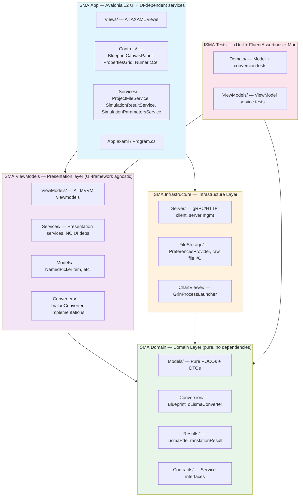
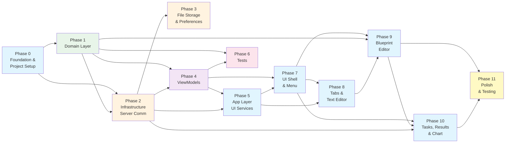

# ISMA UI → .NET 10 + Avalonia 12 Migration Plan

## Overview

This document provides a comprehensive, multi-step migration plan for porting the ISMA desktop UI from Java/Kotlin/JavaFX to .NET 10 / C# / Avalonia 12. The plan prioritizes a clean architecture with clear separation of concerns, testable business logic, and feature parity with the original application.

## Target Architecture

**Dependency direction:** App depends on ViewModels and Infrastructure. ViewModels depends on Domain (interfaces only). Infrastructure depends on Domain (interfaces and models). Tests depends on Domain and ViewModels (Infrastructure is mocked).

CRITICAL: ViewModels layer must NOT depend on Avalonia types. Any service requiring FileDialog, Window, or other UI types MUST be in the App layer.

The solution consists of five projects organized in a clean architecture:

- **ISMA.Tests** (xUnit + FluentAssertions + Moq) — Domain tests (models and conversion) and ViewModels tests (viewmodels and service tests).
- **ISMA.Domain** (pure domain layer, no external dependencies) — Models (pure POCOs and DTOs), Conversion (BlueprintToLismaConverter as a pure algorithm), Results (LismaPdeTranslationResult sealed interface), and Contracts (service interfaces implemented by Infrastructure and App layers).
- **ISMA.Infrastructure** (infrastructure layer) — Server (gRPC/HTTP client and server management), FileStorage (PreferencesProvider and raw file I/O), and ChartViewer (GrinProcessLauncher).
- **ISMA.ViewModels** (presentation layer, UI-framework agnostic) — ViewModels (all MVVM viewmodels), Services (presentation services with no UI dependencies), Models (NamedPickerItem and similar), and Converters (IValueConverter implementations).
- **ISMA.App** (Avalonia 12 UI and UI-dependent services) — Services (ProjectFileService, SimulationResultService, SimulationParametersService — all require FileDialog), Controls (BlueprintCanvasPanel, PropertiesGrid, NumericCell), Views (all AXAML views), and App.axaml / Program.cs.

**Key architectural decisions:**

- **MVVM** with `CommunityToolkit.Mvvm` — `[ObservableProperty]`, `[RelayCommand]`, `[INotifyPropertyChanged]`
- **Microsoft.Extensions.DependencyInjection** — standard .NET DI with `ServiceCollectionExtensions` pattern
- **System.Text.Json** — JSON serialization with `[JsonSerializable]` source generation
- **Grpc.Net.Client** — cross-platform gRPC client with UnixDomainSocket handler (no Linux-only epoll)
- **Avalonia.Controls.DataGrid** — for error list table
- **ICSharpCode.AvalonEdit** — for LISMA text editor (syntax highlighting, line numbers)
- **Custom Panel** — for blueprint editor canvas rendering (OnRender override)
- **ViewLocator pattern** — automatic View resolution from ViewModel type
- **Avalonia 12 features**: `x:DataType` compiled bindings, `IsVisible` (not `Visibility`), `BoxShadow`, Container Queries, Control Themes
- **Tests**: xUnit + FluentAssertions + Moq for Domain and ViewModels

## Source Documentation

This migration plan is derived from the original Java/JavaFX ISMA-UI documentation. Always refer to these sources for implementation details:

| Source Document | Content | Maps To |
|----------------|---------|---------|
| [01-overview.md](../isma-ui/01-overview.md) | Architecture, module structure, dependency graph, DI wiring | Target architecture, Phase 0 |
| [02-domain-layer.md](../isma-ui/02-domain-layer.md) | Domain models, interfaces, result streaming | Phase 1 (Domain Layer) |
| [03-external-services.md](../isma-ui/03-external-services.md) | gRPC client, HTTP client, server lifecycle, facade | Phase 2 (Infrastructure Layer) |
| [04-ui-components.md](../isma-ui/04-ui-components.md) | App entry point, views, editors, toolbars, models | Phases 4–10 (ViewModels + UI) |
| [05-build-and-deployment.md](../isma-ui/05-build-and-deployment.md) | Gradle config, modules, dependencies, startup | Phase 0 (project setup) |
| [06-ux-reference.md](../isma-ui/06-ux-reference.md) | Complete UX specification: windows, menus, dialogs, transitions, features | Phases 7–11 (all UI) |
| [07-blueprint-editor-ux.md](../isma-ui/07-blueprint-editor-ux.md) | Detailed blueprint editor: canvas, states, arrows, popover, toolbar, modes, LISMA conversion, Avalonia migration mapping | Phase 9 (Blueprint Editor) |

**Critical reference for blueprint editor**: `07-blueprint-editor-ux.md` section 19 (Avalonia Migration Mapping) provides the component, interaction, and rendering strategy mapping from JavaFX to Avalonia.

**Critical reference for UX**: `06-ux-reference.md` section "Feature Matrix" (31 features) maps directly to the feature inventory table in this plan.

## Project Structure

The solution `isma-ui-dotnet/` contains five projects plus shared configuration files:

**ISMA.Domain/** — Pure domain models, DTOs, and interfaces.

Models/ directory contains: SimulationPoint (x, yForDe as double arrays, rhs as double[][]), SimulationProgress (startTime, endTime, currentTime), SimulationMetadata (columnNames as List<string>), MetricData (startTime, endTime, simulationTime), CauchyInitials (startTime, endTime, initialStep), IntegrationMethodParameters (selectedMethod, accuracy, isAccuracyInUse, isStableAllowedInUse, isStableInUse, isParallelInUse, server, port), EventDetectionParameters (isEventDetectionInUse, isStepLimitInUse, gamma, lowBorder), ResultSavingParameters (savingTarget enum), ResultProcessingParameters (isSimplifyInUse, selectedSimplifyMethod, tolerance), SimulationParameters (composite of all parameter models), LismaTextModel (fullText, regions as List<CodeRegion>), CodeRegion (name, startLine, endLine, fragmentNameByIndex method), BlueprintModel (main, init, states array, transactions array, loopTransactions array), BlueprintStateModel (canvasPositionX, canvasPositionY, name, text), BlueprintTransactionModel (startStateName, endStateName, predicate, alias), BlueprintLoopTransactionModel (stateName, predicate, alias, text), ErrorInfo (row, position, fragmentName, message), InProgressSimulation (id, modelName, parameters, progress 0.0–1.0), CompletedSimulation (id, modelName, equationIndexProvider, metricData, parameters, cachedFile, cachedColumnNames), WindowPreferences (x, y, width, height, isMaximized), DefaultFilesPreferences (lastOpenedProjectPath as string array), and Preferences (windowPreferences, defaultFilesPreferences).

Dtos/ directory contains DTOs for server communication: CompileResult (modelId, errors, warnings), ValidationResult (errors, warnings), CompilationError (row, column, message), SyntaxTokenDto (start, length, kind enum), SyntaxTokenKind (Unspecified, Keyword, Comment, Number, Text), CachedSimulationResult (file as FileInfo, columnNames), RunSimulationParams (startTime, endTime, initialStep, methodName, accuracy, isAccuracyInUse, isStabilityControlInUse, compiledModelId, eventDetectionGamma, eventDetectionLowBorder), and SocketPaths (grpc and http Unix socket paths).

Conversion/ directory contains BlueprintToLismaConverter which converts BlueprintModel to LismaTextModel as a pure algorithm. It includes ConvertToLisma() (main flow: main text to transactions to loops), CreateTransactionKey() (produces "{targetStateName} ({predicate})"), and StateBlockModel (helper for state block generation).

Results/ directory contains LismaPdeTranslationResult — a sealed interface with SuccessTranslation and FailedTranslation variants.

Contracts/ directory contains service interfaces: ISimulationServerFacade (compile, validate, highlight, run, monitor, download, cancel, getMethods, shutdown), IEquationIndexProvider (getDifferentialEquationCount, getAlgebraicEquationCount, getDifferentialEquationCode, getAlgebraicEquationCode), ISimulationResultReader (Results as IEnumerable<SimulationPoint>), ISyntaxHighlighter (Highlight(source) returns List<SyntaxTokenDto>), ITextEditorFactory (CreateTextEditor and DisposeInstance), and ISimulationResultService (CommitResult, RemoveResult, ShowChart, ExportToFile). NOTE: ISimulationResultService is implemented in the App layer because ShowChart requires FileDialog and GrinProcessLauncher.

See `ISMA.Domain.csproj` for project configuration.

**ISMA.Infrastructure/** — gRPC, file I/O, and external processes.

Server/ directory contains: SimulationServerManager (process lifecycle, socket path parsing), SimulationServerFacade (orchestration: compile, validate, run, monitor), GrpcSimulationClient (gRPC client for SimulationServiceGrpc), GrpcLismaCompilerClient (gRPC client for LismaCompilerServiceGrpc), HttpSimulationClient (HTTP client for binary result downloads), BinaryFilePointProvider (reads binary results to IEnumerable<SimulationPoint>), and BinaryEquationIndexProvider (parses column prefixes DE_, AE_, f).

FileStorage/ directory contains PreferencesProvider (preferences.json persistence via raw file I/O).

ChartViewer/ directory contains GrinProcessLauncher (launches external chart viewer process).

See `ISMA.Infrastructure.csproj` for project configuration.

**ISMA.ViewModels/** — Presentation layer, UI-framework agnostic.

ViewModels/ directory contains: MainWindowViewModel (Projects, ActiveProject, 14 commands), IProjectViewModel (Name, File, EditorContent, NameChanged, Dispose), LismaProjectViewModel (LISMA text content, data provider bridge), BlueprintProjectViewModel (Blueprint model, convertToLisma integration), SimulationParametersViewModel (5 parameter sections with snapshot/commit), SimulationServiceViewModel (Simulate, StopSimulation, TrackingTasks), SimulationResultViewModel (CommitResult, ShowChart, ExportToFile), ErrorListViewModel (Errors collection, PutErrorList), CauchyInitialsViewModel (bound to CauchyInitials properties), IntegrationMethodViewModel (bound to IntegrationMethod properties plus method list), EventDetectionViewModel (bound to EventDetection properties), ResultProcessingViewModel (bound to ResultProcessing properties), BlueprintEditorViewModel (States, Transactions, Modes, Add/Remove operations), TasksPopOverViewModel (InProgress and Completed sections), SelectVariablesDialogViewModel (XAxis, YAxis selection for chart viewer), EditArrowPopOverViewModel (Alias and Predicate for arrow editing), and InProgressSimulationViewModel (Id, ModelName, Progress, CanAbort).

Models/ directory contains NamedPickerItem (generic item for axis picker dialog).

Services/ directory contains: SimulationService (orchestrates snapshot to compile to run to monitor to download), ProjectService (project collection management), ModelErrorService (error list management), LismaPdeService (LISMA validation producing Success/Failure), and SyntaxHighlighterService (delegates to server, maps token kinds).

Converters/ directory contains: DoubleConverter (string to double with normalization), IntegerConverter (string to int with normalization), ProgressToPercentConverter (0.0–1.0 to percentage), BoolToVisibilityConverter (bool to IsVisible binding), and SaveTargetConverter (SaveTarget enum to display string).

See `ISMA.ViewModels.csproj` for project configuration.

**ISMA.App/** — Avalonia 12 UI.

Views/ directory contains: MainWindow.axaml (MenuBar, ToolBar, TabControl, SettingsPanel, ErrorList, ProcessBar), SettingsPanelView.axaml (4-tab settings panel), EditorTabPaneView.axaml (TabControl bound to Projects collection), IsmaTextEditorView.axaml (AvalonEdit TextEditor with syntax highlighting), BlueprintEditorView.axaml (Canvas panel + toolbar + edit popover), TasksPopOverView.axaml (In-progress and Completed sections), IsmaErrorListTableView.axaml (DataGrid for errors), SimulationProcessBarView.axaml (Play button + Tasks button), SelectVariablesDialog.axaml (X-axis ComboBox + Y-axis CheckBoxList), EditArrowPopOverView.axaml (Alias + Predicate text fields), and Settings/ subdirectory with CauchyInitialsView.axaml (Start, End, Step), MethodSettingsView.axaml (Method, Accurate, Accuracy, Stable, Parallel, Server, Port), EventDetectionView.axaml (In use, Gamma, Step limit, Low border), and ResultProcessingView.axaml (Save result MEMORY/FILE, Simplify checkbox, Simplify method Radial-Distance/Douglas-Peucker, Tolerance). NOTE: In the original, Simplify/Tolerance controls are commented out (see 06-ux-reference.md lines 377–381).

Controls/ directory contains: BlueprintCanvasPanel.cs (custom Panel with Draw/DrawingContext for states and arrows), PropertiesGrid.axaml (reusable label+control grid), and NumericCell.axaml (custom DataGrid cell for row/position columns).

Services/ directory contains UI-specific services with Avalonia dependencies: EditorPlatformService (Cut/Copy/Paste event propagation), TextEditorFactory (creates/disposes AvalonEdit instances), ProjectFileService (Open/Save with FileDialog), SimulationResultService (ShowChart with FileDialog/Grin), and SimulationParametersService (Store/Load with FileDialog).

ViewModels/ and Converters/ directories are empty — all ViewModels and converters are in ISMA.ViewModels.

App.axaml contains Fluent theme, resource dictionaries, and styles. App.xaml.cs handles DI registration and application lifecycle. Program.cs is the Avalonia entry point.

See `ISMA.App.csproj` for project configuration.

**ISMA.Tests/** — xUnit + FluentAssertions + Moq.

Domain/ directory contains: SimulationParametersTests (serialization, defaults, snapshot/commit), BlueprintModelTests (empty model defaults, state/transaction creation), BlueprintToLismaConversionTests (all conversion scenarios), PreferencesTests (load/save, window geometry), SimulationPointTests (Equals/GetHashCode for arrays), and CodeRegionTests (line range tracking, fragmentNameByIndex).

ViewModels/ directory contains: SimulationServiceViewModelTests (mock server: compile errors, success, progress, cancel), ProjectViewModelTests (create/close projects, name changes, file save), SimulationParametersViewModelTests (snapshot captures, commit applies), ErrorListViewModelTests (clear and repopulate), MainWindowViewModelTests (commands exist and invoke), BlueprintEditorViewModelTests (add/remove states and transitions), and BlueprintToLismaConversionViewModelTests (ViewModel uses converter correctly).

See `ISMA.Tests.csproj` for project configuration.

**Shared configuration:** Directory.Build.props (common properties: nullable, analyzers, LangVersion), Directory.Packages.props (centralized package versions), and isma-ui-dotnet.sln (solution file).

---

## Avalonia 12 Specifics

The following Avalonia 12 features and changes must be used throughout:

| Feature | Usage |
|---------|-------|
| **`.axaml` extension** | All XAML files use `.axaml`, not `.xaml` |
| **Compiled bindings** | `<AvaloniaUseCompiledBindingsByDefault>true</AvaloniaUseCompiledBindingsByDefault>` in .csproj; `x:DataType` on all root elements |
| **`IsVisible` (bool)** | Replace WPF `Visibility` enum — `IsVisible="False"` = Collapsed |
| **`BoxShadow`** | CSS-like syntax on `Border` — replaces `DropShadowEffect` |
| **Pseudo-classes** | `:pointerover`, `:pressed`, `:focus`, `:disabled` — replace WPF `Triggers` |
| **Style classes** | `Classes="h1 primary"` — replace WPF `Style x:Key` |
| **Container Queries** | `ContainerQuery` markup extension for responsive layouts |
| **Control Themes** | `<ControlTheme>` for custom controls — replace implicit styles |
| **`$parent[]` binding** | `{Binding $parent[Grid].Property}` — replace `RelativeSource AncestorType` |
| **`#name` binding** | `{Binding #myControl.Text}` — replace `ElementName` |
| **`$self` binding** | `{Binding $self.Property}` — replace `RelativeSource Self` |
| **`OnFormFactor`** | Static platform detection: `{OnFormFactor Desktop='250,*', Mobile='*'}` |
| **`AvaloniaUI.DiagnosticsSupport`** | Developer tools (NOT deprecated `Avalonia.Diagnostics`) |

---

## Unix Socket Cross-Platform Support

The original uses Linux-only Netty Epoll for Unix Domain Sockets. The .NET implementation must be cross-platform:

| Platform | gRPC Unix Socket | HTTP Unix Socket |
|----------|-----------------|------------------|
| **Linux** | `UnixDomainSocketEndPoint` | `UnixDomainSocketEndPoint` |
| **Windows** | Named pipe (`Microsoft.IO.NamedPipeChannel`) | Named pipe |
| **macOS** | `UnixDomainSocketEndPoint` | `UnixDomainSocketEndPoint` |

Implementation: Create an `IUnixSocketHandler` abstraction in Infrastructure with platform-specific implementations. Use `Grpc.Net.Client` with a custom `HttpHandler` that selects the appropriate transport.

---

## Exchange-Format Binary Reader

The original uses `ru.isma.next.exchange.format` for binary simulation result reading. This library must be **ported/reimplemented in .NET** inside `ISMA.Infrastructure`:

- `BinaryFilePointProvider` reads binary `.bin` files
- Each record: `x` (double), `yForDe[]` (double[]), `rhs[][]` (double[][])
- Metadata: column names, equation counts (DE_, AE_, f prefixes)
- Stream as `IEnumerable<SimulationPoint>` for CSV export and chart display
- Port the Java `readAllPointsSequence()` and metadata parsing logic
- The `BinaryEquationIndexProvider` parses column prefixes to derive equation counts and codes
- This is the most complex infrastructure component — treat it as a separate porting effort

---

## Build Configuration

### Directory.Build.props

Sets common properties for all projects: TargetFramework is `net10.0`, Nullable and ImplicitUsings are enabled, LangVersion is 13, TreatWarningsAsErrors is true (with CS8618 and CS8604 excluded), IsPackable is false, and Microsoft.CodeAnalysis.NetAnalyzers version 10.0.0 is referenced as a private asset.

### Directory.Packages.props

Enables central package version management with transitive pinning enabled. Package versions: Avalonia 12.0.5 (core, Themes.Fluent, Controls.DataGrid, Desktop, Fonts.Inter, UI.DiagnosticsSupport), CommunityToolkit.Mvvm 8.2.0, Grpc.Net.Client 2.63.0, Grpc.Tools 2.63.0, Google.Protobuf 3.27.0, ICSharpCode.AvalonEdit 6.3.0.90, Microsoft.Extensions.DependencyInjection 10.0.0, System.IO.Pipelines 10.0.0, xUnit 2.9.0, xunit.runner.visualstudio 2.8.0, FluentAssertions 6.12.0, Moq 4.20.70.

### .editorconfig (root)

Root-level editorconfig with space indentation (4 spaces), CRLF line endings, and final newline insertion. For all .cs files: sort system headers first, do not separate import directive groups. For mvvm*ViewModel.cs files: camel_case naming convention for public properties. Nullable context settings: using directives outside namespace, prefer static local functions (suggestion), expression-bodied methods as suggestion (false), expression-bodied properties as suggestion (true).

### gRPC Code Generation

The `Grpc.Tools` package generates C# stubs from protobuf definitions. Configuration in `ISMA.Infrastructure.csproj`:

See `ISMA.Infrastructure.csproj` for the Protobuf ItemGroup configuration. It includes `..\..\protobuf-contracts\v1\simulation_service\*.proto` with GrpcServices="Client" linked to `proto\%(Filename)%(Extension)`, and includes the same protos with GrpcServices="Server" in Debug configuration only. Generated files appear in `obj/Debug/net10.0/` and are automatically included in compilation.

### gRPC Code Generation

The `Grpc.Tools` package generates C# stubs from protobuf definitions. Configuration in `ISMA.Infrastructure.csproj`:

See `ISMA.Infrastructure.csproj` for the Protobuf ItemGroup configuration. It includes `..\..\protobuf-contracts\v1\simulation_service\*.proto` with GrpcServices="Client" linked to `proto\%(Filename)%(Extension)`, and includes the same protos with GrpcServices="Server" in Debug configuration only. Generated files appear in `obj/Debug/net10.0/` and are automatically included in the compilation.

---

## Migration Phases

### Phase 0: Foundation & Project Setup

**Goal:** Create the solution structure, configure build, DI, and verify the project compiles.

#### Phase Dependencies

| Phase | Prerequisites | Depends On |
|-------|--------------|------------|
| 0 | None | — |
| 1 | Phase 0 | Phase 0 |
| 2 | Phase 1 | Phase 0 (protobuf), Phase 1 (interfaces) |
| 3 | Phase 2 | Phase 2 (server must be running for method list) |
| 4 | Phase 1 | Phase 1 (interfaces + models), Phase 2 (server facade interface) |
| 5 | Phase 4 | Phase 2 (infrastructure), Phase 4 (interfaces) |
| 6 | Phase 1, 4 | Phase 1 (domain), Phase 4 (viewmodels) |
| 7 | Phase 4, 5 | Phase 4 (viewmodels), Phase 5 (services) |
| 8 | Phase 7 | Phase 7 (shell), Phase 5 (ProjectFileService) |
| 9 | Phase 8 | Phase 8 (text editor integration), Phase 1 (converter) |
| 10 | Phase 7, 9 | Phase 7 (shell), Phase 9 (blueprint editor), Phase 2 (GrinProcessLauncher) |
| 11 | All phases | All |

#### Cross-Reference: Phases → Features → Source Docs

| Feature | Phase | Source Doc Reference |
|---------|-------|---------------------|
| Solution structure, build config, DI skeleton | 0 | 01-overview.md (module structure) |
| Domain models, DTOs, interfaces | 1 | 02-domain-layer.md |
| Blueprint-to-LISMA converter | 1 | 07-blueprint-editor-ux.md §11 |
| gRPC/HTTP clients, server lifecycle | 2 | 03-external-services.md |
| Binary result reader (exchange-format port) | 2 | 02-domain-layer.md (SimulationPoint) |
| Preferences provider, default values | 3 | 04-ui-components.md (PreferencesProvider) |
| All ViewModels (MVVM) | 4 | 04-ui-components.md (ViewModels), 06-ux-reference.md |
| UI-dependent services (FileDialog) | 5 | 04-ui-components.md (ProjectFileService, etc.) |
| Unit tests (Domain + ViewModels) | 6 | All domain/ViewModel docs |
| Main window, menu, toolbar, settings, error list | 7 | 06-ux-reference.md (Application Shell, Menu Bar, Toolbars, Settings Panel) |
| Project tabs, text editor, file operations | 8 | 04-ui-components.md (Text Editor), 06-ux-reference.md (File Operations) |
| Blueprint editor (canvas, states, arrows, modes) | 9 | 07-blueprint-editor-ux.md (all sections), 06-ux-reference.md (Blueprint Editor) |
| Tasks PopOver, results, chart viewer, CSV export | 10 | 06-ux-reference.md (Tasks PopOver, Results Visualization) |
| Polish, cross-platform testing | 11 | 06-ux-reference.md (Keyboard Shortcuts, Feature Matrix) |

#### Steps

1. Create .NET 10 solution with 5 projects (Domain, Infrastructure, ViewModels, App, Tests)
2. Configure `Directory.Build.props` for common properties (nullable enabled, analyzers, LangVersion=12)
3. Configure `Directory.Packages.props` for centralized package version management
4. Add NuGet packages:
   - **Domain:** None (pure POCOs)
   - **Infrastructure:** `Grpc.Net.Client`, `Grpc.Net.Client.Web`, `Google.Protobuf`, `Grpc.Tools`, `Microsoft.Extensions.Logging.Abstractions`, `System.IO.Pipelines`
   - **ViewModels:** `CommunityToolkit.Mvvm`, `Microsoft.Extensions.DependencyInjection.Abstractions`
   - **App:** `Avalonia.Themes.Fluent`, `Avalonia.Controls.DataGrid`, `Avalonia.Desktop`, `CommunityToolkit.Mvvm`, `Microsoft.Extensions.DependencyInjection`, `ICSharpCode.AvalonEdit`, `AvaloniaUI.DiagnosticsSupport`, `Avalonia.Fonts.Inter`
   - **Tests:** `xunit`, `xunit.runner.visualstudio`, `FluentAssertions`, `Moq`, `Microsoft.NET.Test.Sdk`, `coverlet.collector`
5. Configure `Grpc.Tools` protobuf generation from `protobuf-contracts/v1/`
    - Add `<Protobuf Include="..\..\protobuf-contracts\v1\simulation_service\*.proto" GrpcServices="Client" />` to `ISMA.Infrastructure.csproj`
   - Set `<ProtobufFiles>$(IntermediateOutputPath)$(MSBuildProjectName).grpc.cs</ProtobufFiles>` for output path
   - Verify generated stubs in `obj/Debug/net10.0/` after build
6. Set up DI registration skeleton in `App.xaml.cs` using `ServiceCollectionExtensions` pattern:

See `App.xaml.cs` for the DI registration implementation. The `App` class extends `Application` and overrides `OnFrameworkInitialization()`. It creates a `ServiceCollection`, calls layer-specific configuration methods (ConfigureInfrastructure, ConfigureViewModels, ConfigureAppServices), registers `MainWindowViewModel` as a singleton, builds the `ServiceProvider`, and calls the base implementation.

- Create `ServiceCollectionExtensions.cs` in each layer for modular registration
- Phase 0: register only `MainWindowViewModel`
- Phase 4: register all ViewModels and presentation services
- Phase 5: register UI-dependent services
7. Create minimal `MainWindow.axaml` with empty content to verify the app runs.

8. Create `ViewLocator` for automatic View resolution from ViewModel type:

See the ViewLocator implementation — a class implementing `IDataTemplate` with a `Build(object? param)` method that replaces "ViewModel" with "View" in the full type name, resolves the type from the same assembly, and creates an instance. The `Create()` method delegates to `Build(null)`.

- Register in `App.axaml`: `<DataTemplate DataType="{x:Type vm:MainWindowViewModel}"><views:MainWindow /></DataTemplate>`
- Or use `ViewLocator` as default data template for `ContentControl`

#### Acceptance Checklist

- [ ] Solution builds with `dotnet build` (zero errors)
- [ ] `dotnet run` launches an empty Avalonia 12 window
- [ ] All 5 projects compile (zero errors)
- [ ] gRPC stubs generate correctly from protobuf contracts
- [ ] DI container resolves `MainWindowViewModel`
- [ ] Tests project compiles (no tests yet)
- [ ] `.axaml` files compile (XAML validation passes)
- [ ] `ViewLocator` resolves `MainWindowViewModel` → `MainWindow.axaml`
- [ ] `Directory.Packages.props` centralizes all package versions

---

### Phase 1: Domain Layer — Models, DTOs, Interfaces & Conversion Algorithm

**Goal:** Implement all domain models, DTOs, service interfaces, and the pure `convertToLisma()` algorithm. Zero external dependencies.

#### Steps

1. **Simulation Models** (pure POCOs with `[JsonSerializable]` support)
   - `SimulationPoint` — `double X`, `double[] YForDe`, `double[][] Rhs`
     - Override `Equals`/`GetHashCode` using `SequenceEqual` for arrays
   - `SimulationProgress` — `double StartTime`, `double EndTime`, `double CurrentTime`
   - `SimulationMetadata` — `List<string> ColumnNames`
   - `MetricData` — `long StartTime`, `long EndTime`, derived `SimulationTime`

2. **Simulation Parameters Models**
   - `CauchyInitials` — `double StartTime`, `double EndTime`, `double InitialStep`
   - `IntegrationMethodParameters` — `string SelectedMethod`, `double Accuracy`,
      `bool IsAccuracyInUse`, `bool IsStableAllowedInUse`, `bool IsStableInUse`,
      `bool IsParallelInUse`, `string Server`, `int Port`
      - NOTE: `IsStableAllowedInUse` is an internal flag (set by infrastructure based on server capabilities).
        `IsStableInUse` is the user-facing flag. Both are preserved from original for model fidelity.
        Only `IsStableInUse` is exposed in the ViewModel UI.
   - `EventDetectionParameters` — `bool IsEventDetectionInUse`, `bool IsStepLimitInUse`,
     `double Gamma`, `double LowBorder`
   - `ResultSavingParameters` — `SaveTarget SavingTarget` (enum: `Memory`, `File`)
   - `ResultProcessingParameters` — `bool IsSimplifyInUse`, `string SelectedSimplifyMethod`,
     `double Tolerance`
   - `SimulationParameters` — composite of all above (serializable)

3. **Project Models**
   - `LismaTextModel` — `string FullText`, `List<CodeRegion> Regions`
     - Static `DefaultFragment` (CodeRegion with name "Main", lines 0–0)
     - `FragmentNameByIndex(int index)` method
   - `CodeRegion` — `string Name`, `int StartLine`, `int EndLine`
   - `BlueprintModel` — `BlueprintStateModel Main`, `BlueprintStateModel Init`,
     `BlueprintStateModel[] States`, `BlueprintTransactionModel[] Transactions`,
     `BlueprintLoopTransactionModel[] LoopTransactions`
     - Static `Empty` property matching original defaults (Main at 10,10; Init at 10,100)
   - `BlueprintStateModel` — `double CanvasPositionX`, `double CanvasPositionY`,
     `string Name`, `string Text`
   - `BlueprintTransactionModel` — `string StartStateName`, `string EndStateName`,
     `string Predicate`, `string Alias = ""`
   - `BlueprintLoopTransactionModel` — `string StateName`, `string Predicate`,
     `string Alias = ""`, `string Text`

4. **UI Models**
   - `ErrorInfo` — `int Row`, `int Position`, `string FragmentName`, `string Message`
   - `InProgressSimulation` — `int Id`, `string ModelName`, `SimulationParameters Parameters`,
     `double Progress` (0.0–1.0)
   - `CompletedSimulation` — `int Id`, `string ModelName`, `IEquationIndexProvider? EquationIndexProvider`,
      `MetricData MetricData`, `SimulationParameters Parameters`, `string CachedFile`,
      `List<string> CachedColumnNames`
      - NOTE: `IEquationIndexProvider` is a domain interface (dependency inversion). Infrastructure implements it.
        Used for CSV export to map equation indices to column names. Nullable since not all results have it.

5. **Preferences Models**
   - `WindowPreferences` — `double X`, `double Y`, `double Width`, `double Height`, `bool IsMaximized`
   - `DefaultFilesPreferences` — `string[] LastOpenedProjectPath`
   - `Preferences` — `WindowPreferences WindowPreferences`, `DefaultFilesPreferences DefaultFilesPreferences`
    - `ProjectType` — enum: `LismaText`, `Blueprint`, `Legacy` (used by ProjectFileService.Open)

6. **DTOs** (for server communication)
   - `CompileResult` — `string ModelId`, `List<CompilationError> Errors`, `List<string> Warnings`
   - `ValidationResult` — `List<CompilationError> Errors`, `List<string> Warnings`
   - `CompilationError` — `int Row`, `int Column`, `string Message`
   - `SyntaxTokenDto` — `int Start`, `int Length`, `SyntaxTokenKind Kind`
   - `SyntaxTokenKind` — `Unspecified`, `Keyword`, `Comment`, `Number`, `Text`
   - `CachedSimulationResult` — `string File`, `List<string> ColumnNames`
   - `RunSimulationParams` — `double StartTime`, `double EndTime`, `double InitialStep`,
     `string MethodName`, `double Accuracy`, `bool IsAccuracyInUse`,
     `bool IsStabilityControlInUse`, `string CompiledModelId`,
     `double? EventDetectionGamma`, `double? EventDetectionLowBorder`
   - `SocketPaths` — `string Grpc`, `string Http`

7. **Conversion Algorithm** (pure algorithm, no dependencies)
   - `BlueprintToLismaConverter.ConvertToLisma(BlueprintModel)` → `LismaTextModel`
   - **Algorithm:**
     1. Start with main state text as base content
     2. Process transactions: group by target state + predicate, create `state "key" { ... } from start1, start2, ...;` blocks
     3. Process loop transactions: create pseudo-state pattern
        - `state <name>_pseudo_1 (<predicate>) { ... } from <state>;`
        - `state <name> (1 > 0) { ... } from <pseudo_1>;`
     4. Track `CodeRegion` for each generated fragment (line numbers)
     5. Return `LismaTextModel` with full text and regions list
   - Helper: `CreateTransactionKey(targetState, predicate)` → `"{targetState} ({predicate})"`
   - Helper: `StateBlockModel` — builds state block string with proper formatting

8. **Service Interfaces** (in `Contracts/`, implemented in Infrastructure and ViewModels)
   - `ISimulationServerFacade` — `CompileModel(source) → CompileResult`, `ValidateModel(source) → ValidationResult`,
     `HighlightSource(source) → SyntaxTokenDto[]`, `RunSimulation(params) → long`,
     `MonitorSimulation(id) → IAsyncEnumerable<SimulationProgress>`,
     `DownloadResult(id) → CachedSimulationResult`, `CancelSimulation(id) → void`,
     `GetSimulationMethods() → string[]`, `Shutdown() → void`
   - `IEquationIndexProvider` — `GetDifferentialEquationCount()`, `GetAlgebraicEquationCount()`,
     `GetDifferentialEquationCode(index)`, `GetAlgebraicEquationCode(index)`
   - `ISimulationResultReader` — `Results` (IEnumerable<SimulationPoint>)
   - `ISyntaxHighlighter` — `Highlight(source) → SyntaxTokenDto[]`
   - `ITextEditorFactory` — `CreateTextEditor(text, onTextChanged)`, `DisposeInstance(editor)`

#### Acceptance Checklist

- [ ] All domain model classes compile with zero dependencies on external libraries
- [ ] All DTOs compile (no dependencies)
- [ ] `SimulationPoint.Equals`/`GetHashCode` work correctly for arrays
- [ ] `BlueprintModel.Empty` matches original defaults exactly (Main at 10,10; Init at 10,100)
- [ ] `SaveTarget` enum has `Memory` and `File` values
- [ ] `SimulationParameters` serializes and deserializes correctly with `System.Text.Json`
- [ ] `CodeRegion.FragmentNameByIndex()` works correctly
- [ ] `BlueprintToLismaConverter.ConvertToLisma()` produces correct LISMA text for:
  - [ ] Empty blueprint (Main + init only)
  - [ ] Single state with content
  - [ ] Multiple states with regular transitions
  - [ ] Loop transitions (pseudo-state pattern)
  - [ ] Multiple transitions to same target with same predicate (merge behavior)
- [ ] `LismaPdeTranslationResult` sealed interface with `SuccessTranslation` and `FailedTranslation` variants
- [ ] `ISimulationResultService` interface defined in Domain.Contracts (implemented in App layer)
- [ ] `IProjectFileService` interface defined in Domain.Contracts (implemented in App layer)
- [ ] `dotnet build ISMA.Domain` produces zero errors and zero warnings
- [ ] All DTOs pass JSON serialization round-trip test

---

### Phase 2: Infrastructure Layer — Server Communication

**Goal:** Implement gRPC client, HTTP client, server lifecycle management, and binary result reading. All interfaces from Domain.Contracts are implemented.

#### Steps

1. **SimulationServerManager**
   - Resolve script path from `ISMA_SERVER_SCRIPT` env var or `isma.server.script` config key
   - Launch server as child process via `ProcessBuilder`
   - Parse stdout: skip `WARNING:`, `SLF4J:`, blank, log-prefixed lines
   - Extract gRPC socket path from first non-skipped line
   - Extract HTTP socket path from line containing `HTTP_SOCKET=`
   - Return `SocketPaths(grpc, http)`
   - Register shutdown hook to stop server on process exit
   - Cross-platform: use `ProcessStartInfo` with proper argument escaping

2. **Unix Socket Handler** (cross-platform abstraction)
   - `IUnixSocketHandler` interface
   - `LinuxUnixSocketHandler` — uses `UnixDomainSocketEndPoint`
   - `WindowsNamedPipeHandler` — uses named pipes
   - `MacUnixSocketHandler` — uses `UnixDomainSocketEndPoint`
   - Factory selects handler based on `RuntimeInformation.IsOSPlatform()`

3. **GrpcSimulationClient**
   - Use `Grpc.Net.Client` with custom `HttpHandler` wrapping the Unix socket handler
   - `RunSimulation(params) → long` — blocking call
   - `MonitorSimulation(id) → IAsyncEnumerable<SimulationProgress>` — server streaming
   - `DownloadResult(id) → string downloadUrl` — returns URL for HTTP download
   - `CancelSimulation(id) → void` — blocking call
   - `GetSimulationMethods() → string[]` — blocking call

4. **GrpcLismaCompilerClient**
   - `CompileModel(source) → CompileResult` — modelId + errors + warnings
   - `ValidateModel(source) → ValidationResult` — errors + warnings
   - `HighlightSource(source) → SyntaxTokenDto[]` — token positions and kinds
   - `DeleteCompiledModel(modelId) → void`

5. **HttpSimulationClient**
   - `DownloadResultToFile(downloadUrl, destinationPath) → FileInfo`
   - Create cache directory `<temp>/isma-simulation-cache/` if not exists
   - Use `HttpClient` with proper timeout

6. **SimulationServerFacade** (implements `ISimulationServerFacade`)
   - `Warmup()` — start server, create all clients
   - `Shutdown()` — dispose all clients and stop server
   - `CompileModel(source) → CompileResult`
   - `ValidateModel(source) → ValidationResult`
   - `HighlightSource(source) → SyntaxTokenDto[]`
   - `RunSimulation(params) → long`
   - `MonitorSimulation(id) → IAsyncEnumerable<SimulationProgress>`
   - `DownloadResult(id) → CachedSimulationResult` — gets URL from gRPC, downloads via HTTP
   - `CancelSimulation(id) → void`
   - `GetSimulationMethods() → string[]`

7. **BinaryFilePointProvider** (implements `ISimulationResultReader`)
   - Read binary result files using ported exchange-format library
   - Each record: `x` (double), `yForDe[]` (double[]), `rhs[][]` (double[][])
   - Stream as `IEnumerable<SimulationPoint>`
   - Parse metadata: column names, equation counts
   - Static `ReadMetadata(file) → SimulationMetadata`

8. **BinaryEquationIndexProvider** (implements `IEquationIndexProvider`)
   - Parse column name prefixes: `DE_` (differential), `AE_` (algebraic), `f` (forcing)
   - `GetDifferentialEquationCount()` — count DE_ columns
   - `GetAlgebraicEquationCount()` — count AE_ columns
   - `GetDifferentialEquationCode(index)` — return column name for DE at index
   - `GetAlgebraicEquationCode(index)` — return column name for AE at index

9. **GrinProcessLauncher**
   - Resolve script from `ISMA_GRIN_SCRIPT` env var or `isma.grin.script` config key
   - `Launch(resultFile, xAxisColumn, chartColumns)` — starts Grin via `ProcessBuilder`
   - Arguments: `--result-file <path>`, `--x-axis <name>`, `--charts <names>`
   - Register shutdown hook to destroy process

#### Acceptance Checklist

- [ ] `SimulationServerManager` starts and stops the server process correctly
- [ ] Socket path parsing handles all output formats (WARNING, SLF4J, blank lines)
- [ ] gRPC client connects via Unix Domain Socket (Linux) or named pipes (Windows)
- [ ] `Warmup()` successfully initializes all clients
- [ ] `Shutdown()` cleanly disposes all clients and stops server
- [ ] `CompileModel()` returns `CompileResult` with modelId and errors
- [ ] `ValidateModel()` returns `ValidationResult`
- [ ] `HighlightSource()` returns token list with correct positions and kinds
- [ ] `RunSimulation()` returns a simulation ID
- [ ] `MonitorSimulation()` streams progress updates as `IAsyncEnumerable`
- [ ] `DownloadResult()` saves binary file to cache directory
- [ ] `CancelSimulation()` stops a running simulation
- [ ] `GetSimulationMethods()` returns available method names
- [ ] `BinaryFilePointProvider` reads binary files and yields `SimulationPoint`s
- [ ] `BinaryEquationIndexProvider` correctly parses DE_, AE_, f column prefixes
- [ ] `GrinProcessLauncher` launches the chart viewer process with correct arguments
- [ ] Shutdown hook terminates server on process exit
- [ ] Cross-platform: Unix socket handler works on Linux (primary)

---

### Phase 3: Infrastructure Layer — File Storage & Preferences

**Goal:** Implement file I/O for projects and preferences persistence. File I/O without UI (PreferencesProvider, raw file operations) goes here.
UI-dependent file operations (ProjectFileService with FileDialog) go in **Phase 10 (App layer)**.

#### Steps

1. **PreferencesProvider**
    - Resolve settings file path from config (default: app data directory + `preferences.json`)
    - `Load() → Preferences` — deserialize JSON
    - `Save(preferences) → void` — serialize JSON
    - `CommitWindow(WindowPreferences) → void` — update and persist
    - `CommitFiles(DefaultFilesPreferences) → void` — update and persist
    - Restore last opened file paths on startup

2. **Default values registry** (shared constants, no UI dependencies)
    - Cauchy: `StartTime=0.0`, `EndTime=10.0`, `InitialStep=0.1`
    - Integration: `Accuracy=0.1`, `Server="localhost"`, `Port=7890`
    - Event Detection: `Gamma=0.8`, `LowBorder=0.001`
    - Simplify methods: `["Radial-Distance", "Douglas-Peucker"]`
    - File extension constants: `.iscm2`, `.scisma`, `.im`, `.params.json`, `preferences.json`

#### Acceptance Checklist

- [ ] PreferencesProvider loads and saves `preferences.json` correctly
- [ ] Preferences persist across app restarts
- [ ] Last opened files are restored on startup
- [ ] Window geometry is saved and restored
- [ ] Default values registry contains all original defaults
- [ ] File extension constants match original application
- [ ] `dotnet build ISMA.Infrastructure` produces zero errors

---

### Phase 4: ViewModels — Presentation Layer

**Goal:** Implement all ViewModels and presentation services using CommunityToolkit.Mvvm. These are UI-framework agnostic and fully testable.

#### Steps

1. **MainWindowViewModel**
   - `ObservableCollection<IProjectViewModel> Projects`
   - `IProjectViewModel? ActiveProject`
   - `bool ShowSettings` (binds to settings panel visibility)
   - Commands (via `[RelayCommand]`):
     - `NewText()` — delegates to `ProjectService.CreateNew("New project")`
     - `NewBlueprint()` — delegates to `ProjectService.CreateNewBlueprint("New statechart")`
     - `Open()` — delegates to `ProjectFileService.Open()`
     - `Save()` — delegates to `ProjectFileService.Save(ActiveProject)`
     - `SaveAll()` — delegates to `ProjectFileService.SaveAll(Projects)`
     - `Close()` — delegates to `ProjectService.Close(ActiveProject)`
     - `CloseAll()` — delegates to `ProjectService.CloseAll()`
     - `Exit()` — closes application
   - `Cut()` — delegates to `EditorPlatformService.Cut()`
    - `Copy()` — delegates to `EditorPlatformService.Copy()`
    - `Paste()` — delegates to `EditorPlatformService.Paste()`
    - `Verify()` — delegates to `LismaPdeService.Validate(ActiveProject)`
    - `Run()` — delegates to `SimulationService.Simulate()`
    - `StoreSettings()` — delegates to `IProjectFileService.StoreSettings()`
    - `LoadSettings()` — delegates to `IProjectFileService.LoadSettings()`

2. **ProjectViewModel** (interface + implementations)
   - `IProjectViewModel` — `string Name`, `string? FilePath`, `object EditorContent`,
     `event Action? NameChanged`, `void Dispose()`
   - `LismaProjectViewModel` — wraps `LismaTextModel`, integrates with data provider
   - `BlueprintProjectViewModel` — wraps `BlueprintModel`, integrates with `convertToLisma()`

3. **Data Provider Bridges** (per-project scoped)
   - `LismaProjectDataProvider` — bridge between `LismaProjectViewModel` and text editor
     - `string Text` — getter reads from editor, setter writes to editor
   - `BlueprintProjectDataProvider` — bridge between `BlueprintProjectViewModel` and blueprint editor
     - `BlueprintModel Blueprint` — getter/setter

4. **SimulationService** (presentation service)
    - `ObservableCollection<InProgressSimulationViewModel> TrackingTasks`
    - `Simulate()` — orchestrates full simulation flow:
      1. Snapshot parameters from `ISimulationParametersService` (interface — App layer implements in Phase 5)
      2. Get active project source text
      3. Call `serverFacade.CompileModel(source)`
      4. Map compilation errors to `ErrorInfo` and call `ModelErrorService.PutErrorList(errors)`
      5. Call `serverFacade.RunSimulation(params)` → `simulationId`
      6. Start monitoring: `serverFacade.MonitorSimulation(id)` → stream progress
      7. For each progress update: normalize to 0.0–1.0, update `InProgressSimulationViewModel.Progress`
      8. Call `serverFacade.DownloadResult(id)` → `CachedSimulationResult`
      9. Create `CompletedSimulation` and call `ISimulationResultService.CommitResult()` (interface — App layer implements in Phase 5)
      10. Remove from `TrackingTasks`
    - `StopSimulation(InProgressSimulationViewModel)` — call `serverFacade.CancelSimulation()`
    - Uses `Task.Run` or `Channels` for background execution (no virtual threads in .NET)

**IMPORTANT: The following services are in `ISMA.App/Services` (NOT in ViewModels):**
- `SimulationResultService` — requires `FileDialog` (ShowChart) and `GrinProcessLauncher` (ShowChart) — implements `ISimulationResultService`
- `SimulationParametersService` — requires `FileDialog` (Store/Load) — implements `ISimulationParametersService`
- `ProjectFileService` — requires `FileDialog` (Open/Save/SaveAs) — implements `IProjectFileService`
- These services are UI-dependent and cannot be in the ViewModels layer
- **ViewModels depend on interfaces only** — `ISimulationResultService`, `ISimulationParametersService`, `IProjectFileService` are defined in `ISMA.Domain/Contracts`

**IMPORTANT: Interface definitions required in `ISMA.Domain/Contracts`:**
- `ISimulationResultService` — `CommitResult(CompletedSimulation)`, `RemoveResult(CompletedSimulation)`, `ShowChart(CompletedSimulation)`, `ExportToFile(CompletedSimulation, filePath)`
- `ISimulationParametersService` — `Snapshot() → SimulationParameters`, `Commit(SimulationParameters)`, `IntegrationMethods (ObservableCollection<string>)`, `SimplifyMethods (ObservableCollection<string>)`
- `IProjectFileService` — `Open(ownerWindow) → List<string>`, `Save(project) → bool`, `SaveAs(project) → bool`, `SaveAll(projects) → bool`, `StoreSettings(ownerWindow) → bool`, `LoadSettings(ownerWindow) → bool`

5. **SimulationParametersViewModel**
    - `CauchyInitials` — `double StartTime`, `double EndTime`, `double Step`
    - `IntegrationMethod` — `string SelectedMethod`, `double Accuracy`, `bool IsAccuracyInUse`,
      `bool IsStableInUse`, `bool IsParallelInUse`, `string Server`, `int Port`
      - NOTE: `IsStableAllowedInUse` exists in the Domain model but is NOT exposed in the ViewModel UI.
        It is an internal flag set based on server capabilities, not a user-configurable setting.
    - `EventDetection` — `bool IsEventDetectionInUse`, `bool IsStepLimitInUse`, `double Gamma`, `double LowBorder`
    - `ResultSaving` — `SaveTarget SavingTarget`
    - `ResultProcessing` — `bool IsSimplifyInUse`, `string SelectedSimplifyMethod`, `double Tolerance`
    - `ObservableCollection<string> IntegrationMethods`
    - `Snapshot() → SimulationParameters` — capture all properties
    - `Commit(SimulationParameters) → void` — apply all properties

6. **ErrorListViewModel**
   - `ObservableCollection<ErrorInfo> Errors`
   - `PutErrorList(IEnumerable<ErrorInfo>)` — clear and add all

7. **Settings ViewModels** (each in its own file, bound to SimulationParametersViewModel)
    - `CauchyInitialsViewModel` — `StartTime`, `EndTime`, `Step` properties
    - `IntegrationMethodViewModel` — `SelectedMethod`, `Accuracy`, `IsAccuracyInUse`, `IsStableInUse`, `IsParallelInUse`, `Server`, `Port`, `IntegrationMethods`
    - `EventDetectionViewModel` — `IsEventDetectionInUse`, `IsStepLimitInUse`, `Gamma`, `LowBorder`
    - `ResultProcessingViewModel` — `IsSimplifyInUse`, `SelectedSimplifyMethod`, `Tolerance`

8. **BlueprintEditorViewModel**
   - `ObservableCollection<BlueprintStateViewModel> States`
   - `ObservableCollection<BlueprintTransactionViewModel> Transactions`
   - `ObservableCollection<BlueprintLoopTransactionViewModel> LoopTransactions`
   - `BlueprintEditorMode CurrentMode` (enum: Default, AddTransition, RemoveState, RemoveTransition)
   - `AddState(double x, double y)` — create state at position
   - `AddTransition(BlueprintStateViewModel source, BlueprintStateViewModel target)` — create arrow
   - `RemoveState(BlueprintStateViewModel state)` — remove state and all associated arrows
   - `RemoveTransition(BlueprintTransactionViewModel arrow)` — remove arrow
   - `RemoveLoop(BlueprintLoopTransactionViewModel arrow)` — remove loop arrow
   - `GetBlueprintModel() → BlueprintModel` — serialize canvas to model
   - `SetBlueprintModel(BlueprintModel model) → void` — restore from model
   - `ResetEditorMode()` — clear all modes

9. **BlueprintStateViewModel**
     - `double CanvasPositionX`, `double CanvasPositionY`
     - `string Name`
     - `string Text`
     - `bool IsEditable`
     - `bool IsMain`, `bool IsInit`
     - `string FillColorHex` (hex color string: "#90EE90" for Main, "#ADD8E6" for Init, "#F08080" for user)
     - NOTE: Color stored as hex string to keep ViewModels UI-framework agnostic (Avalonia `Color` type is not available in ViewModels)

10. **BlueprintTransactionViewModel**
    - `BlueprintStateViewModel StartState`, `BlueprintStateViewModel EndState`
    - `string Predicate`, `string Alias`

11. **BlueprintLoopTransactionViewModel**
    - `BlueprintStateViewModel State`
    - `string Predicate`, `string Alias`, `string Text`

 12. **SimulationResultViewModel**
    - `ObservableCollection<CompletedSimulation> CompletedResults`
    - `CommitResult(CompletedSimulation)` — thread-safe add to collection
    - `RemoveResult(CompletedSimulation)` — remove from collection
    - `ShowChart(CompletedSimulation)` — opens SelectVariablesDialog, then calls `GrinProcessLauncher`
    - `ExportToFile(CompletedSimulation, filePath)` — async CSV export via `BinaryFilePointProvider`
    - NOTE: This ViewModel is in ISMA.ViewModels layer but delegates ShowChart/ExportToFile to `ISimulationResultService` in App layer

 13. **InProgressSimulationViewModel**
    - `int Id` — auto-incrementing task counter
    - `string ModelName` — name of the model being simulated
    - `SimulationParameters Parameters` — snapshot of simulation parameters at start
    - `double Progress` (0.0–1.0, `[ObservableProperty]`) — updated from background task
    - `bool CanAbort` — true while simulation is running
    - `AbortCommand` — `[RelayCommand]` that calls `SimulationService.StopSimulation(this)`

 16. **TasksPopOverViewModel**
    - `ObservableCollection<InProgressSimulationViewModel> InProgress`
    - `ObservableCollection<CompletedSimulation> Completed`
    - Properties for UI binding

 17. **SelectVariablesDialogViewModel**
    - `ObservableCollection<string> AllColumns`
    - `string SelectedXAxis` (pre-select "TIME")
    - `ObservableCollection<NamedPickerItem> YAxisItems`
    - `ICommand SelectAllCommand`, `ICommand UnselectAllCommand`, `ICommand OkCommand`, `ICommand CloseCommand`

 18. **EditArrowPopOverViewModel**
    - `string Alias`
    - `string Predicate`

 19. **InProgressSimulationViewModel**
    - `int Id` — auto-incrementing task counter
    - `string ModelName` — name of the model being simulated
    - `SimulationParameters Parameters` — snapshot of simulation parameters at start
    - `double Progress` (0.0–1.0, `[ObservableProperty]`) — updated from background task
    - `bool CanAbort` — true while simulation is running
    - `AbortCommand` — `[RelayCommand]` that calls `SimulationService.StopSimulation(this)`

20. **CompletedSimulationViewModel**
    - `int Id` — simulation task ID
    - `string ModelName` — name of the model
    - `SimulationParameters Parameters` — parameters used for this simulation
    - `MetricData MetricData` — timing information (startTime, endTime, simulationTime)
    - `List<string> ColumnNames` — for axis picker dialog
    - `string CachedFilePath` — path to cached binary result file
    - `ShowChartCommand` — opens SelectVariablesDialog
    - `ExportToFileCommand` — opens file picker for CSV export
    - `RemoveCommand` — removes from completed list

#### Acceptance Checklist

- [ ] All ViewModels inherit from `ObservableObject` (CommunityToolkit.Mvvm)
- [ ] All properties use `[ObservableProperty]` or `[NotifyPropertyChangedFor]`
- [ ] All commands use `[RelayCommand]`
- [ ] `MainWindowViewModel` has all 15 commands (NewText, NewBlueprint, Open, Save, SaveAll, Close, CloseAll, Exit, Cut, Copy, Paste, Verify, Run, StoreSettings, LoadSettings)
- [ ] `SimulationService.Simulate()` implements full flow with proper error handling using interfaces
- [ ] Progress updates propagate via `[ObservableProperty]` from background task
- [ ] `SimulationParametersViewModel` has all 5 parameter sections
- [ ] `IsStableAllowedInUse` exists in Domain model but NOT in ViewModel UI (internal flag only)
- [ ] `ErrorListViewModel` supports clearing and repopulating
- [ ] `BlueprintEditorViewModel` has all 4 editor modes
- [ ] `SelectVariablesDialogViewModel` has axis selection logic
- [ ] `NamedPickerItem<T>` generic model supports axis picker dialog
- [ ] `LismaPdeTranslationResult` sealed interface used by LismaPdeService
- [ ] `CompletedSimulationViewModel` exposes column names for axis picker
- [ ] `SimulationResultViewModel` delegates UI operations to `ISimulationResultService` (App layer)
- [ ] `InProgressSimulationViewModel` has `AbortCommand` with `[RelayCommand]`
- [ ] ViewModels have zero Avalonia dependencies (NO FileDialog, NO Window, NO GrinProcessLauncher)
- [ ] `dotnet build ISMA.ViewModels` produces zero errors
- [ ] `ISimulationResultService`, `ISimulationParametersService`, `IProjectFileService` interfaces exist in Domain.Contracts

---

### Phase 5: App Layer — UI-Dependent Services

**Goal:** Implement services that require Avalonia UI types (FileDialog, Window). These services depend on `ISMA.Domain` (interfaces) and `ISMA.Infrastructure` (implementations) but MUST NOT be in the ViewModels layer.

#### Steps

1. **ProjectFileService** (in `ISMA.App/Services`)
    - Implements `IProjectFileService` (new interface in `ISMA.Domain/Contracts`)
    - `Open(ownerWindow) → List<string> filePaths` — `FileDialog` with filters:
      - `All ISMA Files` (`.iscm2`, `.scisma`, `.im`)
      - `LISMA Text` (`.iscm2`)
      - `State Chart` (`.scisma`)
      - `Legacy` (`.im`)
    - `Open(paths) → List<ProjectType>` — dispatches by extension:
      - `.iscm2` → LISMA text project
      - `.scisma` → Blueprint project (JSON-encoded `BlueprintModel`)
      - `.im` → Legacy text project (backward compatibility, TODO)
    - `Save(project) → bool` — writes project content to file
      - LISMA text → write `FullText` to file
      - Blueprint → serialize `BlueprintModel` to JSON
    - `SaveAs(project) → bool` — same as Save but with `FileDialog`
    - `SaveAll(projects) → bool` — iterate all projects, save each

2. **SimulationResultService** (in `ISMA.App/Services`)
    - Implements `ISimulationResultService` (in `ISMA.Domain/Contracts`)
    - `ObservableCollection<CompletedSimulation> TrackingTasksResults`
    - `CommitResult(CompletedSimulation)` — add to collection (thread-safe)
    - `RemoveResult(CompletedSimulation)` — remove from collection
    - `ShowChart(CompletedSimulation)` — opens `FileDialog` for axis picker, launches `GrinProcessLauncher` with selected axes
    - `ExportToFile(CompletedSimulation, filePath)` — async CSV export:
      - Header: `x, [DE column names], [AE column names], f0, f1, ..., fN`
      - Stream points from `BinaryFilePointProvider`
      - Write to buffered `StreamWriter` on background thread

3. **SimulationParametersService** (in `ISMA.App/Services`)
    - Default values (from Phase 3 constants registry):
      - Cauchy: `StartTime=0.0`, `EndTime=10.0`, `InitialStep=0.1`
      - Integration: `Accuracy=0.1`, `Server="localhost"`, `Port=7890`
      - Event Detection: `Gamma=0.8`, `LowBorder=0.001`
    - `Store(ownerWindow) → bool` — `FileDialog` → serialize `SimulationParameters` to JSON
    - `Load(ownerWindow) → bool` — `FileDialog` → deserialize from JSON
    - `Snapshot() → SimulationParameters` — capture all viewmodel state
    - `Commit(model) → void` — apply model to all viewmodel state
    - `IntegrationMethods` — populated from server (set after Phase 2)
    - `SimplifyMethods` — hardcoded: `["Radial-Distance", "Douglas-Peucker"]`

4. **IProjectFileService interface** (in `ISMA.Domain/Contracts`)
    - `Open(ownerWindow) → List<string> filePaths`
    - `Open(paths) → List<ProjectType>`
    - `Save(project) → bool`
    - `SaveAs(project) → bool`
    - `SaveAll(projects) → bool`

#### Acceptance Checklist

- [ ] `ProjectFileService` uses `FileDialog` (Avalonia type) — no ViewModels layer dependency
- [ ] `SimulationResultService` uses `FileDialog` and `GrinProcessLauncher` — no ViewModels layer dependency
- [ ] `SimulationParametersService` uses `FileDialog` — no ViewModels layer dependency
- [ ] All three services implement interfaces defined in `ISMA.Domain/Contracts`
- [ ] `IProjectFileService` interface exists in Domain layer
- [ ] `ISimulationResultService` interface exists in Domain layer
- [ ] Services can be mocked for ViewModel tests
- [ ] `dotnet build ISMA.App` produces zero errors

---

### Phase 6: Tests — Domain & ViewModels

**Goal:** Write unit tests for all business logic. UI layer is not tested directly.

#### Steps

1. **Domain Tests** (`ISMA.Tests.Domain`)
   - `SimulationParametersTests` — serialization round-trip, default values, snapshot/commit
   - `BlueprintModelTests` — Empty model defaults, state/transaction creation
   - `BlueprintToLismaConversionTests` — convertToLisma produces correct LISMA text for:
     - Empty blueprint (Main + init only)
     - Single state with content
     - Multiple states with regular transitions
     - Loop transitions (pseudo-state pattern)
     - Multiple transitions to same target with same predicate (merge behavior)
   - `PreferencesTests` — load/save preferences, window geometry persistence
   - `SimulationPointTests` — Equals/GetHashCode for arrays
   - `CodeRegionTests` — line range tracking, `FragmentNameByIndex()`

2. **ViewModel Tests** (`ISMA.Tests.ViewModels`)
   - `SimulationServiceViewModelTests` — simulate flow (mock server facade):
     - Compilation errors prevent simulation
     - Successful simulation creates completed result
     - Progress updates during simulation
     - Cancellation stops simulation
   - `ProjectViewModelTests` — create/close projects, name changes, file save/load
   - `SimulationParametersViewModelTests` — snapshot captures current values, commit applies values
   - `ErrorListViewModelTests` — errors are cleared and repopulated
   - `MainWindowViewModelTests` — commands exist and can be invoked
   - `BlueprintEditorViewModelTests` — add/remove states and transitions
   - `BlueprintToLismaConversionViewModelTests` — ViewModel uses converter correctly

#### Acceptance Checklist

- [ ] All domain tests pass (`dotnet test ISMA.Tests`)
- [ ] Blueprint-to-LISMA conversion tests cover all scenarios from UX spec
- [ ] Simulation flow tests mock the server facade
- [ ] ViewModel tests verify command execution
- [ ] Test coverage for simulation parameters serialization
- [ ] Tests run in CI without external dependencies (all mocking)
- [ ] `dotnet test` produces 100% green

---

### Phase 7: UI — Application Shell, Menu, Toolbar, Settings, and Error List

**Goal:** Build the main window layout, menu bar, toolbar, settings panel, error list, and process bar. These are the simplest UI components.

#### Steps

1. **App.axaml**
   - Fluent theme: `<FluentTheme />`
   - Resource dictionaries merged from `Converters/`, `Controls/`, `Styles/`
   - Global styles: fonts, colors, pseudo-class hover effects
   - `x:CompileBindings="True"` on Application root

2. **MainWindow.axaml**
   - BorderPane layout:
     - Top: `MenuBar` + `ToolBar`
     - Center: `ContentControl` bound to `EditorTabPaneView`
     - Right: `ContentControl` bound to `SettingsPanelView` (IsVisible bound to `ShowSettings`)
     - Bottom: `ErrorList` (collapsible drawer) + `SimulationProcessBar`
   - Minimum size: `MinWidth="500" MinHeight="600"`
   - Title: `"ISMA"`
   - `x:DataType="vm:MainWindowViewModel"`

3. **MenuBar** (`IsmaMenuBarView`)
   - File menu: New Text (Ctrl+N), New Statechart (Ctrl+B), Open (Ctrl+O), Save (Ctrl+S), Save As, Save All, Close, Close All, Exit (Ctrl+W)
   - Edit menu: Cut (Ctrl+X), Copy (Ctrl+C), Paste (Ctrl+V)
   - Simulation menu: Verify (Ctrl+F4), Run (Ctrl+F5), Store Settings, Load Settings
   - All commands bound to `MainWindowViewModel` via compiled bindings
   - Accelerators: `InputBindings` for keyboard shortcuts

4. **ToolBar** (`IsmaToolBarView`)
   - Icon buttons: New model, New statechart, Open model, Save current, Save all, Cut, Copy, Paste, Verify, Store Settings, Load Settings
   - Material Design icons (use `Avalonia.MaterialDesign` or inline SVG)
   - Same commands as menu bar
   - Separators between logical groups

5. **Settings Panel** (`SettingsPanelView`)
   - `TabControl` with 4 tabs: Initials, Integration, Event Detection, Result Processing
   - Each tab uses `PropertiesGrid` for label+control rows
   - Bind to `SimulationParametersViewModel` via compiled bindings
   - Width: 240px per tab content

6. **PropertiesGrid** (custom reusable control)
   - Grid layout: label on left, control on right
   - Support for: `Double`, `Integer`, `String`, `Boolean`, `Enum`, `ComboBox`
   - Two-way binding support via compiled bindings
   - Conditional visibility: fields disabled when parent checkbox is unchecked

7. **Error List** (`IsmaErrorListTableView`)
   - `DataGrid` bound to `ErrorListViewModel.Errors`
   - Columns: Row (5%), Position (5%), Fragment (10%), Message (80%)
   - Custom `NumericCell` for Row and Position columns (formatted as integers)
   - Auto-resize columns

8. **Simulation Process Bar** (`SimulationProcessBarView`)
   - `StackPanel` (horizontal) with:
     - Play button (RunCommand) — Material Design `play_arrow` icon
     - Tasks button — opens `TasksPopOverView` as a `Popup`
   - Located at bottom of window

#### Acceptance Checklist

- [ ] MainWindow displays with all regions (top, center, right, bottom)
- [ ] Menu bar shows all items with correct shortcuts
- [ ] Toolbar shows all buttons with icons
- [ ] Commands execute ViewModel methods (zero business logic in code-behind)
- [ ] Settings panel shows all 4 sections with correct controls
- [ ] PropertiesGrid renders label+control rows correctly
- [ ] Error list DataGrid displays errors with correct column widths
- [ ] Process bar shows play button and tasks button
- [ ] Settings panel visibility toggles correctly via `ShowSettings` binding
- [ ] Window minimum size is 500×600
- [ ] Window title is "ISMA"
- [ ] No business logic in any code-behind file (only `InitializeComponent()`)
- [ ] All bindings use compiled bindings (`x:DataType`)
- [ ] Pseudo-classes used for hover/pressed states on buttons

---

### Phase 8: UI — Project Tabs, Text Editor, and File Operations

**Goal:** Implement tab-based project management, LISMA text editor with syntax highlighting, and file open/save.

#### Steps

1. **Editor Tab Pane** (`EditorTabPaneView`)
   - `TabControl` bound to `MainWindowViewModel.Projects` via `ItemsSource`
   - `DataTemplate` for `IProjectViewModel` → shows `EditorContent`
   - Tab close → `CloseCommand` for that project
   - Tab selection → sets `ActiveProject`
   - Tab title bound to project `Name`
   - Unsaved indicator: asterisk in tab title when project has unsaved changes

2. **LISMA Text Editor** (`IsmaTextEditorView`)
   - Use `ICSharpCode.AvalonEdit` `TextEditor` control
   - Monospace font: `FontFamily="Consolas"` or `Courier New`
   - `FontOptions = { FontRenderingEmSize = 12 }`
   - `ShowLineNumbers = true`
   - Syntax highlighting via `TextEditor.SyntaxHighlighting`
   - LISMA syntax highlighting definition:
     - Keywords → orange, bold
     - Comments → gray, italic
     - Numbers → blue
   - Syntax computed server-side via `HighlightSource()` gRPC call
   - Apply highlighting spans on text change with debouncing (100ms)
   - Cut/Copy/Paste via `EditorPlatformService` integration

3. **EditorPlatformService** (UI-specific service)
   - Expose `Action? CutRequested`, `CopyRequested`, `PasteRequested` events
   - Propagate clipboard commands from menu/toolbar to focused editor
   - AvalonEdit has built-in cut/copy/paste — wire events to `TextEditor.Cut()`, `Copy()`, `Paste()`

4. **TextEditorFactory** (in App.Services)
   - Create `TextEditor` instances for blueprint state text editing
   - Dispose instances on tab close
   - Wire up text change callbacks via `TextEditor.TextArea.TextChanged` event

5. **File Operations**
   - Open dialog: `FileDialog` with filters (`.iscm2`, `.scisma`, `.im`)
   - Save dialog: `FileDialog` with type-specific filter
   - Save All: iterate all projects, save each
   - Unsaved changes: track `bool IsDirty` in project viewmodel, show asterisk in tab title

6. **Window State Persistence**
   - Save window geometry on `Closing` event
   - Restore on startup from `PreferencesProvider`
   - Save last opened file paths

#### Acceptance Checklist

- [ ] Multiple tabs can be opened simultaneously
- [ ] Tab titles show project names (filename if saved, "New project" otherwise)
- [ ] Unsaved changes indicated with asterisk in tab title
- [ ] Closing a tab disposes the project
- [ ] AvalonEdit renders LISMA source code correctly
- [ ] Line numbers display on left margin
- [ ] Syntax highlighting applies server-computed spans
- [ ] Keywords appear orange and bold
- [ ] Comments appear gray and italic
- [ ] Numbers appear blue
- [ ] Cut/Copy/Paste work via menu, toolbar, and keyboard
- [ ] Open dialog filters files correctly by extension
- [ ] Save writes correct format for each project type
- [ ] Window geometry persists across restarts
- [ ] Last opened files restore on startup

---

### Phase 9: UI — Blueprint Editor (Complex Canvas)

**Goal:** Implement the visual statechart editor with canvas rendering, state boxes, transition arrows, loop arrows, edit popover, and all interaction modes. This is the most complex UI component.

#### Steps

1. **BlueprintCanvasPanel** (custom `Panel`)
    - Override `MeasureOverride` and `ArrangeOverride` for absolute positioning
    - Render states and arrows via `Draw(DrawingContext)` override (direct drawing for performance)
    - Handle pointer events: `PointerPressed`, `PointerMoved`, `PointerReleased`
    - Double-click detection: check `e.ClickCount > 1` in `PointerPressed` handler
    - Scroll support via `ScrollViewer` wrapper in AXAML
    - Coordinate clamping: `max(position, 0.0)` — negative coordinates forbidden

2. **State Box Rendering** (in `Draw(DrawingContext)`)
    - Rounded rectangles: `DrawRoundedRectangle(fill, pen, rect, 20, 20)`
    - Main state: `#90EE90` (LightGreen) fill, fixed position (20, 10)
    - Init state: `#ADD8E6` (LightBlue) fill, fixed position (10, 100)
    - User states: `#F08080` (Coral) fill, draggable
    - Text label: `DrawText(font, point, name)` — Arial 16pt, centered
    - Inline name editing: `TextBox` overlay on single-click (200ms `DispatcherTimer` delay)
    - Double-click → open text editor tab via `ITextEditorFactory`

3. **Transition Arrow Rendering** (in `Draw(DrawingContext)`)
    - Straight line from source state center to target state center
    - Offset endpoints: `offsetDistance = 10.0`, perpendicular to line
    - Arrowhead: `DrawPolygon(polygonPoints)` — 14×14 isosceles triangle
    - Label: `DrawText(font, labelPosition, displayedText)` — alias if present, else predicate
    - Geometry updates when state positions change (re-render on position change)

4. **Loop Arrow Rendering** (in `Draw(DrawingContext)`)
   - Circle: `DrawEllipseGeometry(rect)` with radius 40
   - Arrowhead pointing back to state
   - Label to the right of circle (X offset 120, Y offset -10)
   - Double-click arrowhead → open text editor tab with `"{stateName} (loop)"`

5. **Edit Arrow PopOver** (`EditArrowPopOverView`)
   - `Border` with `BoxShadow` effect (radius 20, color `#D3D3D3`)
   - `CornerRadius="5"`, `Padding="10"`, `MinWidth="300"`
   - `StackPanel` with two `TextBox` fields: Alias (optional) and Predicate
   - Bidirectional binding to `EditArrowPopOverViewModel`
   - Auto-dismiss on `PointerExited` event

6. **Interaction Modes** (managed by `BlueprintEditorViewModel`)
   - `BlueprintEditorMode` enum: `Default`, `AddTransition`, `RemoveState`, `RemoveTransition`
   - Default mode: drag states, click to edit names, double-click for text
   - Add transition mode: click source state, click target state (same state = loop)
   - Remove state mode: click state to delete (Main/Init can be clicked but no removal handler)
   - Remove transition mode: click arrow to delete
   - Mutually exclusive modes via toggle buttons

7. **Blueprint Editor Toolbar**
   - Bottom `StackPanel` (horizontal) with 4 buttons:
     - New State — creates state at (10, 200)
     - New Transition / Stop adding transaction — toggle button
     - Remove state / Stop remove state — toggle button
     - Remove transition / Stop remove transition — toggle button
   - Separator between "add" group and "remove" group

8. **NameChangingMonitor** (in ViewModels layer)
   - `HashSet<string> ExistedNames`
   - `int NextNameCounter = 1`
   - `TryRegister(name) → bool` — returns false if duplicate
   - `TryUnregister(name) → bool` — removes from registry
   - `CreateNextDefaultName() → string` — returns `"New state N"`
   - Name edit rollback: save `previousName`, restore on duplicate

9. **Blueprint-to-LISMA Integration**
   - `BlueprintProjectViewModel.Snapshot()` calls `BlueprintToLismaConverter.ConvertToLisma(BlueprintModel)`
   - Returns `LismaTextModel` with full text and `CodeRegion` list
   - Used by simulation service for compilation

10. **State Content Editing**
    - Double-click state → `ITextEditorFactory.CreateTextEditor(state.Text, onTextChanged)`
    - New tab named after state, content bound to state text
    - Tab close → `ITextEditorFactory.DisposeInstance(editor)`
    - Double-click loop arrowhead → tab named `"{stateName} (loop)"`

#### Acceptance Checklist

- [ ] Canvas renders Main (green) and Init (blue) states at correct positions
- [ ] User states render as Coral rounded rectangles (CornerRadius=20)
- [ ] States are draggable with mouse (PointerPressed → PointerMoved → PointerReleased)
- [ ] Dragging updates arrow positions in real-time
- [ ] Arrow geometry connects state centers correctly (offset 10px perpendicular)
- [ ] Arrowhead rotates to match line angle
- [ ] Loop arrows render as circles (radius 40) with arrowheads
- [ ] New State button creates a state at (10, 200) with auto-generated name
- [ ] New Transition mode: click two states → arrow created
- [ ] New Transition mode: click same state twice → loop arrow created
- [ ] Remove State mode: click state → state and arrows deleted
- [ ] Remove Transition mode: click arrow → arrow deleted
- [ ] Modes are mutually exclusive (toggle buttons call ResetEditorMode)
- [ ] Inline name editing works (single-click, 200ms DispatcherTimer delay)
- [ ] Duplicate names are prevented (NameChangingMonitor)
- [ ] Duplicate names rollback to previous name
- [ ] Double-click state → text editor tab opens
- [ ] Double-click loop arrowhead → text editor tab with "(loop)" suffix
- [ ] Edit Arrow PopOver opens on arrow click
- [ ] PopOver fields bind bidirectionally to arrow properties
- [ ] PopOver dismisses on PointerExited
- [ ] `GetBlueprintModel()` serializes canvas correctly
- [ ] `SetBlueprintModel()` restores canvas from model
- [ ] Blueprint-to-LISMA produces correct output for all scenarios
- [ ] Canvas scrolls when content exceeds viewport
- [ ] No state can be placed at negative coordinates
- [ ] Duplication prevention: no duplicate transitions between same states
- [ ] Duplication prevention: only one loop arrow per state

---

### Phase 10: UI — Tasks PopOver, Results, and Chart Viewer

**Goal:** Implement the Tasks PopOver, simulation result management, axis picker dialog, CSV export, and chart viewer integration.

#### Steps

1. **Tasks PopOver** (`TasksPopOverView`)
   - `Popup` anchored to Tasks button
   - Two sections: "In progress" and "Completed"
   - In-progress items: task label (`TextBlock`), progress bar (`ProgressBar`), abort button
   - Completed items: task label, Show button, Export button, Remove button, Details chevron (`TextBlock` with "⋯")
   - Details chevron → nested `Popup` with simulation metadata

2. **Select Variables Dialog** (`SelectVariablesDialog.axaml`)
   - `Window` or `ContentDialog` with:
     - X-axis: `ComboBox` bound to `AllColumns`, `SelectedXAxis` pre-selected to "TIME"
     - Y-axis: `ListBox` with `CheckBox` for each column (multi-select)
     - Select All / Unselect All buttons
     - Ok / Close buttons
   - Bound to `SelectVariablesDialogViewModel`
   - Ok command returns selected axes

3. **Simulation Result Service** (presentation service)
   - `CommitResult()` — add to completed list
   - `RemoveResult()` — remove from list
   - `ShowChart(result)` — open axis picker dialog, launch Grin with selected axes
   - `ExportToFile(result, filePath)` — async CSV export:
     - Header: `x, [DE columns], [AE columns], f0, f1, ...`
     - Stream points from `BinaryFilePointProvider`
     - Write to buffered `StreamWriter` on background thread

4. **Grin Process Launcher Integration**
   - `GrinProcessLauncher.Launch(resultFile, xAxisColumn, chartColumns)`
   - Resolve script from config (same as Phase 2)

5. **CSV Export**
   - `FileDialog` for output path (filter `*.csv`)
   - Background task: `Task.Run(() => ExportToFileAsync(...))`
   - Use `BinaryFilePointProvider` to stream points
   - Non-blocking: UI remains responsive during export

#### Acceptance Checklist

- [ ] Tasks PopOver opens from Tasks button
- [ ] In-progress section shows running simulations with progress bars
- [ ] Abort button cancels the simulation
- [ ] Completed section shows finished simulations
- [ ] Show button opens axis picker dialog
- [ ] Select Variables dialog lists all columns
- [ ] X-axis ComboBox pre-selects TIME
- [ ] Y-axis checkboxes support multi-select
- [ ] Select All / Unselect All work correctly
- [ ] Ok launches Grin chart viewer
- [ ] Export button opens file picker
- [ ] CSV export writes correct format (header + data rows)
- [ ] CSV export runs asynchronously (non-blocking)
- [ ] Details PopOver shows simulation metadata
- [ ] Remove button removes entry from completed list
- [ ] Progress bar updates in real-time during simulation
- [ ] Tasks are removed from in-progress after completion or cancellation

---

### Phase 11: Polish, Integration Testing, and Documentation

**Goal:** Final polish, cross-platform testing, and documentation.

#### Steps

1. **Styling & Theming**
   - Consistent color palette matching original:
     - Main state: `#90EE90` (LightGreen)
     - Init state: `#ADD8E6` (LightBlue)
     - User states: `#F08080` (Coral)
     - Arrow lines: `#000000` (Black)
     - PopOver background: `#FFFFFF` (White)
     - PopOver shadow: `#D3D3D3` (LightGray)
   - Fluent theme integration
   - Custom accent colors in `App.axaml` if needed
   - Pseudo-class styles for hover/pressed/disabled states

2. **Keyboard Shortcuts**
   - Verify all shortcuts work:
     - `Ctrl+N` / New text
     - `Ctrl+B` / New Statechart
     - `Ctrl+O` / Open
     - `Ctrl+S` / Save
     - `Ctrl+W` / Exit
     - `Ctrl+X` / Cut
     - `Ctrl+C` / Copy
     - `Ctrl+V` / Paste
     - `Ctrl+F4` / Verify
     - `Ctrl+F5` / Run
   - Cross-platform: `Cmd` on macOS (Avalonia handles this automatically via `InputBindings`)

3. **Window Management**
   - Minimum size enforcement (`MinWidth="500" MinHeight="600"`)
   - State persistence (position, size, maximized) via `PreferencesProvider`
   - Multiple monitor support (Avalonia handles this automatically)

4. **Error Handling**
   - Server not found → user-friendly error dialog (Avalonia `MessageBox`)
   - gRPC errors → displayed in error list
   - File I/O errors → error dialogs
   - Simulation failures → error messages in tasks

5. **Performance**
   - Blueprint canvas rendering: test with 50+ states (`Draw(DrawingContext)` should be efficient)
   - Text editor: test with 1000+ line files
   - CSV export: verify non-blocking behavior

6. **Cross-Platform Testing**
   - Linux (primary development platform)
   - Windows (gRPC Unix socket / named pipe support)
   - macOS (Unix socket support)

7. **Documentation**
   - Update `docs/dotnet-ui-migration/` with final architecture notes
   - Add README to `isma-ui-dotnet/` solution
   - Document build and run instructions
   - Document testing approach

#### Acceptance Checklist

- [ ] All keyboard shortcuts work correctly
- [ ] Window respects minimum size
- [ ] Window state persists across restarts
- [ ] Server connection errors are handled gracefully (error dialog)
- [ ] Compilation errors display in error list
- [ ] Blueprint canvas handles 50+ states without lag
- [ ] Text editor handles 1000+ line files smoothly
- [ ] CSV export completes without freezing UI
- [ ] App runs on Linux
- [ ] App runs on Windows
- [ ] App runs on macOS
- [ ] All tests pass (`dotnet test` 100% green)
- [ ] Documentation is complete

---

## Dependency Mapping Summary

| Original (Java/Kotlin) | Replacement (.NET/C#) | Notes |
|------------------------|----------------------|-------|
| JavaFX `Application` | Avalonia `Application` | Entry point, lifecycle |
| JavaFX `Stage`/`Scene` | Avalonia `Window` | Main window |
| JavaFX `BorderPane` | Avalonia `BorderPane` | Layout |
| JavaFX `TabPane` | Avalonia `TabControl` | Tab management |
| JavaFX `TableView` | Avalonia `DataGrid` (NuGet) | Error list table |
| JavaFX `CodeArea` (fxmisc.richtext) | AvalonEdit `TextEditor` | LISMA text editing |
| JavaFX `Pane` (canvas) | Avalonia `Panel` (custom) | Blueprint canvas |
| JavaFX `Rectangle` | Avalonia `Rectangle` + `CornerRadius` | State boxes |
| JavaFX `Line` | Avalonia `Path` with `LineGeometry` | Arrow shafts |
| JavaFX `Polygon` | Avalonia `Path` with `PathGeometry` | Arrowheads |
| JavaFX `Circle` | Avalonia `Ellipse` | Loop arrows |
| JavaFX `VBox`/`HBox` | Avalonia `StackPanel` | PopOver layout |
| JavaFX `ToolBar` | Avalonia `StackPanel` (horizontal) | Bottom toolbar |
| JavaFX `PopOver` (ControlsFX) | Avalonia `Popup` | Edit popover, tasks |
| JavaFX `DropShadow` | Avalonia `BoxShadow` on `Border` | PopOver shadow |
| Koin DI | Microsoft.Extensions.DependencyInjection | Dependency injection |
| TornadoFX `ViewModel` | CommunityToolkit.Mvvm `ObservableObject` | MVVM base class |
| JavaFX `Simple*Property` | CommunityToolkit.Mvvm `[ObservableProperty]` | Property change notification |
| Kotlin Coroutines | C# `async`/`await` + `Task` | Concurrency |
| Kotlin `Flow` | C# `IAsyncEnumerable` / `ObservableCollection` | Reactive collections |
| gRPC-Java (Netty Epoll) | Grpc.Net.Client (cross-platform) | gRPC client |
| Ktor CIO HTTP | `System.Net.Http.HttpClient` | HTTP client |
| kotlinx.serialization | System.Text.Json | JSON serialization |
| JavaFX `ObservableList` | `ObservableCollection<T>` | Reactive collections |
| JavaFX `FileChooser` | Avalonia `FileDialog` | File dialogs |
| JavaFX `Preferences` | File-based JSON storage | Preferences persistence |
| TornadoFX `drawer` | Avalonia `TabControl` or `StackPanel` | Settings panel |
| Ikonli (Material Design) | Avalonia.MaterialDesign or inline SVG | Icons |
| fxmisc.richtext | ICSharpCode.AvalonEdit | Rich text editing |

---

## Business Features Inventory

All 31 features from the original application that must be implemented:

| # | Feature | Phase | Complexity |
|---|---------|-------|------------|
| 1 | Multi-project editing (tabs) | 8 | Low |
| 2 | LISMA text editing with syntax highlighting | 8 | Medium |
| 3 | Remote syntax highlighting (server-driven) | 8 | Medium |
| 4 | Visual statechart (blueprint) editing | 9 | High |
| 5 | State creation, drag, rename | 9 | Medium |
| 6 | Transition arrow creation and management | 9 | High |
| 7 | Loop transition arrows | 9 | High |
| 8 | Edit arrow PopOver (alias/predicate) | 9 | Medium |
| 9 | Inline state name editing | 9 | Medium |
| 10 | Blueprint-to-LISMA conversion | 1 (Domain) | High |
| 11 | Model compilation (via gRPC) | 2 | Low |
| 12 | Model validation (Verify) | 7 | Low |
| 13 | Simulation execution (via gRPC) | 2 | Low |
| 14 | Real-time progress monitoring | 10 | Medium |
| 15 | Simulation cancellation | 10 | Low |
| 16 | Result download and caching | 2 | Low |
| 17 | Error list display | 7 | Low |
| 18 | Simulation parameters configuration | 7 | Low |
| 19 | Parameter presets (store/load JSON) | 5 | Low |
| 20 | Chart visualization (Grin process) | 10 | Low |
| 21 | Variable axis selection dialog | 10 | Medium |
| 22 | CSV export of results | 10 | Medium |
| 23 | Window state persistence | 8 | Low |
| 24 | Menu bar and toolbar commands | 7 | Low |
| 25 | Keyboard shortcuts | 11 | Low |
| 26 | Clipboard propagation (cut/copy/paste) | 8 | Low |
| 27 | Tasks PopOver (in-progress + completed) | 10 | Medium |
| 28 | State content editing (double-click → text tab) | 9 | Medium |
| 29 | Name uniqueness enforcement | 9 | Low |
| 30 | Parallel execution settings | 7 | Low |
| 31 | Result simplification settings | 7 | Low |

---

## Key Differences from Original Architecture

| Aspect | Original (Java/Kotlin) | New (.NET/C#) |
|--------|----------------------|---------------|
| DI framework | Koin (scoped, module-based) | Microsoft.Extensions.DependencyInjection |
| MVVM framework | TornadoFX (JavaFX-first) | CommunityToolkit.Mvvm (framework-agnostic) |
| Reactive collections | JavaFX `ObservableList` + Kotlin `Flow` | `ObservableCollection<T>` + C# events |
| Concurrency | Kotlin coroutines + virtual threads | C# `async`/`await` + `Task.Run` |
| Server communication | gRPC-Java (Linux epoll only) | Grpc.Net.Client (cross-platform) |
| HTTP client | Ktor CIO | System.Net.Http.HttpClient |
| JSON serialization | kotlinx.serialization | System.Text.Json (source generation) |
| Text editor | fxmisc.richtext (JavaFX) | ICSharpCode.AvalonEdit |
| Canvas rendering | JavaFX `Pane` with child nodes | Custom `Panel` with `Draw(DrawingContext)` |
| Styling | JavaFX CSS | Avalonia XAML styles + pseudo-classes |
| Property system | JavaFX `Simple*Property` | CommunityToolkit.Mvvm `[ObservableProperty]` |
| Testing | (not specified) | xUnit + FluentAssertions + Moq |
| Build system | Gradle | MSBuild + NuGet |
