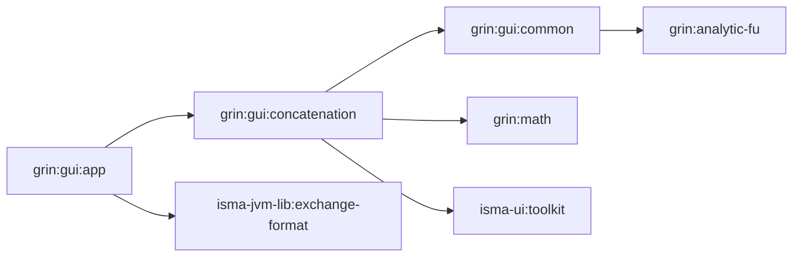
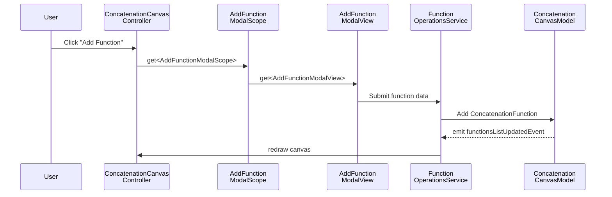
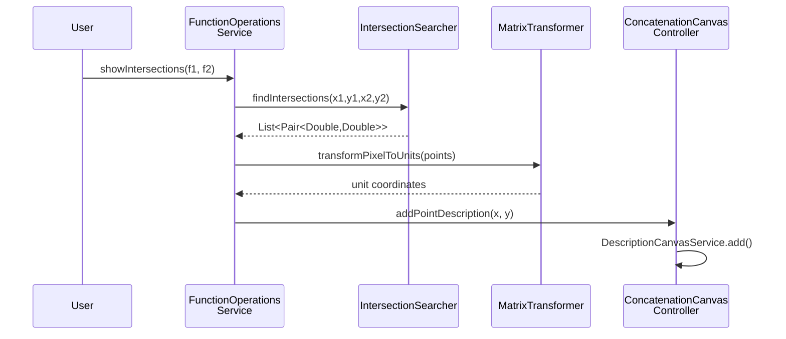

# GrIn Overview

## Purpose

GrIn is an interactive function visualization and analysis environment built on JavaFX. It allows users to plot, transform, and analyze mathematical functions on a 2D Cartesian canvas — supporting analytical expressions, numerical data from files, and point-based datasets. The module provides a toolbox of operations including derivatives, mirror transformations, wavelet transforms, integration, and intersection detection.

## Module Structure

```
grin/
├── analytic-fu/                  # Analytical function parser + evaluator
│   ├── model/                    # Expression, Calculated, Number, Fraction
│   ├── parser/                   # ExpressionParser, ExpressionConverter, Litter AST
│   ├── operators/                # BinaryOperator interface + impl
│   ├── validators/               # FunctionValidator
│   └── calculation/              # Calculator (RPN evaluator)
├── math/                         # Numerical math primitives
│   ├── Integration.kt            # Trapezoidal integration
│   ├── Derivatives.kt            # Left/right/central numerical derivatives
│   └── IntersectionSearcher.kt   # Segment intersection detection (coroutines)
├── gui/
│   ├── common/                   # Shared UI models + draw elements
│   │   ├── model/                # Point, FunctionModel, WaveletTransformFun, DrawSize
│   │   ├── draw/elements/        # GridDrawElement, ClearDrawElement
│   │   └── view/                 # ChainDrawElement, ChainDrawer
│   ├── concatenation/            # Main canvas application
│   │   ├── canvas/               # Canvas view, model, handlers, controller
│   │   ├── cartesian/            # CartesianSpace CRUD views + services
│   │   ├── function/             # Function CRUD + operations + transforms
│   │   ├── description/          # Annotation/description management
│   │   ├── axis/                 # Axis configuration + draw strategies
│   │   ├── file/                 # File I/O (CSV, XLS, XLSX) + project loader
│   │   └── koin/                 # Scope classes + DI wiring
│   └── app/                      # Application entry point + DI root
```

## Dependency Diagram



## Design Principles

### 1. Layered Architecture

The `concatenation` module follows a consistent MVC pattern across every domain area (function, cartesian space, axis, description):

- **Model** — data classes (e.g. `ConcatenationFunction`, `CartesianSpace`) + view models (e.g. `FunctionListViewModel`)
- **View** — JavaFX UI components (Fragments, ListViews, ToolBar controls)
- **Controller** — handles user interactions (e.g. `FunctionListViewController`, `AddFunctionController`)
- **Service** — business logic and operations (e.g. `FunctionOperationsService`, `CartesianCanvasService`)

### 2. Koin-Scoped Dependency Injection

All UI components use Koin with a hierarchical scoping system. The `MainGrinScope` is a top-level Koin scope created at application startup, and each modal dialog gets its own child scope:

```kotlin
// grin/gui/concatenation/src/main/kotlin/.../koin/KoinExtensions.kt
class MainGrinScope(val primaryStage: Stage) : KoinScopeComponent {
    override val scope: Scope by lazy { createScope(this) }
}

class FunctionChangeModalScope: KoinScopeComponent {
    override val scope: Scope by lazy { createScope(this) }
}
```

Each modal scope links to the parent:

```kotlin
// grin/gui/concatenation/src/main/kotlin/.../KoinModules.kt
factory {
    FunctionChangeModalScope().apply {
        scope.linkTo(get<MainGrinScope>().scope)
    }
}
```

Scopes are closed on dialog close via `onClose` hooks in the Koin module registration.

### 3. Async Transformer Pipeline

Functions support composable point transformations via the `IAsyncPointsTransformer` interface:

```kotlin
// grin/gui/concatenation/src/main/kotlin/.../function/transform/IAsyncPointsTransformer.kt
interface IAsyncPointsTransformer {
    suspend fun transform(x: DoubleArray, y: DoubleArray): Pair<DoubleArray, DoubleArray>
}
```

Transformers include:

| Transformer | Operation |
|-------------|-----------|
| `DerivativeTransformer` | Numerical derivative (left/right/central) |
| `MirrorTransformer` | Reflect across X axis, Y axis, or both |
| `TranslateTransformer` | Shift function by dx/dy |
| `LogTransformer` | Apply logarithmic scale |
| `IntegratorTransformer` | Numerical integration (trapezoidal) |
| `WaveletTransformer` | Wavelet transform |

The `ConcatenationFunction` class uses an `AtomicReference` CAS loop to apply transformation pipelines concurrently:

```kotlin
// grin/gui/concatenation/src/main/kotlin/.../function/model/ConcatenationFunction.kt
suspend fun updateTransformersTransaction(
    operation: (Array<IAsyncPointsTransformer>) -> Array<IAsyncPointsTransformer>
) = coroutineScope {
    while (true) {
        if (tryUpdateCacheCandidate(operation)) break
    }
    // ... apply candidate transformers
}
```

### 4. Reactive Canvas Updates

The `ConcatenationCanvasModel` publishes `SharedFlow` events for state changes:

```kotlin
// grin/gui/concatenation/src/main/kotlin/.../canvas/model/ConcatenationCanvasModel.kt
private val functionsListUpdatedEventInternal = MutableSharedFlow<List<ConcatenationFunction>>()
val functionsListUpdatedEvent = functionsListUpdatedEventInternal.asSharedFlow()

private val axesListUpdatedEventInternal = MutableSharedFlow<List<ConcatenationAxis>>()
val axesListUpdatedEvent = axesListUpdatedEventInternal.asSharedFlow()
```

The `ConcatenationCanvas` subscribes to all events and triggers redraw:

```kotlin
fxCoroutineScope.launch {
    merge(
        model.axesListUpdatedEvent,
        model.functionsListUpdatedEvent,
        model.descriptionsListUpdatedEvent,
        model.cartesianSpacesListUpdatedEvent,
    ).collectLatest { chainDrawer.draw() }
}
```

### 5. Two-Layer Canvas

The canvas uses two `Canvas` (JavaFX 2D) overlays:

- **Functions layer** — plots function curves (lines, points)
- **UI layer** — renders grid, axes, labels, selections, descriptions

The `ConcatenationChainDrawer` orchestrates drawing by chaining `ChainDrawElement` implementations:

```kotlin
// grin/gui/common/src/main/kotlin/.../view/ChainDrawElement.kt
interface ChainDrawElement {
    fun draw(context: GraphicsContext, canvasWidth: Double, canvasHeight: Double)
}
```

Draw elements include `GridDrawElement`, `AxisDrawElement`, `ConcatenationFunctionDrawElement`, `DescriptionDrawElement`, and `SelectionDrawElement`.

### 6. Pixel-to-Unit Transformation

The `MatrixTransformer` converts between canvas pixel coordinates and mathematical unit coordinates:

```kotlin
// grin/gui/concatenation/src/main/kotlin/.../canvas/controller/MatrixTransformer.kt
fun transformPixelToUnits(number: Double, scaleProperties: AxisScaleProperties, direction: Direction): Double
fun transformUnitsToPixel(number: Double, scaleProperties: AxisScaleProperties, direction: Direction): Double
```

It respects axis direction (`Direction.LEFT`, `Direction.RIGHT`, `Direction.TOP`, `Direction.BOTTOM`) and scale properties (`minValue`, `maxValue`).

### 7. Analytical Expression Pipeline

The `analytic-fu` module implements a classic expression evaluation pipeline:

```
String → ExpressionParser → List<Litter> → ExpressionConverter → Inverse Polish (RPN) → Calculator → Double
```

The AST is a sealed hierarchy of leaf nodes:

```kotlin
// grin/analytic-fu/src/main/kotlin/.../parser/Litter.kt
sealed class Litter
data class Number(val value: Double) : Litter()
object X : Litter()
object PlusOperator : Litter()
object MinusOperator : Litter()
object DelOperator : Litter()       // Division (del = delenie)
object MultiplyOperator : Litter()
object LeftBracket : Litter()
object RightBracket : Litter()
```

The `Calculator` evaluates RPN using a stack:

```kotlin
// grin/analytic-fu/src/main/kotlin/.../calculation/Calculator.kt
class Calculator(private val list: List<Litter>) {
    fun calculate(x: Double): Double {
        val stack = Stack<Double>()
        list.forEach { /* push numbers/variables, apply operators */ }
        return stack.pop()
    }
}
```

### 8. Numerical Math

The `math` module provides pure numerical operations:

- **`Derivatives`** — left difference, right difference, and central difference for arbitrary derivative degree
- **`Integration`** — trapezoidal rule integration with initial value
- **`IntersectionSearcher`** — segment-segment intersection using cross products, parallelized with Kotlin coroutines

Intersection detection uses a computational geometry approach: two segments intersect if the endpoints of each segment lie on opposite sides of the other segment (checked via cross product sign).

## Communication Flows

### Adding a Function



### Function Transformation

```mermaid
sequenceDiagram
    participant User
    participant Ctrl as Function<br/>ListViewController
    participant Svc as Function<br/>OperationsService
    participant Func as Concatenation<br/>Function
    param T as IAsyncPoints<br/>Transformer

    User->>Ctrl: Select transform (e.g. derivative)
    Ctrl->>Func: updateTransformersTransaction
    Func->>Func: CAS tryUpdateCacheCandidate
    Func->>T: suspend transform(x, y)
    T-->>Func: new (x, y) arrays
    Func->>Func: CAS tryApplyCacheCandidate
    Func-->>Svc: transformed points
    Svc->>Svc: MatrixTransformer units → pixels
    Svc-->>Ctrl: redraw()
```

### Intersection Detection



## Error Handling

Errors in GrIn are handled at three levels:

| Level | Mechanism | Examples |
|-------|-----------|----------|
| **Expression parsing** | `NumberFormatException` for invalid numeric literals | Non-numeric characters in number tokens |
| **File I/O** | `IOException` / POI-specific exceptions | Corrupted XLSX, missing columns |
| **Canvas operations** | Silent skip / null checks | Missing `pixelsToDraw`, empty axis arrays |

The application does not use a structured error handling framework — errors are logged to `System.err` or silently skipped. The command-line runner prints errors to `System.err` and continues:

```kotlin
// grin/gui/app/src/main/kotlin/.../launcher/GrinApplication.kt
if (!file.exists()) {
    System.err.println("Result file not found: ${config.resultFile}")
    return
}
```

## Build Configuration

### Submodule Dependencies

| Submodule | Plugin | Key Dependencies |
|-----------|--------|-----------------|
| `analytic-fu` | `kotlin-jvm` | `kotlin-stdlib` |
| `math` | `kotlin-jvm` | `kotlin-stdlib`, `kotlinx-coroutines-core` |
| `gui/common` | `java-modules` | `:grin:analytic-fu` |
| `gui/concatenation` | `java-modules` + `kotlinx-serialization` | `TornadoFX`, `Koin`, `POI`, `JWave`, coroutines, `:grin:math`, `:isma-ui:toolkit` |
| `gui/app` | `java-modules` + `application` | `:grin:gui:concatenation`, `isma-jvm-lib:exchange-format` |

### Module-Info Declarations

Each submodule declares a Java 9+ module:

| Module | Exports |
|--------|---------|
| `isma.grin.analytic.fu.main` | `ru.nstu.grin.model`, `parser`, `operators`, `validators`, `calculation` |
| `isma.grin.math.main` | `ru.nstu.grin.math` |
| `isma.grin.gui.common.main` | `ru.nstu.grin.common.*` |
| `isma.grin.gui.concatenation.main` | `ru.nstu.grin.concatenation.*` (all subpackages) |
| `isma.grin.gui.app` | `ru.nstu.isma.grin.launcher` |
