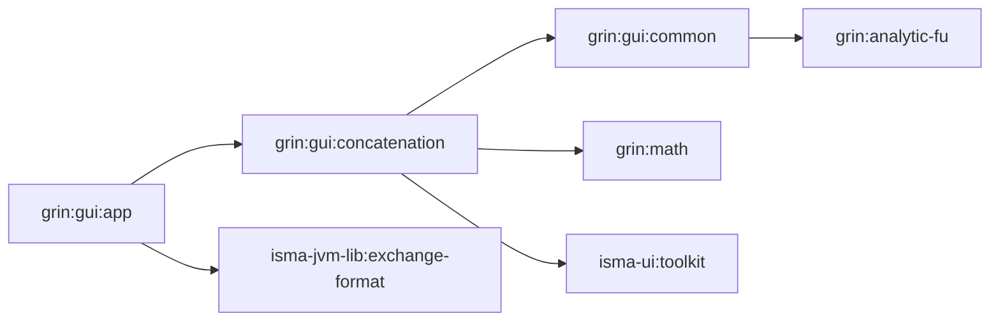
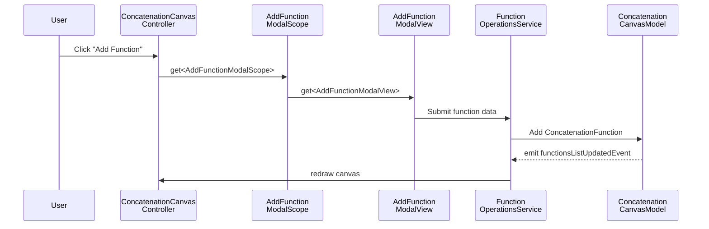
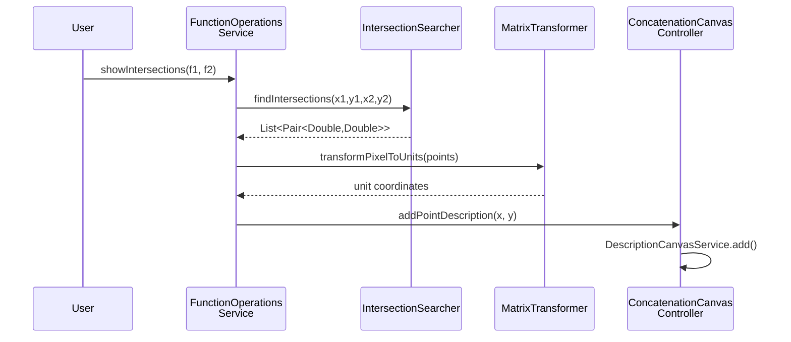

# GrIn Overview

## Purpose

GrIn is an interactive function visualization and analysis environment built on JavaFX. It allows users to plot, transform, and analyze mathematical functions on a 2D Cartesian canvas — supporting analytical expressions, numerical data from files, and point-based datasets. The module provides a toolbox of operations including derivatives, mirror transformations, wavelet transforms, integration, and intersection detection.

## Module Structure

```
grin/
├── analytic-fu/                  # Analytical function parser + evaluator
│   ├── model/                    # Expression, Calculated, Number, Fraction
│   ├── parser/                   # ExpressionParser, ExpressionConverter, Litter AST
│   ├── operators/                # BinaryOperator interface + impl
│   ├── validators/               # FunctionValidator
│   └── calculation/              # Calculator (RPN evaluator)
├── math/                         # Numerical math primitives
│   ├── Integration.kt            # Trapezoidal integration
│   ├── Derivatives.kt            # Left/right/central numerical derivatives
│   └── IntersectionSearcher.kt   # Segment intersection detection (coroutines)
├── gui/
│   ├── common/                   # Shared UI models + draw elements
│   │   ├── model/                # Point, FunctionModel, WaveletTransformFun, WaveletDirection, DrawSize, ChooseFunctionWay
│   │   ├── draw/elements/        # GridDrawElement, ClearDrawElement
│   │   ├── view/                 # ChainDrawElement, ChainDrawer
│   │   ├── controller/           # PointsBuilder
│   │   ├── converters/           # Converter<In, Out> interface
│   │   ├── common/               # SettingsProvider (canvas dimensions)
│   │   └── extensions/           # BytesExtension
│   ├── concatenation/            # Main canvas application
│   │   ├── canvas/               # Canvas view, model, view model, handlers, controller
│   │   │   ├── model/project/    # ProjectSnapshot + serialization (toSnapshot/toModel)
│   │   │   ├── converter/        # CartesianSpaceConverter
│   │   │   ├── dto/              # CartesianSpaceDTO
│   │   │   └── view/             # ConcatenationView, toolbars, context menu, chain drawer
│   │   ├── cartesian/            # CartesianSpace CRUD views + services
│   │   ├── function/             # Function CRUD + operations + transforms + DTOs + converters
│   │   │   ├── transform/        # IAsyncPointsTransformer implementations
│   │   │   ├── dto/              # ConcatenationFunctionDTO
│   │   │   └── converter/        # ConcatenationFunctionConverter
│   │   ├── description/          # Annotation/description management
│   │   ├── axis/                 # Axis configuration + draw strategies + mark builders
│   │   ├── file/                 # File I/O (CSV, XLS, XLSX) + project loader (.chart.json)
│   │   │   ├── readers/          # CsvReader, XLSReader, XLSXReader, FileRecognizer, ExcelRange
│   │   │   └── options/          # FileOptionsView, FileReaderMode, FileDetails
│   │   ├── points/               # Points-based function input (manual entry)
│   │   ├── koin/                 # Scope classes + DI wiring
│   │   └── KoinModules.kt        # grinGuiModule — all DI registrations
│   └── app/                      # Application entry point + DI root
```

## Dependency Diagram



## Design Principles

### 1. Layered Architecture

The `concatenation` module follows a consistent MVC pattern across every domain area (function, cartesian space, axis, description):

- **Model** — data classes (e.g. `ConcatenationFunction`, `CartesianSpace`) + view models (e.g. `FunctionListViewModel`)
- **View** — JavaFX UI components (Fragments, ListViews, ToolBar controls)
- **Controller** — handles user interactions (e.g. `FunctionListViewController`, `AddFunctionController`)
- **Service** — business logic and operations (e.g. `FunctionOperationsService`, `CartesianCanvasService`)

Each subdomain has its own `controller/`, `view/`, `model/`, and `service/` packages.

### 2. Koin-Scoped Dependency Injection

All UI components use Koin with a hierarchical scoping system. The `MainGrinScope` is a top-level Koin scope created at application startup, and each modal dialog gets its own child scope:

```kotlin
// grin/gui/concatenation/src/main/kotlin/.../koin/KoinExtensions.kt
class MainGrinScope(val primaryStage: Stage) : KoinScopeComponent {
    override val scope: Scope by lazy { createScope(this) }
}

class FunctionChangeModalScope: KoinScopeComponent {
    override val scope: Scope by lazy { createScope(this) }
}
```

The DI configuration is centralized in `grinGuiModule` (`KoinModules.kt`):

```kotlin
// grin/gui/concatenation/src/main/kotlin/.../KoinModules.kt
val grinGuiModule = module {
    scope<MainGrinScope> {
        scopedOf(::ConcatenationCanvasController)
        scopedOf(::ConcatenationCanvasModel)
        scopedOf(::ConcatenationCanvasViewModel)
        scopedOf(::ConcatenationChainDrawer)
        scopedOf(::FunctionOperationsService)
        scopedOf(::CartesianCanvasService)
        scopedOf(::AxisCanvasService)
        scopedOf(::DescriptionCanvasService)
        // ... + all views, controllers, draw elements, handlers, toolbars

        factory {
            FunctionChangeModalScope().apply {
                scope.linkTo(get<MainGrinScope>().scope)
            }
        }
        // ... + other modal scopes (AxisChange, FunctionCopy, DescriptionChange, etc.)
    }

    scope<FunctionChangeModalScope> {
        scopedOf(::ChangeFunctionFragment)
        scopedOf(::ChangeFunctionViewModel)
    }
    // ... + other modal scope registrations
}
```

Scopes are closed on dialog close via `onClose` hooks in the Koin module registration.

### 3. Canvas Model and ViewModel

The canvas state is split into two layers:

- **`ConcatenationCanvasModel`** — holds the domain data: cartesian spaces, functions, axes, descriptions. Publishes `SharedFlow` events for state changes.
- **`ConcatenationCanvasViewModel`** — holds UI state: graphics contexts for both layers, canvas dimensions, functions area insets, selected functions/descriptions.

```kotlin
// grin/gui/concatenation/src/main/kotlin/.../canvas/model/ConcatenationCanvasModel.kt
class ConcatenationCanvasModel {
    val cartesianSpaces = mutableListOf<CartesianSpace>()
    val functions get() = cartesianSpaces.map { it.functions }.flatten()
    val axes get() = cartesianSpaces.map { listOf(it.xAxis, it.yAxis) }.flatten()
    val descriptions get() = cartesianSpaces.map { it.descriptions }.flatten()

    // SharedFlow events for reactive updates
    val functionsListUpdatedEvent = ...
    val axesListUpdatedEvent = ...
    val cartesianSpacesListUpdatedEvent = ...
    val descriptionsListUpdatedEvent = ...
}
```

### 4. Edit Mode System

The canvas supports multiple interaction modes controlled by `EditModeViewModel`:

```kotlin
// grin/gui/concatenation/src/main/kotlin/.../canvas/model/EditMode.kt
enum class EditMode {
    NONE,       // No interaction
    VIEW,       // Pan/scroll
    SCALE,      // Zoom
    EDIT,       // Edit function parameters
    WINDOWED,   // Windowed view
    SELECTION,  // Select region
    MOVE        // Move elements
}
```

Mouse handlers delegate based on the current edit mode: `PressedMouseHandler`, `DraggedHandler`, `ReleaseMouseHandler`, and `ScalableScrollHandler`.

### 5. Selection and Tracing

The canvas supports two interactive overlays:

- **Selection** — `SelectionSettings` tracks two points defining a rectangular selection region. `SelectionDrawElement` renders the selection rectangle.
- **Trace** — `TraceSettings` tracks a pressed point and axis references for coordinate tracing along function curves. `ConcatenationFunctionDrawElement` highlights the nearest point on a function curve.

### 6. Async Transformer Pipeline

Functions support composable point transformations via the `IAsyncPointsTransformer` interface:

```kotlin
// grin/gui/concatenation/src/main/kotlin/.../function/transform/IAsyncPointsTransformer.kt
interface IAsyncPointsTransformer {
    suspend fun transform(x: DoubleArray, y: DoubleArray): Pair<DoubleArray, DoubleArray>
}
```

Transformers include:

| Transformer | Operation |
|-------------|-----------|
| `DerivativeTransformer` | Numerical derivative (left/right/central) |
| `MirrorTransformer` | Reflect across X axis, Y axis, or both |
| `TranslateTransformer` | Shift function by dx/dy |
| `LogTransformer` | Apply logarithmic scale |
| `IntegratorTransformer` | Numerical integration (trapezoidal) |
| `WaveletTransformer` | Wavelet transform |

The `ConcatenationFunction` class uses an `AtomicReference` CAS loop to apply transformation pipelines concurrently:

```kotlin
// grin/gui/concatenation/src/main/kotlin/.../function/model/ConcatenationFunction.kt
suspend fun updateTransformersTransaction(
    operation: (Array<IAsyncPointsTransformer>) -> Array<IAsyncPointsTransformer>
) = coroutineScope {
    while (true) {
        if (tryUpdateCacheCandidate(operation)) break
    }
    // ... apply candidate transformers
}
```

### 7. Reactive Canvas Updates

The `ConcatenationCanvasModel` publishes `SharedFlow` events for state changes. The `ConcatenationCanvas` subscribes to all events and triggers redraw:

```kotlin
// grin/gui/concatenation/src/main/kotlin/.../canvas/view/ConcatenationCanvas.kt
fxCoroutineScope.launch {
    merge(
        model.axesListUpdatedEvent,
        model.functionsListUpdatedEvent,
        model.descriptionsListUpdatedEvent,
        model.cartesianSpacesListUpdatedEvent,
    ).collectLatest {
        chainDrawer.draw()
    }
}
```

### 8. Two-Layer Canvas

The canvas uses two `Canvas` (JavaFX 2D) overlays:

- **Functions layer** — plots function curves, axes, descriptions, and grid
- **UI layer** — renders selection rectangles and other interactive overlays

The `ConcatenationChainDrawer` orchestrates drawing by chaining `ChainDrawElement` implementations:

```kotlin
// grin/gui/common/src/main/kotlin/.../view/ChainDrawElement.kt
interface ChainDrawElement {
    fun draw(context: GraphicsContext, canvasWidth: Double, canvasHeight: Double)
}
```

Draw elements include `GridDrawElement`, `AxisDrawElement`, `ConcatenationFunctionDrawElement`, `DescriptionDrawElement`, and `SelectionDrawElement`.

The draw pipeline:

```
ConcatenationChainDrawer.draw()
  → findFunctionsAreaInsets()          // compute functions area from axes
  → transformSpaces()                  // apply space-level transformations
  → drawFunctionsLayerInternal()       // clear → functions → axes → descriptions
  → drawUiLayerInternal()              // clear → selection overlay
```

### 9. Pixel-to-Unit Transformation

The `MatrixTransformer` converts between canvas pixel coordinates and mathematical unit coordinates:

```kotlin
// grin/gui/concatenation/src/main/kotlin/.../canvas/controller/MatrixTransformer.kt
fun transformPixelToUnits(number: Double, scaleProperties: AxisScaleProperties, direction: Direction): Double
fun transformUnitsToPixel(number: Double, scaleProperties: AxisScaleProperties, direction: Direction): Double
fun transformUnitsToPixel(input: DoubleArray, output: DoubleArray, ...): Unit
```

It respects axis direction (`Direction.LEFT`, `Direction.RIGHT`, `Direction.TOP`, `Direction.BOTTOM`) and scale properties (`minValue`, `maxValue`). The `functionsArea` insets from `ConcatenationCanvasViewModel` define the usable drawing region within the canvas.

### 10. Analytical Expression Pipeline

The `analytic-fu` module implements a classic expression evaluation pipeline:

```
String → ExpressionParser → List<Litter> → ExpressionConverter → Inverse Polish (RPN) → Calculator → Double
```

The AST is a sealed hierarchy of leaf nodes:

```kotlin
// grin/analytic-fu/src/main/kotlin/.../parser/Litter.kt
sealed class Litter
data class Number(val value: Double) : Litter()
object X : Litter()
object PlusOperator : Litter()
object MinusOperator : Litter()
object DelOperator : Litter()       // Division (del = delenie)
object MultiplyOperator : Litter()
object LeftBracket : Litter()
object RightBracket : Litter()
```

The `Calculator` evaluates RPN using a stack:

```kotlin
// grin/analytic-fu/src/main/kotlin/.../calculation/Calculator.kt
class Calculator(private val list: List<Litter>) {
    fun calculate(x: Double): Double {
        val stack = Stack<Double>()
        list.forEach { /* push numbers/variables, apply operators */ }
        return stack.pop()
    }
}
```

The `FunctionValidator` checks expression correctness before parsing.

### 11. Numerical Math

The `math` module provides pure numerical operations:

- **`Derivatives`** — left difference, right difference, and central difference for arbitrary derivative degree
- **`Integration`** — trapezoidal rule integration with initial value
- **`IntersectionSearcher`** — segment-segment intersection using cross products, parallelized with Kotlin coroutines

Intersection detection uses a computational geometry approach: two segments intersect if the endpoints of each segment lie on opposite sides of the other segment (checked via cross product sign).

### 12. Function Input Modes

Functions can be added to the canvas through multiple input modes, each with its own fragment and model:

| Mode | Fragment | Model | Description |
|------|----------|-------|-------------|
| Analytic | `AnalyticFunctionFragment` | `AnalyticFunctionModel` | Mathematical expression (e.g. `sin(x) + x^2`) |
| File | `FileFunctionFragment` | `FileFunctionModel` | Data from CSV/XLS/XLSX file |
| Manual | `ManualFunctionFragment` | `ManualFunctionModel` | Manual point entry |

The `AddFunctionModalView` orchestrates these modes through the `AddFunctionController`.

### 13. File I/O

GrIn supports three file formats for data import:

| Format | Reader | Library |
|--------|--------|---------|
| CSV | `CsvReader` | Custom |
| XLS | `XLSReader` | Apache POI |
| XLSX | `XLSXReader` | Apache POI |

`FileRecognizer` determines the format by file extension. Each reader produces `DoubleArray` pairs (x, y) that are wrapped into `ConcatenationFunction` instances.

### 14. Project Save/Load

Projects are saved and loaded as JSON files (`.chart.json`) using Kotlinx Serialization:

```kotlin
// grin/gui/concatenation/src/main/kotlin/.../file/CanvasProjectLoader.kt
class CanvasProjectLoader(
    private val model: ConcatenationCanvasModel,
    private val concatenationCanvasController: ConcatenationCanvasController,
) {
    fun save(window: Window? = null)  // → *.chart.json
    fun load(window: Window? = null)  // ← *.chart.json
}
```

The serialization model (`ProjectSnapshotModels.kt`) includes:

```kotlin
@Serializable
data class ProjectSnapshot(
    val spaces: List<CartesianSpaceSnapshot>
)

@Serializable
data class CartesianSpaceSnapshot(
    val name: String,
    val functions: List<ConcatenationFunctionSnapshot>,
    val descriptions: List<DescriptionSnapshot>,
    val xAxis: ConcatenationAxisSnapshot,
    val yAxis: ConcatenationAxisSnapshot,
    val isShowGrid: Boolean,
)

@Serializable
data class ConcatenationFunctionSnapshot(
    val name: String,
    val xPoints: List<Double>,
    val yPoints: List<Double>,
    val isHide: Boolean,
    val functionColor: ColorSnapshot,
    val lineSize: Double,
    val lineType: LineType,
    val transformers: List<TransformerSnapshot>   // serializable transformer representations
)
```

Each transformer type has a corresponding `@Serializable` snapshot class (`DerivativeTransformerSnapshot`, `MirrorTransformerSnapshot`, `TranslateTransformerSnapshot`, `LogTransformerSnapshot`, `IntegratorTransformerSnapshot`, `WaveletTransformerSnapshot`). Conversion functions (`toSnapshot()`/`toModel()`) handle bidirectional mapping.

### 15. Cartesian Space System

A `CartesianSpace` is a named coordinate system containing functions, descriptions, and axis configuration:

```kotlin
// grin/gui/concatenation/src/main/kotlin/.../cartesian/model/CartesianSpace.kt
data class CartesianSpace(
    var name: String,
    val functions: MutableList<ConcatenationFunction>,
    val descriptions: MutableList<Description>,
    val xAxis: ConcatenationAxis,
    val yAxis: ConcatenationAxis,
    var isShowGrid: Boolean = false
) : Cloneable {
    val axes = listOf(xAxis, yAxis)
    fun merge(inFunctions: List<ConcatenationFunction>)
}
```

Multiple `CartesianSpace` instances can coexist in a single canvas. The `CartesianCanvasService` manages CRUD operations.

### 16. Axis System

Axes define the coordinate system for a cartesian space:

```kotlin
// grin/gui/concatenation/src/main/kotlin/.../axis/model/ConcatenationAxis.kt
data class ConcatenationAxis(
    var name: String,
    var direction: Direction,          // LEFT, RIGHT, TOP, BOTTOM
    var styleProperties: AxisStyleProperties,
    var scaleProperties: AxisScaleProperties,
)
```

`AxisScaleProperties` includes `scalingType` (LINEAR, LOGARITHMIC), `scalingLogBase`, `minValue`, `maxValue`.

`AxisStyleProperties` includes `backgroundColor`, `marksDistanceType`, `marksDistance`, `marksColor`, `marksFont`, `isVisible`.

Axis rendering uses a strategy pattern: `AxisDrawStrategy` (horizontal/vertical) delegates to `MarksArrayBuilder` for tick mark computation and `AxisMarksDrawStrategy` for rendering.

### 17. Description System

Descriptions are text annotations placed at specific coordinates on the canvas:

```kotlin
// grin/gui/concatenation/src/main/kotlin/.../description/model/Description.kt
data class Description(
    var text: String,
    var textOffsetX: Double,
    var textOffsetY: Double,
    var color: Color,
    var font: Font,
    var pointerX: Double,
    var pointerY: Double,
) {
    fun isLocated(eventX: Double, eventY: Double): Boolean
}
```

Descriptions are managed by `DescriptionCanvasService` and rendered by `DescriptionDrawElement`. The `ConcatenationCanvasController.openDescriptionModal()` opens an annotation dialog, and `addPointDescription()` creates auto-labeled intersection points.

### 18. Converter Pattern

The `Converter<In, Out>` interface provides a uniform pattern for data transformation:

```kotlin
// grin/gui/common/src/main/kotlin/.../converters/Converter.kt
interface Converter<In, Out> {
    fun convert(source: In): Out
}
```

Used by `ConcatenationFunctionConverter` (DTO → model) and `CartesianSpaceConverter` (DTO → model).

## Communication Flows

### Adding a Function



### Function Transformation

```mermaid
sequenceDiagram
    participant User
    participant Ctrl as Function<br/>ListViewController
    participant Svc as Function<br/>OperationsService
    participant Func as Concatenation<br/>Function
    param T as IAsyncPoints<br/>Transformer

    User->>Ctrl: Select transform (e.g. derivative)
    Ctrl->>Func: updateTransformersTransaction
    Func->>Func: CAS tryUpdateCacheCandidate
    Func->>T: suspend transform(x, y)
    T-->>Func: new (x, y) arrays
    Func->>Func: CAS tryApplyCacheCandidate
    Func-->>Svc: transformed points
    Svc->>Svc: MatrixTransformer units → pixels
    Svc-->>Ctrl: redraw()
```

### Intersection Detection



### Project Save

```mermaid
sequenceDiagram
    participant User
    participant Loader as Canvas<br/>ProjectLoader
    participant Model as Concatenation<br/>CanvasModel
    param Json as Kotlinx<br/>Serialization

    User->>Loader: save()
    Loader->>Model: read cartesianSpaces
    Model-->>Loader: List<CartesianSpace>
    Loader->>Loader: toSnapshot() on each space
    Loader->>Json: encode ProjectSnapshot → JSON
    Json-->>Loader: *.chart.json
    Loader->>Loader: write to file
```

### Project Load

```mermaid
sequenceDiagram
    participant User
    participant Loader as Canvas<br/>ProjectLoader
    param Json as Kotlinx<br/>Serialization
    participant CVC as ConcatenationCanvas<br/>Controller

    User->>Loader: load()
    Loader->>Loader: read JSON from file
    Loader->>Json: decode ProjectSnapshot
    Json-->>Loader: ProjectSnapshot
    Loader->>Loader: toModel() on each space
    Loader->>CVC: replaceAll(cartesianSpaces)
    CVC->>CVC: normalizeSpaces() + emit update events
```

## Error Handling

Errors in GrIn are handled at three levels:

| Level | Mechanism | Examples |
|-------|-----------|----------|
| **Expression parsing** | `NumberFormatException` for invalid numeric literals | Non-numeric characters in number tokens |
| **File I/O** | `IOException` / POI-specific exceptions | Corrupted XLSX, missing columns |
| **Canvas operations** | Silent skip / null checks | Missing `pixelsToDraw`, empty axis arrays |

The application does not use a structured error handling framework — errors are logged to `System.err` or silently skipped. The command-line runner prints errors to `System.err` and continues:

```kotlin
// grin/gui/app/src/main/kotlin/.../launcher/GrinApplication.kt
if (!file.exists()) {
    System.err.println("Result file not found: ${config.resultFile}")
    return
}
```

## Build Configuration

### Submodule Dependencies

| Submodule | Plugin | Key Dependencies |
|-----------|--------|-----------------|
| `analytic-fu` | `java-modules` | `kotlin-stdlib` |
| `math` | `java-modules` | `kotlin-stdlib`, `kotlinx-coroutines-core` |
| `gui/common` | `java-modules` | `:grin:analytic-fu`, `javafx.graphics` |
| `gui/concatenation` | `java-modules` + `kotlinx-serialization` | `TornadoFX`, `Koin`, `POI`, `JWave`, coroutines, `:grin:math`, `:isma-ui:toolkit` |
| `gui/app` | `java-modules` + `application` | `:grin:gui:concatenation`, `isma-jvm-lib:exchange-format`, `koin-core` |

### Module-Info Declarations

| Module | Exports |
|--------|---------|
| `isma.grin.analytic.fu.main` | `ru.nstu.grin.model`, `parser`, `operators`, `validators`, `calculation` |
| `isma.grin.math.main` | `ru.nstu.grin.math` |
| `isma.grin.gui.common.main` | `ru.nstu.grin.common.common`, `controller`, `converters`, `draw.elements`, `extensions`, `model`, `view` |
| `isma.grin.gui.concatenation.main` | `axis.controller/service/view/model`, `canvas.controller/view/model/handlers`, `cartesian.controller/service/view/model`, `description.controller/service/view/model`, `file`, `file.options.view`, `function.controller/service/view/model`, `koin` |
| `isma.grin.gui.app` | `ru.nstu.isma.grin.launcher` |
