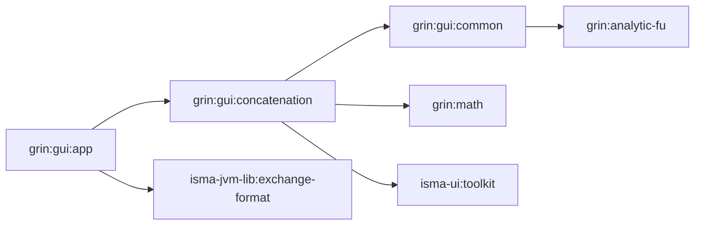
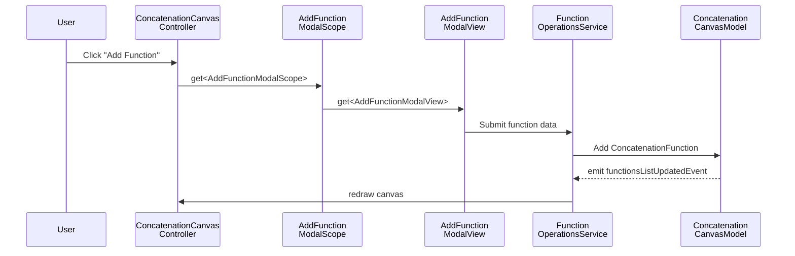
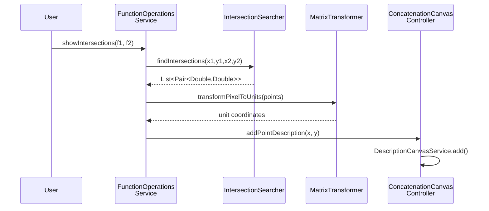

# GrIn Overview

## Purpose

GrIn is an interactive function visualization and analysis environment built on JavaFX. It allows users to plot, transform, and analyze mathematical functions on a 2D Cartesian canvas — supporting analytical expressions, numerical data from files, and point-based datasets. The module provides a toolbox of operations including derivatives, mirror transformations, wavelet transforms, integration, and intersection detection.

## Module Structure

The `grin` module has four main submodules:

- **`grin/analytic-fu/`** — Analytical function parser and evaluator. Contains `model/` (Expression, Calculated, Number, Fraction), `parser/` (ExpressionParser, ExpressionConverter, Litter AST), `operators/` (BinaryOperator interface and implementations), `validators/` (FunctionValidator), and `calculation/` (Calculator, an RPN evaluator). See `grin/analytic-fu/src/main/kotlin/.../parser/ExpressionParser.kt`, `grin/analytic-fu/src/main/kotlin/.../parser/ExpressionConverter.kt`, `grin/analytic-fu/src/main/kotlin/.../parser/Litter.kt`, and `grin/analytic-fu/src/main/kotlin/.../calculation/Calculator.kt` for implementation.

- **`grin/math/`** — Numerical math primitives. Contains `Integration.kt` (trapezoidal integration), `Derivatives.kt` (left/right/central numerical derivatives), and `IntersectionSearcher.kt` (segment intersection detection using coroutines). See `grin/math/src/main/kotlin/.../math/Derivatives.kt`, `grin/math/src/main/kotlin/.../math/Integration.kt`, and `grin/math/src/main/kotlin/.../math/IntersectionSearcher.kt`.

- **`grin/gui/common/`** — Shared UI models and draw elements. Contains `model/` (Point, FunctionModel, WaveletTransformFun, WaveletDirection, DrawSize, ChooseFunctionWay), `draw/elements/` (GridDrawElement, ClearDrawElement), `view/` (ChainDrawElement, ChainDrawer), `controller/` (PointsBuilder), `converters/` (Converter interface), `common/` (SettingsProvider), and `extensions/` (BytesExtension). See `grin/gui/common/src/main/kotlin/.../model/Point.kt`, `grin/gui/common/src/main/kotlin/.../view/ChainDrawElement.kt`, `grin/gui/common/src/main/kotlin/.../view/ChainDrawer.kt`, `grin/gui/common/src/main/kotlin/.../converters/Converter.kt`, and `grin/gui/common/src/main/kotlin/.../common/SettingsProvider.kt`.

- **`grin/gui/concatenation/`** — Main canvas application. Contains `canvas/` (canvas view, model, view model, handlers, controller, with `model/project/` for project serialization, `converter/` for CartesianSpaceConverter, `dto/` for CartesianSpaceDTO, and `view/` for ConcatenationView, toolbars, context menu, chain drawer), `cartesian/` (CartesianSpace CRUD views and services), `function/` (function CRUD, operations, transforms, DTOs, converters — with `transform/` for IAsyncPointsTransformer implementations, `dto/` for ConcatenationFunctionDTO, and `converter/` for ConcatenationFunctionConverter), `description/` (annotation/description management), `axis/` (axis configuration, draw strategies, mark builders), `file/` (file I/O for CSV/XLS/XLSX and project loader for `.chart.json` — with `readers/` for CsvReader, XLSReader, XLSXReader, FileRecognizer, ExcelRange, and `options/` for FileOptionsView, FileReaderMode, FileDetails), `points/` (points-based function input), `koin/` (scope classes and DI wiring), and `KoinModules.kt` (grinGuiModule with all DI registrations). See `grin/gui/concatenation/src/main/kotlin/.../KoinModules.kt`, `grin/gui/concatenation/src/main/kotlin/.../canvas/model/ConcatenationCanvasModel.kt`, `grin/gui/concatenation/src/main/kotlin/.../canvas/model/ConcatenationCanvasViewModel.kt`, `grin/gui/concatenation/src/main/kotlin/.../canvas/view/ConcatenationCanvas.kt`, and `grin/gui/concatenation/src/main/kotlin/.../function/model/ConcatenationFunction.kt`.

- **`grin/gui/app/`** — Application entry point and DI root. See `grin/gui/app/src/main/kotlin/.../launcher/GrinApplication.kt` and `grin/gui/app/src/main/kotlin/.../launcher/Launcher.kt`.

## Dependency Diagram



## Design Principles

### 1. Layered Architecture

The `concatenation` module follows a consistent MVC pattern across every domain area (function, cartesian space, axis, description):

- **Model** — data classes (e.g. `ConcatenationFunction`, `CartesianSpace`) + view models (e.g. `FunctionListViewModel`)
- **View** — JavaFX UI components (Fragments, ListViews, ToolBar controls)
- **Controller** — handles user interactions (e.g. `FunctionListViewController`, `AddFunctionController`)
- **Service** — business logic and operations (e.g. `FunctionOperationsService`, `CartesianCanvasService`)

Each subdomain has its own `controller/`, `view/`, `model/`, and `service/` packages.

### 2. Koin-Scoped Dependency Injection

All UI components use Koin with a hierarchical scoping system. The `MainGrinScope` is a top-level Koin scope created at application startup, and each modal dialog gets its own child scope. See `grin/gui/concatenation/src/main/kotlin/.../koin/KoinExtensions.kt` for the `MainGrinScope` and `FunctionChangeModalScope` class definitions.

The DI configuration is centralized in `grinGuiModule` defined in `grin/gui/concatenation/src/main/kotlin/.../KoinModules.kt`. It registers all canvas controllers, models, view models, services, views, controllers, draw elements, and handlers within the `MainGrinScope`. Modal scopes (FunctionChangeModalScope, AxisChange, FunctionCopy, DescriptionChange, etc.) are created via factory functions and linked to the main scope. Scopes are closed on dialog close via `onClose` hooks in the Koin module registration.

### 3. Canvas Model and ViewModel

The canvas state is split into two layers:

- **`ConcatenationCanvasModel`** — holds the domain data: cartesian spaces, functions, axes, descriptions. Publishes `SharedFlow` events for state changes.
- **`ConcatenationCanvasViewModel`** — holds UI state: graphics contexts for both layers, canvas dimensions, functions area insets, selected functions/descriptions.

See `grin/gui/concatenation/src/main/kotlin/.../canvas/model/ConcatenationCanvasModel.kt` for implementation. The `ConcatenationCanvasModel` class holds `cartesianSpaces` as a mutable list, with convenience accessors for `functions`, `axes`, and `descriptions` that flatten from the cartesian spaces. It publishes `SharedFlow` events for reactive updates: `functionsListUpdatedEvent`, `axesListUpdatedEvent`, `cartesianSpacesListUpdatedEvent`, and `descriptionsListUpdatedEvent`.

### 4. Edit Mode System

The canvas supports multiple interaction modes controlled by `EditModeViewModel`:

See `grin/gui/concatenation/src/main/kotlin/.../canvas/model/EditMode.kt` for the `EditMode` enum, which defines the following modes: `NONE` (no interaction), `VIEW` (pan/scroll), `SCALE` (zoom), `EDIT` (edit function parameters), `WINDOWED` (windowed view), `SELECTION` (select region), and `MOVE` (move elements). Mouse handlers delegate based on the current edit mode: `PressedMouseHandler`, `DraggedHandler`, `ReleaseMouseHandler`, and `ScalableScrollHandler`.

### 5. Selection and Tracing

The canvas supports two interactive overlays:

- **Selection** — `SelectionSettings` tracks two points defining a rectangular selection region. `SelectionDrawElement` renders the selection rectangle.
- **Trace** — `TraceSettings` tracks a pressed point and axis references for coordinate tracing along function curves. `ConcatenationFunctionDrawElement` highlights the nearest point on a function curve.

### 6. Async Transformer Pipeline

Functions support composable point transformations via the `IAsyncPointsTransformer` interface:

See `grin/gui/concatenation/src/main/kotlin/.../function/transform/IAsyncPointsTransformer.kt` for the `IAsyncPointsTransformer` interface definition, which declares a `suspend fun transform(x: DoubleArray, y: DoubleArray): Pair<DoubleArray, DoubleArray>` method.

Transformers include:

| Transformer | Operation |
|-------------|-----------|
| `DerivativeTransformer` | Numerical derivative (left/right/central) |
| `MirrorTransformer` | Reflect across X axis, Y axis, or both |
| `TranslateTransformer` | Shift function by dx/dy |
| `LogTransformer` | Apply logarithmic scale |
| `IntegratorTransformer` | Numerical integration (trapezoidal) |
| `WaveletTransformer` | Wavelet transform |

The `ConcatenationFunction` class uses an `AtomicReference` CAS loop to apply transformation pipelines concurrently:

See `grin/gui/concatenation/src/main/kotlin/.../function/model/ConcatenationFunction.kt` for implementation. The `ConcatenationFunction` class uses an `AtomicReference` CAS loop in `updateTransformersTransaction()` to apply transformation pipelines concurrently.

### 7. Reactive Canvas Updates

The `ConcatenationCanvasModel` publishes `SharedFlow` events for state changes. The `ConcatenationCanvas` subscribes to all events and triggers redraw:

See `grin/gui/concatenation/src/main/kotlin/.../canvas/view/ConcatenationCanvas.kt` for implementation. The canvas launches a coroutine that merges all four `SharedFlow` events from the model and calls `chainDrawer.draw()` via `collectLatest` on any state change.

### 8. Two-Layer Canvas

The canvas uses two `Canvas` (JavaFX 2D) overlays:

- **Functions layer** — plots function curves, axes, descriptions, and grid
- **UI layer** — renders selection rectangles and other interactive overlays

The `ConcatenationChainDrawer` orchestrates drawing by chaining `ChainDrawElement` implementations:

See `grin/gui/common/src/main/kotlin/.../view/ChainDrawElement.kt` for the `ChainDrawElement` interface, which declares `fun draw(context: GraphicsContext, canvasWidth: Double, canvasHeight: Double)`. Draw elements include `GridDrawElement`, `AxisDrawElement`, `ConcatenationFunctionDrawElement`, `DescriptionDrawElement`, and `SelectionDrawElement`.

The draw pipeline: `ConcatenationChainDrawer.draw()` calls `findFunctionsAreaInsets()` to compute the functions area from axes, then `transformSpaces()` to apply space-level transformations, then `drawFunctionsLayerInternal()` (clear → functions → axes → descriptions), then `drawUiLayerInternal()` (clear → selection overlay).

### 9. Pixel-to-Unit Transformation

The `MatrixTransformer` converts between canvas pixel coordinates and mathematical unit coordinates:

See `grin/gui/concatenation/src/main/kotlin/.../canvas/controller/MatrixTransformer.kt` for implementation. The `MatrixTransformer` provides `transformPixelToUnits()` and `transformUnitsToPixel()` methods (both single-value and array variants) that respect axis direction (`Direction.LEFT`, `Direction.RIGHT`, `Direction.TOP`, `Direction.BOTTOM`) and scale properties (`minValue`, `maxValue`). The `functionsArea` insets from `ConcatenationCanvasViewModel` define the usable drawing region within the canvas.

### 10. Analytical Expression Pipeline

The `analytic-fu` module implements a classic expression evaluation pipeline:

The pipeline: a `String` is parsed by `ExpressionParser` into a `List<Litter>`, converted by `ExpressionConverter` into Inverse Polish notation (RPN), and evaluated by `Calculator` to produce a `Double`.

The AST is a sealed hierarchy of leaf nodes:

See `grin/analytic-fu/src/main/kotlin/.../parser/Litter.kt` for the AST definition. The AST is a sealed hierarchy of leaf nodes: `Number` (numeric value), `X` (variable), `PlusOperator`, `MinusOperator`, `DelOperator` (division — "del" = delenie), `MultiplyOperator`, `LeftBracket`, and `RightBracket`.

The `Calculator` evaluates RPN using a stack. See `grin/analytic-fu/src/main/kotlin/.../calculation/Calculator.kt` for implementation.

The `FunctionValidator` checks expression correctness before parsing.

### 11. Numerical Math

The `math` module provides pure numerical operations:

- **`Derivatives`** — left difference, right difference, and central difference for arbitrary derivative degree
- **`Integration`** — trapezoidal rule integration with initial value
- **`IntersectionSearcher`** — segment-segment intersection using cross products, parallelized with Kotlin coroutines

Intersection detection uses a computational geometry approach: two segments intersect if the endpoints of each segment lie on opposite sides of the other segment (checked via cross product sign).

### 12. Function Input Modes

Functions can be added to the canvas through multiple input modes, each with its own fragment and model:

| Mode | Fragment | Model | Description |
|------|----------|-------|-------------|
| Analytic | `AnalyticFunctionFragment` | `AnalyticFunctionModel` | Mathematical expression (e.g. `sin(x) + x^2`) |
| File | `FileFunctionFragment` | `FileFunctionModel` | Data from CSV/XLS/XLSX file |
| Manual | `ManualFunctionFragment` | `ManualFunctionModel` | Manual point entry |

The `AddFunctionModalView` orchestrates these modes through the `AddFunctionController`.

### 13. File I/O

GrIn supports three file formats for data import:

| Format | Reader | Library |
|--------|--------|---------|
| CSV | `CsvReader` | Custom |
| XLS | `XLSReader` | Apache POI |
| XLSX | `XLSXReader` | Apache POI |

`FileRecognizer` determines the format by file extension. Each reader produces `DoubleArray` pairs (x, y) that are wrapped into `ConcatenationFunction` instances.

### 14. Project Save/Load

Projects are saved and loaded as JSON files (`.chart.json`) using Kotlinx Serialization:

See `grin/gui/concatenation/src/main/kotlin/.../file/CanvasProjectLoader.kt` for the `CanvasProjectLoader` class, which takes `ConcatenationCanvasModel` and `ConcatenationCanvasController` in its constructor and provides `save()` (writes `*.chart.json`) and `load()` (reads `*.chart.json`) methods.

The serialization model is defined in `grin/gui/concatenation/src/main/kotlin/.../canvas/model/project/ProjectSnapshotModels.kt`. It includes `@Serializable` data classes: `ProjectSnapshot` (containing a list of `CartesianSpaceSnapshot`), `CartesianSpaceSnapshot` (name, functions list, descriptions list, xAxis, yAxis, isShowGrid), and `ConcatenationFunctionSnapshot` (name, xPoints, yPoints, isHide, functionColor, lineSize, lineType, transformers list of serializable transformer representations). Each transformer type has a corresponding `@Serializable` snapshot class (`DerivativeTransformerSnapshot`, `MirrorTransformerSnapshot`, `TranslateTransformerSnapshot`, `LogTransformerSnapshot`, `IntegratorTransformerSnapshot`, `WaveletTransformerSnapshot`). Conversion functions (`toSnapshot()`/`toModel()`) handle bidirectional mapping.

### 15. Cartesian Space System

A `CartesianSpace` is a named coordinate system containing functions, descriptions, and axis configuration:

See `grin/gui/concatenation/src/main/kotlin/.../cartesian/model/CartesianSpace.kt` for the `CartesianSpace` data class, which contains a mutable `name`, `functions` list, `descriptions` list, `xAxis`, `yAxis`, `isShowGrid` flag, an `axes` accessor, and a `merge()` method. Multiple `CartesianSpace` instances can coexist in a single canvas. The `CartesianCanvasService` manages CRUD operations.

### 16. Axis System

Axes define the coordinate system for a cartesian space:

See `grin/gui/concatenation/src/main/kotlin/.../axis/model/ConcatenationAxis.kt` for the `ConcatenationAxis` data class, which contains `name`, `direction` (LEFT, RIGHT, TOP, BOTTOM), `styleProperties` of type `AxisStyleProperties`, and `scaleProperties` of type `AxisScaleProperties`.

`AxisScaleProperties` includes `scalingType` (LINEAR, LOGARITHMIC), `scalingLogBase`, `minValue`, `maxValue`.

`AxisStyleProperties` includes `backgroundColor`, `marksDistanceType`, `marksDistance`, `marksColor`, `marksFont`, `isVisible`.

Axis rendering uses a strategy pattern: `AxisDrawStrategy` (horizontal/vertical) delegates to `MarksArrayBuilder` for tick mark computation and `AxisMarksDrawStrategy` for rendering.

### 17. Description System

Descriptions are text annotations placed at specific coordinates on the canvas:

See `grin/gui/concatenation/src/main/kotlin/.../description/model/Description.kt` for the `Description` data class, which contains `text`, `textOffsetX`, `textOffsetY`, `color`, `font`, `pointerX`, `pointerY`, and an `isLocated()` method. Descriptions are managed by `DescriptionCanvasService` and rendered by `DescriptionDrawElement`. The `ConcatenationCanvasController.openDescriptionModal()` opens an annotation dialog, and `addPointDescription()` creates auto-labeled intersection points.

### 18. Converter Pattern

The `Converter<In, Out>` interface provides a uniform pattern for data transformation:

See `grin/gui/common/src/main/kotlin/.../converters/Converter.kt` for the `Converter<In, Out>` interface, which declares `fun convert(source: In): Out`. Used by `ConcatenationFunctionConverter` (DTO → model) and `CartesianSpaceConverter` (DTO → model).

## Communication Flows

### Adding a Function



### Function Transformation

```mermaid
sequenceDiagram
    participant User
    participant Ctrl as Function<br/>ListViewController
    participant Svc as Function<br/>OperationsService
    participant Func as Concatenation<br/>Function
    param T as IAsyncPoints<br/>Transformer

    User->>Ctrl: Select transform (e.g. derivative)
    Ctrl->>Func: updateTransformersTransaction
    Func->>Func: CAS tryUpdateCacheCandidate
    Func->>T: suspend transform(x, y)
    T-->>Func: new (x, y) arrays
    Func->>Func: CAS tryApplyCacheCandidate
    Func-->>Svc: transformed points
    Svc->>Svc: MatrixTransformer units → pixels
    Svc-->>Ctrl: redraw()
```

### Intersection Detection



### Project Save

```mermaid
sequenceDiagram
    participant User
    participant Loader as Canvas<br/>ProjectLoader
    participant Model as Concatenation<br/>CanvasModel
    param Json as Kotlinx<br/>Serialization

    User->>Loader: save()
    Loader->>Model: read cartesianSpaces
    Model-->>Loader: List<CartesianSpace>
    Loader->>Loader: toSnapshot() on each space
    Loader->>Json: encode ProjectSnapshot → JSON
    Json-->>Loader: *.chart.json
    Loader->>Loader: write to file
```

### Project Load

```mermaid
sequenceDiagram
    participant User
    participant Loader as Canvas<br/>ProjectLoader
    param Json as Kotlinx<br/>Serialization
    participant CVC as ConcatenationCanvas<br/>Controller

    User->>Loader: load()
    Loader->>Loader: read JSON from file
    Loader->>Json: decode ProjectSnapshot
    Json-->>Loader: ProjectSnapshot
    Loader->>Loader: toModel() on each space
    Loader->>CVC: replaceAll(cartesianSpaces)
    CVC->>CVC: normalizeSpaces() + emit update events
```

## Error Handling

Errors in GrIn are handled at three levels:

| Level | Mechanism | Examples |
|-------|-----------|----------|
| **Expression parsing** | `NumberFormatException` for invalid numeric literals | Non-numeric characters in number tokens |
| **File I/O** | `IOException` / POI-specific exceptions | Corrupted XLSX, missing columns |
| **Canvas operations** | Silent skip / null checks | Missing `pixelsToDraw`, empty axis arrays |

The application does not use a structured error handling framework — errors are logged to `System.err` or silently skipped. The command-line runner (see `grin/gui/app/src/main/kotlin/.../launcher/GrinApplication.kt`) prints errors to `System.err` and continues, such as checking if a result file exists before loading it.

## Build Configuration

### Submodule Dependencies

| Submodule | Plugin | Key Dependencies |
|-----------|--------|-----------------|
| `analytic-fu` | `java-modules` | `kotlin-stdlib` |
| `math` | `java-modules` | `kotlin-stdlib`, `kotlinx-coroutines-core` |
| `gui/common` | `java-modules` | `:grin:analytic-fu`, `javafx.graphics` |
| `gui/concatenation` | `java-modules` + `kotlinx-serialization` | `TornadoFX`, `Koin`, `POI`, `JWave`, coroutines, `:grin:math`, `:isma-ui:toolkit` |
| `gui/app` | `java-modules` + `application` | `:grin:gui:concatenation`, `isma-jvm-lib:exchange-format`, `koin-core` |

### Module-Info Declarations

| Module | Exports |
|--------|---------|
| `isma.grin.analytic.fu.main` | `ru.nstu.grin.model`, `parser`, `operators`, `validators`, `calculation` |
| `isma.grin.math.main` | `ru.nstu.grin.math` |
| `isma.grin.gui.common.main` | `ru.nstu.grin.common.common`, `controller`, `converters`, `draw.elements`, `extensions`, `model`, `view` |
| `isma.grin.gui.concatenation.main` | `axis.controller/service/view/model`, `canvas.controller/view/model/handlers`, `cartesian.controller/service/view/model`, `description.controller/service/view/model`, `file`, `file.options.view`, `function.controller/service/view/model`, `koin` |
| `isma.grin.gui.app` | `ru.nstu.isma.grin.launcher` |
