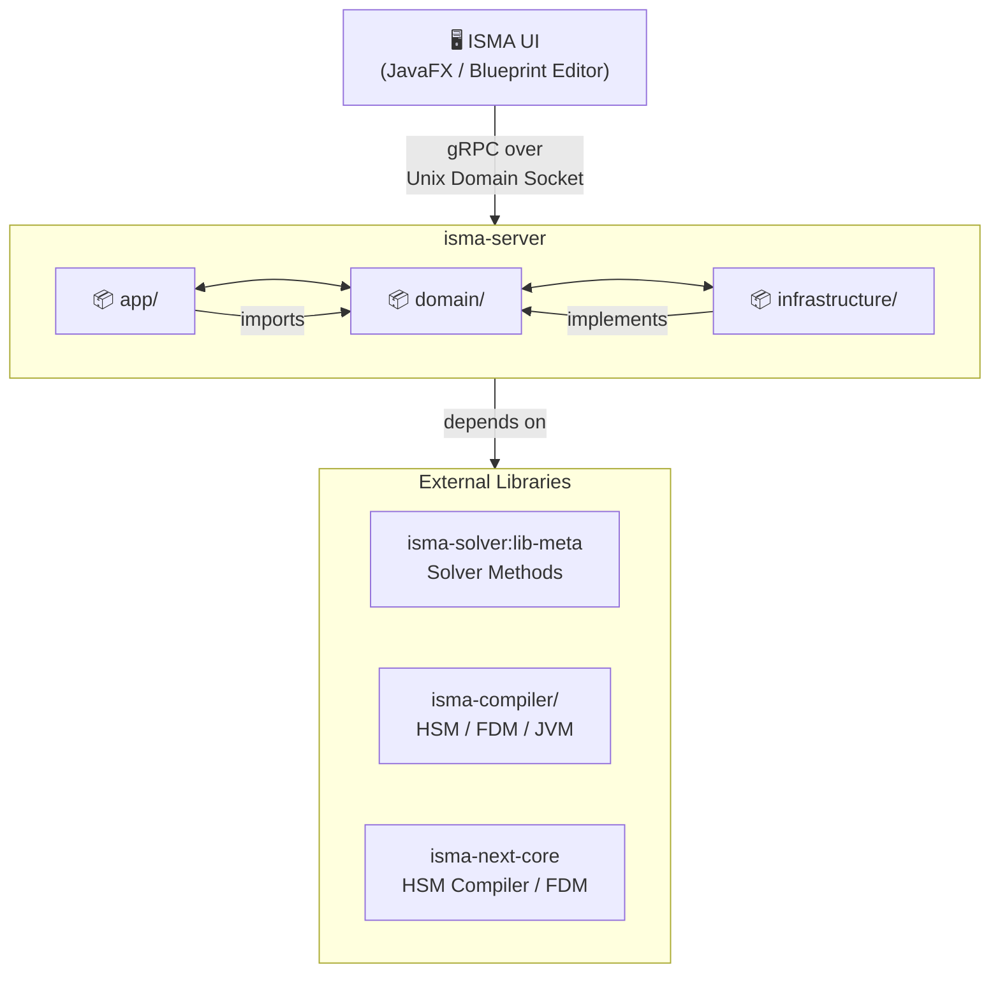
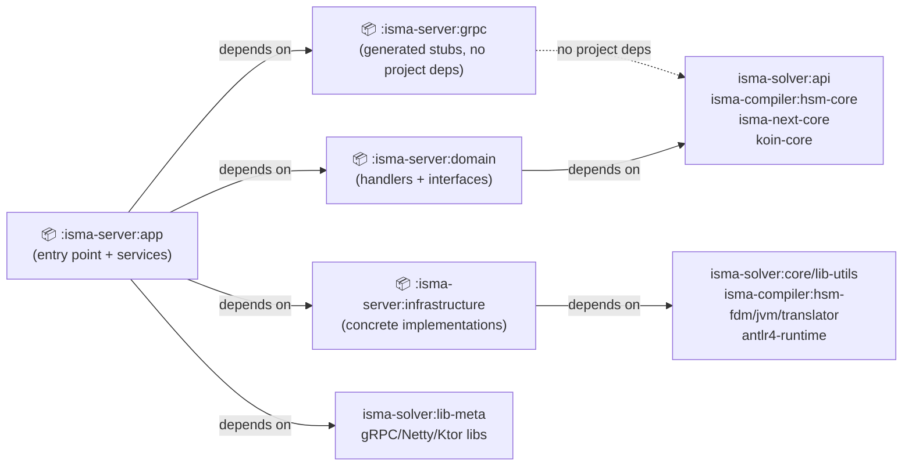
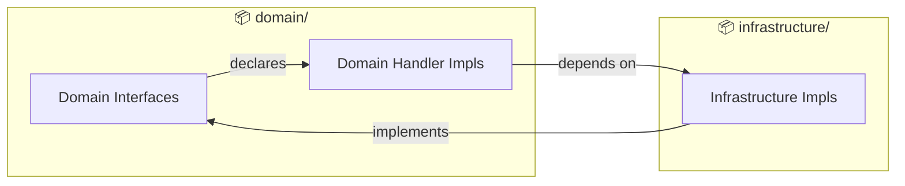
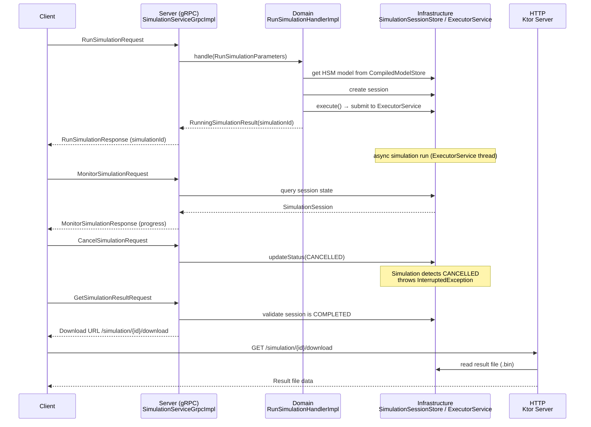
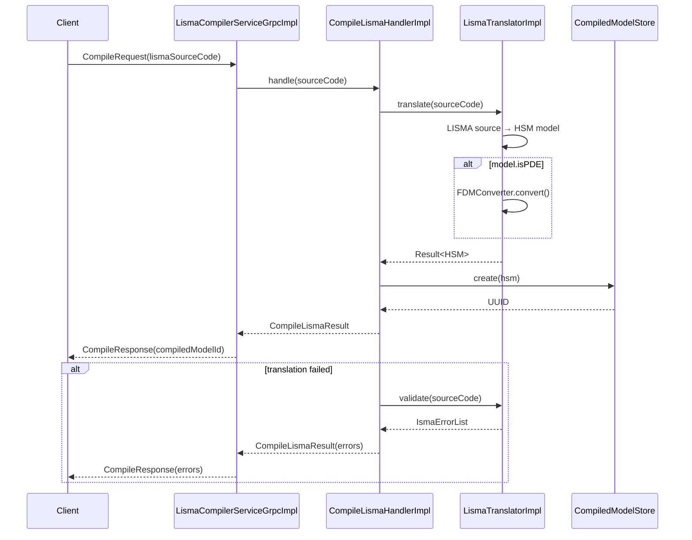

# ISMA Server Architecture Overview

## Purpose

`isma-server` is a gRPC-based server application for the ISMA (Instrumental Modeling) mathematical modeling environment. It provides simulation execution, model compilation, and LISMA language services via a gRPC API using Unix domain sockets for inter-process communication.

## Position in the ISMA Architecture



The server communicates with the UI via a **two-service gRPC architecture**:

1. **SimulationService** — Run, monitor, and manage numerical simulations
2. **LismaCompilerService** — Compile, validate, and highlight LISMA source code

## Module Structure

```
isma-server/
├── app/                  # Application entry point, gRPC & HTTP services
│   └── src/main/kotlin/ru/nstu/isma/server/app/
│       ├── Application.kt            # Main class, server startup
│       ├── AppModule.kt              # Koin DI module (gRPC service bindings)
│       ├── grpc/
│       │   ├── SimulationServiceGrpcImpl.kt
│       │   └── LismaCompilerServiceGrpcImpl.kt
│       └── http/
│           └── HttpRoutes.kt         # Ktor HTTP routes (result download)
│
├── domain/               # Domain layer: interfaces + handler implementations
│   └── src/main/kotlin/ru/nstu/isma/domain/
│       ├── DomainModule.kt           # Koin DI module (handler bindings)
│       ├── compiler/
│       │   └── ICompiledModelStore.kt
│       ├── handlers/
│       │   ├── cancelSimulation/
│       │   ├── compileLisma/
│       │   ├── deleteCompiledModel/
│       │   ├── getSimulationResult/
│       │   ├── highlightLisma/
│       │   ├── listSimulationMethods/
│       │   ├── monitorSimulation/
│       │   ├── runSimulation/
│       │   └── validateLisma/
│       ├── integration/
│       │   └── IIntegrationMethodsStore.kt
│       └── simulation/
│           ├── ISimulationExecutor.kt
│           ├── ISimulationSessionStore.kt
│           ├── SimulationSession.kt
│           └── SimulationStatus.kt
│
├── infrastructure/       # Infrastructure layer: concrete implementations
│   └── src/main/kotlin/ru/nstu/isma/server/infrastructure/
│       ├── InfrastructureModule.kt   # Koin DI module (infrastructure bindings)
│       ├── highlight/
│       │   └── HighlightLismaHandlerImpl.kt
│       ├── simulation/
│       │   └── SimulationExecutorImpl.kt
│       ├── stores/
│       │   ├── compiledModels/CompiledModelStore.kt
│       │   ├── integrationMethods/IntegrationMethodsStore.kt
│       │   └── simulationSessions/SimulationSessionStore.kt
│       └── translation/
│           └── LismaTranslatorImpl.kt
│
└── grpc/                 # gRPC code generation (proto → Java stubs)
    └── Protobuf source: ../../protobuf-contracts/
```

### Module Dependencies



## Design Principles

### 1. Interface-Based Domain Layer

The `domain/` module contains both **interfaces** and **handler implementations**, following a hexagonal architecture pattern. Interfaces define contracts; implementations are in the `infrastructure/` module. The `domain/` module's handler implementations depend on infrastructure interfaces declared in the same module.



### 2. Koin Dependency Injection

Three Koin modules are layered:

| Module                 | Contents                                                          |
| ---------------------- | ----------------------------------------------------------------- |
| `domainModule`         | All handler interfaces → implementations                          |
| `infrastructureModule` | All store interfaces → implementations, external service wrappers |
| `appModule`            | gRPC service implementations that wire handlers together          |

```kotlin
// Startup order (appModule depends on the others)
startKoin {
    modules(domainModule, infrastructureModule, appModule)
}
```

### 3. Thread Pool Architecture

| Component            | Threading                                                        |
| -------------------- | ---------------------------------------------------------------- |
| gRPC calls           | Netty event loops (per-call)                                     |
| Simulation execution | Java `ExecutorService` (cached thread pool)                      |
| Virtual threads      | Used within simulation for result writing (`Thread.ofVirtual()`) |
| Session stores       | `ConcurrentHashMap` for lock-free thread safety                  |

## Communication Flow

### Simulation Lifecycle



### Model Compilation Flow



## Runtime Characteristics

- **Transport**: Unix domain sockets (Linux) via Netty Epoll
- **Two sockets**: One for gRPC simulation, one for Ktor HTTP downloads
- **Socket lifecycle**: Created at startup, cleaned up on shutdown
- **Default socket paths**: `{java.io.tmpdir}/isma-{UUID}.sock` and `{java.io.tmpdir}/isma-http-{UUID}.sock`
- **Customization**: Via `--socket-path` and `--http-socket-path` CLI arguments, or `isma.server.script` system property on the client side
- **Shutdown hook**: Stops gRPC, Ktor, closes Netty groups, deletes socket files

## Error Handling

gRPC errors are mapped from Kotlin exceptions:

| Exception                  | gRPC Status           | Meaning                   |
| -------------------------- | --------------------- | ------------------------- |
| `IllegalArgumentException` | `NOT_FOUND`           | Resource not found        |
| `IllegalStateException`    | `FAILED_PRECONDITION` | Wrong state for operation |
| Other `Exception`          | `INTERNAL`            | Unexpected error          |

HTTP errors use standard Ktor `HttpResponseContent`:

| Condition                             | HTTP Status                            |
| ------------------------------------- | -------------------------------------- |
| Invalid simulation ID                 | 400 Bad Request                        |
| Simulation not found or not completed | 404 Not Found                          |
| Result file missing                   | 404 Not Found                          |
| Success                               | 200 OK with `application/octet-stream` |
