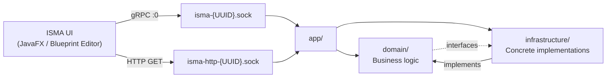
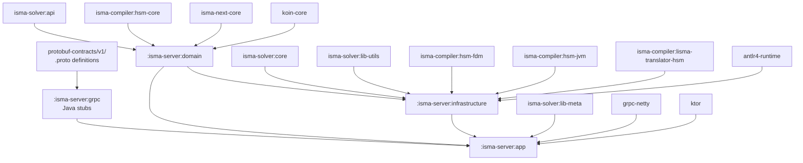
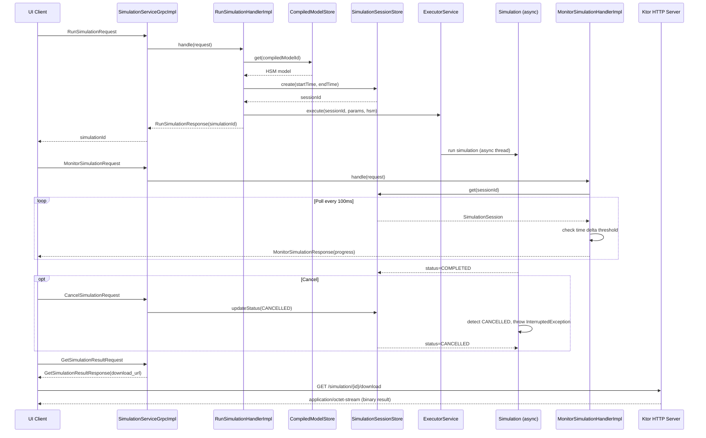
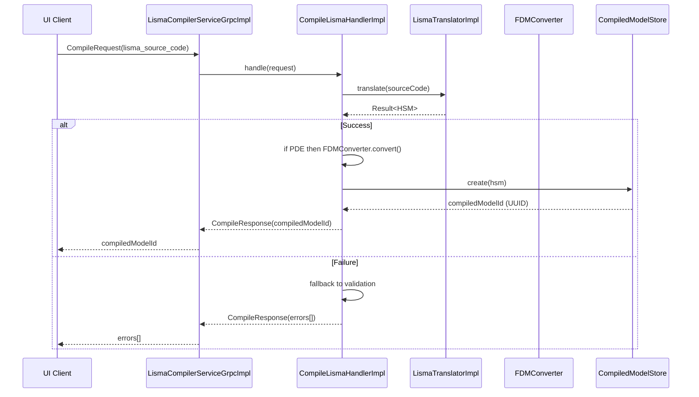

# ISMA Server Architecture Overview

## Purpose

`isma-server` is a gRPC-based server application for the ISMA (Instrumental Modeling) mathematical modeling environment. It provides simulation execution, model compilation, and LISMA language services via a gRPC API using Unix domain sockets for inter-process communication.

## Position in the ISMA Architecture

The ISMA UI (JavaFX / Blueprint Editor) communicates with the server via gRPC over a Unix domain socket. The server consists of three internal modules: `app/` (entry point and services), `domain/` (business logic), and `infrastructure/` (concrete implementations). The server depends on external libraries including `isma-solver:lib-meta` (solver method factories), `isma-compiler/` (HSM, FDM, JVM backends), and `isma-next-core` (HSM compiler and finite difference method support). The `app/` module imports `domain/`, `domain/` and `infrastructure/` have a bidirectional dependency (domain declares interfaces, infrastructure implements them).

The server communicates with the UI via a **two-service gRPC architecture**:

1. **SimulationService** — Run, monitor, and manage numerical simulations
2. **LismaCompilerService** — Compile, validate, and highlight LISMA source code

## Module Structure

| Directory | Purpose |
|-----------|---------|
| `app/src/main/kotlin/ru/nstu/isma/server/app/` | Application entry point, gRPC & HTTP services |
| `Application.kt` | Main class, server startup |
| `AppModule.kt` | Koin DI module (gRPC service bindings) |
| `grpc/` | gRPC service implementations |
| `SimulationServiceGrpcImpl.kt` | SimulationService gRPC handler |
| `LismaCompilerServiceGrpcImpl.kt` | LismaCompilerService gRPC handler |
| `http/HttpRoutes.kt` | Ktor HTTP routes (result download) |
| `domain/src/main/kotlin/ru/nstu/isma/domain/` | Domain layer: interfaces + handler implementations |
| `DomainModule.kt` | Koin DI module (handler bindings) |
| `compiler/ICompiledModelStore.kt` | Compiled model store interface |
| `handlers/` | Handler packages (cancelSimulation, compileLisma, deleteCompiledModel, getSimulationResult, highlightLisma, listSimulationMethods, monitorSimulation, runSimulation, validateLisma) |
| `integration/IIntegrationMethodsStore.kt` | Integration methods store interface |
| `simulation/` | Simulation domain (ISimulationExecutor, ISimulationSessionStore, SimulationSession, SimulationStatus) |
| `infrastructure/src/main/kotlin/ru/nstu/isma/server/infrastructure/` | Infrastructure layer: concrete implementations |
| `InfrastructureModule.kt` | Koin DI module (infrastructure bindings) |
| `highlight/HighlightLismaHandlerImpl.kt` | Syntax highlighting implementation |
| `simulation/SimulationExecutorImpl.kt` | Simulation execution engine |
| `stores/` | Concrete store implementations (CompiledModelStore, IntegrationMethodsStore, SimulationSessionStore) |
| `translation/LismaTranslatorImpl.kt` | LISMA to HSM translator |
| `grpc/` | gRPC code generation (proto → Java stubs) |
| Protobuf source | `../../protobuf-contracts/` |

### Module Dependencies

The `:isma-server:grpc` module generates Java stubs from protobuf definitions and has no project dependencies. The `:isma-server:domain` module depends on `isma-solver:api`, `isma-compiler:hsm-core`, `isma-next-core`, and `koin-core`. The `:isma-server:infrastructure` module depends on `isma-solver:core`, `isma-solver:lib-utils`, `isma-compiler:hsm-fdm`, `isma-compiler:hsm-jvm`, `isma-compiler:lisma-translator-hsm`, `antlr4-runtime`, and other compiler modules. The `:isma-server:app` module depends on all three internal modules (domain, grpc, infrastructure) plus `isma-solver:lib-meta` and gRPC/Netty/Ktor libraries.

## Design Principles

### 1. Interface-Based Domain Layer

The `domain/` module contains both **interfaces** and **handler implementations**, following a hexagonal architecture pattern. Interfaces define contracts; implementations are in the `infrastructure/` module. The `domain/` module's handler implementations depend on infrastructure interfaces declared in the same module. The dependency pattern is: domain interfaces declare domain handler implementations, which depend on infrastructure implementations, which implement the domain interfaces.

### 2. Koin Dependency Injection

Three Koin modules are layered in startup order:

| Module                 | Contents                                                          |
| ---------------------- | ----------------------------------------------------------------- |
| `domainModule`         | All handler interfaces → implementations                          |
| `infrastructureModule` | All store interfaces → implementations, external service wrappers |
| `appModule`            | gRPC service implementations that wire handlers together          |

See `Application.kt` for the `startKoin { modules(domainModule, infrastructureModule, appModule) }` call that initializes all three modules. The `appModule` depends on the other two, so it must be loaded last.

### 3. Thread Pool Architecture

| Component            | Threading                                                        |
| -------------------- | ---------------------------------------------------------------- |
| gRPC calls           | Netty event loops (per-call)                                     |
| Simulation execution | Java `ExecutorService` (cached thread pool)                      |
| Virtual threads      | Used within simulation for result writing (`Thread.ofVirtual()`) |
| Session stores       | `ConcurrentHashMap` for lock-free thread safety                  |

## Communication Flow

### Simulation Lifecycle

The client sends a `RunSimulationRequest` to `SimulationServiceGrpcImpl`, which delegates to `RunSimulationHandlerImpl`. The handler retrieves the HSM model from `CompiledModelStore`, creates a new `SimulationSession`, and submits async execution to the `ExecutorService`. The server returns a `RunSimulationResponse` with the `simulationId`. The simulation runs asynchronously on an `ExecutorService` thread. The client can then send `MonitorSimulationRequest` messages, which trigger a polling loop in `MonitorSimulationHandlerImpl` that checks the session store every 100ms and sends progress updates via callback when the time delta threshold is reached or the simulation reaches a terminal status. The client sends `CancelSimulationRequest` to set the session status to `CANCELLED`; the running simulation detects this and throws `InterruptedException` to halt. The client sends `GetSimulationResultRequest` to validate the session is `COMPLETED`, and the server returns a download URL `/simulation/{id}/download`. The client then makes an HTTP GET request to the Ktor server on the separate Unix socket, which reads the result file and returns the binary data.

### Model Compilation Flow

The client sends a `CompileRequest` with LISMA source code to `LismaCompilerServiceGrpcImpl`, which delegates to `CompileLismaHandlerImpl`. The handler calls `LismaTranslatorImpl.translate(sourceCode)` which converts LISMA source to an HSM model, and if the model is a PDE, applies `FDMConverter.convert()` for finite difference discretization. On success, the handler stores the HSM model in `CompiledModelStore` and returns the generated UUID as `compiledModelId`. On failure, the handler falls back to validation to extract detailed error positions and returns them as `CompilationError` objects in the response.

### Model Compilation Flow

The client sends a `CompileRequest` with LISMA source code to `LismaCompilerServiceGrpcImpl`, which delegates to `CompileLismaHandlerImpl`. The handler calls `LismaTranslatorImpl.translate(sourceCode)` which converts LISMA source to an HSM model, and if the model is a PDE, applies `FDMConverter.convert()` for finite difference discretization. On success, the handler stores the HSM model in `CompiledModelStore` and returns the generated UUID as `compiledModelId`. On failure, the handler falls back to validation to extract detailed error positions and returns them as `CompilationError` objects in the response.

## Runtime Characteristics

- **Transport**: Unix domain sockets (Linux) via Netty Epoll
- **Two sockets**: One for gRPC simulation, one for Ktor HTTP downloads
- **Socket lifecycle**: Created at startup, cleaned up on shutdown
- **Default socket paths**: `{java.io.tmpdir}/isma-{UUID}.sock` and `{java.io.tmpdir}/isma-http-{UUID}.sock`
- **Customization**: Via `--socket-path` and `--http-socket-path` CLI arguments, or `isma.server.script` system property on the client side
- **Shutdown hook**: Stops gRPC, Ktor, closes Netty groups, deletes socket files

> See [07-transport-layer.md](07-transport-layer.md) for full details on Netty Unix domain socket configuration, client discovery, and troubleshooting.

> See [07-transport-layer.md](07-transport-layer.md) for detailed Netty Unix domain socket configuration.

## Error Handling

gRPC errors are mapped from Kotlin exceptions:

| Exception                  | gRPC Status           | Meaning                   |
| -------------------------- | --------------------- | ------------------------- |
| `IllegalArgumentException` | `NOT_FOUND`           | Resource not found        |
| `IllegalStateException`    | `FAILED_PRECONDITION` | Wrong state for operation |
| Other `Exception`          | `INTERNAL`            | Unexpected error          |

HTTP errors use standard Ktor `HttpResponseContent`:

| Condition                             | HTTP Status                            |
| ------------------------------------- | -------------------------------------- |
| Invalid simulation ID                 | 400 Bad Request                        |
| Simulation not found or not completed | 404 Not Found                          |
| Result file missing                   | 404 Not Found                          |
| Success                               | 200 OK with `application/octet-stream` |
