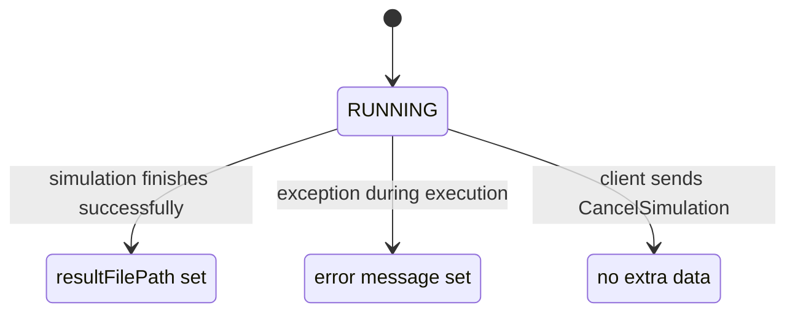
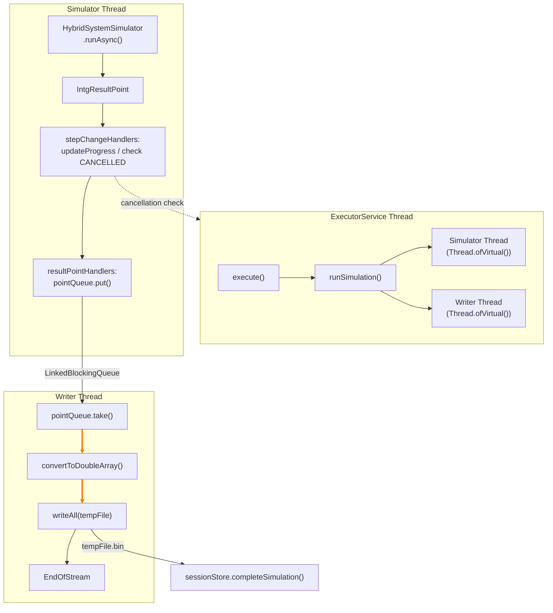

# Infrastructure Layer

## Overview

The `infrastructure/` module provides concrete implementations of domain interfaces. It bridges the domain layer to external systems: numerical solvers, compilers, file I/O, and the Java ServiceLoader SPI.

### DI Registration (`InfrastructureModule.kt`)

```kotlin
val infrastructureModule = module {
    // Stores (domain interfaces → concrete implementations)
    single<IIntegrationMethodsStore> { IntegrationMethodsStore() }
    single<ISimulationSessionStore> { SimulationSessionStore() }
    single<ICompiledModelStore> { CompiledModelStore() }

    // Translators / Compilers
    single<InputTranslator> { LismaTranslator() }
    single<ILismaTranslator> { LismaTranslatorImpl(get()) }
    single<IHsmCompiler> { HsmCompiler() }

    // Integration methods library
    single<IntegrationMethodsLibrary> { IntegrationMethodLibraryLoader.load() }

    // Thread pool for async simulation execution
    single<ExecutorService> { Executors.newCachedThreadPool() }

    // Simulation executor (depends on library, compiler, stores, executor)
    single<ISimulationExecutor> {
        SimulationExecutorImpl(
            integrationMethodsLibrary = get(),
            hsmCompiler = get(),
            sessionStore = get(),
            executorService = get(),
        )
    }

    // Highlight handler (no external dependencies)
    single<IHighlightLismaHandler> { HighlightLismaHandlerImpl() }
}
```

All registrations use `single()` — every DI resolution returns the same instance (singleton).

---

## Stores

### CompiledModelStore

```kotlin
class CompiledModelStore : ICompiledModelStore {
    private val models = ConcurrentHashMap<String, HSM>()
    // create, get, delete, exists
}
```

- **Storage:** In-memory `ConcurrentHashMap<String, HSM>`
- **Keys:** UUID strings generated on `create()`
- **Thread safety:** Lock-free via `ConcurrentHashMap`
- **Lifecycle:** Models live for the entire server lifetime (no cleanup mechanism other than explicit `delete()`)
- **Memory management:** No eviction, no TTL — models accumulate until server restart

**Operations:**

| Operation | Return | Behavior |
|-----------|--------|----------|
| `create(hsm)` | `String` (UUID) | Generates UUID, puts in map, returns ID |
| `get(id)` | `HSM?` | Direct map lookup |
| `delete(id)` | `Boolean` | `map.remove(id) != null` |
| `exists(id)` | `Boolean` | `map.containsKey(id)` |

---

### SimulationSessionStore

```kotlin
class SimulationSessionStore : ISimulationSessionStore {
    private val sessions = ConcurrentHashMap<Long, SimulationSession>()
    private val nextId = AtomicLong(1L)
    // create, get, getAll, update, updateStatus, updateProgress, completeSimulation, failSimulation, delete, exists
}
```

- **Storage:** In-memory `ConcurrentHashMap<Long, SimulationSession>`
- **ID generation:** `AtomicLong` starting at 1, auto-incrementing
- **Thread safety:** Lock-free concurrent access via `ConcurrentHashMap`
- **Immutability:** Sessions are immutable data classes; all mutations produce a copy via `session.copy(...)`

**Operations:**

| Operation | Behavior |
|-----------|----------|
| `create(startTime, endTime)` | Generates ID, creates `SimulationSession(status=RUNNING)` |
| `get(id)` | Returns session or null |
| `getAll()` | Returns immutable snapshot `sessions.toMap()` |
| `update(id, session)` | Replaces if exists, throws `IllegalArgumentException` if not |
| `updateStatus(id, status)` | Creates copy with new status |
| `updateProgress(id, currentTime)` | Creates copy with new `currentTime` |
| `completeSimulation(id, resultFilePath)` | Sets status=COMPLETED, records file path |
| `failSimulation(id, error)` | Sets status=FAILED, records error message |
| `delete(id)` | Removes and returns true if present |
| `exists(id)` | `containsKey` check |

**Session state transitions:**



---

### IntegrationMethodsStore

```kotlin
class IntegrationMethodsStore : IIntegrationMethodsStore {
    private val methods: Map<String, IIntegrationMethodFactory>

    init {
        val loader = ServiceLoader.load(IIntegrationMethodFactory::class.java)
        methods = loader.associateBy { it.name }
    }

    override fun getMethodNames(): List<String> = methods.keys.sorted()
    override fun getMethod(name: String): IIntegrationMethodFactory =
        methods[name] ?: throw UnsupportedOperationException("Integration method '$name' not found")
}
```

- **Discovery mechanism:** Java `ServiceLoader` loads all `IIntegrationMethodFactory` implementations at startup
- **Mapping:** Factory names → factory instances (immutable map)
- **Thread safety:** Read-only immutable map after initialization — inherently thread-safe

**Discovered methods (from isma-solver):**
- `euler`
- `rk2`
- `rk3`
- `rk31`
- `rkmerson`
- `rkfehlberg`

**SPI interface:** `IIntegrationMethodFactory` is defined in `isma-solver:lib-meta` (the solver library's SPI module). Each integration method module (e.g., `isma-solver:lib:euler`) provides a factory implementation registered via `META-INF/services`.

---

## Simulation Executor

### SimulationExecutorImpl

The most complex component in the infrastructure layer. It orchestrates the entire simulation lifecycle: setting up the integration method, compiling the HSM model, running the simulator, and writing results.

**Dependencies:**

| Dependency | Type | Purpose |
|------------|------|---------|
| `IntegrationMethodsLibrary` | Library | Provides numerical integration method instances |
| `IHsmCompiler` | HsmCompiler | Compiles HSM models to solver-compatible form |
| `ISimulationSessionStore` | SimulationSessionStore | Manages session state |
| `ExecutorService` | CachedThreadPool | Async execution |

### Execution Architecture



**Thread model:**
1. `ExecutorService` thread — entry point, catches exceptions and updates session store
2. `Thread.ofVirtual()` (simulator) — runs the numerical integration asynchronously
3. `Thread.ofVirtual()` (writer) — consumes result points and writes to binary file
4. Main thread (from #1) — joins both virtual threads before completing

### Step-by-Step Execution

**1. HSM Initialization**
```kotlin
hsm.initTimeEquation(parameters.startTime)
```
Sets the initial time for the HSM model's time equation.

**2. Integration Method Setup**
```kotlin
val integrationMethod = integrationMethodsLibrary
    .getIntegrationMethod(parameters.methodName)
    .create()
```
Retrieves the factory by name, creates an instance, and configures:
- `accuracyController.enabled` / `accuracyController.accuracy` (if accuracy config is present)
- `stabilityController.enabled` (if stability config is present)

**3. Factory Proxies**

The executor creates anonymous adapter objects to bridge between domain types and the next-core solver types:

```kotlin
val integrationMethodProvider = object : IIntegrationMethodProvider {
    override val method = integrationMethod
}

val daeSystemSolverFactory = object : IDaeSystemSolverFactory {
    override fun create(hsmCompilationResult): DaeSystemStepSolver {
        return DefaultDaeSystemStepSolver(integrationMethod.method, hsmCompilationResult.hybridSystem.daeSystem)
    }
}

val eventDetectorFactory = object : IEventDetectorFactory {
    override fun create(): IEventDetector? {
        return if (gamma != null && lowBorder != null)
            DefaultEventDetector(gamma, stepLowBound)
        else
            null
    }
}
```

**4. Hybrid System Simulator**
```kotlin
val simulator = HybridSystemSimulator(daeSystemSolverFactory, eventDetectorFactory)
val compilationResult = hsmCompiler.compile(hsm)
```

**5. Initial Conditions**
```kotlin
val differentialEquationInitials = createOdeInitials(compilationResult.indexProvider, hsm)
```
Maps ODE definitions from the HSM model to the solver's differential equation indices.

**6. Simulation Parameters**
```kotlin
val simulationInitials = SimulationInitials(
    differentialEquationInitials = odeInitials,
    start = parameters.startTime,
    end = parameters.endTime,
    step = parameters.initialStep
)
```

**7. Temporary File**
```kotlin
val tempFile = File.createTempFile("isma_simulation_$simulationId", ".bin")
```
Each simulation writes to a unique temp file in the system temp directory.

**8. Async Simulation + Result Writing**

Two virtual threads run concurrently:

**Simulator thread** — runs the simulation with callbacks:
```kotlin
val simulatorParameters = HybridSystemSimulatorParameters(
    compilationResult,
    simulationInitials,
    stepChangeHandlers = { currentTime ->
        // Check cancellation
        val session = sessionStore.get(simulationId)
        if (session?.status == SimulationStatus.CANCELLED)
            throw InterruptedException("Simulation was cancelled")
        // Update progress
        sessionStore.updateProgress(simulationId, currentTime)
    },
    resultPointHandlers = { point ->
        pointQueue.put(QueueItem.Point(point))
    }
)
metricData = simulator.runAsync(simulatorParameters)
```

**Writer thread** — consumes points and writes the file:
```kotlin
val pointsSequence = sequence {
    while (true) {
        val item = pointQueue.take()
        if (item is QueueItem.EndOfStream) break
        yield(convertToDoubleArray(item.point))
    }
}
writeAll(tempFile, variableNames, pointsSequence)
```

**Point queue:** `LinkedBlockingQueue<QueueItem>` — unbounded blocking queue for thread synchronization.

**QueueItem sealed class:**
```kotlin
private sealed class QueueItem {
    data class Point(val point: IntgResultPoint) : QueueItem()
    data object EndOfStream : QueueItem()
}
```

**9. Result File Format**

The file is written via `writeAll()` from `isma-jvm-lib:exchange-format`. It contains:

| Column | Description |
|--------|-------------|
| `TIME` | Simulation time |
| `DE_0-<code>`, `DE_1-<code>`, ... | Differential equation state variables |
| `AE_0-<code>`, `AE_1-<code>`, ... | Algebraic equation variables |
| `f0`, `f1`, ... | Right-hand side function values |

**10. Completion**

```kotlin
simulatorThread.join()
writerThread.join()
sessionStore.completeSimulation(simulationId, tempFile.absolutePath)
```

### Exception Handling

```kotlin
executorService.submit {
    try {
        runSimulation(simulationId, parameters, hsm)
    } catch (e: InterruptedException) {
        if (session?.status != SimulationStatus.CANCELLED) {
            sessionStore.failSimulation(simulationId, e.message ?: "Simulation interrupted")
        }
    } catch (e: Exception) {
        sessionStore.failSimulation(simulationId, e.message ?: "Unknown error")
    }
}
```

- `InterruptedException` → only marks as FAILED if not already CANCELLED
- Other exceptions → always FAILED

---

## LISMA Translator

### LismaTranslatorImpl

```kotlin
class LismaTranslatorImpl(
    private val translator: InputTranslator,
) : ILismaTranslator {

    override fun translate(sourceCode: String): Result<HSM> {
        return try {
            val errors = IsmaErrorList()
            val model = translator.translate(sourceCode, errors)

            if (errors.isNotEmpty()) {
                return Result.failure(TranslationException(errors))
            }

            val processedModel = if (model.isPDE) {
                FDMConverter(model).convert()
                    ?: return Result.failure(IllegalArgumentException("FDM conversion failed"))
            } else {
                model
            }

            Result.success(processedModel)
        } catch (e: Exception) {
            Result.failure(e)
        }
    }

    override fun validate(sourceCode: String): IsmaErrorList {
        val errors = IsmaErrorList()
        translator.translate(sourceCode, errors)
        return errors
    }
}
```

**Translation pipeline:**

1. **Parse & Translate:** `InputTranslator.translate(sourceCode, errors)` produces an `HSM` model
2. **Error check:** If `IsmaErrorList` is non-empty, fail with `TranslationException`
3. **PDE handling:** If `model.isPDE`, apply finite difference discretization via `FDMConverter`
4. **Return:** Success with HSM model, or failure with exception

**FDM (Finite Difference Method) conversion:**
- Applied automatically when the model contains partial differential equations
- Converts PDEs to systems of ODEs using spatial discretization
- If conversion fails (`FDMConverter.convert()` returns null), returns failure

**Validation mode:**
- Runs the same translator but discards the model
- Returns only the error list — used by `IValidateLismaHandler` for IDE feedback without compilation

---

## Syntax Highlighting

### HighlightLismaHandlerImpl

Uses ANTLR4 runtime (no parser, only lexer) for fast lexical analysis.

```kotlin
val inputStream = CharStreams.fromString(sourceCode)
val tokens = LismaLexer(inputStream).allTokens
```

Only three token kinds are returned (others filtered):
- **Keywords:** `const`, `state`, `for`, `if`, `else`, `from`, `macro`, `set`
- **Comments:** Block comments and single-line comments (`//`)
- **Numbers:** Floating-point literals and decimal integers

All identifiers, operators, and punctuation are silently ignored — this is sufficient for basic syntax highlighting in an IDE.
