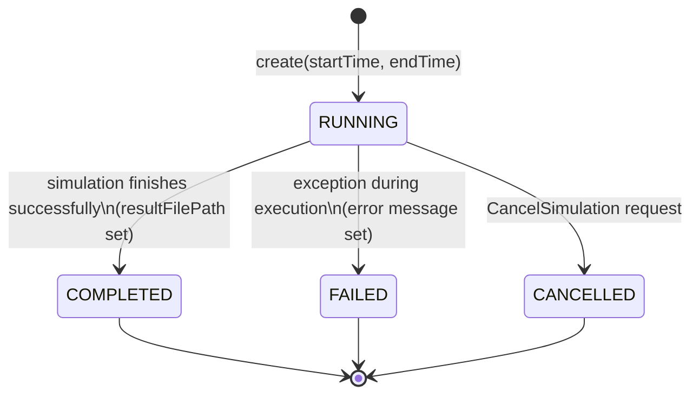
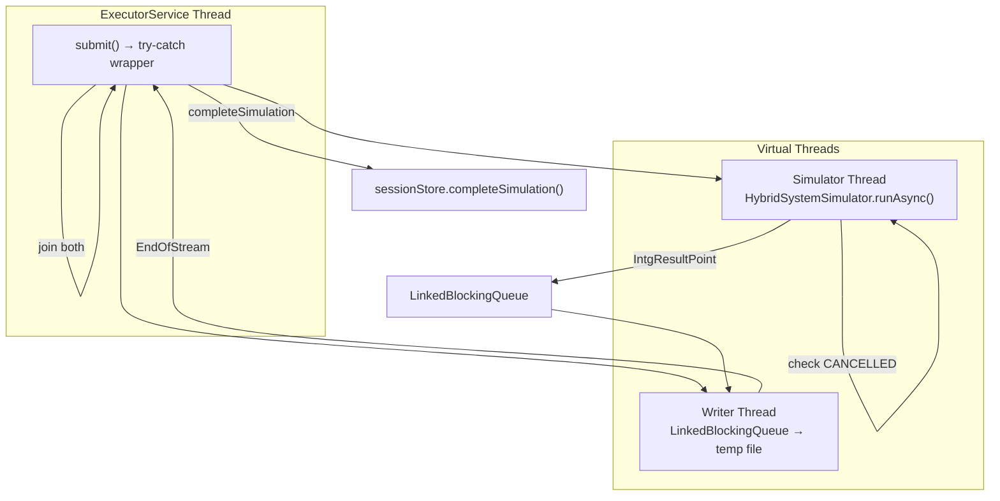

# Infrastructure Layer

## Overview

The `infrastructure/` module provides concrete implementations of domain interfaces. It bridges the domain layer to external systems: numerical solvers, compilers, file I/O, and the Java ServiceLoader SPI.

### DI Registration (`InfrastructureModule.kt`)

See `InfrastructureModule.kt` for the full Koin module definition. All registrations use `single()` — every DI resolution returns the same instance (singleton). The module registers:

- **Stores:** `IntegrationMethodsStore`, `SimulationSessionStore`, `CompiledModelStore` implementing domain interfaces
- **Translators/Compilers:** `LismaTranslator`, `LismaTranslatorImpl`, `HsmCompiler`
- **Integration methods library:** Loaded via `IntegrationMethodLibraryLoader.load()`
- **Thread pool:** `Executors.newCachedThreadPool()` for async simulation execution
- **Simulation executor:** `SimulationExecutorImpl` with dependencies on library, compiler, session store, and executor service
- **Highlight handler:** `HighlightLismaHandlerImpl` with no external dependencies

---

## Stores

### CompiledModelStore

See `CompiledModelStore.kt` for the implementation. It stores compiled HSM models in an in-memory `ConcurrentHashMap<String, HSM>`. Keys are UUID strings generated on `create()`. Thread safety is achieved via lock-free `ConcurrentHashMap` operations. Models live for the entire server lifetime — no cleanup mechanism other than explicit `delete()`. No eviction or TTL; models accumulate until server restart.

**Operations:**

| Operation | Return | Behavior |
|-----------|--------|----------|
| `create(hsm)` | `String` (UUID) | Generates UUID, puts in map, returns ID |
| `get(id)` | `HSM?` | Direct map lookup |
| `delete(id)` | `Boolean` | `map.remove(id) != null` |
| `exists(id)` | `Boolean` | `map.containsKey(id)` |

---

### SimulationSessionStore

See `SimulationSessionStore.kt` for the implementation. It stores sessions in an in-memory `ConcurrentHashMap<Long, SimulationSession>` with an `AtomicLong` starting at 1 for auto-incrementing ID generation. Thread safety is achieved via lock-free concurrent access. Sessions are immutable data classes; all mutations produce a copy via `session.copy(...)`.

**Operations:**

| Operation | Behavior |
|-----------|----------|
| `create(startTime, endTime)` | Generates ID, creates `SimulationSession(status=RUNNING)` |
| `get(id)` | Returns session or null |
| `getAll()` | Returns immutable snapshot `sessions.toMap()` |
| `update(id, session)` | Replaces if exists, throws `IllegalArgumentException` if not |
| `updateStatus(id, status)` | Creates copy with new status |
| `updateProgress(id, currentTime)` | Creates copy with new `currentTime` |
| `completeSimulation(id, resultFilePath)` | Sets status=COMPLETED, records file path |
| `failSimulation(id, error)` | Sets status=FAILED, records error message |
| `delete(id)` | Removes and returns true if present |
| `exists(id)` | `containsKey` check |

**Session state transitions:**

A session starts in `RUNNING` status. It transitions to `COMPLETED` when the simulation finishes successfully (with `resultFilePath` set), to `FAILED` when an exception occurs during execution (with an error message set), or to `CANCELLED` when the client sends a `CancelSimulation` request (no extra data).

---

### IntegrationMethodsStore

See `IntegrationMethodsStore.kt` for the implementation. It uses Java `ServiceLoader` to load all `IIntegrationMethodFactory` implementations at startup, mapping factory names to factory instances in an immutable map. Thread safety is inherent since the map is read-only after initialization.

**Discovered methods (from isma-solver):**
- `euler`
- `rk2`
- `rk3`
- `rk31`
- `rkmerson`
- `rkfehlberg`

**SPI interface:** `IIntegrationMethodFactory` is defined in `isma-solver:lib-meta` (the solver library's SPI module). Each integration method module (e.g., `isma-solver:lib:euler`) provides a factory implementation registered via `META-INF/services`.

---

## Simulation Executor

### SimulationExecutorImpl

The most complex component in the infrastructure layer. It orchestrates the entire simulation lifecycle: setting up the integration method, compiling the HSM model, running the simulator, and writing results.

**Dependencies:**

| Dependency | Type | Purpose |
|------------|------|---------|
| `IntegrationMethodsLibrary` | Library | Provides numerical integration method instances |
| `IHsmCompiler` | HsmCompiler | Compiles HSM models to solver-compatible form |
| `ISimulationSessionStore` | SimulationSessionStore | Manages session state |
| `ExecutorService` | CachedThreadPool | Async execution |

### Execution Architecture

See `SimulationExecutorImpl.kt` for the full implementation. The execution uses three threads: an `ExecutorService` thread (entry point that catches exceptions and updates the session store), a virtual thread for the simulator (runs `HybridSystemSimulator.runAsync()` which produces `IntgResultPoint` objects, with step change handlers that update progress and check for cancellation, and result point handlers that put points into a `LinkedBlockingQueue`), and a virtual thread for the writer (consumes points from the queue, converts them to double arrays, and writes them to a temp file via `writeAll()`, signaling `EndOfStream` when done). After both virtual threads complete, `sessionStore.completeSimulation()` is called with the temp file path.

**Thread model:**

1. `ExecutorService` thread — entry point, catches exceptions and updates session store
2. `Thread.ofVirtual()` (simulator) — runs the numerical integration asynchronously
3. `Thread.ofVirtual()` (writer) — consumes result points and writes to binary file
4. Main thread (from #1) — joins both virtual threads before completing

### Step-by-Step Execution

See `SimulationExecutorImpl.kt` for the complete implementation. The execution proceeds as follows:

**1. HSM Initialization:** Calls `hsm.initTimeEquation(parameters.startTime)` to set the initial time for the HSM model's time equation.

**2. Integration Method Setup:** Retrieves the integration method factory by name from `integrationMethodsLibrary`, creates an instance, and configures accuracy controller and stability controller based on config presence.

**3. Factory Proxies:** The executor creates anonymous adapter objects (`IIntegrationMethodProvider`, `IDaeSystemSolverFactory`, `IEventDetectorFactory`) to bridge between domain types and the next-core solver types. The `IDaeSystemSolverFactory` creates `DefaultDaeSystemStepSolver` with the integration method and DAE system. The `IEventDetectorFactory` creates a `DefaultEventDetector` if gamma and lowBorder are provided, otherwise returns null.

**4. Hybrid System Simulator:** Creates a `HybridSystemSimulator` with the DAE solver factory and event detector factory, then compiles the HSM model via `hsmCompiler.compile(hsm)`.

**5. Initial Conditions:** Calls `createOdeInitials()` to map ODE definitions from the HSM model to the solver's differential equation indices.

**6. Simulation Parameters:** Creates `SimulationInitials` with the differential equation initials, start time, end time, and initial step.

**7. Temporary File:** Creates a temp file using `File.createTempFile("isma_simulation_$simulationId", ".bin")` in the system temp directory.

**8. Async Simulation + Result Writing:** Two virtual threads run concurrently. The simulator thread runs `HybridSystemSimulator.runAsync()` with step change handlers that check for cancellation (throwing `InterruptedException` if status is `CANCELLED`) and update progress, and result point handlers that put points into a `LinkedBlockingQueue<QueueItem>`. The writer thread consumes from the queue, converts points to double arrays via a sequence, and writes them to the temp file. When `EndOfStream` is received, the writer exits the loop.

**QueueItem sealed class:** Has two variants — `Point(IntgResultPoint)` and `EndOfStream`.

**Variable naming in output file:** Variable names are derived from `EquationIndexProvider`:
- `TIME` — simulation time
- `DE_i-{code}` — differential equation `i` with optional equation code (falls back to `DE_i` when code is null)
- `AE_i-{code}` — algebraic equation `i` with optional equation code (falls back to `AE_i` when code is null)
- `f_i` — right-hand side function value for differential equation `i`

**9. Result File Format**

The file is written via `writeAll()` from `isma-jvm-lib:exchange-format`. It contains:

| Column | Description |
|--------|-------------|
| `TIME` | Simulation time |
| `DE_0-<code>`, `DE_1-<code>`, ... | Differential equation state variables |
| `AE_0-<code>`, `AE_1-<code>`, ... | Algebraic equation variables |
| `f0`, `f1`, ... | Right-hand side function values |

**10. Completion:** The main thread joins both virtual threads and then calls `sessionStore.completeSimulation(simulationId, tempFile.absolutePath)` to mark the simulation as complete with the result file path.

### Exception Handling

See `SimulationExecutorImpl.kt` for the exception handling logic. The `executorService.submit()` block wraps the simulation in a try-catch. `InterruptedException` is only marked as FAILED if the session status is not already `CANCELLED`. Other exceptions always result in a FAILED status with the exception message.

---

## LISMA Translator

### LismaTranslatorImpl

See `LismaTranslatorImpl.kt` for the full implementation. The `translate()` method calls `InputTranslator.translate(sourceCode, errors)`, checks if the error list is non-empty (failing with `TranslationException` if so), applies `FDMConverter.convert()` for PDE models, and returns `Result.success(processedModel)` or `Result.failure(exception)`. The `validate()` method runs the same translator but discards the model, returning only the error list.

**Translation pipeline:**

1. **Parse & Translate:** `InputTranslator.translate(sourceCode, errors)` produces an `HSM` model
2. **Error check:** If `IsmaErrorList` is non-empty, fail with `TranslationException`
3. **PDE handling:** If `model.isPDE`, apply finite difference discretization via `FDMConverter`
4. **Return:** Success with HSM model, or failure with exception

**FDM (Finite Difference Method) conversion:**
- Applied automatically when the model contains partial differential equations
- Converts PDEs to systems of ODEs using spatial discretization
- If conversion fails (`FDMConverter.convert()` returns null), returns failure

**Validation mode:**
- Runs the same translator but discards the model
- Returns only the error list — used by `IValidateLismaHandler` for IDE feedback without compilation

---

## Syntax Highlighting

### HighlightLismaHandlerImpl

See `HighlightLismaHandlerImpl.kt` for the implementation. Uses ANTLR4 runtime (no parser, only lexer) for fast lexical analysis. It creates a `CharStreams.fromString(sourceCode)` and tokenizes with `LismaLexer`. Only three token kinds are returned (others filtered): **Keywords** (`const`, `state`, `for`, `if`, `else`, `from`, `macro`, `set`), **Comments** (block comments and single-line comments), and **Numbers** (floating-point literals and decimal integers). All identifiers, operators, and punctuation are silently ignored — this is sufficient for basic syntax highlighting in an IDE.
