# Application Layer

## Overview

The `app/` module is the server's entry point. It bootstraps the Koin dependency injection container, creates the gRPC server (Netty + Unix domain sockets), and starts the Ktor HTTP server for result file downloads.

---

## Entry Point

### Application.kt

**Main function:** `ru.nstu.isma.server.app.ApplicationKt` (configured in `build.gradle.kts`)

```kotlin
fun main(args: Array<String>) {
    // 1. Parse CLI arguments
    val socketPath = ...
    val httpSocketPath = ...

    // 2. Start Koin DI
    startKoin {
        modules(domainModule, infrastructureModule, appModule)
    }

    // 3. Resolve gRPC service instances from Koin
    val koin = object : KoinComponent {
        val grpcService: SimulationServiceGrpcImpl by inject()
        val compilerService: LismaCompilerServiceGrpcImpl by inject()
        val sessionStore: ISimulationSessionStore by inject()
    }

    // 4. Clean up existing socket files
    File(socketPath).delete()
    File(httpSocketPath).delete()

    // 5. Create Netty event loop groups
    val bossGroup = MultiThreadIoEventLoopGroup(EpollIoHandler.newFactory())
    val workerGroup = MultiThreadIoEventLoopGroup(EpollIoHandler.newFactory())

    // 6. Create gRPC server (build only — start happens after HTTP server)
    val grpcServer = NettyServerBuilder
        .forAddress(DomainSocketAddress(socketPath))
        .channelType(EpollServerDomainSocketChannel::class.java)
        .bossEventLoopGroup(bossGroup)
        .workerEventLoopGroup(workerGroup)
        .addService(koin.grpcService)
        .addService(koin.compilerService)
        .addService(ProtoReflectionServiceV1.newInstance())
        .build()

    // 7. Create and start Ktor HTTP server
    val httpServer = embeddedServer(CIO, configure = {
        unixConnector(httpSocketPath) { }
    }) {
        routing {
            simulationResultRoutes(koin.sessionStore)
        }
    }
    httpServer.start(wait = false)

    // 8. Print socket paths to stdout, then start gRPC server
    println("Starting gRPC server on Unix socket: $socketPath")
    println("Starting HTTP server on Unix socket: $httpSocketPath")
    grpcServer.start()
    println("GRPC_SOCKET=$socketPath")
    println("HTTP_SOCKET=$httpSocketPath")
    println("Servers started. Shutting down with Ctrl+C...")

    // 9. Register shutdown hook
    Runtime.getRuntime().addShutdownHook(Thread { ... })

    // 10. Block on gRPC server termination
    grpcServer.awaitTermination()
}
```

### CLI Arguments

| Argument | Default | Description |
|----------|---------|-------------|
| `--socket-path` | `{tmpdir}/isma-{UUID}.sock` | Unix socket path for gRPC |
| `--http-socket-path` | `{tmpdir}/isma-http-{UUID}.sock` | Unix socket path for Ktor HTTP |

### Socket Lifecycle

```
Startup:  File(socket).delete()    ← remove stale socket files
          NettyServerBuilder.bind(DomainSocketAddress(socket))
          embeddedServer(unixConnector(socket))

Runtime:  Socket files persist in filesystem (Unix domain socket special files)

Shutdown: File(socket).delete()    ← cleanup by shutdown hook
          grpcServer.shutdown()
          httpServer.stop(1, 2, SECONDS)
          bossGroup.shutdownGracefully()
          workerGroup.shutdownGracefully()
```

---

## Netty Transport Configuration

### Unix Domain Sockets

The server uses Linux-specific **Netty Epoll** transport for Unix domain socket support:

```kotlin
channelType(EpollServerDomainSocketChannel::class.java)
```

**Dependencies:**
- `netty-transport` — core Netty transport
- `netty-transport-classes-epoll` — Epoll channel implementation classes
- `netty-transport-native-epoll` — Native Epoll library (Linux x86_64)
- `netty-codec` — Netty codec framework
- `netty-handler` — Netty handler framework

**Event loop groups:**
```kotlin
val bossGroup = MultiThreadIoEventLoopGroup(EpollIoHandler.newFactory())    // Accepts connections
val workerGroup = MultiThreadIoEventLoopGroup(EpollIoHandler.newFactory())  // Handles I/O
```

**Note:** The server is Linux-only for gRPC transport due to the Epoll dependency. Windows/macOS clients must connect via a compatible transport (not supported by this server implementation).

---

## gRPC Services

### SimulationServiceGrpcImpl

**Package:** `ru.nstu.isma.server.app.grpc`

**Base class:** `SimulationServiceGrpc.SimulationServiceImplBase()`

**Injected dependencies (5 handlers):**

| Parameter | Interface | Resolved from |
|-----------|-----------|---------------|
| `runSimulationHandler` | `IRunSimulationHandler` | `domainModule` |
| `getSimulationResultHandler` | `IGetSimulationResultHandler` | `domainModule` |
| `monitorSimulationHandler` | `IMonitorSimulationHandler` | `domainModule` |
| `listSimulationMethodsHandler` | `IListSimulationMethodsHandler` | `domainModule` |
| `cancelSimulationHandler` | `ICancelSimulationHandler` | `domainModule` |

**Request flow:** Each RPC method follows the same pattern:
1. Validates required fields (blank check for `compiledModelId`, `lismaSourceCode`, `sourceCode`)
2. Calls domain handler with transformed request data
3. Maps domain types to protobuf response builders
4. Calls `responseObserver.onNext()` + `responseObserver.onCompleted()`
5. Catches exceptions and converts via `toStatusException()`
6. Logs errors via `logger.error()` before propagating

**Validation behavior:**
- `runSimulation`: Returns `INVALID_ARGUMENT` if `compiledModelId` is blank
- `compile`: Returns `INVALID_ARGUMENT` if `lismaSourceCode` is blank
- `validate`: Returns `INVALID_ARGUMENT` if `lismaSourceCode` is blank
- `delete`: Returns `INVALID_ARGUMENT` if `compiledModelId` is blank
- `highlight`: Returns empty response (no error) if `sourceCode` is blank

### LismaCompilerServiceGrpcImpl

**Package:** `ru.nstu.isma.server.app.grpc`

**Base class:** `LismaCompilerServiceGrpc.LismaCompilerServiceImplBase()`

**Injected dependencies (4 handlers):**

| Parameter | Interface | Resolved from |
|-----------|-----------|---------------|
| `compileLismaHandler` | `ICompileLismaHandler` | `domainModule` |
| `validateLismaHandler` | `IValidateLismaHandler` | `domainModule` |
| `deleteCompiledModelHandler` | `IDeleteCompiledModelHandler` | `domainModule` |
| `highlightLismaHandler` | `IHighlightLismaHandler` | `infrastructureModule` |

**Request flow:** Same pattern as SimulationService.

### ProtoReflectionServiceV1

```kotlin
.addService(ProtoReflectionServiceV1.newInstance())
```

Enables dynamic service discovery via gRPC reflection. Allows tools like `grpcurl` and IDE plugins to introspect the API without generated stubs.

---

## HTTP Server (Ktor)

### HttpRoutes.kt

The server embeds a Ktor HTTP server (CIO engine) on a separate Unix socket for binary file downloads.

```kotlin
fun Routing.simulationResultRoutes(sessionStore: ISimulationSessionStore) {
    get("/simulation/{id}/download") {
        val simulationId = call.parameters["id"]?.toLongOrNull()
        if (simulationId == null) {
            call.respond(HttpStatusCode.BadRequest, "Invalid simulation ID")
            return@get
        }

        val session = sessionStore.get(simulationId)
        if (session == null || session.status != SimulationStatus.COMPLETED) {
            val status = if (session == null) "not found" else "not completed (${session.status})"
            call.respond(HttpStatusCode.NotFound, "Simulation $simulationId: $status")
            return@get
        }

        val resultFilePath = session.resultFilePath
        if (resultFilePath == null || !File(resultFilePath).exists()) {
            call.respond(HttpStatusCode.NotFound, "Result file not found")
            return@get
        }

        call.response.headers.append(HttpHeaders.ContentType, "application/octet-stream")
        call.response.headers.append(
            HttpHeaders.ContentDisposition,
            "attachment; filename=\"simulation_$simulationId.bin\""
        )
        call.respondFile(File(resultFilePath))
    }
}
```

**Route:** `GET /simulation/{id}/download`

**Response headers:**
```
Content-Type: application/octet-stream
Content-Disposition: attachment; filename="simulation_<id>.bin"
```

**Ktor dependencies:**
- `ktor-server-core` — Ktor server framework
- `ktor-server-cio` — CIO (Channel Input/Output) engine
- `ktor-server-content-negotiation` — Content negotiation (available but unused)

---

## Dependency Injection (AppModule)

```kotlin
val appModule = module {
    single { SimulationServiceGrpcImpl(get(), get(), get(), get(), get()) }
    single { LismaCompilerServiceGrpcImpl(get(), get(), get(), get()) }
}
```

The `appModule` only registers the gRPC service implementations. All handler dependencies are resolved transitively from `domainModule` and `infrastructureModule`.

### DI Resolution Chain

```mermaid
flowchart TB
    subgraph SimSvc["SimulationServiceGrpcImpl"]
        S1["IRunSimulationHandler"] --> S1h["RunSimulationHandlerImpl"]
        S2["IGetSimulationResultHandler"] --> S2h["GetSimulationResultHandlerImpl"]
        S3["IMonitorSimulationHandler"] --> S3h["MonitorSimulationHandlerImpl"]
        S4["IListSimulationMethodsHandler"] --> S4h["ListSimulationMethodsHandlerImpl"]
        S5["ICancelSimulationHandler"] --> S5h["CancelSimulationHandlerImpl"]
    end

    subgraph CompSvc["LismaCompilerServiceGrpcImpl"]
        C1["ICompileLismaHandler"] --> C1h["CompileLismaHandlerImpl"]
        C2["IValidateLismaHandler"] --> C2h["ValidateLismaHandlerImpl"]
        C3["IDeleteCompiledModelHandler"] --> C3h["DeleteCompiledModelHandlerImpl"]
        C4["IHighlightLismaHandler"] --> C4h["HighlightLismaHandlerImpl"]
    end

    S1h --> SM1["ICompiledModelStore"]
    S1h --> SM2["ISimulationSessionStore"]
    S1h --> SM3["ISimulationExecutor"]

    SM1 --> SM1i["CompiledModelStore"]
    SM2 --> SM2i["SimulationSessionStore"]
    SM3 --> SM3i["IntegrationMethodsLibrary"]
    SM3 --> SM3i2["IHsmCompiler"]
    SM3 --> SM3i3["ISimulationSessionStore"]
    SM3 --> SM3i4["ExecutorService"]

    S2h --> SM2
    S3h --> SM2
    S4h --> SM4["IIntegrationMethodsStore"]
    S5h --> SM2

    C1h --> C1a["ILismaTranslator"]
    C1h --> SM1
    C2h --> C1a
    C3h --> SM1

    C1a --> C1ai["InputTranslator / LismaTranslator()"]

    classDef grpc fill:#e1f5fe,stroke:#0288d1,stroke-width:2px
    classDef handler fill:#f3e5f5,stroke:#7b1fa2,stroke-width:2px
    classDef store fill:#fff3e0,stroke:#f57c00,stroke-width:2px
    classDef external fill:#e8f5e9,stroke:#388e3c,stroke-width:2px

    class SimSvc,CompSvc grpc
    class S1h,S2h,S3h,S4h,S5h,C1h,C2h,C3h,C4h handler
    class SM1,SM2,SM3,SM1i,SM2i,SM4 store
    class SM3i,SM3i2,SM3i3,SM3i4,C1ai external
```



---

## Logging

Configuration in `logback.xml`:

```xml
<logger name="io.grpc" level="INFO"/>
<logger name="io.netty" level="INFO"/>
<logger name="io.ktor" level="INFO"/>
<root level="INFO">
    <appender-ref ref="STDOUT"/>
</root>
```

- All output to stdout
- Pattern: `%d{HH:mm:ss.SSS} [%thread] %-5level %logger{36} - %msg%n`
- Third-party frameworks logged at INFO level
- gRPC service methods log errors via `logger.error()` with exception stack traces before propagating to gRPC clients
