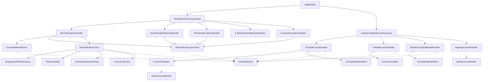

# Application Layer

## Overview

The `app/` module is the server's entry point. It bootstraps the Koin dependency injection container, creates the gRPC server (Netty + Unix domain sockets), and starts the Ktor HTTP server for result file downloads.

---

## Entry Point

### Application.kt

**Main function:** `ru.nstu.isma.server.app.ApplicationKt` (configured in `build.gradle.kts`). See `Application.kt` for the full implementation. The function performs 10 steps: (1) parses CLI arguments for socket paths, (2) starts Koin DI with all three modules, (3) resolves gRPC service instances and session store from Koin via `KoinComponent`, (4) cleans up existing socket files, (5) creates Netty event loop groups (boss + worker), (6) builds the gRPC server on a Unix domain socket with both services and the reflection service, (7) creates and starts the Ktor HTTP server with result download routes, (8) prints socket paths to stdout and starts the gRPC server, (9) registers a shutdown hook, and (10) blocks on `grpcServer.awaitTermination()`.

### CLI Arguments

| Argument | Default | Description |
|----------|---------|-------------|
| `--socket-path` | `{tmpdir}/isma-{UUID}.sock` | Unix socket path for gRPC |
| `--http-socket-path` | `{tmpdir}/isma-http-{UUID}.sock` | Unix socket path for Ktor HTTP |

### Socket Lifecycle

**Startup:** Socket files are deleted to remove stale files, then `NettyServerBuilder` binds to the `DomainSocketAddress` and `embeddedServer` with `unixConnector` is started.

**Runtime:** Socket files persist in the filesystem as Unix domain socket special files.

**Shutdown:** See `Application.kt` for the shutdown hook implementation. It deletes socket files, calls `grpcServer.shutdown()`, `httpServer.stop(1, 2, SECONDS)`, and `bossGroup`/`workerGroup.shutdownGracefully()`.

---

## Netty Transport Configuration

The server uses Linux-specific **Netty Epoll** transport for Unix domain socket support.

**Dependencies:**
- `grpc-netty` — Netty-based gRPC server transport
- `netty-transport-classes-epoll` — Epoll channel implementation
- `netty-transport-native-epoll` — Native epoll library (Linux x86_64)

**Event loop groups:** See `Application.kt` for the creation of `bossGroup` and `workerGroup` using `MultiThreadIoEventLoopGroup(EpollIoHandler.newFactory())`. The boss group accepts connections and the worker group handles I/O.

> See [07-transport-layer.md](07-transport-layer.md) for complete Netty Unix domain socket configuration, transport architecture, client discovery, and troubleshooting.

---

## gRPC Services

### SimulationServiceGrpcImpl

**Package:** `ru.nstu.isma.server.app.grpc`

**Base class:** `SimulationServiceGrpc.SimulationServiceImplBase()`

**Injected dependencies (5 handlers):**

| Parameter | Interface | Resolved from |
|-----------|-----------|---------------|
| `runSimulationHandler` | `IRunSimulationHandler` | `domainModule` |
| `getSimulationResultHandler` | `IGetSimulationResultHandler` | `domainModule` |
| `monitorSimulationHandler` | `IMonitorSimulationHandler` | `domainModule` |
| `listSimulationMethodsHandler` | `IListSimulationMethodsHandler` | `domainModule` |
| `cancelSimulationHandler` | `ICancelSimulationHandler` | `domainModule` |

**Request flow:** Each RPC method follows the same pattern:
1. Validates required fields (blank check for `compiledModelId`, `lismaSourceCode`, `sourceCode`)
2. Calls domain handler with transformed request data
3. Maps domain types to protobuf response builders
4. Calls `responseObserver.onNext()` + `responseObserver.onCompleted()`
5. Catches exceptions and converts via `toStatusException()`
6. Logs errors via `logger.error()` before propagating

**Validation behavior:**
- `runSimulation`: Returns `INVALID_ARGUMENT` if `compiledModelId` is blank
- `compile`: Returns `INVALID_ARGUMENT` if `lismaSourceCode` is blank
- `validate`: Returns `INVALID_ARGUMENT` if `lismaSourceCode` is blank
- `delete`: Returns `INVALID_ARGUMENT` if `compiledModelId` is blank
- `highlight`: Returns empty response (no error) if `sourceCode` is blank

### LismaCompilerServiceGrpcImpl

**Package:** `ru.nstu.isma.server.app.grpc`

**Base class:** `LismaCompilerServiceGrpc.LismaCompilerServiceImplBase()`

**Injected dependencies (4 handlers):**

| Parameter | Interface | Resolved from |
|-----------|-----------|---------------|
| `compileLismaHandler` | `ICompileLismaHandler` | `domainModule` |
| `validateLismaHandler` | `IValidateLismaHandler` | `domainModule` |
| `deleteCompiledModelHandler` | `IDeleteCompiledModelHandler` | `domainModule` |
| `highlightLismaHandler` | `IHighlightLismaHandler` | `infrastructureModule` |

**Request flow:** Same pattern as SimulationService.

### ProtoReflectionServiceV1

See `Application.kt` for the `.addService(ProtoReflectionServiceV1.newInstance())` call. Enables dynamic service discovery via gRPC reflection. Allows tools like `grpcurl` and IDE plugins to introspect the API without generated stubs.

---

## HTTP Server (Ktor)

### HttpRoutes.kt

The server embeds a Ktor HTTP server (CIO engine) on a separate Unix socket for binary file downloads. See `HttpRoutes.kt` for the full implementation. The `simulationResultRoutes()` extension function registers a single route: `GET /simulation/{id}/download`. It validates the simulation ID, checks that the session exists and is `COMPLETED`, verifies the result file exists, sets response headers (`Content-Type: application/octet-stream`, `Content-Disposition: attachment`), and serves the file via `call.respondFile()`.

**Route:** `GET /simulation/{id}/download`

**Response headers:** `Content-Type: application/octet-stream` and `Content-Disposition: attachment; filename="simulation_<id>.bin"`.

**Ktor dependencies:**
- `ktor-server-core` — Ktor server framework
- `ktor-server-cio` — CIO (Channel Input/Output) engine
- `ktor-server-content-negotiation` — Content negotiation (available but unused)

---

## Dependency Injection (AppModule)

See `AppModule.kt` for the full module definition. The `appModule` only registers the gRPC service implementations: `SimulationServiceGrpcImpl` (with 5 handler dependencies) and `LismaCompilerServiceGrpcImpl` (with 4 handler dependencies). All handler dependencies are resolved transitively from `domainModule` and `infrastructureModule`.

### DI Resolution Chain

`SimulationServiceGrpcImpl` depends on 5 handlers: `IRunSimulationHandler`, `IGetSimulationResultHandler`, `IMonitorSimulationHandler`, `IListSimulationMethodsHandler`, and `ICancelSimulationHandler`. `LismaCompilerServiceGrpcImpl` depends on 4 handlers: `ICompileLismaHandler`, `IValidateLismaHandler`, `IDeleteCompiledModelHandler`, and `IHighlightLismaHandler`.

The simulation handlers depend on `ICompiledModelStore`, `ISimulationSessionStore`, and `ISimulationExecutor`. The `ISimulationExecutor` depends on `IntegrationMethodsLibrary`, `IHsmCompiler`, `ISimulationSessionStore`, and `ExecutorService`. The `ICompileLismaHandler` depends on `ILismaTranslator` and `ICompiledModelStore`. The `IValidateLismaHandler` depends on `ILismaTranslator`. The `IDeleteCompiledModelHandler` depends on `ICompiledModelStore`. `ILismaTranslator` is implemented by `LismaTranslatorImpl` which wraps `InputTranslator`.

---

## Logging

Configuration is in `logback.xml`. See the file for the full configuration. All logging output goes to stdout with the pattern `%d{HH:mm:ss.SSS} [%thread] %-5level %logger{36} - %msg%n`. Third-party frameworks (`io.grpc`, `io.netty`, `io.ktor`) are logged at INFO level. gRPC service methods log errors via `logger.error()` with exception stack traces before propagating to gRPC clients.
