# Build & Deployment

## Build Configuration

### Gradle Modules

| Module | Purpose |
|--------|---------|
| `:isma-server:grpc` | gRPC code generation (protobuf → Java) |
| `:isma-server:domain` | Domain interfaces + handler implementations |
| `:isma-server:infrastructure` | Concrete store/executor implementations |
| `:isma-server:app` | Application entry point + gRPC/HTTP services |

### Build Scripts

#### `grpc/build.gradle.kts`

See `grpc/build.gradle.kts` for the full configuration. It applies the `google.protobuf` and `java.modules` plugins, configures `protoc` and `protoc-gen-grpc-java` code generation, sets the proto source directory to `../../protobuf-contracts`, and depends on gRPC and protobuf libraries.

**Code generation:** Protobuf files from `protobuf-contracts/v1/` are compiled into Java gRPC stubs. The generated classes include service interfaces (`SimulationServiceGrpc`, `LismaCompilerServiceGrpc`), message classes (`RunSimulationRequest`, `CompileResponse`, etc.), and builder classes for all messages.

**Important:** Proto changes require rebuilding this module. Generated code should NOT be committed (it's derived from `.proto` files).

#### `domain/build.gradle.kts`

See `domain/build.gradle.kts` for the full configuration. It applies `kotlin.jvm` and `java.modules` plugins and depends on `isma-solver:api`, `isma-compiler:hsm-core`, `isma-next-core`, and `koin-core`. Domain depends only on external libraries and core project modules. No infrastructure or app dependencies.

#### `infrastructure/build.gradle.kts`

See `infrastructure/build.gradle.kts` for the full configuration. It applies `kotlin.jvm` and `java.modules` plugins and depends on the domain module, `isma-jvm-lib:exchange-format`, `isma-solver:api/core/lib-utils`, `isma-compiler:lisma-translator-hsm/hsm-core/hsm-fdm/hsm-jvm/hsm-jvm-calcmodel`, `isma-next-core`, `antlr4-runtime`, `koin-core`, and `slf4j-api`.

#### `app/build.gradle.kts`

See `app/build.gradle.kts` for the full configuration. It applies `kotlin.jvm`, `java.modules`, and `application` plugins, sets `mainClass` to `ru.nstu.isma.server.app.ApplicationKt`, and depends on all three internal modules, `isma-solver:lib-meta`, gRPC/Netty libraries, Kotlin reflection, Koin, SLF4J/Logback, and Ktor server libraries.

### Dependency Versions

All versions are centralized in `gradle/libs.versions.toml`:

| Library | Version |
|---------|---------|
| Kotlin | 2.3.20 |
| gRPC | 1.80.0 |
| Protobuf | 4.34.1 |
| Netty | 4.2.10.Final |
| Ktor | 3.4.1 |
| Koin | 4.2.0 |
| SLF4J | 2.0.17 |
| Logback | 1.5.32 |
| ANTLR4 | 4.13.2 |
| Guava | 33.5.0-jre |

---

## Runtime Dependencies

### Project Dependencies

| Module | Provides | Used by |
|--------|----------|---------|
| `isma-solver:api` | `IIntegrationMethodFactory`, `DaeSystemStepSolver`, `IntgResultPoint` | domain, infrastructure |
| `isma-solver:core` | `DefaultDaeSystemStepSolver` | infrastructure |
| `isma-solver:lib-meta` | SPI interface `IIntegrationMethodFactory` | app (ServiceLoader) |
| `isma-compiler:hsm-core` | `HSM`, `IsmaErrorList`, `IsmaSyntaxError` | domain, infrastructure |
| `isma-compiler:hsm-fdm` | `FDMConverter` | infrastructure |
| `isma-compiler:hsm-jvm` | `EquationIndexProvider` | infrastructure |
| `isma-compiler:hsm-jvm-calcmodel` | Calculation model utilities | infrastructure |
| `isma-compiler:lisma-translator-hsm` | `LismaTranslator`, `InputTranslator` | infrastructure |
| `isma-next-core` | `HsmCompiler`, `HybridSystemSimulator`, `SimulationInitials` | domain, infrastructure |
| `isma-jvm-lib:exchange-format` | `writeAll()` (binary file writer) | infrastructure |

### Third-Party Dependencies

| Library | Purpose |
|---------|---------|
| Netty (with Epoll) | gRPC server transport + Unix domain sockets |
| gRPC (Netty + Protobuf) | RPC framework |
| Koin | Lightweight DI framework |
| Ktor (CIO) | Embedded HTTP server |
| ANTLR4 | LISMA lexer for syntax highlighting |
| SLF4J + Logback | Logging |
| Kotlin reflection | Koin runtime support |

---

## Startup Sequence

```mermaid
flowchart TD
    A["1. Parse CLI arguments\n(--socket-path, --http-socket-path)"] --> B["2. startKoin"]

    subgraph Koin["startKoin { domain, infrastructure, app }"]
        direction LR
        K1["IntegrationMethodsStore\n(ServiceLoader)"]
        K2["IntegrationMethodLibraryLoader.load()"]
        K3["LismaTranslator()"]
        K4["HsmCompiler()"]
        K5["Executors.newCachedThreadPool()"]
        K6["Handler instances\n(injected deps)"]
    end

    B --> Koin
    Koin --> C["3. Delete stale socket files"]
    C --> D["4. Create Netty Epoll\nevent loop groups\n(boss + worker)"]
    D --> E["5. Build gRPC server"]

    subgraph GrpcBuild["gRPC Server Build"]
        direction LR
        G1["Bind DomainSocketAddress\n(socketPath)"]
        G2["Register SimulationServiceGrpcImpl"]
        G3["Register LismaCompilerServiceGrpcImpl"]
        G4["Register ProtoReflectionServiceV1"]
    end

    E --> GrpcBuild
    GrpcBuild --> F["6. Start gRPC server (.start())"]
    F --> G["7. Create Ktor HTTP server\n(CIO engine, Unix socket)"]
    G --> H["8. Register HTTP route\nGET /simulation/{id}/download"]
    H --> I["9. Start HTTP server (.start(false))"]
    I --> J["10. Print GRPC_SOCKET / HTTP_SOCKET"]
    J --> K["11. Register shutdown hook"]
    K --> L["12. grpcServer.awaitTermination()\n(blocks main thread)"]

    classDef step fill:#e1f5fe,stroke:#0288d1,stroke-width:2px
    classDef subgraph fill:#f3e5f5,stroke:#7b1fa2,stroke-width:1px
    class A,B,C,D,F,G,H,I,J,K,L step
    class Koin,GrpcBuild subgraph
```

See `Application.kt` for the full startup sequence. The function performs 12 steps: (1) parse CLI arguments (`--socket-path`, `--http-socket-path`), (2) call `startKoin { modules(domainModule, infrastructureModule, appModule) }` — initializes `IntegrationMethodsStore` (ServiceLoader), `IntegrationMethodLibraryLoader`, `LismaTranslator`, `HsmCompiler`, `Executors.newCachedThreadPool()`, and all handler instances, (3) delete stale socket files, (4) create Netty Epoll event loop groups (boss + worker), (5) build gRPC server — binds to `DomainSocketAddress`, registers `SimulationServiceGrpcImpl`, `LismaCompilerServiceGrpcImpl`, and `ProtoReflectionServiceV1`, (6) start gRPC server (`.start()`), (7) create Ktor HTTP server (CIO engine, Unix socket), (8) register HTTP route `GET /simulation/{id}/download`, (9) start HTTP server (`start(false)`), (10) print `GRPC_SOCKET` and `HTTP_SOCKET` to stdout, (11) register shutdown hook, (12) block on `grpcServer.awaitTermination()` (blocks main thread).

---

## Shutdown Sequence

```mermaid
flowchart LR
    ShutdownHook["ShutdownHook.run()"] --> S1["1. grpcServer.shutdown()\n(stop accepting new requests)"]
    S1 --> S2["2. httpServer.stop(1s/2s)\n(stop HTTP server)"]
    S2 --> S3["3. bossGroup.shutdownGracefully()\n(close boss event loop)"]
    S3 --> S4["4. workerGroup.shutdownGracefully()\n(close worker event loop)"]
    S4 --> S5["5. File(socketPath).delete()\n(remove gRPC socket file)"]
    S5 --> S6["6. File(httpSocketPath).delete()\n(remove HTTP socket file)"]

    classDef hook fill:#ffebee,stroke:#c62828,stroke-width:2px
    classDef action fill:#fff3e0,stroke:#f57c00,stroke-width:2px
    class ShutdownHook hook
    class S1,S2,S3,S4,S5,S6 action
```



See `Application.kt` for the shutdown hook implementation. The shutdown proceeds in 6 steps: (1) `grpcServer.shutdown()` — stop accepting new requests, (2) `httpServer.stop(1, 2, SECONDS)` — stop HTTP server, (3) `bossGroup.shutdownGracefully()` — close boss event loop, (4) `workerGroup.shutdownGracefully()` — close worker event loop, (5) `File(socketPath).delete()` — remove gRPC socket file, (6) `File(httpSocketPath).delete()` — remove HTTP socket file.

---

## Build Commands

| Command | Purpose |
|---------|---------|
| `./gradlew :isma-server:build` | Build entire isma-server module (all 4 submodules) |
| `./gradlew :isma-server:app:build` | Build just the application (includes all dependencies) |
| `./gradlew :isma-server:grpc:generateProto` | Generate gRPC stubs only (after proto changes) |
| `./gradlew :isma-server:test` | Build with tests |
| `./.ci-cd/build-bundle.sh` | Build distribution bundle (UI + server together) |

### Common Issues

| Problem | Solution |
|---------|----------|
| Proto files not found | Run `./gradlew :isma-server:grpc:generateProto` after pulling proto changes |
| Missing Epoll native library | Server requires Linux x86_64; Epoll classifier `linux-x86_64` must be available |
| Socket file already exists | Server auto-deletes stale sockets at startup; manually `rm /tmp/isma-*.sock` if needed |
| ServiceLoader finds no integration methods | Ensure `isma-solver:lib:euler`, `lib:rk2`, etc. are in the classpath and have `META-INF/services/ru.nstu.isma.intg.api.methods.IIntegrationMethodFactory` entries |

---

## Deployment

### Process Launch

The server is launched by the ISMA UI process (`SimulationServerManager`) as a separate JVM. The UI:

1. Determines the server launch script (from `ISMA_SERVER_SCRIPT` env var or `isma.server.script` system property)
2. Launches the server process
3. Reads `GRPC_SOCKET` and `HTTP_SOCKET` from stdout
4. Connects to the gRPC server via the Unix socket path
5. Connects to the HTTP server for file downloads

### Bundle Distribution

The `.ci-cd/build-bundle.sh` script creates a distribution bundle at `build/bundle/` containing:
- `isma-server` executable
- `isma-ui` executable
- `run-ui.sh` launcher script

### Platform Requirements

| Requirement | Details |
|-------------|---------|
| **OS** | Linux (Epoll dependency) |
| **Architecture** | x86_64 (native Epoll classifier) |
| **Java** | JVM compatible with Kotlin 2.3.20 |
| **Unix sockets** | Required (not TCP/IP) |

---

## Configuration

### Runtime Configuration

| Method | Parameters |
|--------|------------|
| CLI arguments | `--socket-path <path>` `--http-socket-path <path>` |
| System properties | `java.io.tmpdir` (default socket location) |

### Logging

Configured via `logback.xml`:
- All output to stdout
- Console appender with timestamp, thread, level, logger name, message
- Third-party frameworks at INFO level

### gRPC Reflection

Enabled by default via `ProtoReflectionServiceV1.newInstance()`. Allows:
- `grpcurl` command-line tool to introspect the API
- IDE plugins to auto-generate client code
- Runtime service discovery
