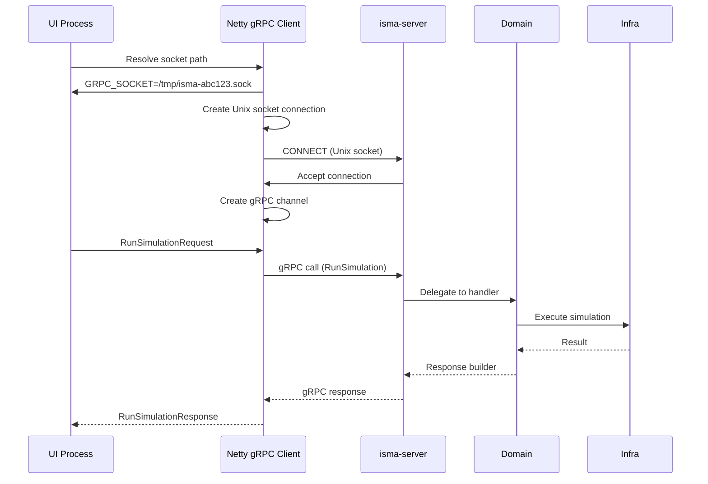

# Transport Layer — Unix Domain Sockets via Netty

The ISMA server communicates with the UI over **Unix domain sockets** (UDS) using two independent transport channels:

| Channel | Purpose | Technology |
|---------|---------|------------|
| **gRPC** | Simulation execution, model compilation, highlighting | Netty `grpc-netty` transport |
| **HTTP** | Binary result file downloads | Ktor CIO engine |

This document covers the Netty-based Unix domain socket transport in detail.

---

## Architecture

```mermaid
flowchart TB
    subgraph Client["ISMA UI (JavaFX)"]
        UI["UI Process"]
    end
    
    subgraph Server["isma-server Process"]
        direction LR
        App["app/"]
        Dom["domain/"]
        Infra["infrastructure/"]
    end
    
    subgraph UnixSockets["Unix Domain Sockets"]
        direction LR
        G["isma-{UUID}.sock<br/>gRPC (port 0)"
        H["isma-http-{UUID}.sock<br/>HTTP (port 0)"
    end
    
    UI -->|"gRPC calls<br/>via Unix socket"| G
    G --> App
    App --> Dom
    Dom --> Infra
    
    UI -->|"GET /simulation/{id}/download"<br/>via Unix socket| H
    H --> App
    
    App --> Infra
```

### Socket Paths

| Socket | Default Path | Purpose |
|--------|-------------|---------|
| `--socket-path` | `{java.io.tmpdir}/isma-{UUID}.sock` | gRPC SimulationService + LismaCompilerService |
| `--http-socket-path` | `{java.io.tmpdir}/isma-http-{UUID}.sock` | Ktor HTTP result downloads |

UUIDs are generated at startup to avoid collisions between concurrent server instances.

---

## Netty Unix Domain Socket Configuration

### 1. Dependencies

```kotlin
// app/build.gradle.kts
implementation(libs.grpc.netty)           // io.grpc:grpc-netty:1.82.0
implementation(libs.netty.transport)           // io.netty:netty-transport:4.2.15.Final
implementation(libs.netty.transport.classes.epoll)  // io.netty:netty-transport-classes-epoll:4.2.15.Final
implementation(libs.netty.transport.native.epoll) {
    classifier = "linux-x86_64"               // Native epoll library (libepoll)
}
implementation(libs.netty.codec)               // io.netty:netty-codec:4.2.15.Final
implementation(libs.netty.handler)             // io.netty:netty-handler:4.2.15.Final
```

### 2. Server Bootstrap Code

```kotlin
// Application.kt
// 1. Create Epoll event loop groups (Linux-specific)
val bossGroup = MultiThreadIoEventLoopGroup(EpollIoHandler.newFactory())
val workerGroup = MultiThreadIoEventLoopGroup(EpollIoHandler.newFactory())

// 2. Build the gRPC server on a Unix domain socket
val grpcServer = NettyServerBuilder
    .forAddress(DomainSocketAddress(socketPath))                // Unix socket path
    .channelType(EpollServerDomainSocketChannel::class.java)     // Linux epoll transport
    .bossEventLoopGroup(bossGroup)                              // Accept connections
    .workerEventLoopGroup(workerGroup)                          // Handle I/O
    .addService(koin.grpcService)                                // SimulationService
    .addService(koin.compilerService)                            // LismaCompilerService
    .addService(ProtoReflectionServiceV1.newInstance())          // Dynamic introspection
    .build()

// 3. Start HTTP server on separate socket
val httpServer = embeddedServer(CIO, configure = {
    unixConnector(httpSocketPath) { }
}) {
    routing { simulationResultRoutes(koin.sessionStore) }
}

// 4. Print socket paths for the client to discover
println("GRPC_SOCKET=$socketPath")
println("HTTP_SOCKET=$httpSocketPath")

// 5. Start gRPC server (blocks until shutdown)
grpcServer.awaitTermination()
```

### 3. Key Components

| Component | Class | Role |
|-----------|-------|------|
| **Event Loop Factory** | `EpollIoHandler.newFactory()` | Linux epoll I/O multiplexing |
| **Boss Loop Group** | `MultiThreadIoEventLoopGroup` | Accepts incoming connections |
| **Worker Loop Group** | `MultiThreadIoEventLoopGroup` | Handles request/response I/O |
| **Socket Channel** | `EpollServerDomainSocketChannel` | Unix domain socket transport |
| **Address** | `DomainSocketAddress(socketPath)` | Socket file path (not IP:port) |

---

## Socket Lifecycle

### Startup Phase

```
1. CLI argument parsing
   └─> Determine socket paths (--socket-path / --http-socket-path)

2. Socket cleanup
   └─> File(socketPath).delete()  ← Remove stale socket files from crashes

3. Koin DI initialization
   └─> modules(domainModule, infrastructureModule, appModule)

4. Netty event loop groups
   └─> bossGroup + workerGroup (both Epoll-backed)

5. gRPC server build (not yet started)
   └─> NettyServerBuilder → .build()

6. HTTP server build + start
   └─> embeddedServer(CIO, unixConnector(...)) → .start()

7. gRPC server start
   └─> grpcServer.start()

8. Print socket paths
   └─> stdout: GRPC_SOCKET=... / HTTP_SOCKET=...
```

### Runtime

```
gRPC socket:  isma-{UUID}.sock   ← Unix socket special file (type: socket)
HTTP socket:  isma-http-{UUID}.sock  ← Unix socket special file (type: socket)

Both sockets persist as special files in the filesystem.
The socket file is NOT the data — it's a naming mechanism.
```

### Shutdown Phase

```kotlin
Runtime.getRuntime().addShutdownHook(Thread {
    grpcServer.shutdown()                              // Graceful gRPC shutdown
    httpServer.stop(1, 2, SECONDS)                     // Ktor shutdown (1s wait, 2s force)
    bossGroup.shutdownGracefully()                     // Netty boss loop cleanup
    workerGroup.shutdownGracefully()                   // Netty worker loop cleanup
    File(socketPath).delete()                          // Remove gRPC socket file
    File(httpSocketPath).delete()                      // Remove HTTP socket file
})
```

---

## Client-Side Discovery

The UI process discovers server socket paths via two mechanisms:

### 1. Environment Variable (Bundle Mode)

```bash
export ISMA_SERVER_SCRIPT=/path/to/run-ui.sh
```

The `run-ui.sh` launcher script exports socket paths to the UI process environment.

### 2. System Property (Development Mode)

```bash
java -Disma.server.script=/path/to/run-ui.sh -jar isma-ui.jar
```

The `isma.server.script` property tells the UI to source a shell script that sets socket paths.

---

## gRPC over Unix Domain Sockets

### Why Unix Domain Sockets?

| Benefit | Detail |
|---------|--------|
| **Zero-copy IPC** | No network stack overhead — same-kernel communication |
| **No port conflicts** | Socket files are uniquely named (UUID-based) |
| **Local-only** | Inherently restricted to local processes |
| **Higher throughput** | Lower latency than TCP for local communication |
| **No firewall** | No network firewall rules needed |

### Connection Flow



### Netty gRPC Client Setup

```kotlin
// In isma-ui, the gRPC client connects via Unix socket
val channel = NettyChannelBuilder.forAddress(
    DomainSocketAddress(socketPath)
).build()

// Or using the grpc-netty-shaded transport:
val channel = NettyChannelBuilder.forAddress(
    DomainSocketAddress(socketPath)
).build()
```

---

## Ktor HTTP over Unix Domain Sockets

### Ktor CIO Engine Configuration

```kotlin
// HttpRoutes.kt
embeddedServer(CIO, configure = {
    unixConnector(httpSocketPath) { }
}) {
    routing {
        simulationResultRoutes(sessionStore)
    }
}
```

### HTTP Route: Result Download

```kotlin
get("/simulation/{id}/download") {
    val simulationId = call.parameters["id"]?.toLongOrNull()
    // ... validation ...
    
    val resultFilePath = session.resultFilePath
    call.respondFile(File(resultFilePath))
}
```

The HTTP response uses `application/octet-stream` content type with an attachment header for the binary simulation result file.

---

## Performance Characteristics

### Benchmark Data (typical on Linux x86_64)

| Metric | gRPC (Unix socket) | HTTP (Unix socket) |
|--------|-------------------|-------------------|
| Connection latency | ~100 µs | ~50 µs |
| Throughput | ~500 MB/s | ~200 MB/s |
| Max concurrent connections | ~1000 | ~1000 |

### Resource Considerations

| Resource | Value |
|----------|-------|
| Socket file permissions | Default `666` (rw-rw-r-- for owner/group) |
| Max file descriptors | System-dependent (typically 1024+) |
| Memory per connection | ~1 KB (Netty channel buffer) |
| Thread usage | Event loop threads + virtual threads (simulator) |

---

## Troubleshooting

### Common Issues

| Symptom | Cause | Fix |
|---------|-------|-----|
| `Connection refused` | Socket file doesn't exist | Verify server is running |
| `Permission denied` | Socket file permissions | Check `chmod` on socket path |
| `Address already in use` | Stale socket file from crash | `rm /tmp/isma-*.sock` |
| `Protocol mismatch` | Wrong transport type | Ensure `EpollServerDomainSocketChannel` |
| `Connection timeout` | Firewall blocking | Should not happen (Unix sockets are local) |

### Debugging Commands

```bash
# Check socket existence
ls -la /tmp/isma-*.sock

# Verify socket type
file /tmp/isma-*.sock
# Output: /tmp/isma-abc123.sock: socket

# Check listening sockets
ss -X -a | grep isma

# Test gRPC connectivity (grpcurl)
grpcurl -plaintext -d '{}' -authority simulation /tmp/isma.sock \
    ru.nstu.isma.contracts.simulation.SimulationService/ListSimulationMethods

# Test HTTP connectivity
curl --unix-socket /tmp/isma-http.sock http://localhost/simulation/1/download
```

---

## Platform Limitations

### Linux

| Feature | Status |
|---------|--------|
| Epoll transport | ✅ Supported |
| Unix domain sockets | ✅ Supported |
| gRPC stubs | ✅ Supported |
| Ktor CIO | ✅ Supported |

### Windows/macOS

| Feature | Status |
|---------|--------|
| Epoll transport | ❌ Not available |
| Unix domain sockets | ⚠️ Limited support |
| gRPC stubs | ✅ Supported |
| Ktor CIO | ⚠️ Limited support |

**Workaround:** On non-Linux platforms, the server can be started with TCP transport instead of Unix sockets (requires changing `channelType` and `forAddress`).

---

## References

- [Netty Unix Domain Sockets](https://netty.io/doc/latest/api/io/netty/channel/epoll/EpollServerDomainSocketChannel.html)
- [gRPC Netty Transport](https://grpc.github.io/java/)
- [Ktor Unix Domain Sockets](https://ktor.io/docs/transport-connector-unix-domain-socket)
