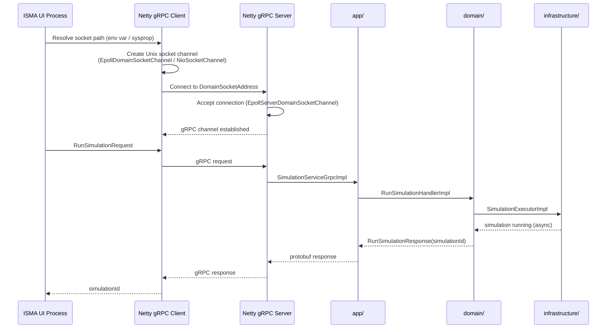

# Transport Layer — Unix Domain Sockets via Netty

The ISMA server communicates with the UI over **Unix domain sockets** (UDS) using two independent transport channels:

| Channel | Purpose | Technology |
|---------|---------|------------|
| **gRPC** | Simulation execution, model compilation, highlighting | Netty `grpc-netty` transport |
| **HTTP** | Binary result file downloads | Ktor CIO engine |

This document covers the Netty-based Unix domain socket transport in detail.

---

## Architecture

The ISMA UI (JavaFX process) communicates with the isma-server process via two Unix domain sockets: `isma-{UUID}.sock` for gRPC (port 0) and `isma-http-{UUID}.sock` for HTTP (port 0). The UI sends gRPC calls over the gRPC socket to the `app/` module, which delegates to `domain/` and then `infrastructure/`. The UI also sends HTTP GET requests to `/simulation/{id}/download` over the HTTP socket, which is handled by the `app/` module's embedded Ktor server.

### Socket Paths

| Socket | Default Path | Purpose |
|--------|-------------|---------|
| `--socket-path` | `{java.io.tmpdir}/isma-{UUID}.sock` | gRPC SimulationService + LismaCompilerService |
| `--http-socket-path` | `{java.io.tmpdir}/isma-http-{UUID}.sock` | Ktor HTTP result downloads |

UUIDs are generated at startup to avoid collisions between concurrent server instances.

---

## Netty Unix Domain Socket Configuration

### 1. Dependencies

See `app/build.gradle.kts` for the full dependency declarations. The server depends on `grpc-netty`, `netty-transport`, `netty-transport-classes-epoll`, `netty-transport-native-epoll` (with `linux-x86_64` and `windows-x86_64` classifiers), `netty-codec`, and `netty-handler`.

### 2. Server Bootstrap Code

Platform detection dispatches to platform-specific setup objects. See `Application.kt` for the bootstrap code that detects Linux vs. other platforms and creates gRPC handles accordingly.

**Linux path** (`LinuxServerSetup.kt`): Creates `MultiThreadIoEventLoopGroup` with `EpollIoHandler.newFactory()` for both boss and worker groups, builds a `NettyServerBuilder` with `EpollServerDomainSocketChannel`, registers both gRPC services and the reflection service, and returns `GrpcServerHandles`.

**Windows path** (`WindowsServerSetup.kt`): Creates `NioEventLoopGroup()` for both boss and worker groups, builds a `NettyServerBuilder` with `NioServerSocketChannel`, registers both gRPC services and the reflection service, and returns `GrpcServerHandles`.

**Print socket paths:** See `Application.kt` for the `println("GRPC_SOCKET=...")` and `println("HTTP_SOCKET=...")` calls followed by `handles.grpcServer.awaitTermination()`.

### 3. Key Components

The server automatically detects platform capabilities at runtime:

| Component | Linux (Epoll available) | Windows 11 / macOS (NIO fallback) |
|-----------|------------------------|----------------------------------|
| **Event Loop Factory** | `EpollIoHandler.newFactory()` | `NioEventLoopGroup()` |
| **Boss Loop Group** | `MultiThreadIoEventLoopGroup` | `NioEventLoopGroup()` |
| **Worker Loop Group** | `MultiThreadIoEventLoopGroup` | `NioEventLoopGroup()` |
| **Server Socket Channel** | `EpollServerDomainSocketChannel` | `NioServerSocketChannel` |
| **Address** | `DomainSocketAddress(socketPath)` | `DomainSocketAddress(socketPath)` (same) |
| **HTTP Server** | Ktor CIO `unixConnector` | Ktor CIO `unixConnector` (same) |

**Platform detection strategy:** The server tries to load Epoll classes via reflection. If successful, it uses Epoll transport. If Epoll classes are not available (not on Linux), it falls back to NIO transport. This approach is automatic — no configuration or platform detection code needed.

---

## Socket Lifecycle

### Startup Phase

1. CLI argument parsing — determine socket paths (`--socket-path` / `--http-socket-path`)
2. Socket cleanup — `File(socketPath).delete()` to remove stale socket files from crashes
3. Koin DI initialization — `modules(domainModule, infrastructureModule, appModule)`
4. Netty event loop groups — `bossGroup` + `workerGroup` (Epoll on Linux, NIO on Windows 11)
5. gRPC server build (not yet started) — `NettyServerBuilder → .build()`
6. HTTP server build + start — `embeddedServer(CIO, unixConnector(...)) → .start()`
7. gRPC server start — `grpcServer.start()`
8. Print socket paths — stdout: `GRPC_SOCKET=...` / `HTTP_SOCKET=...`

### Runtime

- **gRPC socket:** `isma-{UUID}.sock` — Unix socket special file (type: socket)
- **HTTP socket:** `isma-http-{UUID}.sock` — Unix socket special file (type: socket)

Both sockets persist as special files in the filesystem. The socket file is NOT the data — it's a naming mechanism.

### Shutdown Phase

See `Application.kt` for the shutdown hook implementation. It calls `grpcServer.shutdown()`, `httpServer.stop(1, 2, SECONDS)`, `bossGroup.shutdownGracefully()`, `workerGroup.shutdownGracefully()`, and deletes both socket files.

---

## Client-Side Discovery

The UI process discovers server socket paths via two mechanisms:

### 1. Environment Variable (Bundle Mode)

Set `ISMA_SERVER_SCRIPT=/path/to/run-ui.sh`. The `run-ui.sh` launcher script exports socket paths to the UI process environment.

### 2. System Property (Development Mode)

Launch with `-Disma.server.script=/path/to/run-ui.sh -jar isma-ui.jar`. The `isma.server.script` property tells the UI to source a shell script that sets socket paths.

---

## gRPC over Unix Domain Sockets

### Why Unix Domain Sockets?

| Benefit | Detail |
|---------|--------|
| **Zero-copy IPC** | No network stack overhead — same-kernel communication |
| **No port conflicts** | Socket files are uniquely named (UUID-based) |
| **Local-only** | Inherently restricted to local processes |
| **Higher throughput** | Lower latency than TCP for local communication |
| **No firewall** | No network firewall rules needed |

### Connection Flow

The UI process resolves the socket path (from environment variable or system property), creates a Unix socket connection via Netty, and connects to the server. The server accepts the connection and a gRPC channel is established. The UI sends gRPC requests (e.g., `RunSimulationRequest`) which are routed through the server to the domain layer, then to the infrastructure layer for simulation execution. Results flow back through the same chain: infrastructure → domain → server → Netty → UI.

### Netty gRPC Client Setup

Platform detection dispatches to platform-specific client implementations. See `GrpcSimulationClient.kt` for the Linux vs. Windows detection logic.

**Linux path** (`LinuxGrpcClient.kt`): Creates a `MultiThreadIoEventLoopGroup` with `EpollIoHandler.newFactory()`, builds a `NettyChannelBuilder` with `EpollDomainSocketChannel`, `DomainSocketAddress`, `PLAINTEXT` negotiation type, and a 365-day keep-alive interval.

**Windows path** (`WindowsGrpcClient.kt`): Creates an `NioEventLoopGroup`, builds a `NettyChannelBuilder` with `NioSocketChannel`, `DomainSocketAddress`, `PLAINTEXT` negotiation type, and a 365-day keep-alive interval.

---

## Ktor HTTP over Unix Domain Sockets

### Ktor CIO Engine Configuration

See `HttpRoutes.kt` for the Ktor server setup. An `embeddedServer(CIO, configure = { unixConnector(httpSocketPath) { } })` is created with routing that registers `simulationResultRoutes(sessionStore)`.

### HTTP Route: Result Download

The HTTP route at `/simulation/{id}/download` validates the simulation ID, checks the session, and serves the result file via `call.respondFile(File(resultFilePath))`. The HTTP response uses `application/octet-stream` content type with an attachment header for the binary simulation result file.

---

## Performance Characteristics

### Benchmark Data (typical on Linux x86_64)

| Metric | gRPC (Unix socket) | HTTP (Unix socket) |
|--------|-------------------|-------------------|
| Connection latency | ~100 µs | ~50 µs |
| Throughput | ~500 MB/s | ~200 MB/s |
| Max concurrent connections | ~1000 | ~1000 |

### Resource Considerations

| Resource | Value |
|----------|-------|
| Socket file permissions | Default `666` (rw-rw-r-- for owner/group) |
| Max file descriptors | System-dependent (typically 1024+) |
| Memory per connection | ~1 KB (Netty channel buffer) |
| Thread usage | Event loop threads + virtual threads (simulator) |

---

## Troubleshooting

### Common Issues

| Symptom | Cause | Fix |
|---------|-------|-----|
| `Connection refused` | Socket file doesn't exist | Verify server is running |
| `Permission denied` | Socket file permissions | Check `chmod` on socket path |
| `Address already in use` | Stale socket file from crash | `rm /tmp/isma-*.sock` |
| `Protocol mismatch` | Wrong transport type | Ensure `EpollServerDomainSocketChannel` |
| `Connection timeout` | Firewall blocking | Should not happen (Unix sockets are local) |

### Debugging Commands

| Command | Purpose |
|---------|---------|
| `ls -la /tmp/isma-*.sock` | Check socket existence |
| `file /tmp/isma-*.sock` | Verify socket type (output: `socket`) |
| `ss -X -a \| grep isma` | Check listening sockets |
| `grpcurl -plaintext -d '{}' -authority simulation /tmp/isma.sock ru.nstu.isma.contracts.simulation.SimulationService/ListSimulationMethods` | Test gRPC connectivity |
| `curl --unix-socket /tmp/isma-http.sock http://localhost/simulation/1/download` | Test HTTP connectivity |

---

## Platform Support

### Linux

| Feature | Status |
|---------|--------|
| Epoll transport | ✅ Supported |
| Unix domain sockets | ✅ Supported |
| gRPC stubs | ✅ Supported |
| Ktor CIO | ✅ Supported |

### Windows 11

| Feature | Status |
|---------|--------|
| NIO transport | ✅ Supported |
| Unix domain sockets | ✅ Supported (native in Windows 11 build 2004+) |
| gRPC stubs | ✅ Supported |
| Ktor CIO | ✅ Supported |

### macOS

| Feature | Status |
|---------|--------|
| NIO transport | ✅ Supported (automatic fallback) |
| Unix domain sockets | ✅ Supported |
| gRPC stubs | ✅ Supported |
| Ktor CIO | ✅ Supported |

**Note:** macOS is supported via NIO fallback. Epoll is Linux-only, so the server/client automatically use NIO transport on macOS. Windows 11 natively supports Unix domain sockets. Netty's NIO transport maps `DomainSocketAddress` to the Windows UDsock API automatically. Platform detection is automatic via reflection — no configuration needed.

---

## References

- [Netty EpollServerDomainSocketChannel](https://netty.io/doc/latest/api/io/netty/channel/epoll/EpollServerDomainSocketChannel.html)
- [Netty NioServerSocketChannel](https://netty.io/doc/latest/api/io/netty/channel/socket/nio/NioServerSocketChannel.html)
- [Netty Unix Domain Sockets](https://netty.io/doc/latest/api/io/netty/channel/unix/DomainSocketAddress.html)
- [gRPC Netty Transport](https://grpc.github.io/java/)
- [Ktor Unix Domain Sockets](https://ktor.io/docs/transport-connector-unix-domain-socket)
- [Windows 11 Unix Domain Sockets](https://learn.microsoft.com/en-us/windows/win32/winsock/using-unix-domain-sockets)
