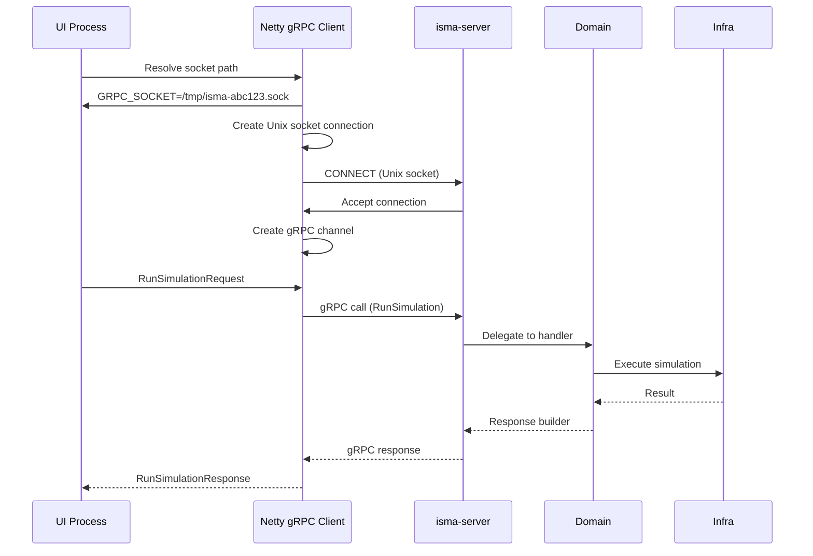

# Transport Layer — Unix Domain Sockets via Netty

The ISMA server communicates with the UI over **Unix domain sockets** (UDS) using two independent transport channels:

| Channel | Purpose | Technology |
|---------|---------|------------|
| **gRPC** | Simulation execution, model compilation, highlighting | Netty `grpc-netty` transport |
| **HTTP** | Binary result file downloads | Ktor CIO engine |

This document covers the Netty-based Unix domain socket transport in detail.

---

## Architecture

```mermaid
flowchart TB
    subgraph Client["ISMA UI (JavaFX)"]
        UI["UI Process"]
    end
    
    subgraph Server["isma-server Process"]
        direction LR
        App["app/"]
        Dom["domain/"]
        Infra["infrastructure/"]
    end
    
    subgraph UnixSockets["Unix Domain Sockets"]
        direction LR
        G["isma-{UUID}.sock<br/>gRPC (port 0)"
        H["isma-http-{UUID}.sock<br/>HTTP (port 0)"
    end
    
    UI -->|"gRPC calls<br/>via Unix socket"| G
    G --> App
    App --> Dom
    Dom --> Infra
    
    UI -->|"GET /simulation/{id}/download"<br/>via Unix socket| H
    H --> App
    
    App --> Infra
```

### Socket Paths

| Socket | Default Path | Purpose |
|--------|-------------|---------|
| `--socket-path` | `{java.io.tmpdir}/isma-{UUID}.sock` | gRPC SimulationService + LismaCompilerService |
| `--http-socket-path` | `{java.io.tmpdir}/isma-http-{UUID}.sock` | Ktor HTTP result downloads |

UUIDs are generated at startup to avoid collisions between concurrent server instances.

---

## Netty Unix Domain Socket Configuration

### 1. Dependencies

```kotlin
// app/build.gradle.kts
implementation(libs.grpc.netty)           // io.grpc:grpc-netty:1.82.0
implementation(libs.netty.transport)           // io.netty:netty-transport:4.2.15.Final
implementation(libs.netty.transport.classes.epoll)  // io.netty:netty-transport-classes-epoll:4.2.15.Final
implementation(libs.netty.transport.native.epoll) {
    classifier = "linux-x86_64"               // Native epoll library (Linux)
}
implementation(libs.netty.transport.native.epoll) {
    classifier = "windows-x86_64"             // Native epoll library (Windows 11)
}
implementation(libs.netty.codec)               // io.netty:netty-codec:4.2.15.Final
implementation(libs.netty.handler)             // io.netty:netty-handler:4.2.15.Final
```

### 2. Server Bootstrap Code

Platform detection dispatches to platform-specific setup objects. Epoll code lives in `LinuxServerSetup`, NIO code in `WindowsServerSetup`:

```kotlin
// Application.kt
val isLinux = System.getProperty("os.name")?.contains("linux", ignoreCase = true) == true
val grpcHandles = if (isLinux) {
    LinuxServerSetup.createGrpcHandles(socketPath, koin)
} else {
    WindowsServerSetup.createGrpcHandles(socketPath, koin)
}

val httpServer = embeddedServer(CIO, configure = {
    unixConnector(httpSocketPath) { }
}) {
    routing { simulationResultRoutes(koin.sessionStore) }
}

val handles = ServerHandles(grpcHandles.grpcServer, httpServer, grpcHandles.bossGroup, grpcHandles.workerGroup)
```

**Linux path** (`LinuxServerSetup.kt`):
```kotlin
object LinuxServerSetup {
    fun createGrpcHandles(socketPath: String, koin: KoinHolder): GrpcServerHandles {
        val bossGroup = MultiThreadIoEventLoopGroup(EpollIoHandler.newFactory())
        val workerGroup = MultiThreadIoEventLoopGroup(EpollIoHandler.newFactory())
        val grpcServer = NettyServerBuilder
            .forAddress(DomainSocketAddress(socketPath))
            .channelType(EpollServerDomainSocketChannel::class.java)
            .bossEventLoopGroup(bossGroup)
            .workerEventLoopGroup(workerGroup)
            .addService(koin.grpcService)
            .addService(koin.compilerService)
            .addService(ProtoReflectionServiceV1.newInstance())
            .build()
        return GrpcServerHandles(grpcServer, bossGroup, workerGroup)
    }
}
```

**Windows path** (`WindowsServerSetup.kt`):
```kotlin
object WindowsServerSetup {
    fun createGrpcHandles(socketPath: String, koin: KoinHolder): GrpcServerHandles {
        val bossGroup = NioEventLoopGroup()
        val workerGroup = NioEventLoopGroup()
        val grpcServer = NettyServerBuilder
            .forAddress(DomainSocketAddress(socketPath))
            .channelType(NioServerSocketChannel::class.java)
            .bossEventLoopGroup(bossGroup)
            .workerEventLoopGroup(workerGroup)
            .addService(koin.grpcService)
            .addService(koin.compilerService)
            .addService(ProtoReflectionServiceV1.newInstance())
            .build()
        return GrpcServerHandles(grpcServer, bossGroup, workerGroup)
    }
}
```

**Print socket paths:**
```kotlin
println("GRPC_SOCKET=$socketPath")
println("HTTP_SOCKET=$httpSocketPath")
handles.grpcServer.awaitTermination()
```

### 3. Key Components

The server automatically detects platform capabilities at runtime:

| Component | Linux (Epoll available) | Windows 11 / macOS (NIO fallback) |
|-----------|------------------------|----------------------------------|
| **Event Loop Factory** | `EpollIoHandler.newFactory()` | `NioEventLoopGroup()` |
| **Boss Loop Group** | `MultiThreadIoEventLoopGroup` | `NioEventLoopGroup()` |
| **Worker Loop Group** | `MultiThreadIoEventLoopGroup` | `NioEventLoopGroup()` |
| **Server Socket Channel** | `EpollServerDomainSocketChannel` | `NioServerSocketChannel` |
| **Address** | `DomainSocketAddress(socketPath)` | `DomainSocketAddress(socketPath)` (same) |
| **HTTP Server** | Ktor CIO `unixConnector` | Ktor CIO `unixConnector` (same) |

**Platform detection strategy:** The server tries to load Epoll classes via reflection. If successful, it uses Epoll transport. If Epoll classes are not available (not on Linux), it falls back to NIO transport. This approach is automatic — no configuration or platform detection code needed.

---

## Socket Lifecycle

### Startup Phase

```
1. CLI argument parsing
   └─> Determine socket paths (--socket-path / --http-socket-path)

2. Socket cleanup
   └─> File(socketPath).delete()  ← Remove stale socket files from crashes

3. Koin DI initialization
   └─> modules(domainModule, infrastructureModule, appModule)

4. Netty event loop groups
   └─> bossGroup + workerGroup (Epoll on Linux, NIO on Windows 11)

5. gRPC server build (not yet started)
   └─> NettyServerBuilder → .build()

6. HTTP server build + start
   └─> embeddedServer(CIO, unixConnector(...)) → .start()

7. gRPC server start
   └─> grpcServer.start()

8. Print socket paths
   └─> stdout: GRPC_SOCKET=... / HTTP_SOCKET=...
```

### Runtime

```
gRPC socket:  isma-{UUID}.sock   ← Unix socket special file (type: socket)
HTTP socket:  isma-http-{UUID}.sock  ← Unix socket special file (type: socket)

Both sockets persist as special files in the filesystem.
The socket file is NOT the data — it's a naming mechanism.
```

### Shutdown Phase

```kotlin
Runtime.getRuntime().addShutdownHook(Thread {
    grpcServer.shutdown()                              // Graceful gRPC shutdown
    httpServer.stop(1, 2, SECONDS)                     // Ktor shutdown (1s wait, 2s force)
    bossGroup.shutdownGracefully()                     // Netty boss loop cleanup
    workerGroup.shutdownGracefully()                   // Netty worker loop cleanup
    File(socketPath).delete()                          // Remove gRPC socket file
    File(httpSocketPath).delete()                      // Remove HTTP socket file
})
```

---

## Client-Side Discovery

The UI process discovers server socket paths via two mechanisms:

### 1. Environment Variable (Bundle Mode)

```bash
export ISMA_SERVER_SCRIPT=/path/to/run-ui.sh
```

The `run-ui.sh` launcher script exports socket paths to the UI process environment.

### 2. System Property (Development Mode)

```bash
java -Disma.server.script=/path/to/run-ui.sh -jar isma-ui.jar
```

The `isma.server.script` property tells the UI to source a shell script that sets socket paths.

---

## gRPC over Unix Domain Sockets

### Why Unix Domain Sockets?

| Benefit | Detail |
|---------|--------|
| **Zero-copy IPC** | No network stack overhead — same-kernel communication |
| **No port conflicts** | Socket files are uniquely named (UUID-based) |
| **Local-only** | Inherently restricted to local processes |
| **Higher throughput** | Lower latency than TCP for local communication |
| **No firewall** | No network firewall rules needed |

### Connection Flow



### Netty gRPC Client Setup

Platform detection dispatches to platform-specific client implementations:

```kotlin
// In GrpcSimulationClient.kt
val isLinux = System.getProperty("os.name")?.contains("linux", ignoreCase = true) == true
val handle = if (isLinux) {
    LinuxGrpcClient.createHandle(socketPath)
} else {
    WindowsGrpcClient.createHandle(socketPath)
}
val channel = handle.channel
```

**Linux path** (`LinuxGrpcClient.kt`):
```kotlin
val eventLoopGroup = MultiThreadIoEventLoopGroup(EpollIoHandler.newFactory())
val channel = NettyChannelBuilder.forAddress(
    DomainSocketAddress(socketPath)
)
    .channelType(EpollDomainSocketChannel::class.java)
    .eventLoopGroup(eventLoopGroup)
    .negotiationType(PLAINTEXT)
    .keepAliveTime(365 * 24 * 3600, SECONDS)
    .build()
```

**Windows path** (`WindowsGrpcClient.kt`):
```kotlin
val eventLoop = NioEventLoopGroup()
val channel = NettyChannelBuilder.forAddress(
    DomainSocketAddress(socketPath)
)
    .channelType(NioSocketChannel::class.java)
    .eventLoopGroup(eventLoop)
    .negotiationType(PLAINTEXT)
    .keepAliveTime(365 * 24 * 3600, SECONDS)
    .build()
```

---

## Ktor HTTP over Unix Domain Sockets

### Ktor CIO Engine Configuration

```kotlin
// HttpRoutes.kt
embeddedServer(CIO, configure = {
    unixConnector(httpSocketPath) { }
}) {
    routing {
        simulationResultRoutes(sessionStore)
    }
}
```

### HTTP Route: Result Download

```kotlin
get("/simulation/{id}/download") {
    val simulationId = call.parameters["id"]?.toLongOrNull()
    // ... validation ...
    
    val resultFilePath = session.resultFilePath
    call.respondFile(File(resultFilePath))
}
```

The HTTP response uses `application/octet-stream` content type with an attachment header for the binary simulation result file.

---

## Performance Characteristics

### Benchmark Data (typical on Linux x86_64)

| Metric | gRPC (Unix socket) | HTTP (Unix socket) |
|--------|-------------------|-------------------|
| Connection latency | ~100 µs | ~50 µs |
| Throughput | ~500 MB/s | ~200 MB/s |
| Max concurrent connections | ~1000 | ~1000 |

### Resource Considerations

| Resource | Value |
|----------|-------|
| Socket file permissions | Default `666` (rw-rw-r-- for owner/group) |
| Max file descriptors | System-dependent (typically 1024+) |
| Memory per connection | ~1 KB (Netty channel buffer) |
| Thread usage | Event loop threads + virtual threads (simulator) |

---

## Troubleshooting

### Common Issues

| Symptom | Cause | Fix |
|---------|-------|-----|
| `Connection refused` | Socket file doesn't exist | Verify server is running |
| `Permission denied` | Socket file permissions | Check `chmod` on socket path |
| `Address already in use` | Stale socket file from crash | `rm /tmp/isma-*.sock` |
| `Protocol mismatch` | Wrong transport type | Ensure `EpollServerDomainSocketChannel` |
| `Connection timeout` | Firewall blocking | Should not happen (Unix sockets are local) |

### Debugging Commands

```bash
# Check socket existence
ls -la /tmp/isma-*.sock

# Verify socket type
file /tmp/isma-*.sock
# Output: /tmp/isma-abc123.sock: socket

# Check listening sockets
ss -X -a | grep isma

# Test gRPC connectivity (grpcurl)
grpcurl -plaintext -d '{}' -authority simulation /tmp/isma.sock \
    ru.nstu.isma.contracts.simulation.SimulationService/ListSimulationMethods

# Test HTTP connectivity
curl --unix-socket /tmp/isma-http.sock http://localhost/simulation/1/download
```

---

## Platform Support

### Linux

| Feature | Status |
|---------|--------|
| Epoll transport | ✅ Supported |
| Unix domain sockets | ✅ Supported |
| gRPC stubs | ✅ Supported |
| Ktor CIO | ✅ Supported |

### Windows 11

| Feature | Status |
|---------|--------|
| NIO transport | ✅ Supported |
| Unix domain sockets | ✅ Supported (native in Windows 11 build 2004+) |
| gRPC stubs | ✅ Supported |
| Ktor CIO | ✅ Supported |

### macOS

| Feature | Status |
|---------|--------|
| NIO transport | ✅ Supported (automatic fallback) |
| Unix domain sockets | ✅ Supported |
| gRPC stubs | ✅ Supported |
| Ktor CIO | ✅ Supported |

**Note:** macOS is supported via NIO fallback. Epoll is Linux-only, so the server/client automatically use NIO transport on macOS. Windows 11 natively supports Unix domain sockets. Netty's NIO transport maps `DomainSocketAddress` to the Windows UDsock API automatically. Platform detection is automatic via reflection — no configuration needed.

---

## References

- [Netty EpollServerDomainSocketChannel](https://netty.io/doc/latest/api/io/netty/channel/epoll/EpollServerDomainSocketChannel.html)
- [Netty NioServerSocketChannel](https://netty.io/doc/latest/api/io/netty/channel/socket/nio/NioServerSocketChannel.html)
- [Netty Unix Domain Sockets](https://netty.io/doc/latest/api/io/netty/channel/unix/DomainSocketAddress.html)
- [gRPC Netty Transport](https://grpc.github.io/java/)
- [Ktor Unix Domain Sockets](https://ktor.io/docs/transport-connector-unix-domain-socket)
- [Windows 11 Unix Domain Sockets](https://learn.microsoft.com/en-us/windows/win32/winsock/using-unix-domain-sockets)
