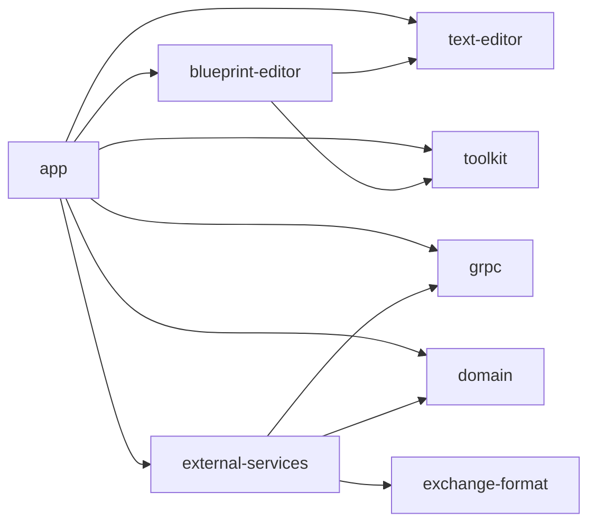
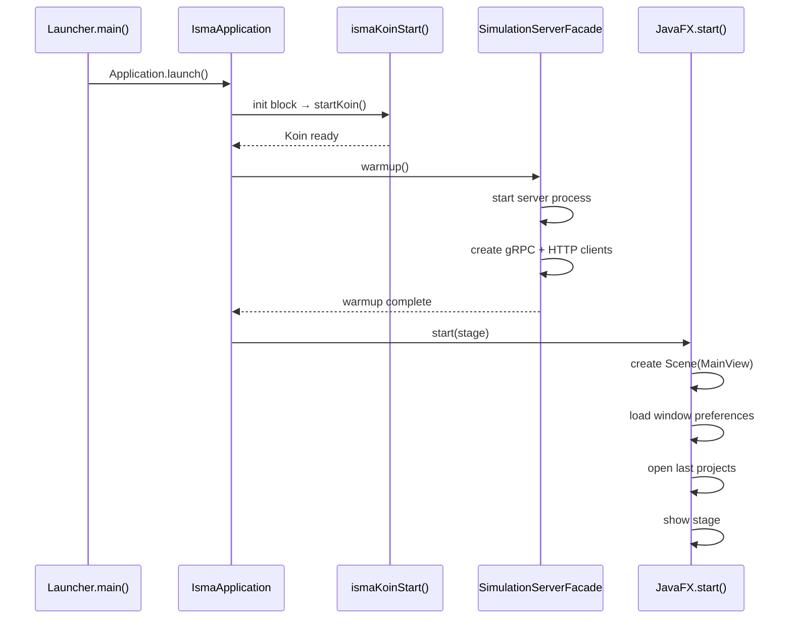

# ISMA-UI Architecture

## Purpose

ISMA-UI is a multi-module JavaFX desktop application that provides editing, simulation, and visualization capabilities for the ISMA mathematical modeling environment. It follows a layered architecture: domain models (pure Kotlin) → external services (gRPC/HTTP clients) → app layer (views, services, models) with Koin dependency injection wiring the layers together.

## Module Structure

```
isma-ui/
├── app/                          # Main application entry point
│   └── src/main/kotlin/ru/isma/next/app/
│       ├── launcher/             # IsmaApplication, Koin DI root, GrinProcessLauncher
│       ├── models/               # UI models (projects, simulation, preferences)
│       ├── services/             # Business logic services
│       ├── viewmodels/           # Plain JavaFX property-based view models for settings
│       ├── views/                # JavaFX UI components (MainView, toolbars, settings)
│       ├── utilities/            # BlueprintModel extensions (convertToLisma)
│       ├── extensions/           # ButtonExtensions.kt (Ikonli helpers removed)
│       └── constants/            # File extension constants, preferences paths
├── domain/                       # Pure Kotlin domain models (no UI deps)
├── external-services/            # gRPC clients, HTTP client, server manager
├── grpc/                         # Generated gRPC stubs
├── text-editor/                  # Rich text editor with syntax highlighting
├── blueprint-editor/             # Visual statechart editor
└── toolkit/                      # Shared JavaFX utilities
```

## Dependency Graph



The `app` module depends on all other isma-ui modules. `external-services` depends on `grpc` and `domain`. The `domain` module is the leaf — pure Kotlin with only kotlinx-coroutines as a dependency.

## Design Principles

### Separation of Concerns

- **Domain layer** — No UI dependencies. Pure data classes and interfaces for simulation results, progress, and metadata.
- **External services** — No JavaFX. gRPC stubs, HTTP client, and server process management are all plain Kotlin.
- **Text editor / Blueprint editor** — Reusable editor components injected into project models.
- **App layer** — Wires everything together. Views observe services; services consume external services and domain models.

### Koin Dependency Injection

All services and UI components are instantiated through Koin. There are no constructors called manually outside the DI root. The DI hierarchy follows module boundaries:

```
simulationServerModule → appServicesModule → grinProcessLauncherModule
    → editorModule → lismaTextEditorModule → blueprintEditorModule
    → toolbarsModule → editorTabPaneModule → settingsPanelModule → mainViewModule
```

Service-layer DI modules are defined in `di/serviceModules.kt` (replacing the old `services/koin/KoinExtentions.kt`). View-layer DI modules are in `di/viewModules.kt` (replacing `views/koin/KoinExtensions.kt`).

Scoped DI is used for project-specific editors: each `LismaProjectModel` and `BlueprintProjectModel` gets its own Koin scope with scoped `IsmaTextEditor` instances that are cleaned up on `dispose()`.

### Coroutine-Based Concurrency

JavaFX's single-threaded UI model is respected through `Dispatchers.JavaFx` coroutine context. Long-running operations (simulation monitoring, CSV export) run on `Dispatchers.IO` or a virtual-thread-backed dispatcher, with results marshalled back to the JavaFX thread via `Platform.runLater` or `withContext(Dispatchers.JavaFx)`.

Simulation execution uses a global `CoroutineScope` backed by `Executors.newVirtualThreadPerTaskExecutor().asCoroutineDispatcher()` with `SupervisorJob()`. Each simulation runs as an independent coroutine in this scope (`SimulationTaskService.SimulationScope`), allowing concurrent simulation runs without cancellation propagation.

### Observable Collections

UI state is managed through JavaFX `ObservableList` and `ObservableSet` collections, bridged to coroutine `Flow` via `addedAsFlow()` and `changeAsFlow()` extensions from the toolkit module.

## Application Startup Flow



## Key Interfaces

### IProjectModel

Defined in [`IProjectModel.kt`](app/src/main/kotlin/ru/isma/next/app/models/projects/IProjectModel.kt). Two implementations: `LismaProjectModel` and `BlueprintProjectModel`, both implementing `KoinScopeComponent` for per-project DI scoping.

### SimulationTask

Defined in [`SimulationTask.kt`](app/src/main/kotlin/ru/isma/next/app/models/simulation/SimulationTask.kt). Tracks lifecycle state through `ObjectProperty<SimulationTaskStatus>` with a global `ALL` observable list shared across `SimulationTaskService`, `TasksPopOver`, and `SimulationResultService`.

### SimulationService

Defined in [`SimulationService.kt`](app/src/main/kotlin/ru/isma/next/app/services/simulation/SimulationService.kt). 36-line thin coordinator that delegates to `SimulationTaskService`. See [`ui-components/02-services.md`](ui-components/02-services.md) for the full simulation pipeline.

### SimulationTaskService

Defined in [`SimulationTaskService.kt`](app/src/main/kotlin/ru/isma/next/app/services/simulation/SimulationTaskService.kt). 151 lines. Owns the `tasks` list and manages the 4-phase lifecycle (compile → run → monitor → download). Full algorithm in [`ui-components/02-services.md`](ui-components/02-services.md).

## Architecture Decisions

### Why Koin over constructor injection
Koin provides a visible DI graph, scoped instances per project, and avoids verbose constructor chains across 7 modules. Constructor injection would require passing 10+ dependencies through every layer.

### Why virtual threads for simulation
`Executors.newVirtualThreadPerTaskExecutor()` enables concurrent simulation runs without managing a bounded thread pool. Each simulation is an independent coroutine in a `SupervisorJob` scope.

### Why `SupervisorJob` for simulation scope
Prevents cancellation propagation between concurrent simulations. If one simulation fails, it does not cancel other running simulations.

### Why server-driven syntax highlighting
Centralized grammar in the server avoids duplicating tokenization logic in the UI. The UI receives token positions and kinds via gRPC, then applies CSS class-based styling.

### Why `BlueprintViewAdapter` abstraction
Decouples the blueprint editor ViewModel from JavaFX types, enabling framework-independent logic. The concrete `JavaFxBlueprintViewAdapter` delegates to JavaFX `Pane.children` and `Tab` creation.
