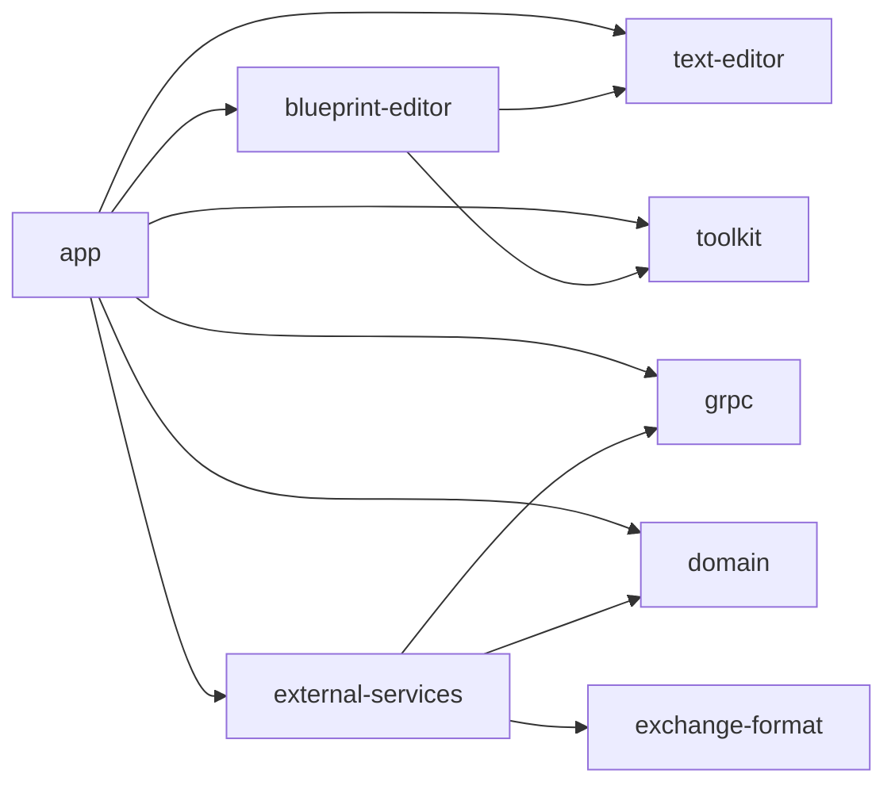
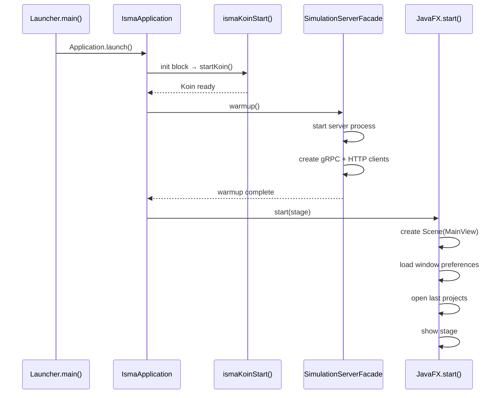

# ISMA-UI Architecture Overview

## Purpose

ISMA-UI is a multi-module JavaFX desktop application that provides editing, simulation, and visualization capabilities for the ISMA mathematical modeling environment. It follows a layered architecture: domain models (pure Kotlin) → external services (gRPC/HTTP clients) → app layer (views, services, models) with Koin dependency injection wiring the layers together.

## Module Structure

```
isma-ui/
├── app/                          # Main application entry point
│   └── src/main/kotlin/ru/isma/next/app/
│       ├── launcher/             # IsmaApplication, Koin DI root, GrinProcessLauncher
│       ├── models/               # UI models (projects, simulation, preferences)
│       ├── services/             # Business logic services
│       ├── viewmodels/           # TornadoFX view models
│       ├── views/                # JavaFX UI components (MainView, toolbars, settings)
│       ├── utilities/            # BlueprintModel extensions (convertToLisma)
│       ├── extentions/           # Ikonli icon helpers, TornadoFX binding helpers
│       └── constants/            # File extension constants, preferences paths
├── domain/                       # Pure Kotlin domain models (no UI deps)
├── external-services/            # gRPC clients, HTTP client, server manager
├── grpc/                         # Generated gRPC stubs
├── text-editor/                  # Rich text editor with syntax highlighting
├── blueprint-editor/             # Visual statechart editor
└── toolkit/                      # Shared JavaFX utilities
```

## Dependency Graph



The `app` module depends on all other isma-ui modules. `external-services` depends on `grpc` and `domain`. The `domain` module is the leaf — pure Kotlin with only kotlinx-coroutines as a dependency.

## Design Principles

### Separation of Concerns

- **Domain layer** — No UI dependencies. Pure data classes and interfaces for simulation results, progress, and metadata.
- **External services** — No JavaFX. gRPC stubs, HTTP client, and server process management are all plain Kotlin.
- **Text editor / Blueprint editor** — Reusable editor components injected into project models.
- **App layer** — Wires everything together. Views observe services; services consume external services and domain models.

### Koin Dependency Injection

All services and UI components are instantiated through Koin. There are no constructors called manually outside the DI root. The DI hierarchy follows module boundaries:

```
simulationServerModule → appServicesModule → grinProcessLauncherModule
    → editorModule → lismaTextEditorModule → blueprintEditorModule
    → toolbarsModule → editorTabPaneModule → settingsPanelModule → mainViewModule
```

Scoped DI is used for project-specific editors: each `LismaProjectModel` and `BlueprintProjectModel` gets its own Koin scope with scoped `IsmaTextEditor` instances that are cleaned up on `dispose()`.

### Coroutine-Based Concurrency

JavaFX's single-threaded UI model is respected through `Dispatchers.JavaFx` coroutine context. Long-running operations (simulation monitoring, CSV export) run on `Dispatchers.IO` or a virtual-thread-backed dispatcher, with results marshalled back to the JavaFX thread via `Platform.runLater` or `withContext(Dispatchers.JavaFx)`.

### Observable Collections

UI state is managed through JavaFX `ObservableList` and `ObservableSet` collections, bridged to coroutine `Flow` via `addedAsFlow()` and `changeAsFlow()` extensions from the toolkit module.

## Application Startup Flow



## Key Interfaces

### IProjectModel

Defined in `app/src/main/kotlin/.../models/projects/IProjectModel.kt`:

```kotlin
interface IProjectModel {
    var name: String
    var file: File?
    val editor: Node
    fun nameProperty(): SimpleStringProperty
    fun snapshot(): LismaTextModel
    fun dispose()
}
```

Two implementations exist:
- `LismaProjectModel` — text-based LISMA projects, backed by `LismaProjectDataProvider` in a Koin scope
- `BlueprintProjectModel` — visual statechart projects, backed by `BlueprintProjectDataProvider`

Both implement `KoinScopeComponent` for per-project DI scoping.

### InProgressSimulationModel

Tracks running simulations with JavaFX `SimpleDoubleProperty` progress binding. Progress updates flow from `SimulationService.SimulationScope` → `Platform.runLater` → `progressProperty` → bound UI (e.g. `SimulationProcessBar`).

```kotlin
class InProgressSimulationModel(
    val id: Int,
    val model: String,
    val parameters: SimulationParametersModel
) {
    private var actualProgress = 0.0

    var simulationId: Long? = null

    val progressProperty = SimpleDoubleProperty(actualProgress)

    fun commitProgress(value: Double) {
        Platform.runLater {
            progressProperty.set(value)
        }
    }
}
```
