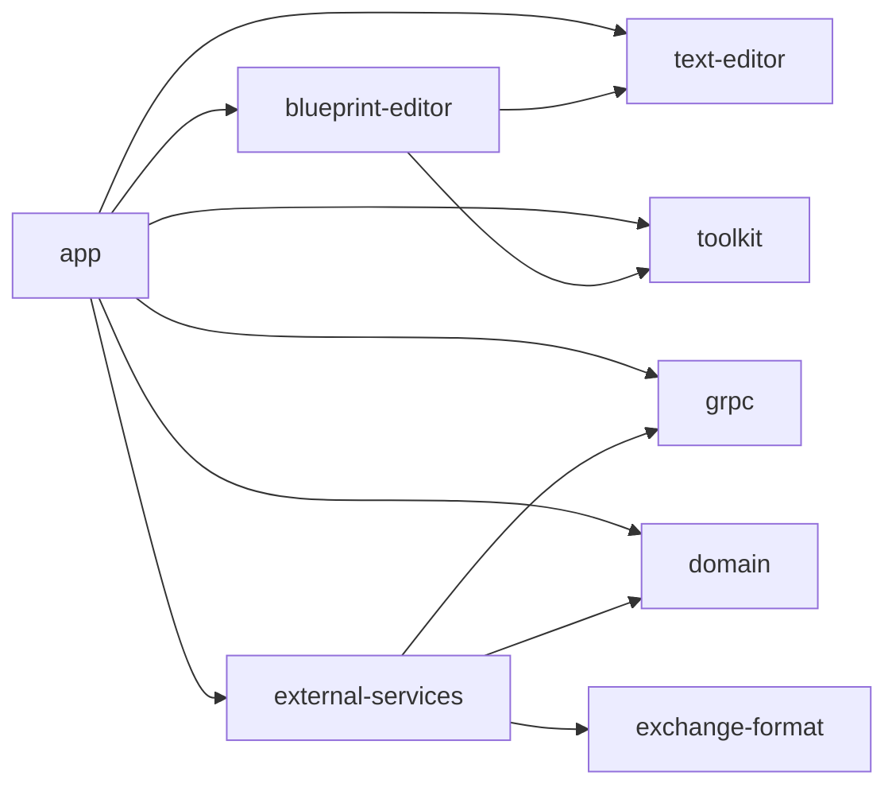
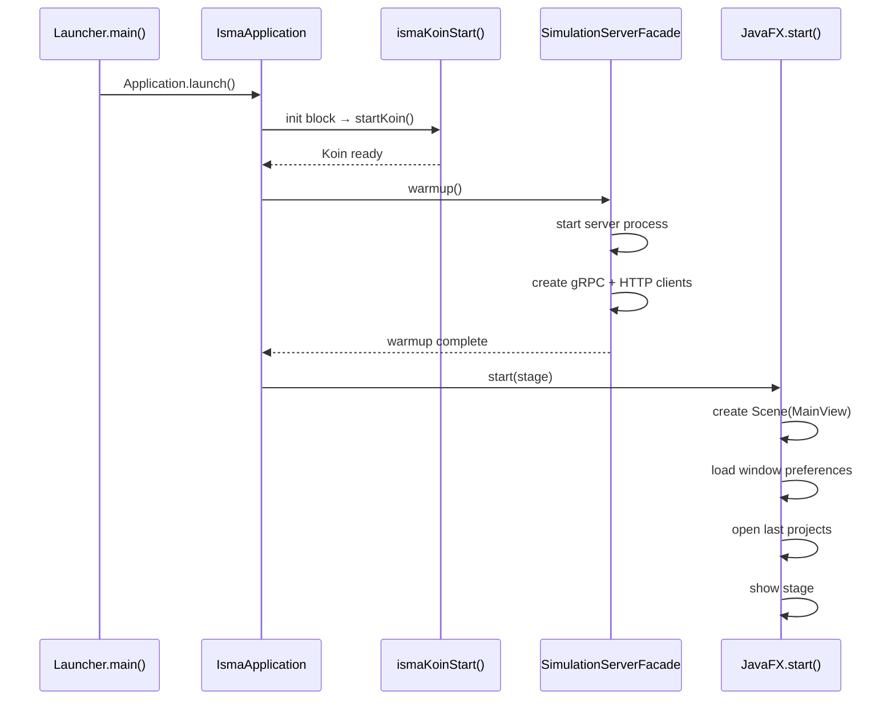

# ISMA-UI Architecture Overview

## Purpose

ISMA-UI is a multi-module JavaFX desktop application that provides editing, simulation, and visualization capabilities for the ISMA mathematical modeling environment. It follows a layered architecture: domain models (pure Kotlin) → external services (gRPC/HTTP clients) → app layer (views, services, models) with Koin dependency injection wiring the layers together.

## Module Structure

```
isma-ui/
├── app/                          # Main application entry point
│   └── src/main/kotlin/ru/isma/next/app/
│       ├── launcher/             # IsmaApplication, Koin DI root, GrinProcessLauncher
│       ├── models/               # UI models (projects, simulation, preferences)
│       ├── services/             # Business logic services
│       ├── viewmodels/           # Plain JavaFX property-based view models for settings
│       ├── views/                # JavaFX UI components (MainView, toolbars, settings)
│       ├── utilities/            # BlueprintModel extensions (convertToLisma)
│       ├── extensions/           # ButtonExtensions.kt (Ikonli helpers removed)
│       └── constants/            # File extension constants, preferences paths
├── domain/                       # Pure Kotlin domain models (no UI deps)
├── external-services/            # gRPC clients, HTTP client, server manager
├── grpc/                         # Generated gRPC stubs
├── text-editor/                  # Rich text editor with syntax highlighting
├── blueprint-editor/             # Visual statechart editor
└── toolkit/                      # Shared JavaFX utilities
```

## Dependency Graph



The `app` module depends on all other isma-ui modules. `external-services` depends on `grpc` and `domain`. The `domain` module is the leaf — pure Kotlin with only kotlinx-coroutines as a dependency.

## Design Principles

### Separation of Concerns

- **Domain layer** — No UI dependencies. Pure data classes and interfaces for simulation results, progress, and metadata.
- **External services** — No JavaFX. gRPC stubs, HTTP client, and server process management are all plain Kotlin.
- **Text editor / Blueprint editor** — Reusable editor components injected into project models.
- **App layer** — Wires everything together. Views observe services; services consume external services and domain models.

### Koin Dependency Injection

All services and UI components are instantiated through Koin. There are no constructors called manually outside the DI root. The DI hierarchy follows module boundaries:

```
simulationServerModule → appServicesModule → grinProcessLauncherModule
    → editorModule → lismaTextEditorModule → blueprintEditorModule
    → toolbarsModule → editorTabPaneModule → settingsPanelModule → mainViewModule
```

Service-layer DI modules are defined in `di/serviceModules.kt` (replacing the old `services/koin/KoinExtentions.kt`). View-layer DI modules are in `di/viewModules.kt` (replacing `views/koin/KoinExtensions.kt`).

Scoped DI is used for project-specific editors: each `LismaProjectModel` and `BlueprintProjectModel` gets its own Koin scope with scoped `IsmaTextEditor` instances that are cleaned up on `dispose()`.

### Coroutine-Based Concurrency

JavaFX's single-threaded UI model is respected through `Dispatchers.JavaFx` coroutine context. Long-running operations (simulation monitoring, CSV export) run on `Dispatchers.IO` or a virtual-thread-backed dispatcher, with results marshalled back to the JavaFX thread via `Platform.runLater` or `withContext(Dispatchers.JavaFx)`.

Simulation execution uses a global `CoroutineScope` backed by `Executors.newVirtualThreadPerTaskExecutor().asCoroutineDispatcher()` with `SupervisorJob()`. Each simulation runs as an independent coroutine in this scope (`SimulationTaskService.SimulationScope`), allowing concurrent simulation runs without cancellation propagation.

### Observable Collections

UI state is managed through JavaFX `ObservableList` and `ObservableSet` collections, bridged to coroutine `Flow` via `addedAsFlow()` and `changeAsFlow()` extensions from the toolkit module.

## Application Startup Flow



## Key Interfaces

### IProjectModel

Defined in `app/src/main/kotlin/.../models/projects/IProjectModel.kt`:

```kotlin
interface IProjectModel {
    var name: String
    var file: File?
    val editor: Node
    fun nameProperty(): SimpleStringProperty
    fun snapshot(): LismaTextModel
    fun dispose()
}
```

Two implementations exist:
- `LismaProjectModel` — text-based LISMA projects, backed by `LismaProjectDataProvider` in a Koin scope
- `BlueprintProjectModel` — visual statechart projects, backed by `BlueprintProjectDataProvider`

Both implement `KoinScopeComponent` for per-project DI scoping.

### SimulationTask

Tracks running, completed, failed, and cancelled simulations. Replaced the old `InProgressSimulationModel`.

```kotlin
enum class SimulationTaskStatus { RUNNING, COMPLETED, FAILED, CANCELLED }

class SimulationTask(
    val id: Long,
    val modelName: String,
    val parameters: SimulationParametersModel,
    initialStatus: SimulationTaskStatus = SimulationTaskStatus.RUNNING,
) {
    val status: ObjectProperty<SimulationTaskStatus>
    val progress: DoubleProperty
    val error: ObjectProperty<String?>
    var result: CompletedSimulationModel? = null

    companion object {
        val ALL = FXCollections.observableArrayList<SimulationTask>()
    }
}
```

- `status` — tracks lifecycle state (RUNNING → COMPLETED/FAILED/CANCELLED)
- `progress` — normalized 0.0–1.0, updated by `SimulationTaskService` via `Platform.runLater`
- `error` — set on failure, displayed in `TasksPopOver`
- `result` — populated when status becomes COMPLETED
- `ALL` — global observable list, shared across `SimulationTaskService`, `TasksPopOver`, and `SimulationResultService`

### SimulationService (thin wrapper)

The `SimulationService` class is now a 36-line thin coordinator that delegates to `SimulationTaskService`. It snapshots parameters, resolves the active project, and calls `SimulationTaskService.submit()`.

```kotlin
class SimulationService(
    private val projectService: ProjectService,
    private val simulationTaskService: SimulationTaskService,
    private val simulationParametersService: SimulationParametersService,
) : KoinComponent {
    fun simulate() { ... }
    fun stopSimulation(task: SimulationTask) { simulationTaskService.cancelTask(task) }
    companion object { val SimulationScope = SimulationTaskService.SimulationScope }
}
```

### SimulationTaskService (full lifecycle)

The complete simulation pipeline moved to `SimulationTaskService` (151 lines). It owns the `tasks` list and manages the 4-phase lifecycle:

1. **Compile** — `serverFacade.compileModel(sourceCode)`, populates `ModelErrorService`
2. **Run** — `serverFacade.runSimulation(runParams)`, adds task to `tasks` list
3. **Monitor** — `serverFacade.monitorSimulation(id)` flow → `task.setProgress(normalized)`
4. **Download** — `serverFacade.downloadResultToCache(id)` → creates `CompletedSimulationModel` → sets `task.result` and `task.setStatus(COMPLETED)`

All UI updates go through `Platform.runLater`. The coroutine scope uses Java 21 virtual threads (`Executors.newVirtualThreadPerTaskExecutor()`).
