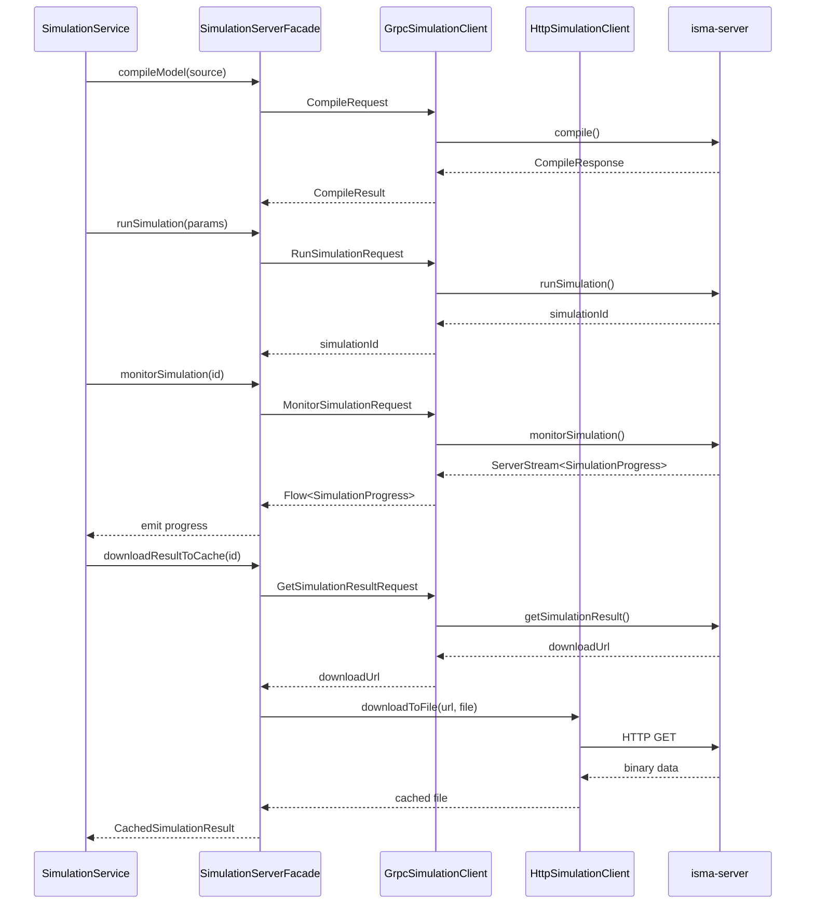

# External Services

## Purpose

The `external-services` module handles all communication with the ISMA server process. It manages the server's lifecycle (start/stop as a child JVM process), provides gRPC clients over Unix Domain Sockets (Netty Epoll), an HTTP client over Unix sockets (Ktor CIO) for result file downloads, and a facade that orchestrates these clients into high-level operations.

## Structure

```
external-services/src/main/kotlin/ru/isma/next/external/
├── BinaryEquationIndexProvider.kt
├── BinaryFilePointProvider.kt
├── GrpcLismaCompilerClient.kt
├── GrpcSimulationClient.kt
├── HttpSimulationClient.kt
├── RunSimulationParams.kt
├── SimulationServerFacade.kt
└── SimulationServerManager.kt
```

## Module Configuration

**File:** `external-services/build.gradle.kts`

```kotlin
plugins {
    alias(libs.plugins.kotlin.jvm)
    alias(libs.plugins.java.modules)
}

dependencies {
    implementation(project(":isma-ui:grpc"))
    implementation(project(":isma-ui:domain"))
    implementation(project(":isma-jvm-lib:exchange-format"))

    implementation(libs.grpc.netty)
    implementation(libs.grpc.protobuf)
    implementation(libs.grpc.stub)
    implementation(libs.protobuf.java)
    implementation(libs.kotlinx.coroutines.core)
    implementation(libs.slf4j.api)

    implementation(libs.ktor.client.core)
    implementation(libs.ktor.client.cio)
    implementation(libs.kotlinx.io.core)

    implementation(libs.netty.transport)
    implementation(libs.netty.transport.classes.epoll)
    implementation(libs.netty.transport.native.epoll) {
        artifact { classifier = "linux-x86_64" }
    }
}
```

## Server Lifecycle

### SimulationServerManager

**File:** `SimulationServerManager.kt`

Manages the isma-server child process. The script path is resolved from environment variable `ISMA_SERVER_SCRIPT` or system property `isma.server.script`.

```kotlin
class SimulationServerManager(
    private val scriptPath: String = resolveServerScriptPath(),
) {
    data class SocketPaths(val grpc: String, val http: String)

    fun start(): SocketPaths
    fun stop()
}
```

**Startup protocol:**

1. `ProcessBuilder(scriptPath).redirectErrorStream(true).start()` launches the server
2. Reads stdout line-by-line, skipping `WARNING:`, `SLF4J:`, blank, and log-prefixed lines
3. Expects the first non-skipped line to be `Starting gRPC server on Unix socket: <path>`
4. Extracts gRPC socket path and HTTP socket path (line containing `HTTP_SOCKET=<path>`)
5. Returns `SocketPaths(grpc, http)`

```kotlin
fun start(): SocketPaths {
    if (running) return socketPaths!!

    process = ProcessBuilder(scriptPath)
        .redirectErrorStream(true)
        .start()

    val reader = process!!.inputStream.bufferedReader()
    val lines = mutableListOf<String>()

    while (lines.size < 4) {
        val line = reader.readLine() ?: break
        if (line.startsWith("WARNING:") || line.startsWith("SLF4J:") || line.isBlank()) continue
        if (line.contains(" INFO ") || line.contains(" WARN ")) continue
        lines.add(line)
    }

    val grpcSocket = lines[0].substringAfter(": ").trim()
    val httpSocket = lines.find { it.startsWith("HTTP_SOCKET=") }
        ?.substringAfter("=")?.trim()
        ?: throw IllegalStateException("HTTP socket not found")

    socketPaths = SocketPaths(grpc = grpcSocket, http = httpSocket)
    running = true
    Runtime.getRuntime().addShutdownHook(Thread { stop() })
    return socketPaths!!
}
```

A shutdown hook registers `stop()` to ensure the server process is destroyed on JVM exit.

### SimulationServerFacade

**File:** `SimulationServerFacade.kt`

The facade orchestrates the three client connections. It's initialized lazily via `warmup()` called from `IsmaApplication.init`.

```kotlin
class SimulationServerFacade(
    private val serverManager: SimulationServerManager,
) {
    private lateinit var grpcClient: GrpcSimulationClient
    private lateinit var httpClient: HttpSimulationClient
    private lateinit var compilerClient: GrpcLismaCompilerClient

    fun warmup()
    fun shutdown()
}
```

**Methods:**

| Method | Client | Description |
| --- | --- | --- |
| `warmup()` | — | Starts server, creates all 3 clients |
| `compileModel(String)` | `compilerClient` | Compiles LISMA source, returns `CompileResult` |
| `validateModel(String)` | `compilerClient` | Validates LISMA source, returns `ValidationResult` |
| `highlightSource(String)` | `compilerClient` | Tokenizes source for syntax highlighting |
| `deleteCompiledModel(String)` | `compilerClient` | Removes compiled model from server cache |
| `runSimulation(RunSimulationParams)` | `grpcClient` | Starts simulation, returns `simulationId` |
| `monitorSimulation(Long, Double)` | `grpcClient` | Returns `Flow<SimulationProgress>` |
| `downloadResultToCache(Long)` | `grpcClient` + `httpClient` | Gets download URL, downloads to temp file |
| `cancelSimulation(Long)` | `grpcClient` | Cancels running simulation |
| `getSimulationMethods()` | `grpcClient` | Lists available integration methods |
| `shutdown()` | All | Shuts down clients and server process |

**DTOs defined in the facade:**

```kotlin
data class CachedSimulationResult(val file: File, val columnNames: List<String>)
data class CompileResult(val modelId: String, val errors: List<CompilationErrorDto>, val warnings: List<String>)
data class ValidationResult(val errors: List<CompilationErrorDto>, val warnings: List<String>)
data class CompilationErrorDto(val row: Int, val column: Int, val message: String)

enum class SyntaxTokenKind { UNSPECIFIED, KEYWORD, COMMENT, NUMBER, TEXT }
data class SyntaxTokenDto(val start: Int, val length: Int, val kind: SyntaxTokenKind)
```

## gRPC Clients

### GrpcSimulationClient

**File:** `GrpcSimulationClient.kt`

Netty gRPC client using Linux Epoll for Unix Domain Socket transport.

```kotlin
class GrpcSimulationClient(socketPath: String) {
    private val eventLoopGroup = MultiThreadIoEventLoopGroup(EpollIoHandler.newFactory())

    private val channel: ManagedChannel = NettyChannelBuilder
        .forAddress(DomainSocketAddress(socketPath))
        .channelType(EpollDomainSocketChannel::class.java)
        .eventLoopGroup(eventLoopGroup)
        .negotiationType(NegotiationType.PLAINTEXT)
        .keepAliveTime(365 * 24 * 3600, TimeUnit.SECONDS)
        .build()

    val blockingStub = SimulationServiceGrpc.newBlockingStub(channel)

    fun shutdown() {
        channel.shutdown()
        eventLoopGroup.shutdownGracefully()
    }
}
```

Uses a 1-year keepalive interval (effectively disabled) since the channel lives for the application lifetime.

### GrpcLismaCompilerClient

**File:** `GrpcLismaCompilerClient.kt`

Same Epoll/Unix socket setup, communicates with `LismaCompilerServiceGrpc` for compile, validate, and highlight operations.

## HTTP Client

### HttpSimulationClient

**File:** `HttpSimulationClient.kt`

Ktor CIO HTTP client for downloading simulation result files over Unix Domain Sockets. Used exclusively by `downloadResultToCache()` — the gRPC client returns a download URL, and the HTTP client fetches the binary file.

## Data Providers

### BinaryFilePointProvider

**File:** `BinaryFilePointProvider.kt`

Implements `SimulationResultReader`. Reads binary simulation results using `ru.isma.next.exchange.format.readAllPointsSequence()` and streams as `Flow<SimulationPoint>`.

```kotlin
class BinaryFilePointProvider(
    private val file: File,
    private val columnNames: List<String>,
) : SimulationResultReader {
    override val results: Flow<SimulationPoint>
        get() = flow { /* ... */ }

    companion object {
        fun readMetadata(file: File): SimulationMetadata
    }
}
```

### BinaryEquationIndexProvider

**File:** `BinaryEquationIndexProvider.kt`

Implements `IEquationIndexProvider` by parsing column name prefixes:
- `DE_` — differential equation variables
- `AE_` — algebraic equation variables
- `f` — forcing functions

Derives equation counts and codes from the column metadata returned with the simulation result.

## Communication Flow: Simulation Run



## Error Handling

| Scenario | Behavior |
| --- | --- |
| Server script not found | `IllegalStateException` from `resolveServerScriptPath()` |
| Server produces no output | `IllegalStateException` — "isma-server started but produced no output" |
| HTTP socket not found in output | `IllegalStateException` — "HTTP socket not found in server output" |
| Empty download URL | `IllegalStateException` — "Download URL is empty" |
| gRPC failure | Propagated as gRPC `StatusException` from the blocking stub |
