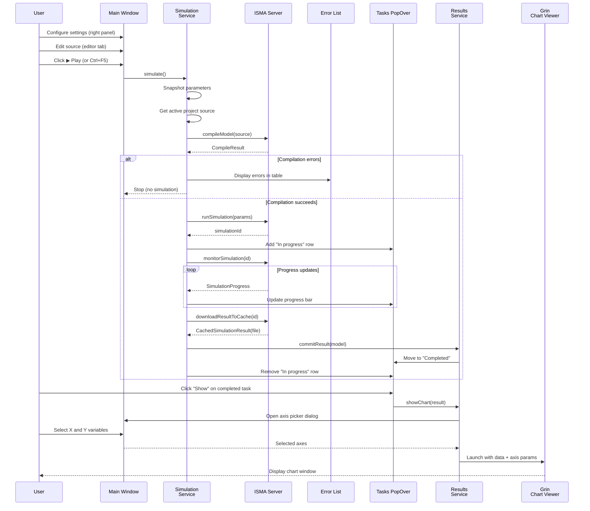
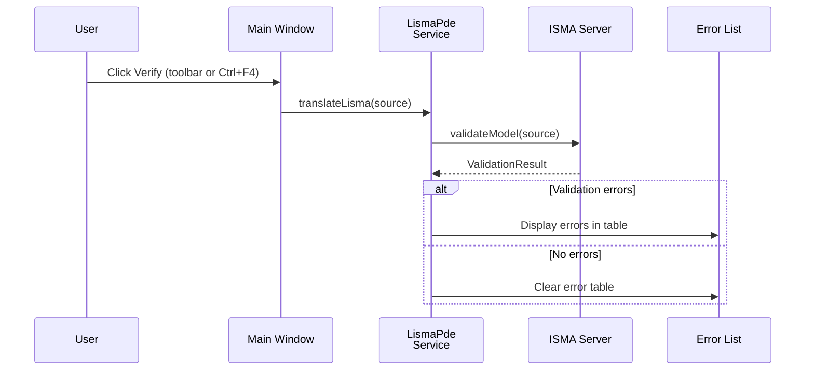
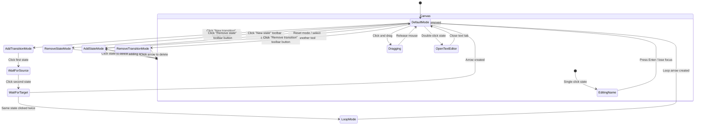

# UX Reference — ISMA UI

## Purpose

This document describes the complete user experience of the ISMA desktop application from a user-interaction perspective. It covers every window, menu, toolbar, dialog, panel, transition, and feature. Use this as a specification when implementing a replacement UI — the goal is feature parity, not framework fidelity.

## Application Shell

### Main Window Layout

```
┌────────────────────────────────────────────────────────────────────┐
│ Menu Bar: [File] [Edit] [Simulation]                              │
├────────────────────────────────────────────────────────────────────┤
│ Toolbar: [New] [Blueprint] [Open] [Save] [SaveAll] │ [Cut] [Copy] │
│          [Paste] │ [Verify] │ [Store] [Load]                      │
├──────────────────────────────────────────┬────────────────────────┤
│                                          │ ┌────────────────────┐ │
│                                          │ │ Settings Panel     │ │
│                                          │ │ [Initials]         │ │
│                                          │ │ [Integration]      │ │
│                                          │ │ [Event detection]  │ │
│                                          │ │ [Result proc.]     │ │
│                                          │ └────────────────────┘ │
│  ┌─────────────────────────────────────┐ │                        │
│  │                                     │ │                        │
│  │  Editor Area (TabPane)              │ │                        │
│  │  ┌───────────────────────────────┐  │ │                        │
│  │  │ [New project | Tab 2 | ...]   │  │ │                        │
│  │  ├───────────────────────────────┤  │ │                        │
│  │  │                               │ │ │                        │
│  │  │  Text Editor or               │ │ │                        │
│  │  │  Blueprint Canvas             │ │ │                        │
│  │  │                               │ │ │                        │
│  │  │                               │ │ │                        │
│  │  └───────────────────────────────┘  │ │                        │
│  ├─────────────────────────────────────┤ │                        │
│  │ Error List (collapsible drawer)     │ │                        │
│  │ ┌────┬────┬─────────┬───────────┐  │ │                        │
│  │ │Row │Pos │Fragment │Message    │  │ │                        │
│  │ └────┴────┴─────────┴───────────┘  │ │                        │
│  ├─────────────────────────────────────┤ │                        │
│  │ [▶ Play] [Tasks ▼]                  │ │                        │
│  └─────────────────────────────────────┘ │                        │
└──────────────────────────────────────────┴────────────────────────┘
```

**Window properties:**
- **Minimum size:** 500×600
- **Title bar:** "ISMA 22"
- **State persistence:** Position, size, and maximized state are saved between sessions

---

## Menu Bar

### File Menu

| Item | Keyboard Shortcut | Action |
|------|-------------------|--------|
| **New text** | `Ctrl+N` / `Cmd+N` | Creates a new text-based LISMA project tab named "New project" |
| **New Statechart** | `Ctrl+B` / `Cmd+B` | Creates a new blueprint (visual statechart) project tab named "New statechart" |
| **Open…** | `Ctrl+O` / `Cmd+O` | Opens a file picker dialog. Filters: `*.iscm2` (text), `*.scisma` (statechart), `*.im2` (legacy) |
| **Save** | `Ctrl+S` / `Cmd+S` | Saves the active project tab. If unsaved, prompts "Save as". |
| **Save as…** | — | Opens file picker to save the active project with a chosen filename and type |
| **Save all** | — | Saves all open project tabs |
| **Close** | — | Closes the active project tab |
| **Close all** | — | Closes all open project tabs |
| **Exit** | `Ctrl+W` / `Cmd+W` | Terminates the application |

**File format behavior:**
- `*.iscm2` — Text-based LISMA source code (plain text file)
- `*.scisma` — Blueprint statechart (JSON-encoded visual statechart model)
- `*.im2` — Legacy ISMA project (backward compatibility)

### Edit Menu

| Item | Keyboard Shortcut | Action |
|------|-------------------|--------|
| **Cut** | `Ctrl+X` / `Cmd+X` | Cut selected text from the focused editor |
| **Copy** | `Ctrl+C` / `Cmd+C` | Copy selected text to clipboard |
| **Paste** | `Ctrl+V` | Paste clipboard content into the focused editor |

**Behavior:** These commands are routed to the currently focused editor (text or blueprint). The text editor supports cut/copy/paste via the platform clipboard. The blueprint editor does not have text editing in its canvas area, so these actions apply to any focused text field within the blueprint editor (e.g., arrow predicate/alias fields).

### Simulation Menu

| Item | Keyboard Shortcut | Action |
|------|-------------------|--------|
| **Verify** | `Ctrl+F4` | Validates the active project's source code against the server's PDE translator. Errors appear in the Error List drawer. |
| **Run** | `Ctrl+F5` | Runs the simulation with current parameters (see Simulation Flow section). |
| **Store Settings…** | — | Opens file picker to save current simulation parameters as JSON (`*.params.json`) |
| **Load Settings…** | — | Opens file picker to load simulation parameters from a JSON file (`*.params.json`) |

---

## Toolbars

### Main Toolbar

Icons use Material Design glyphs. From left to right:

| # | Icon Glyph | Tooltip | Action |
|---|-----------|---------|--------|
| 1 | `add_circle_outline` | "New model" | Same as File → New text |
| 2 | `add_box` | "New statechart" | Same as File → New Statechart |
| 3 | `folder_open` | "Open model" | Same as File → Open |
| 4 | `save` | "Save current model" | Same as File → Save |
| 5 | `save_alt` | "Save all models" | Same as File → Save all |
| — | *(separator)* | — | — |
| 6 | `content_cut` | "Cut" | Same as Edit → Cut |
| 7 | `content_copy` | "Copy" | Same as Edit → Copy |
| 8 | `content_paste` | "Paste" | Same as Edit → Paste |
| — | *(separator)* | — | — |
| 9 | `check_circle` | "Verify" | Same as Simulation → Verify |
| — | *(separator)* | — | — |
| 10 | `bookmark` | "Store Settings" | Same as Simulation → Store Settings |
| 11 | `bookmark_border` | "Load Settings" | Same as Simulation → Load Settings |

### Simulation Process Bar (Bottom Bar)

Located at the bottom of the editor area, left side:

| Element | Icon/Text | Tooltip | Action |
|---------|-----------|---------|--------|
| Play button | `▶ play_arrow` | "Play" | Runs simulation (same as Simulation → Run) |
| Tasks button | "Tasks" | — | Opens the Tasks PopOver (see below) |

---

## Editor Area

### Tab-based Project Management

The central area is a tab pane. Each tab represents one open project.

**Tab behavior:**
- **New tab:** Created when user opens/creates a project via File menu or toolbar
- **Tab title:** Shows project name (derived from filename if saved, otherwise "New project" or "New statechart")
- **Tab close:** Clicking the close button (X) on a tab closes that project (same as File → Close)
- **Tab selection:** Selecting a tab makes that project the "active" project for all toolbar/menu actions
- **Multiple tabs:** Multiple projects can be open simultaneously

### Project Types

#### Text Editor Tab (LISMA source code)

A rich text editor with:
- **Font:** Consolas 12pt
- **Line numbers:** Displayed on the left margin
- **Syntax highlighting:** Server-driven — keywords (orange, bold), comments (gray, italic), numbers (blue)
- **Text editing:** Full insert/delete/cut/copy/paste via keyboard and menu
- **Content:** LISMA mathematical modeling language source code

**How it works:** The text editor component is embedded within each text project tab. Each tab has its own text content model.

#### Blueprint Editor Tab (Visual statechart)

A drag-and-drop visual canvas for building state machines:

**Canvas layout:**
- Scrollable pane with a "Diagram" tab
- Two pre-created states: **Main** (green, top-left, non-editable) and **init** (blue, below Main, non-editable, no rename)
- User-created states: Coral-colored rounded rectangles, draggable, editable names
- Transitions: Arrows connecting states with optional predicate and alias labels
- Loop transitions: Circular arrows self-connecting a state to itself

**Toolbar (at the bottom of the blueprint editor):**

| Button | Action |
|--------|--------|
| **New state** | Enter "Add state" mode — click on canvas to place a new state |
| **New transition** | Enter "Add transition" mode — click source state, then click target state |
| **Remove state** | Enter "Remove state" mode — click a state to delete it (and all its arrows) |
| **Remove transition** | Enter "Remove transition" mode — click an arrow to delete it |

**Interaction modes (mutually exclusive):**

1. **Default (drag) mode:** Drag states to reposition them on the canvas
2. **Add state mode:** Click any position on the canvas to place a new state
3. **Add transition mode:** Click a source state, then click a target state. If the same state is clicked twice, a loop (self-transition) is created.
4. **Remove state mode:** Click any state to delete it along with all associated arrows
5. **Remove transition mode:** Click any transition arrow to delete it

**State box details:**
- **Shape:** Rounded rectangle (arc radius 20px), width 110px, height 65px
- **Colors:** Main state = LightGreen, init state = LightBlue, user states = Coral (default fill)
- **Name editing:** Single-click a state to enter inline name-edit mode. Names must be unique across all states.
- **Double-click:** Opens a text editor tab for editing the state's content text
  - For regular states: tab named after the state (e.g., "MyState")
  - For loop transitions: tab named "{stateName} (loop)"

**Transition arrow details:**
- **Regular transition:** Straight line with arrowhead from source state center to target state center
- **Loop transition:** Circle (radius 40px) attached to the state, arrowhead returns to the state
- **Label:** Shows the predicate condition and/or alias name
- **Single-click arrow body:** Opens Edit Arrow PopOver (see below)
- **Single-click arrowhead:** Opens Edit Arrow PopOver
- **Double-click arrowhead:** Opens a text editor tab for editing loop content

**Edit Arrow PopOver:**
- Floating white card with DropShadow, positioned near the clicked arrow
- Contains two labeled text fields:
  - **"Alias (optional)"** — optional label for the transition
  - **"Predicate"** — the condition/trigger for the transition
- Changes are reflected on the arrow in real-time (bidirectional binding)
- Auto-closes when mouse exits the popover

**Blueprint-to-LISMA conversion:**
When a blueprint project is compiled/simulated, the visual statechart is automatically converted to LISMA text format:
- Main state → `state "Main" { ... }`
- Init state → `state "init" { ... }`
- Transitions → `state "predicate" { ... } from startState;`
- Loop transitions → pseudo-state pattern with `(predicate)` syntax

---

## Right Sidebar: Settings Panel

A collapsible sidebar panel on the right side of the main window. Contains 4 configurable sections for simulation parameters. Each section uses a property grid layout (label on left, control on right).

### 1. Initials (Cauchy Initials)

Controls the time range and step size for the simulation.

| Label | Control | Type | Default |
|-------|---------|------|---------|
| **Start** | Number field | Double | 0.0 |
| **End** | Number field | Double | 10.0 |
| **Step** | Number field | Double | 0.1 |

**Meaning:**
- **Start:** Initial time value (t₀) for the simulation
- **End:** Final time value (t₁) for the simulation
- **Step:** Initial integration step size

### 2. Integration

Controls the numerical integration method and its parameters.

| Label | Control | Type | Default | Disabled when |
|-------|---------|------|---------|---------------|
| **Method** | ComboBox | String (from server) | First method in list | — |
| **Accurate** | Checkbox | Boolean | false | — |
| **Accuracy** | Number field | Double | 0.1 | "Accurate" unchecked |
| **Stable** | Checkbox | Boolean | false | — |
| **Parallel** | Checkbox | Boolean | false | — |
| **Server** | Text field | String | "localhost" | "Parallel" unchecked |
| **Port** | Number field | Integer | 7890 | "Parallel" unchecked |

**Method list:** Populated dynamically from the server at startup (e.g., Euler, RK2, RK3, RK31, RK Fehlberg, RK Merson).

**Meaning:**
- **Method:** Which numerical integration algorithm to use
- **Accurate:** Whether to use adaptive accuracy control
- **Accuracy:** The tolerance value for adaptive integration (only used when Accurate is checked)
- **Stable:** Whether to use stability control during integration
- **Parallel:** Whether to run the simulation on a remote server cluster
- **Server / Port:** Target for parallel execution (only relevant when Parallel is checked)

### 3. Event Detection

Controls whether the simulation detects zero-crossing events.

| Label | Control | Type | Default | Disabled when |
|-------|---------|------|---------|---------------|
| **In use** | Checkbox | Boolean | false | — |
| **Gamma** | Number field | Double | 0.8 | "In use" unchecked |
| **Step limit** | Checkbox | Boolean | false | — |
| **Low border** | Number field | Double | 0.001 | "Step limit" unchecked |

**Meaning:**
- **In use:** Enable event detection (zero-crossing detection)
- **Gamma:** Event detection sensitivity parameter (0 < γ ≤ 1)
- **Step limit:** Enable step size limiting during event detection
- **Low border:** Minimum step size lower bound during event detection

### 4. Result Saving

Controls where simulation results are stored after completion.

| Label | Control | Type | Default |
|-------|---------|------|---------|
| **Save result** | ComboBox | Enum (MEMORY / FILE) | MEMORY |

**Options:**
- **MEMORY:** Results kept in memory only (available for chart display, not persisted to disk)
- **FILE:** Results written to a binary cache file on disk (available for chart display, CSV export, and later sessions)

### 5. Result Processing

Controls post-processing simplification of simulation results.

| Label | Control | Type | Default |
|-------|---------|------|---------|
| **Simplify** | ComboBox | String (Radial-Distance / Douglas-Peucker) | Radial-Distance |
| **Tolerance** | Number field | Double | 20.0 |

**Meaning:** Applies a line-simplification algorithm to reduce the number of data points in the result for smoother chart rendering.

---

## Bottom Area: Error List & Process Bar

### Error List Drawer

A collapsible drawer panel between the editor area and the process bar.

**Title:** "Error list"

**Table columns:**

| Column | Width | Content |
|--------|-------|---------|
| **Row** | 5% | Line number where the error occurred |
| **Position** | 5% | Character position on the line |
| **Fragment** | 10% | Name of the code fragment/region |
| **Message** | 80% | Human-readable error description |

**Populated by:**
- **Compile errors:** When "Run" is clicked, compilation errors from the server appear here
- **Verify results:** When "Verify" is clicked, validation errors appear here
- **Behavior:** Each new run/verify clears the previous error list and shows fresh errors

### Simulation Process Bar

Located at the very bottom of the window:

**Elements:**
- **▶ Play button:** Starts the simulation
- **Tasks button:** Opens the Tasks PopOver

---

## Tasks PopOver

A floating panel that opens from the "Tasks" button. Shows running and completed simulations.

### Layout

```
┌─────────────────────────────────────────┐
│ In progress                             │
│ ┌─────────────────────────────────────┐ │
│ │ Task #1  [████████░░] [✕ Abort]    │ │
│ └─────────────────────────────────────┘ │
│ ┌─────────────────────────────────────┐ │
│ │ Task #2  [██████░░░░] [✕ Abort]    │ │
│ └─────────────────────────────────────┘ │
├─────────────────────────────────────────┤
│ Completed                               │
│ ┌─────────────────────────────────────┐ │
│ │ Task #1  [Show] [Export] [Remove]   │ │
│ │            [⋯ Details]             │ │
│ └─────────────────────────────────────┘ │
│ ┌─────────────────────────────────────┐ │
│ │ Task #2  [Show] [Export] [Remove]   │ │
│ │            [⋯ Details]             │ │
│ └─────────────────────────────────────┘ │
└─────────────────────────────────────────┘
```

### In Progress Section

One row per running simulation. Each row contains:
- **Task label:** "Task #N" (auto-incrementing counter starting from 1)
- **Progress bar:** Shows normalized progress from 0% to 100%
- **Abort button:** Closes icon — cancels the running simulation on the server and removes the task

**Behavior:** New tasks appear when "Run" is clicked. Rows are removed when the simulation completes or is aborted.

### Completed Section

One row per completed simulation. Each row contains:
- **Task label:** "Task #N"
- **Show button:** Opens the chart viewer (see Results Visualization)
- **Export button:** Opens file picker to export results as CSV
- **Remove button:** Removes this entry from the list (does not delete the cached file)
- **Details button:** Chevron icon (⋯) — opens a nested PopOver with simulation metadata

### Details PopOver (nested)

Triggered by clicking the "Details" chevron button. Shows:

```
Model
Name: Project name

Cauchy Initials
Start: 0.0
End: 10.0
Initial step: 0.1

Integration Method
Method: Euler
Is accurate: true
Accuracy: 0.1
Is stable: true

Statistic
Simulation time: 1234ms
```

**Fields displayed:**
- Model name
- Cauchy initials: Start, End, Initial step
- Integration method: Method name, Accuracy status, Accuracy value (if enabled), Stability status
- Statistics: Wall-clock simulation time in milliseconds

---

## Dialogs

### Select Variables Dialog (Axis Picker)

Opens when the user clicks "Show" on a completed simulation. Used to select which axes/variables to plot.

**Title:** "Select variables"

**Layout:**

```
┌─────────────────────────────────────────┐
│ X Axis:   [━━━━━━━━━━━━━━━━━━━━━━━━━▼] │
│                                           │
│ Y Axis:   [☐ Variable 1]                │
│            [☐ Variable 2]                │
│            [☐ Variable 3]                │
│            [☐ TIME] (pre-selected)       │
│            [☐ Variable N]                │
│                                           │
│                    [Select all] [Unselect │
│                         all]              │
│                                           │
│              [Ok]          [Close]        │
└─────────────────────────────────────────┘
```

**Elements:**
- **X Axis ComboBox:** Dropdown listing all available columns. One item selectable. Default: "TIME" column pre-selected.
- **Y Axis ListView:** Scrollable list with checkboxes next to each column name. Multiple items selectable.
- **Select all:** Checks all Y-axis checkboxes
- **Unselect all:** Unchecks all Y-axis checkboxes
- **Ok:** Confirms selection and proceeds to chart visualization
- **Close:** Cancels the dialog, no chart is generated

**Behavior:**
- Only non-null items from the Y-axis list are displayed as selectable options
- TIME column is always pre-selected as the X-axis
- The "Ok" button is disabled until at least one Y-axis variable is selected (if enforced)
- On confirmation, the chart viewer launches with the selected X and Y variables

---

## Simulation Flow

### Complete User Journey: Run a Simulation



### Verify Flow



---

## File Operations

### Open Project

**Trigger:** File → Open, or toolbar `folder_open` button, or `Ctrl+O`

**Dialog behavior:**
- File picker with filters: `All ISMA Files` (`.iscm2`, `.scisma`), `LISMA Text` (`.iscm2`), `State Chart` (`.scisma`), `Legacy` (`.im2`)
- Multi-select supported (can open multiple files at once)

**After open:**
- Each file creates a new tab in the editor area
- Text files (`.iscm2`, `.im2`) → LISMA text editor tab
- Statechart files (`.scisma`) → Blueprint editor tab
- Tab name is derived from the filename (without extension)

### Save Project

**Trigger:** File → Save, or toolbar `save` button, or `Ctrl+S`

**Behavior:**
- If the project was opened from a file: overwrites the same file
- If the project is new (never saved): opens "Save as" dialog
- After save: tab title updates to the filename

### Save Project As

**Trigger:** File → Save as, or Save on an unsaved project

**Dialog behavior:**
- File picker with type filter determined by project type
- On save: project name updates to filename, file path is stored

### Save All

**Trigger:** File → Save all, or toolbar `save_alt` button

**Behavior:** Iterates through all open projects and saves each one (same logic as individual save).

### Close Project

**Trigger:** File → Close, or toolbar button (via active project), or tab close button

**Behavior:**
- Closes the current tab
- Disposes the project's resources (editor instances, Koin scope)
- If no tabs remain, the editor area is empty

### Close All

**Trigger:** File → Close all

**Behavior:** Closes all open tabs at once.

---

## Settings Persistence

### Store Settings

**Trigger:** File → Store Settings, Simulation → Store Settings, or toolbar `bookmark` button

**Dialog behavior:**
- File picker to save simulation parameters
- Default filter: "Simulation Parameters File" (`.params.json`)
- **Serialized data:** Cauchy initials, integration method params, event detection params, result saving params
- **Not serialized:** Result processing params (simplify settings)

### Load Settings

**Trigger:** File → Load Settings, Simulation → Load Settings, or toolbar `bookmark_border` button

**Dialog behavior:**
- File picker to load simulation parameters
- Default filter: "Simulation Parameters File" (`.params.json`)
- **Deserialized data:** Populates all settings panels with loaded values
- **Not loaded:** Result processing params (unchanged)

### Window Preferences

**Behavior:**
- **On startup:** Main window geometry (x, y, width, height, maximized) is restored from saved preferences
- **On exit:** Main window geometry is saved to a JSON preferences file
- **Last opened files:** Paths of recently opened projects are persisted and reloaded on startup

---

## Results Visualization

### Chart Display

**Trigger:** Tasks PopOver → Completed → "Show" button on a completed simulation

**Steps:**
1. Axis picker dialog opens (see Select Variables Dialog above)
2. User selects X-axis variable and one or more Y-axis variables
3. Grin chart viewer process is launched as a separate JVM process
4. Grin receives: result binary file path, X-axis column name, Y-axis column names
5. Grin displays an interactive chart window

**Data format:** Binary `.bin` file streamed via `BinaryFilePointProvider`. Each point contains:
- Independent variable (time/x)
- Differential equation variable values
- Algebraic equation variable values
- RHS values for DEs and AEs

### CSV Export

**Trigger:** Tasks PopOver → Completed → "Export" button on a completed simulation

**Steps:**
1. File picker opens (default filter: `*.csv`)
2. On confirmation, a background task streams the binary data and writes CSV
3. **CSV header:** `x, [DE column names], [AE column names], f0, f1, ..., fN`
   - `x` = independent variable (time)
   - DE columns = differential equation variable names from metadata
   - AE columns = algebraic equation variable names from metadata
   - `fN` = RHS values for differential equations
4. Each subsequent row = one simulation time step

**Export behavior:**
- Runs on a background coroutine (non-blocking)
- Uses `Dispatchers.IO` for I/O
- Progress is not shown during export

---

## Keyboard Shortcuts Reference

| Shortcut | Action |
|----------|--------|
| `Ctrl+N` / `Cmd+N` | New text project |
| `Ctrl+B` / `Cmd+B` | New statechart project |
| `Ctrl+O` / `Cmd+O` | Open project |
| `Ctrl+S` / `Cmd+S` | Save project |
| `Ctrl+W` / `Cmd+W` | Exit application |
| `Ctrl+X` / `Cmd+X` | Cut |
| `Ctrl+C` / `Cmd+C` | Copy |
| `Ctrl+V` | Paste |
| `Ctrl+F4` | Verify model |
| `Ctrl+F5` | Run simulation |

---

## Feature Matrix

| Feature | Location | Description |
|---------|----------|-------------|
| **Multi-project editing** | Editor tab pane | Open, create, switch, and close multiple projects simultaneously |
| **Text-based LISMA editing** | Text editor tab | Rich text editor with syntax highlighting and line numbers |
| **Visual statechart editing** | Blueprint editor tab | Drag-and-drop canvas with states, transitions, and loop transactions |
| **Remote syntax highlighting** | Text editor | Server-driven tokenization — keywords, comments, numbers colored |
| **Model compilation** | Server (via gRPC) | Compiles LISMA text or blueprint to a runnable model |
| **Model validation** | Server (via gRPC) | Validates source code without running (Verify button) |
| **Simulation execution** | Server (via gRPC) | Runs the compiled model with given parameters |
| **Real-time progress** | gRPC stream | Server pushes progress updates during simulation |
| **Simulation cancellation** | gRPC call | Stops a running simulation mid-execution |
| **Error list** | Bottom drawer | Tabular display of compilation/validation errors |
| **Simulation parameters** | Right sidebar | Configurable: time range, integration method, event detection, result storage |
| **Parameter presets** | Store/Load settings | Save and load parameter sets as JSON files |
| **Chart visualization** | Grin process | External chart viewer launched with simulation data |
| **Variable axis selection** | Select Variables dialog | Interactive picker for X and Y axes |
| **CSV export** | File export | Export simulation results to CSV format |
| **Blueprint-to-LISMA** | Automatic conversion | Visual statecharts are converted to LISMA text at compile time |
| **State content editing** | Blueprint editor | Double-click states/loops to open inline text editors |
| **Transition editing** | Blueprint editor | Edit predicate and alias via floating PopOver |
| **Window state persistence** | Preferences | Save/restore window geometry and last opened files |
| **Parallel execution** | Integration settings | Option to run simulation on a remote server cluster |
| **Result simplification** | Result processing | Line-simplification (Radial-Distance, Douglas-Peucker) for smoother charts |
| **Parameter presets** | Store/Load | Save and load simulation parameters as JSON files |
| **Clipboard propagation** | Text editor | Cut/copy/paste events propagated via coroutine SharedFlow |

---

## Blueprint Editor Interaction Model (Detailed)

### State Creation Flow



### State Box Properties

| Property | Type | Constraint |
|----------|------|------------|
| Name | String | Must be unique across all states |
| Position (X, Y) | Double | Minimum 0 for both axes |
| Content text | String | Arbitrary text, edited in separate text editor tab |
| Fill color | Paint | Coral (user), LightGreen (Main), LightBlue (init) |
| Dimensions | Width=110, Height=65 | Fixed for all user states |
| Editable | Boolean | False for Main and init states; True for user states |
| Edit button visible | Boolean | False for init state; True for all others |

### Transition Properties

| Property | Type | Constraint |
|----------|------|------------|
| Source state | StateBox reference | Required |
| Target state | StateBox reference | Required (different from source for regular, same for loop) |
| Predicate | String | Condition expression |
| Alias | String | Optional label |
| Arrowhead | Polygon | Auto-rotated to match line angle |
| Connection | Bound to state centers | Updates when states are dragged |

---

## Error Display

### ErrorViewModel Structure

| Field | Type | Description |
|-------|------|-------------|
| `row` | Int | Line number in source where the error occurred |
| `position` | Int | Character position on the line |
| `fragmentName` | String | Name of the code region/fragment |
| `message` | String | Human-readable error description |

### Error List Table

- **Type:** TableView bound to an observable list of `ErrorViewModel`
- **Columns:** Row (5%), Position (5%), Fragment (10%), Message (80%)
- **Behavior:** Cleared and repopulated on each new compile/verify operation
- **Interaction:** Clicking a row does not have a defined navigation action (future enhancement target)

---

## Architecture Notes for Re-implementation

When building a replacement UI with the same features:

1. **Separation of concerns:** The UI is cleanly layered — domain models (pure data) → services (business logic) → views (UI components) → controllers (event handlers)
2. **Server communication:** All compilation, validation, and simulation happen on a separate server process. The UI communicates via gRPC (compile, validate, run, monitor, cancel, download, highlight) and HTTP (binary result download).
3. **Multi-project:** Projects are managed in an observable set with an active project concept. Each project has its own editor and Koin scope.
4. **Observable collections:** UI state is driven by observable collections (projects, tasks, results, errors) that update the UI reactively via `addedAsFlow()` and `changeAsFlow()` extensions.
5. **Blueprint-to-text:** The blueprint editor is a visual layer that serializes to/from a LISMA text representation. The conversion happens at compile time via `BlueprintModelExenstions.convertToLisma()`, not in real-time.
6. **External processes:** Two external processes are launched by the UI:
   - ISMA Server (gRPC backend) — launched automatically on startup via `SimulationServerManager`
   - Grin Chart Viewer — launched on-demand when user clicks "Show" on results via `GrinProcessLauncher`
7. **Preferences:** Window geometry and last-opened files are persisted as JSON via `PreferencesProvider`. Simulation parameters are stored/loaded as separate JSON files by the user via `SimulationParametersService`.
8. **Syntax highlighting:** Computed server-side via `highlightSource()` gRPC call. The UI receives token positions and kinds, then applies CSS class-based styling to the rich text editor.
9. **Result format:** Binary files containing `SimulationPoint` records (x, yForDe[], rhs[][]). Column names come from server metadata. Both the chart viewer and CSV export consume this binary format via `BinaryFilePointProvider`.
10. **Clipboard propagation:** Cut/copy/paste events are propagated via `EditorPlatformService` using Kotlin `SharedFlow`, allowing the text editor to respond to platform clipboard commands from anywhere in the UI.
11. **Result simplification:** Post-processing simplification uses Radial-Distance or Douglas-Peucker algorithms to reduce data points for smoother chart rendering.
12. **Virtual thread dispatcher:** Simulation execution uses a virtual-thread-backed coroutine dispatcher with `SupervisorJob` for concurrent simulation runs.
