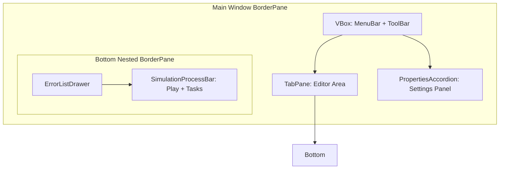
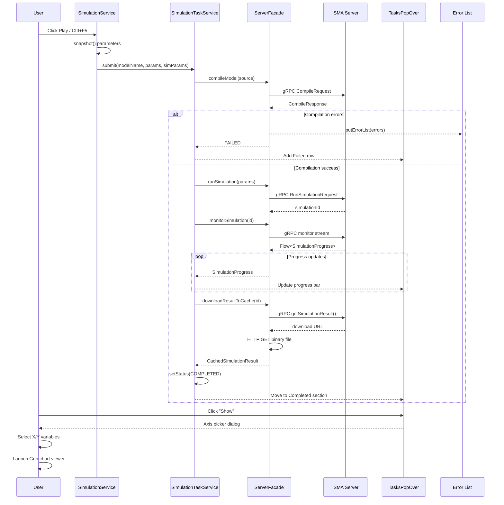
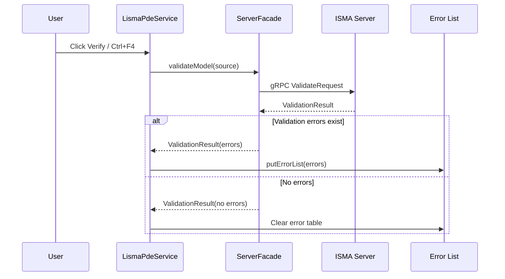

# UX Reference — ISMA UI

## Purpose

This document describes the complete user experience of the ISMA desktop application from a user-interaction perspective. It covers every window, menu, toolbar, dialog, panel, transition, and feature. Use this as a specification when implementing a replacement UI — the goal is feature parity, not framework fidelity.

## Application Shell

### Main Window Layout



The main window is a `BorderPane` with the following layout:

- **top:** A `VBox` containing the menu bar (File, Edit, Simulation menus) and the main toolbar (New, Blueprint, Open, Save, SaveAll, Cut, Copy, Paste, Verify, Store, Load buttons)
- **center:** The editor area containing a `TabPane` with tabs for each open project (text editor or blueprint canvas)
- **right:** The settings panel with sections for Initials, Integration, Event detection, and Result processing
- **bottom:** A nested `BorderPane` with the error list drawer (collapsible table with Row, Position, Fragment, Message columns) above the simulation process bar (Play button and Tasks button)

**Window properties:**
- **Minimum size:** 500×600
- **Title bar:** "ISMA 22"
- **State persistence:** Position, size, and maximized state are saved between sessions

---

## Menu Bar

### File Menu

| Item | Keyboard Shortcut | Action |
|------|-------------------|--------|
| **New text** | `Ctrl+N` / `Cmd+N` | Creates a new text-based LISMA project tab named "New project" |
| **New Statechart** | `Ctrl+B` / `Cmd+B` | Creates a new blueprint (visual statechart) project tab named "New statechart" |
| **Open…** | `Ctrl+O` / `Cmd+O` | Opens a file picker dialog. Filters: `*.iscm2` (text), `*.scisma` (statechart), `*.im2` (legacy) |
| **Save** | `Ctrl+S` / `Cmd+S` | Saves the active project tab. If unsaved, prompts "Save as". |
| **Save as…** | — | Opens file picker to save the active project with a chosen filename and type |
| **Save all** | — | Saves all open project tabs |
| **Close** | — | Closes the active project tab |
| **Close all** | — | Closes all open project tabs |
| **Exit** | `Ctrl+W` / `Cmd+W` | Terminates the application |

**File format behavior:**
- `*.iscm2` — Text-based LISMA source code (plain text file)
- `*.scisma` — Blueprint statechart (JSON-encoded visual statechart model)
- `*.im2` — Legacy ISMA project (backward compatibility)

### Edit Menu

| Item | Keyboard Shortcut | Action |
|------|-------------------|--------|
| **Cut** | `Ctrl+X` / `Cmd+X` | Cut selected text from the focused editor |
| **Copy** | `Ctrl+C` / `Cmd+C` | Copy selected text to clipboard |
| **Paste** | `Ctrl+V` | Paste clipboard content into the focused editor |

**Behavior:** These commands are routed to the currently focused editor (text or blueprint). The text editor supports cut/copy/paste via the platform clipboard. The blueprint editor does not have text editing in its canvas area, so these actions apply to any focused text field within the blueprint editor (e.g., arrow predicate/alias fields).

### Simulation Menu

| Item | Keyboard Shortcut | Action |
|------|-------------------|--------|
| **Verify** | `Ctrl+F4` | Validates the active project's source code against the server's PDE translator. Errors appear in the Error List drawer. |
| **Run** | `Ctrl+F5` | Runs the simulation with current parameters (see Simulation Flow section). |
| **Store Settings…** | — | Opens file picker to save current simulation parameters as JSON (`*.params.json`) |
| **Load Settings…** | — | Opens file picker to load simulation parameters from a JSON file (`*.params.json`) |

---

## Toolbars

### Main Toolbar

Icons use Material Design glyphs. From left to right:

| # | Icon Glyph | Tooltip | Action |
|---|-----------|---------|--------|
| 1 | `add_circle_outline` | "New model" | Same as File → New text |
| 2 | `add_box` | "New statechart" | Same as File → New Statechart |
| 3 | `folder_open` | "Open model" | Same as File → Open |
| 4 | `save` | "Save current model" | Same as File → Save |
| 5 | `save_alt` | "Save all models" | Same as File → Save all |
| — | *(separator)* | — | — |
| 6 | `content_cut` | "Cut" | Same as Edit → Cut |
| 7 | `content_copy` | "Copy" | Same as Edit → Copy |
| 8 | `content_paste` | "Paste" | Same as Edit → Paste |
| — | *(separator)* | — | — |
| 9 | `check_circle` | "Verify" | Same as Simulation → Verify |
| — | *(separator)* | — | — |
| 10 | `bookmark` | "Store Settings" | Same as Simulation → Store Settings |
| 11 | `bookmark_border` | "Load Settings" | Same as Simulation → Load Settings |

### Simulation Process Bar (Bottom Bar)

Located at the bottom of the editor area, left side:

| Element | Icon/Text | Tooltip | Action |
|---------|-----------|---------|--------|
| Play button | `▶ play_arrow` | "Play" | Runs simulation (same as Simulation → Run) |
| Tasks button | "Tasks" | — | Opens the Tasks PopOver (see below) |

---

## Editor Area

### Tab-based Project Management

The central area is a tab pane. Each tab represents one open project.

**Tab behavior:**
- **New tab:** Created when user opens/creates a project via File menu or toolbar
- **Tab title:** Shows project name (derived from filename if saved, otherwise "New project" or "New statechart")
- **Tab close:** Clicking the close button (X) on a tab closes that project (same as File → Close)
- **Tab selection:** Selecting a tab makes that project the "active" project for all toolbar/menu actions
- **Multiple tabs:** Multiple projects can be open simultaneously

### Project Types

#### Text Editor Tab (LISMA source code)

A rich text editor with:
- **Font:** Consolas 12pt
- **Line numbers:** Displayed on the left margin
- **Syntax highlighting:** Server-driven — keywords (orange, bold), comments (gray, italic), numbers (blue)
- **Text editing:** Full insert/delete/cut/copy/paste via keyboard and menu
- **Content:** LISMA mathematical modeling language source code

**How it works:** The text editor component is embedded within each text project tab. Each tab has its own text content model.

#### Blueprint Editor Tab (Visual statechart)

A drag-and-drop visual canvas for building finite-state machines. The blueprint editor follows an MVVM pattern with a canvas (Pane), toolbar (bottom), and text editor integration. States are draggable boxes with transitions (arrows) and loop transitions (self-circles). For detailed specification — state boxes, transitions, popover, toolbar modes, geometry algorithms, LISMA conversion, dimensions — see [`blueprint-editor/README.md`](blueprint-editor/README.md).

**Key behaviors:**
- **Canvas layout:** Scrollable pane with "Diagram" tab, two fixed states (Main/init), and user-created states
- **Toolbar:** New state, New transition/Stop, Remove state/Stop, Remove transition/Stop
- **Interaction modes:** Mutually exclusive — Default (drag), Add transition, Remove state, Remove transition
- **Blueprint-to-LISMA conversion:** Automatic at compile time — states become `state "Name" { ... }`, transitions become `from startState;`, loops use pseudo-state expansion

---

## Right Sidebar: Settings Panel

**Location:** Right side of the main window, occupies the full height of the content area (below the toolbars).

**Visibility:** Always visible as part of the main window layout. The panel is a `PropertiesAccordion` (from toolkit) with all sections expanded and visible simultaneously.

**Implementation:** `SettingsPanelView.kt` extends `PropertiesAccordion` and adds four sub-views, each wrapped in a `VBox` with `prefWidth = 240.0` and `styleClass = "settings-box"`. Each sub-view contains a `ScrollPane` with a `propertiesGrid` layout (label on the left, control on the right) provided by `ru.isma.javafx.extensions.controls.propertiesGrid`.

**Data flow:** The panel reads from and writes to the singleton `SimulationParametersService`, which holds five JavaFX property-based view model instances (no TornadoFX dependency). When the user clicks "Run" (▶ Play or `Ctrl+F5`), the service's `snapshot()` method captures the current view model state into a serializable `SimulationParametersModel`, which is then converted to `RunSimulationParams` and sent to the server via gRPC. The panel values are **not** live-bound to the simulation — they are only read at the moment of execution.

---

### 1. Initials (Cauchy Initials)

**Purpose:** Defines the time domain for the numerical integration. These parameters specify the interval over which the differential equations are solved.

**View:** `CauchyInitialsView` → **ViewModel:** `CauchyInitialsViewModel`

| Label | Control | Type | Default | Property |
|-------|---------|------|---------|----------|
| **Start** | Number field | Double | 0.0 | `startTimeProperty` |
| **End** | Number field | Double | 10.0 | `endTimeProperty` |
| **Step** | Number field | Double | 0.1 | `stepProperty` |

**When values are consumed:** Only when "Run" is clicked. The values are captured via `snapshot()` → `CauchyInitialsModel(startTime, endTime, initialStep)` → `RunSimulationParams`.

**Parameter details:**
- **Start (t₀):** The initial time value. The integration begins from this point. Must be less than or equal to End.
- **End (t₁):** The final time value. The integration runs until this time is reached. Must be greater than or equal to Start.
- **Step (h₀):** The initial integration step size. This is a *hint* to the integration method — adaptive methods (like RK Fehlberg) will adjust step size dynamically based on error estimates, while fixed-step methods use this value directly.

**Typical use cases:**
- **Short transient analysis:** Start=0, End=5, Step=0.01 — for observing rapid changes near t=0
- **Steady-state analysis:** Start=100, End=200, Step=0.5 — for observing system behavior after transients have settled
- **Quick verification:** Start=0, End=1, Step=1.0 — for fast check of model correctness before running full simulation

---

### 2. Integration

**Purpose:** Configures the numerical integration algorithm and its control parameters. This section determines *how* the differential equations are solved.

**View:** `MethodSettingsView` → **ViewModel:** `IntegrationMethodParametersViewModel`

| Label | Control | Type | Default | Disabled when | Bound to |
|-------|---------|------|---------|---------------|----------|
| **Method** | ComboBox | String (from server) | First method in list | — | `selectedMethodProperty` |
| **Accurate** | Checkbox | Boolean | false | — | `isAccuracyInUseProperty` |
| **Accuracy** | Number field | Double | 0.1 | "Accurate" unchecked | `accuracyProperty` |
| **Stable** | Checkbox | Boolean | false | — | `isStableInUseProperty` |
| **Parallel** | Checkbox | Boolean | false | — | `isParallelInUseProperty` |
| **Server** | Text field | String | "localhost" | "Parallel" unchecked | `serverProperty` |
| **Port** | Number field | Integer | 7890 | "Parallel" unchecked | `portProperty` |

**Method list population:** The ComboBox items come from `SimulationParametersService.integrationMethods`, which is an `ObservableList<String>` populated from the server's available integration methods at startup (e.g., Euler, RK2, RK3, RK31, RK Fehlberg, RK Merson). The list is set once during Koin DI initialization: `single { SimulationParametersService(get<SimulationServerFacade>().getSimulationMethods()) }`.

**Conditional behavior:**
- **Accuracy field:** Disabled via `disableProperty().bind(isAccuracyInUseProperty.not())` — the user cannot edit the accuracy value while adaptive accuracy is turned off. The value is still sent to the server but ignored.
- **Server / Port fields:** Disabled via `disableProperty().bind(isParallelInUseProperty.not())` — these are only relevant for parallel execution.

**When values are consumed:** At simulation start, via `snapshot()` → `IntegrationMethodParametersModel` → `RunSimulationParams`. All fields are transmitted to the server.

**Parameter details:**
- **Method:** The numerical integration algorithm. Different methods offer different trade-offs between speed and accuracy:
  - **Euler:** First-order, fastest but least accurate. Suitable for simple models where speed matters more than precision.
  - **RK2:** Second-order Runge-Kutta. Moderate accuracy and speed.
  - **RK3 / RK31:** Third-order Runge-Kutta variants. Better accuracy for smooth solutions.
  - **RK Fehlberg:** Adaptive step-size method (RKF45). Automatically adjusts step size to maintain accuracy. Best for stiff or complex systems.
  - **RK Merson:** Another adaptive method with error estimation.
- **Accurate (isAccuracyInUse):** Enables adaptive step-size control. When checked, the integration method adjusts its step size dynamically to keep the error below the Accuracy threshold. Only meaningful for adaptive methods (RK Fehlberg, RK Merson).
- **Accuracy:** The tolerance for adaptive integration. Smaller values (e.g., 0.001) produce more accurate but slower results. Larger values (e.g., 0.1) are faster but less precise.
- **Stable (isStableInUse):** Enables stability control during integration. This adds checks to prevent numerical instability (e.g., oscillations or divergence) that can occur with certain methods or step sizes.
- **Parallel (isParallelInUse):** When checked, the simulation runs on a remote server cluster instead of the local server. This is relevant for large-scale simulations that benefit from distributed computing.
- **Server / Port:** Network address for the parallel execution target. Used only when Parallel is enabled.

**Typical use cases:**
- **Quick prototype:** Euler method, Accurate unchecked — for fast iteration during model development
- **Production accuracy:** RK Fehlberg, Accurate checked, Accuracy=0.001, Stable checked — for high-precision results
- **Distributed computation:** Parallel checked, Server="compute-node-1", Port=7890 — for running on a cluster

---

### 3. Event Detection

**Purpose:** Configures zero-crossing detection during integration. Event detection allows the simulator to pinpoint exact times when state variables or user-defined functions cross zero (change sign), which is critical for hybrid systems with discrete state transitions.

**View:** `EventDetectionView` → **ViewModel:** `EventDetectionParametersViewModel`

| Label | Control | Type | Default | Disabled when | Bound to |
|-------|---------|------|---------|---------------|----------|
| **In use** | Checkbox | Boolean | false | — | `isEventDetectionInUseProperty` |
| **Gamma** | Number field | Double | 0.8 | "In use" unchecked | `gammaProperty` |
| **Step limit** | Checkbox | Boolean | false | — | `isStepLimitInUseProperty` |
| **Low border** | Number field | Double | 0.001 | "Step limit" unchecked | `lowBorderProperty` |

**Conditional behavior:**
- **Gamma field:** Disabled when "In use" is unchecked. The gamma value is sent to the server only when event detection is enabled.
- **Low border field:** Disabled when "Step limit" is unchecked. The lower bound is only applied when step limiting is active.

**When values are consumed:** At simulation start. In `RunSimulationParams`, gamma is sent as `eventDetectionGamma = if (isEventDetectionInUse) gamma else null`, and lowBorder as `eventDetectionLowBorder = if (isEventDetectionInUse) lowBorder else null`. The server uses `null` values to skip event detection entirely.

**Parameter details:**
- **In use (isEventDetectionInUse):** Enables zero-crossing event detection. Without this, the integrator only records values at discrete time steps and may miss the exact moment a variable crosses zero. With this enabled, the integrator searches for the precise crossing time between steps.
- **Gamma (γ):** Event detection sensitivity. A value between 0 and 1 that controls how close a variable must be to zero for an event to be detected. Lower values (e.g., 0.1) require the variable to be closer to zero, reducing false positives but potentially missing near-zero crossings. Higher values (e.g., 0.9) are more sensitive but may trigger on noise.
- **Step limit (isStepLimitInUse):** When enabled, constrains the integrator's step size during event detection searches. This prevents the integrator from taking excessively small steps when searching for a zero-crossing, which can happen in stiff systems.
- **Low border:** The minimum step size allowed during event detection. Prevents the integrator from reducing step size below this threshold, which could cause infinite loops in cases where the zero-crossing cannot be precisely located.

**Typical use cases:**
- **No events needed:** In use unchecked — for pure ODE systems with no discrete transitions
- **Hybrid system simulation:** In use checked, Gamma=0.8, Step limit checked, Low border=0.001 — for systems with state transitions triggered by continuous variable thresholds (e.g., a valve opening when pressure exceeds a limit)
- **High-precision events:** In use checked, Gamma=0.3, Step limit checked, Low border=0.0001 — for systems where event timing accuracy is critical

---

### 4. Result Saving

**Purpose:** Determines where and how simulation results are stored after completion.

**View:** `ResultProcessingView` (note: this view is named "Result processing" but currently only contains the "Save result" control) → **ViewModel:** `ResultSavingParametersViewModel`

| Label | Control | Type | Default | Bound to |
|-------|---------|------|---------|----------|
| **Save result** | ComboBox | Enum: `MEMORY` / `FILE` | `MEMORY` | `savingTargetProperty` |

**When values are consumed:** At simulation completion. The `SaveTarget` enum is captured via `snapshot()` → `ResultSavingParametersModel` and stored in `CompletedSimulationModel`. The server respects this setting when deciding whether to write a binary cache file.

**Parameter details:**
- **MEMORY:** Results are kept in memory only. Available for immediate chart display in the Tasks PopOver, but not persisted to disk. Suitable for quick exploratory runs where results will not be reused.
- **FILE:** Results are written to a binary cache file on disk (`.bin` format). The file is available for:
  - Chart display via the Grin chart viewer
  - CSV export via the Tasks PopOver
  - Later sessions (results persist across application restarts)

**Typical use cases:**
- **Exploratory modeling:** MEMORY — for rapid iterations where results are viewed once and discarded
- **Production runs:** FILE — for results that need to be shared, exported, or revisited later

---

### 5. Result Processing

**Purpose:** Configures how simulation results are saved after completion. The "Simplify" and "Tolerance" controls are defined in the view model but not yet exposed in the UI.

**View:** `ResultProcessingView` → **ViewModel:** `ResultProcessingParametersViewModel`

| Label | Control | Type | Default | Bound to |
|-------|---------|------|---------|----------|
| **Save result** | ComboBox | Enum: `MEMORY` / `FILE` | `MEMORY` | `savingTargetProperty` |

**Note:** The `ResultProcessingParametersViewModel` also has `isSimplifyInUse`, `selectedSimplifyMethod`, and `tolerance` properties, but these are not yet rendered in `ResultProcessingView`. The view only shows the "Save result" ComboBox.

**When values are consumed:** At simulation completion. The `SaveTarget` enum is captured via `snapshot()` → `ResultSavingParametersModel` and stored in `CompletedSimulationModel`. The server respects this setting when deciding whether to write a binary cache file.

---

### Data Flow Summary

```mermaid
graph LR
    subgraph User
        Settings[Settings Panel UI]
    end
    subgraph ViewModels
        Cauchy[CauchyInitialsViewModel]
        Integration[IntegrationMethodParametersViewModel]
        Event[EventDetectionParametersViewModel]
        ResultSaving[ResultSavingParametersViewModel]
        ResultProc[ResultProcessingParametersViewModel]
    end
    subgraph Service
        ParamsSvc[SimulationParametersService]
        SimModel[SimulationParametersModel]
        RunParams[RunSimulationParams]
    end
    subgraph Server
        Server[ISMA Server gRPC]
    end

    Settings --> Cauchy
    Settings --> Integration
    Settings --> Event
    Settings --> ResultSaving
    Settings --> ResultProc

    Cauchy -->|snapshot()| ParamsSvc
    Integration -->|snapshot()| ParamsSvc
    Event -->|snapshot()| ParamsSvc
    ResultSaving -->|snapshot()| ParamsSvc

    ParamsSvc -->|toRunSimulationParams()| RunParams
    RunParams --> Server
```

The data flow is: User edits settings → ViewModel properties (JavaFX Simple*Property) → `SimulationParametersService` holds all 5 ViewModels as singletons → On "Run" click, `snapshot()` captures all ViewModels into `SimulationParametersModel` → `toRunSimulationParams()` converts to `RunSimulationParams` (gRPC message) → `ServerFacade.runSimulation(params)` sends to server via gRPC.

**Parameters sent to server:** Cauchy initials (start, end, step), integration method (name, accuracy, flags), event detection (gamma, low border — only when enabled).

**Parameters NOT sent to server:** `isStableAllowedInUse` (metadata only), `isParallelInUse` / `server` / `port` (client-side connection config), `savingTarget` (client-side storage preference), result processing settings (client-side rendering only).

**Parameters NOT persisted in Store/Load:** Result processing settings (`isSimplifyInUse`, `selectedSimplifyMethod`, `tolerance`). All other settings sections are included in the JSON serialization.

---

## Bottom Area: Error List & Process Bar

### Error List Drawer

A collapsible drawer panel between the editor area and the process bar.

**Title:** "Error list"

**Table columns:**

| Column | Width | Content |
|--------|-------|---------|
| **Row** | 5% | Line number where the error occurred |
| **Position** | 5% | Character position on the line |
| **Fragment** | 10% | Name of the code fragment/region |
| **Message** | 80% | Human-readable error description |

**Populated by:**
- **Compile errors:** When "Run" is clicked, compilation errors from the server appear here
- **Verify results:** When "Verify" is clicked, validation errors appear here
- **Behavior:** Each new run/verify clears the previous error list and shows fresh errors

### Simulation Process Bar

Located at the very bottom of the window:

**Elements:**
- **▶ Play button:** Starts the simulation
- **Tasks button:** Opens the Tasks PopOver

---

## Tasks PopOver

A floating panel that opens from the "Tasks" button. Shows running and completed simulations. It has three sections: "In progress" (one row per running simulation with task label, progress bar, and Abort button), "Completed" (one row per completed simulation with task label, Show button, Export button, Remove button, and Details chevron), and "Failed" (one row per failed or cancelled simulation with task label, red error message, and Remove button).

### In Progress Section

One row per running simulation. Each row contains:
- **Task label:** "Task #N" (auto-incrementing counter starting from 1)
- **Progress bar:** Shows normalized progress from 0% to 100%
- **Abort button:** Closes icon — cancels the running simulation on the server and removes the task

**Behavior:** New tasks appear when "Run" is clicked. Rows are removed when the simulation completes or is aborted.

### Completed Section

One row per completed simulation. Each row contains:
- **Task label:** "Task #N"
- **Show button:** Opens the chart viewer (see Results Visualization)
- **Export button:** Opens file picker to export results as CSV
- **Remove button:** Removes this entry from the list (does not delete the cached file)
- **Details button:** Chevron icon (⋯) — opens a nested PopOver with simulation metadata

### Failed Section

One row per failed or cancelled simulation. Each row contains:
- **Task label:** "Task #N"
- **Error message:** Red text showing the error description (e.g., "Compilation failed: ...", "Monitor error: ...", "Download error: ...")
- **Remove button:** Removes this entry from the list

Tasks appear here when compilation fails, monitoring throws an exception, or result download fails. They also appear here when a running task is cancelled via the Abort button.

### Details PopOver (nested)

Triggered by clicking the "Details" chevron button. Shows model name, Cauchy initials (Start, End, Initial step), Integration method (Method name, Accuracy status, Accuracy value if enabled, Stability status), and Statistics (wall-clock simulation time in milliseconds).

**Fields displayed:**
- Model name
- Cauchy initials: Start, End, Initial step
- Integration method: Method name, Accuracy status, Accuracy value (if enabled), Stability status
- Statistics: Wall-clock simulation time in milliseconds

---

## Dialogs

### Select Variables Dialog (Axis Picker)

Opens when the user clicks "Show" on a completed simulation. Used to select which axes/variables to plot.

**Title:** "Select variables"

**Layout:** An X Axis ComboBox (dropdown listing all available columns, one item selectable, TIME pre-selected) and a Y Axis ListView (scrollable list with checkboxes, multiple items selectable). Includes "Select all" and "Unselect all" buttons for bulk toggling, and "Ok" / "Close" buttons. See `ItemsPickerDialog.kt` for the implementation.

**Elements:**
- **X Axis ComboBox:** Dropdown listing all available columns. One item selectable. Default: "TIME" column pre-selected.
- **Y Axis ListView:** Scrollable list with checkboxes next to each column name. Multiple items selectable.
- **Select all:** Checks all Y-axis checkboxes
- **Unselect all:** Unchecks all Y-axis checkboxes
- **Ok:** Confirms selection and proceeds to chart visualization
- **Close:** Cancels the dialog, no chart is generated

**Behavior:**
- Only non-null items from the Y-axis list are displayed as selectable options
- TIME column is always pre-selected as the X-axis
- The "Ok" button is disabled until at least one Y-axis variable is selected (if enforced)
- On confirmation, the chart viewer launches with the selected X and Y variables

---

## Simulation Flow

### Complete User Journey: Run a Simulation



The simulation run follows this sequence:

1. User configures settings in the right panel and edits source in an editor tab
2. User clicks Play button or Ctrl+F5, which calls `simulate()` on `SimulationService`
3. `SimulationService` snapshots parameters, gets the active project source, and calls `SimulationTaskService.submit(modelName, params, simParams)`
4. **Compile phase:** `SimulationTaskService` calls `serverFacade.compileModel(source)`. If compilation errors occur, they are displayed in the Error List and a "Failed" row is added to Tasks PopOver. If compilation succeeds:
5. **Run phase:** `runSimulation(params)` is called, returning a `simulationId` from the server
6. **Monitor phase:** `monitorSimulation(id)` starts a server stream; progress updates are received and the progress bar in Tasks PopOver is updated
7. **Download phase:** `downloadResultToCache(id)` fetches the result, creating a `CachedSimulationResult`
8. The task status changes to COMPLETED and moves from "In progress" to "Completed" in Tasks PopOver
9. User clicks "Show" on the completed task, which opens the axis picker dialog
10. User selects X and Y variables, confirms, and the Grin chart viewer launches with the data

See `SimulationService.kt`, `SimulationTaskService.kt`, and `SimulationResultService.kt` for the implementation details.

### Verify Flow



1. User clicks Verify (toolbar or Ctrl+F4), which calls `translateLisma(source)` on `LismaPdeService`
2. `LismaPdeService` calls `serverFacade.validateModel(source)`
3. If validation errors exist, they are displayed in the Error List table. If no errors, the error table is cleared.

See `LismaPdeService.kt` for the implementation.

---

## File Operations

### Open Project

**Trigger:** File → Open, or toolbar `folder_open` button, or `Ctrl+O`

**Dialog behavior:**
- File picker with filters: `All ISMA Files` (`.iscm2`, `.scisma`), `LISMA Text` (`.iscm2`), `State Chart` (`.scisma`), `Legacy` (`.im2`)
- Multi-select supported (can open multiple files at once)

**After open:**
- Each file creates a new tab in the editor area
- Text files (`.iscm2`, `.im2`) → LISMA text editor tab
- Statechart files (`.scisma`) → Blueprint editor tab
- Tab name is derived from the filename (without extension)

### Save Project

**Trigger:** File → Save, or toolbar `save` button, or `Ctrl+S`

**Behavior:**
- If the project was opened from a file: overwrites the same file
- If the project is new (never saved): opens "Save as" dialog
- After save: tab title updates to the filename

### Save Project As

**Trigger:** File → Save as, or Save on an unsaved project

**Dialog behavior:**
- File picker with type filter determined by project type
- On save: project name updates to filename, file path is stored

### Save All

**Trigger:** File → Save all, or toolbar `save_alt` button

**Behavior:** Iterates through all open projects and saves each one (same logic as individual save).

### Close Project

**Trigger:** File → Close, or toolbar button (via active project), or tab close button

**Behavior:**
- Closes the current tab
- Disposes the project's resources (editor instances, Koin scope)
- If no tabs remain, the editor area is empty

### Close All

**Trigger:** File → Close all

**Behavior:** Closes all open tabs at once.

---

## Settings Persistence

### Store Settings

**Trigger:** File → Store Settings, Simulation → Store Settings, or toolbar `bookmark` button

**Dialog behavior:**
- File picker to save simulation parameters
- Default filter: "Simulation Parameters File" (`.params.json`)
- **Serialized data:** Cauchy initials, integration method params, event detection params, result saving params
- **Not serialized:** Result processing params (simplify settings)

### Load Settings

**Trigger:** File → Load Settings, Simulation → Load Settings, or toolbar `bookmark_border` button

**Dialog behavior:**
- File picker to load simulation parameters
- Default filter: "Simulation Parameters File" (`.params.json`)
- **Deserialized data:** Populates all settings panels with loaded values
- **Not loaded:** Result processing params (unchanged)

### Window Preferences

**Behavior:**
- **On startup:** Main window geometry (x, y, width, height, maximized) is restored from saved preferences
- **On exit:** Main window geometry is saved to a JSON preferences file
- **Last opened files:** Paths of recently opened projects are persisted and reloaded on startup

---

## Results Visualization

### Chart Display

**Trigger:** Tasks PopOver → Completed → "Show" button on a completed simulation

**Steps:**
1. Axis picker dialog opens (see Select Variables Dialog above)
2. User selects X-axis variable and one or more Y-axis variables
3. Grin chart viewer process is launched as a separate JVM process
4. Grin receives: result binary file path, X-axis column name, Y-axis column names
5. Grin displays an interactive chart window

**Data format:** Binary `.bin` file streamed via `BinaryFilePointProvider`. Each point contains:
- Independent variable (time/x)
- Differential equation variable values
- Algebraic equation variable values
- RHS values for DEs and AEs

### CSV Export

**Trigger:** Tasks PopOver → Completed → "Export" button on a completed simulation

**Steps:**
1. File picker opens (default filter: `*.csv`)
2. On confirmation, a background task streams the binary data and writes CSV
3. **CSV header:** `x, [DE column names], [AE column names], f0, f1, ..., fN`
   - `x` = independent variable (time)
   - DE columns = differential equation variable names from metadata
   - AE columns = algebraic equation variable names from metadata
   - `fN` = RHS values for differential equations
4. Each subsequent row = one simulation time step

**Export behavior:**
- Runs on a background coroutine (non-blocking)
- Uses `Dispatchers.IO` for I/O
- Progress is not shown during export

---

## Keyboard Shortcuts Reference

| Shortcut | Action |
|----------|--------|
| `Ctrl+N` / `Cmd+N` | New text project |
| `Ctrl+B` / `Cmd+B` | New statechart project |
| `Ctrl+O` / `Cmd+O` | Open project |
| `Ctrl+S` / `Cmd+S` | Save project |
| `Ctrl+W` / `Cmd+W` | Exit application |
| `Ctrl+X` / `Cmd+X` | Cut |
| `Ctrl+C` / `Cmd+C` | Copy |
| `Ctrl+V` | Paste |
| `Ctrl+F4` | Verify model |
| `Ctrl+F5` | Run simulation |

---

## Feature Matrix

| Feature | Location | Description |
|---------|----------|-------------|
| **Multi-project editing** | Editor tab pane | Open, create, switch, and close multiple projects simultaneously |
| **Text-based LISMA editing** | Text editor tab | Rich text editor with syntax highlighting and line numbers |
| **Visual statechart editing** | Blueprint editor tab | Drag-and-drop canvas with states, transitions, and loop transactions |
| **Remote syntax highlighting** | Text editor | Server-driven tokenization — keywords, comments, numbers colored |
| **Model compilation** | Server (via gRPC) | Compiles LISMA text or blueprint to a runnable model |
| **Model validation** | Server (via gRPC) | Validates source code without running (Verify button) |
| **Simulation execution** | Server (via gRPC) | Runs the compiled model with given parameters |
| **Real-time progress** | gRPC stream | Server pushes progress updates during simulation |
| **Simulation cancellation** | gRPC call | Stops a running simulation mid-execution |
| **Error list** | Bottom drawer | Tabular display of compilation/validation errors |
| **Simulation parameters** | Right sidebar | Configurable: time range, integration method, event detection, result storage |
| **Parameter presets** | Store/Load settings | Save and load parameter sets as JSON files |
| **Chart visualization** | Grin process | External chart viewer launched with simulation data |
| **Variable axis selection** | Select Variables dialog | Interactive picker for X and Y axes |
| **CSV export** | File export | Export simulation results to CSV format |
| **Blueprint-to-LISMA** | Automatic conversion | Visual statecharts are converted to LISMA text at compile time |
| **State content editing** | Blueprint editor | Double-click states/loops to open inline text editors |
| **Transition editing** | Blueprint editor | Edit predicate and alias via floating PopOver |
| **Window state persistence** | Preferences | Save/restore window geometry and last opened files |
| **Parallel execution** | Integration settings | Option to run simulation on a remote server cluster |
| **Result simplification** | Result processing | Line-simplification (Radial-Distance, Douglas-Peucker) for smoother charts |
| **Parameter presets** | Store/Load | Save and load simulation parameters as JSON files |
| **Clipboard propagation** | Text editor | Cut/copy/paste events propagated via coroutine SharedFlow |

---

## Blueprint Editor Interaction Model

For detailed specification of the blueprint editor interaction model (state creation flow, interaction modes, state box properties, transition properties, toolbar modes), see [`blueprint-editor/02-algorithms.md`](blueprint-editor/02-algorithms.md) and [`blueprint-editor/03-ux-spec.md`](blueprint-editor/03-ux-spec.md).

---

## Error Display

### ErrorViewModel Structure

| Field | Type | Description |
|-------|------|-------------|
| `row` | Int | Line number in source where the error occurred |
| `position` | Int | Character position on the line |
| `fragmentName` | String | Name of the code region/fragment |
| `message` | String | Human-readable error description |

### Error List Table

- **Type:** TableView bound to an observable list of `ErrorViewModel`
- **Columns:** Row (5%), Position (5%), Fragment (10%), Message (80%)
- **Behavior:** Cleared and repopulated on each new compile/verify operation
- **Interaction:** Clicking a row does not have a defined navigation action (future enhancement target)

---

## Architecture Notes for Re-implementation

When building a replacement UI with the same features:

1. **Separation of concerns:** The UI is cleanly layered — domain models (pure data) → services (business logic) → views (UI components) → controllers (event handlers)
2. **Server communication:** All compilation, validation, and simulation happen on a separate server process. The UI communicates via gRPC (compile, validate, run, monitor, cancel, download, highlight) and HTTP (binary result download).
3. **Multi-project:** Projects are managed in an observable set with an active project concept. Each project has its own editor and Koin scope.
4. **Observable collections:** UI state is driven by observable collections (projects, tasks, results, errors) that update the UI reactively via `addedAsFlow()` and `changeAsFlow()` extensions.
5. **Blueprint-to-text:** The blueprint editor is a visual layer that serializes to/from a LISMA text representation. The conversion happens at compile time via `BlueprintModel.convertToLisma()`, not in real-time.
6. **External processes:** Two external processes are launched by the UI:
   - ISMA Server (gRPC backend) — launched automatically on startup via `SimulationServerManager`
   - Grin Chart Viewer — launched on-demand when user clicks "Show" on results via `GrinProcessLauncher`
7. **Preferences:** Window geometry and last-opened files are persisted as JSON via `PreferencesProvider`. Simulation parameters are stored/loaded as separate JSON files by the user via `SimulationParametersService`.
8. **Syntax highlighting:** Computed server-side via `highlightSource()` gRPC call. The UI receives token positions and kinds, then applies CSS class-based styling to the rich text editor.
9. **Result format:** Binary files containing `SimulationPoint` records (x, yForDe[], rhs[][]). Column names come from server metadata. Both the chart viewer and CSV export consume this binary format via `BinaryFilePointProvider`.
10. **Clipboard propagation:** Cut/copy/paste events are propagated via `EditorPlatformService` using Kotlin `SharedFlow`, allowing the text editor to respond to platform clipboard commands from anywhere in the UI.
11. **Result simplification:** Post-processing simplification uses Radial-Distance or Douglas-Peucker algorithms to reduce data points for smoother chart rendering.
12. **Virtual thread dispatcher:** Simulation execution uses a virtual-thread-backed coroutine dispatcher with `SupervisorJob` for concurrent simulation runs.
