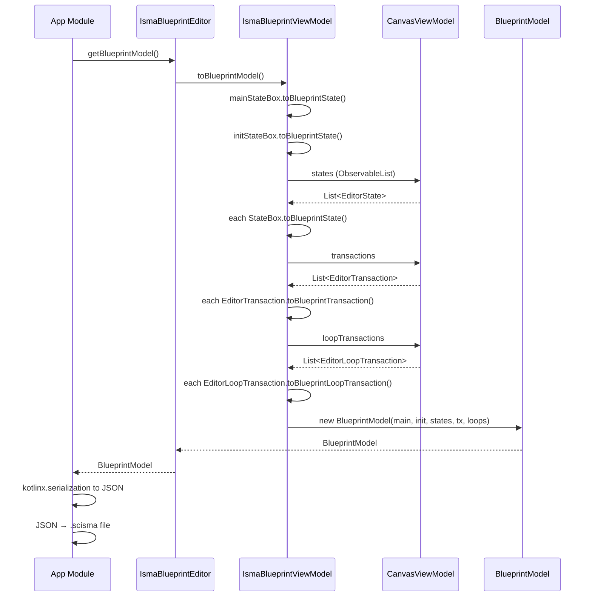
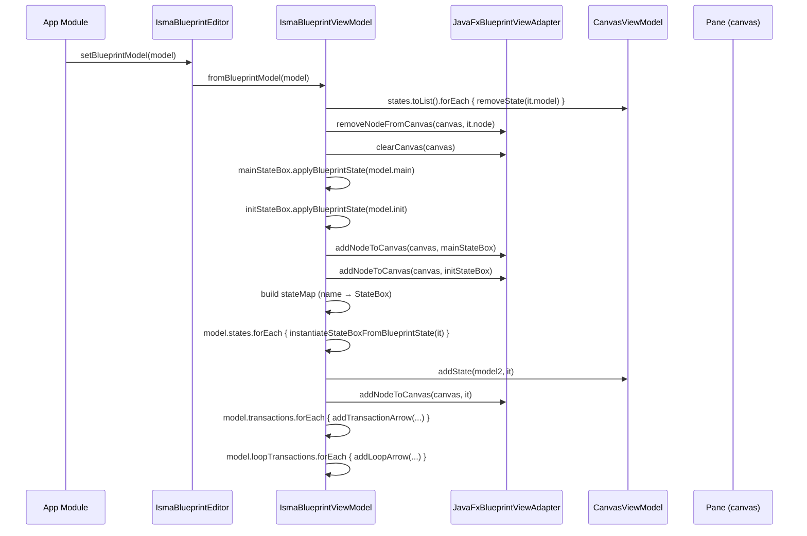

# Blueprint Editor — Architecture

## Canvas Properties

| Property | Value |
|----------|-------|
| Root type | `Pane` (no layout constraints) |
| Scrolling | Via `ScrollPane` wrapper |
| Scroll constraints | No min/max viewport size — scrolls to content |
| Coordinate origin | (0, 0) at top-left of canvas pane |
| Position clamping | All state positions: `max(position, 0.0)` — negative coordinates forbidden |

## Rendering Order (z-index via `viewOrder`)

Higher `viewOrder` renders on top.

| Element | viewOrder | Layer |
|---------|-----------|-------|
| Rectangle (state body) | 3.0 | Background fill |
| HBox (name label + text area) | 2.0 (default) | Foreground content inside state |
| StateBox group | 3.0 (default) | Container for state body + content |
| TransactionArrow / LoopTransactionArrow | 4.0 | Transitions (above states) |
| Line (arrow shaft) | 6.0 | Arrow geometry (topmost) |
| Polygon (arrowhead) | 6.0 | Arrow geometry (topmost) |

## Coordinate System

### Absolute Positioning

All elements use absolute `layoutX` and `layoutY` on the canvas `Pane`. There is no layout manager, no grid snapping, and no snapping to other elements.

### Arrow Geometry Bindings

| Arrow Type | Layout X Binding | Layout Y Binding |
|------------|-----------------|-----------------|
| TransactionArrow | `(endX - startX) / 2 + startX` | `(endY - startY) / 2 + startY` |
| LoopTransactionArrow | `stateBox.centerXProperty()` | `stateBox.centerYProperty()` |

### State Center Calculation

```
centerX = layoutX + squareWidth / 2   (= layoutX + 55)
centerY = layoutY + squareHeight / 2  (= layoutY + 32.5 for user states, 30 for Main/Init)
```

These are exposed as `DoubleBinding` objects via `StateBox.centerXProperty()` and `StateBox.centerYProperty()` that update automatically when `layoutX`, `layoutY`, `squareWidth`, or `squareHeight` changes.

## ViewAdapter Pattern

The `BlueprintViewAdapter` interface abstracts JavaFX-specific canvas operations, decoupling the ViewModel from concrete JavaFX node manipulation. This enables testability and allows future view implementations (e.g., headless or different UI toolkit).

### Interface

```kotlin
interface BlueprintViewAdapter {
    // Create a state box and add to canvas
    fun createStateBox(
        model: BlueprintStateModel,
        x: Double, y: Double,
        canvas: Pane,
        factory: (BlueprintStateModel, Double, Double) -> Node
    ): Node

    // Create a transaction arrow and add to canvas
    fun addTransactionArrow(
        startBox: Node, endBox: Node,
        model: BlueprintTransactionModel,
        canvas: Pane,
        factory: (BlueprintTransactionModel, Node, Node) -> Node
    ): Node

    // Create a loop arrow and add to canvas
    fun addLoopTransactionArrow(
        stateBox: Node,
        model: BlueprintLoopTransactionModel,
        canvas: Pane,
        factory: (BlueprintLoopTransactionModel, Node) -> Node
    ): Node

    // Create a Tab for text editors
    fun createTab(title: String, content: Node): Tab

    // Canvas node manipulation
    fun addNodeToCanvas(canvas: Pane, node: Node)
    fun removeNodeFromCanvas(canvas: Pane, node: Node)
    fun clearCanvas(canvas: Pane)
}
```

### JavaFX Implementation

```kotlin
class JavaFxBlueprintViewAdapter : BlueprintViewAdapter {
    // All methods delegate to canvas.children.add/remove/clear
    // createStateBox, addTransactionArrow, addLoopTransactionArrow:
    //   1. Call factory(model, ...) to create the Node
    //   2. canvas.children.add(node)
    //   3. Return the node
}
```

### Factory Pattern Usage

The `factory` parameter in each adapter method is a lambda that creates the actual control. The ViewModel provides the factory with the model data and receives back a configured JavaFX `Node`. This keeps the ViewModel free of JavaFX import dependencies in the factory closures.

Example from `IsmaBlueprintViewModel.addTransactionArrow()`:

```kotlin
val node = viewAdapter.addTransactionArrow(
    startBox, endBox, model, canvasPane,
    factory = { m, sb, eb ->
        TransactionArrow(
            onClick = { ... },
            onArrowClick = { ... }
        ).apply {
            startXProperty.bind(sb.centerXProperty())
            startYProperty.bind(sb.centerYProperty())
            endXProperty.bind(eb.centerXProperty())
            endYProperty.bind(eb.centerYProperty())
            text = m.predicate
            alias = m.alias
        }
    }
)
```

## Data Flow: Save (Canvas → Model → JSON)



1. `getBlueprintModel()` is called on `IsmaBlueprintEditor`
2. Each `StateBox` is converted via `toBlueprintState()`: extracts `layoutX`, `layoutY`, `name`, `text`
3. Each `EditorTransaction` is converted via `toBlueprintTransaction()`: extracts state **names** (not references), predicate, alias
4. Each `EditorLoopTransaction` is converted via `toBlueprintLoopTransaction()`: extracts state name, predicate, alias, text
5. A `BlueprintModel` is assembled and returned
6. `BlueprintModel.toLismaText()` generates LISMA text at compile/snapshot time

## Data Flow: Load (JSON → Model → Canvas)



1. `setBlueprintModel(model)` is called on `IsmaBlueprintEditor`
2. All existing user state boxes are removed from the canvas (both from `CanvasViewModel` and `Pane.children`)
3. `clearCanvas()` removes all remaining children from the canvas `Pane`
4. Main and Init state data is applied onto the fixed state boxes via `applyBlueprintState()`
5. Main and Init boxes are added back to the canvas
6. New `StateBox` instances are created from `model.states` via `instantiateStateBoxFromBlueprintState`
7. A name → StateBox map is built including Main, Init, and new states
8. For each `BlueprintTransactionModel`, the start/end states are looked up by name and a `TransactionArrow` is created
9. For each `BlueprintLoopTransactionModel`, a `LoopTransactionArrow` is created
10. All arrows bind their geometry to the state box centers

## Editor-Only Data Classes (runtime, not serializable)

Source: `models/CanvasViewModel.kt`

```
CanvasViewModel.EditorState
├── model: BlueprintStateModel     // Serializable state data
└── node: Node                     // StateBox JavaFX node

CanvasViewModel.EditorTransaction
├── startBox: StateBox             // Direct reference to canvas node
├── endBox: StateBox
├── arrow: TransactionArrow
└── node: Node

CanvasViewModel.EditorLoopTransaction
├── stateBox: StateBox
├── arrow: LoopTransactionArrow
└── node: Node
```

These classes pair serializable model data with live JavaFX nodes. They exist only at runtime and are never written to disk.

## CanvasViewModel Operations

### Cascade Removal

Removing a state automatically removes all associated transitions:

```kotlin
fun removeState(model: BlueprintStateModel) {
    _states.removeAll { it.model == model }
    _transactions.removeAll { it.startBox.name == model.name || it.endBox.name == model.name }
    _loopTransactions.removeAll { it.stateBox.name == model.name }
}
```

Matching is done by **state name** (not object reference), which handles the case where state boxes are recreated during load.

### Observable Lists

All three lists (`states`, `transactions`, `loopTransactions`) are exposed as immutable `ObservableList` wrappers around private `FXCollections.observableArrayList`. External code can observe changes but cannot directly modify the lists — all mutations go through the provided CRUD methods.

## Text Editor Integration

### Opening State Text Editor Tabs

Double-clicking a state box triggers `openStateTextEditorTab(state)`:

```kotlin
fun openStateTextEditor(state: StateBox): Tab {
    val editor = editorFactory.createTextEditor(
        text = state.text,
        onTextChanged = { state.text = it }
    )
    return viewAdapter.createTab(state.name, editor).apply {
        textProperty().bind(state.nameProperty)
        setOnCloseRequest { editorFactory.disposeInstance(editor) }
    }
}
```

1. `editorFactory.createTextEditor(state.text, onTextChanged = { state.text = it })`
2. `viewAdapter.createTab(state.name, editor)` — creates a closable Tab
3. `Tab.textProperty()` binds to `state.nameProperty` — tab name updates when state is renamed
4. `Tab.setOnCloseRequest { editorFactory.disposeInstance(editor) }` — disposes the editor on tab close

### Opening Loop Content Editor Tabs

Double-clicking a loop arrow's arrowhead triggers `openLoopTextEditor(arrow, stateBox)`:

1. `editorFactory.createTextEditor(arrow.text, onTextChanged = { arrow.text = it })`
2. `viewAdapter.createTab("${stateBox.name} (loop)", editor)`
3. `Tab.textProperty()` binds to `stateBox.nameProperty.concat(" (loop)")`
4. Tab close disposes the editor instance

### Editor Lifecycle

```
Create → Tab opened → onTextChanged fires on edits → Tab closed → disposeInstance()
```

Each open tab owns one editor instance. Closing the tab releases the editor back to the factory's pool.

## Project Lifecycle

### Blueprint Project Creation

1. User clicks "New statechart" toolbar button or uses File → New Statechart (Ctrl+B)
2. `ProjectService.createNewBlueprint("New statechart")` is called
3. A new `BlueprintProjectModel` is created with `BlueprintModel.empty`
4. A Koin scope is created for this project
5. The `IsmaBlueprintEditor` is instantiated within the scope
6. The project is added to `ProjectService.projects`
7. A new tab opens in the main TabPane showing the editor

### Blueprint Project Save

1. User clicks Save (Ctrl+S) or Save All
2. `project.blueprint` triggers `fetchBlueprint()` → `dataProvider.blueprint` → `blueprintEditor.getBlueprintModel()`
3. The `BlueprintModel` is serialized to JSON via `kotlinx.serialization`
4. JSON is written to the `.scisma` file

### Blueprint Project Load

1. User opens a `.scisma` file (File → Open, filter `*.scisma`)
2. JSON is parsed into `BlueprintModel`
3. `project.blueprint = model` triggers `pushBlueprint()` → `dataProvider.blueprint = model` → `blueprintEditor.setBlueprintModel(model)`
4. `setBlueprintModel` rebuilds the canvas from the model

### Snapshot (Compile)

1. At compile/verification time, `project.snapshot()` is called
2. For blueprint projects, this calls `blueprint.toLismaText()`
3. The result is a `LismaTextModel` containing the generated LISMA text and `CodeRegion` mappings
4. `CodeRegion` objects provide line number ranges for error highlighting in the text editor

## Integration with Main App Shell

### Tab Display

The `IsmaBlueprintEditor` is injected as `Node` with qualifier `IsmaEditorQualifier` into the project model. The main app's `ProjectTab` wraps this node in a `Tab`:

```
Tab {
    text = project.nameProperty
    content = project.editor (IsmaBlueprintEditor instance)
    closable = true
}
```

### Tab Rename

When a state name changes, the tab text updates automatically because:
- The tab's text is bound to the project's name (set at project creation time)
- State name changes do NOT affect the tab title — they only affect the state box label
- The text editor tab (opened by double-clicking a state) DOES update its title via `textProperty().bind(state.nameProperty)`

### Multiple Project Types Coexistence

The main TabPane can contain tabs from both LISMA text projects and Blueprint projects. The TabPane has no type restriction.
