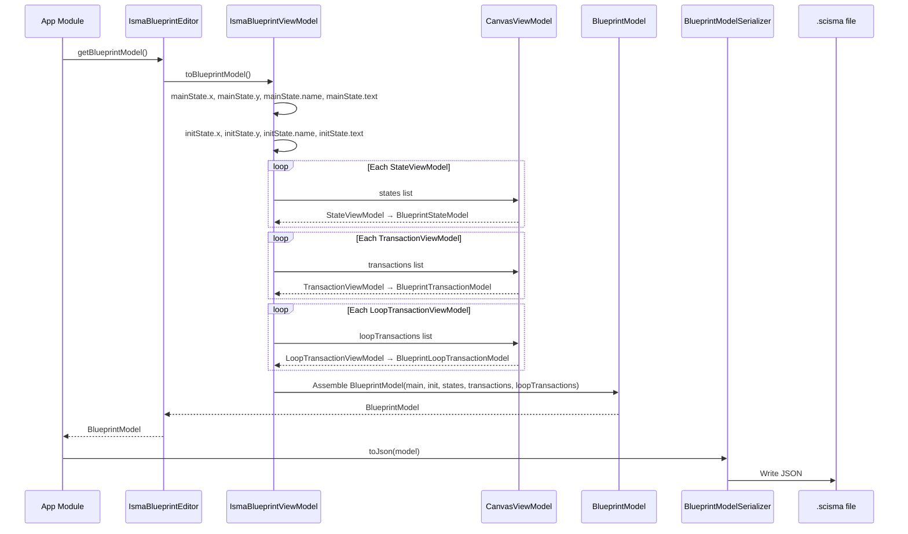
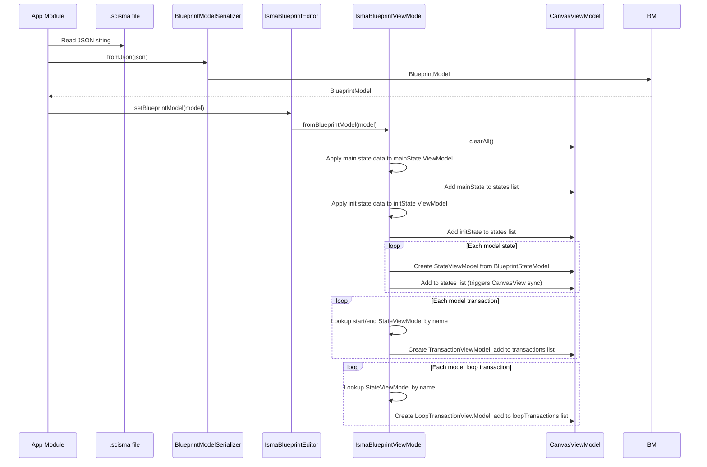

# Blueprint Editor — Architecture

## Canvas Properties

| Property | Value |
|----------|-------|
| Root type | `Pane` (no layout constraints) |
| Scrolling | Via `ScrollPane` wrapper |
| Scroll constraints | No min/max viewport size — scrolls to content |
| Coordinate origin | (0, 0) at top-left of canvas pane |
| Position clamping | All state positions: `max(position, 0.0)` — negative coordinates forbidden |

## Rendering Order (z-index via `viewOrder`)

Higher `viewOrder` renders on top.

| Element | viewOrder | Layer |
|---------|-----------|-------|
| Rectangle (state body) | 3.0 | Background fill |
| HBox (name label + text area) | 2.0 (default) | Foreground content inside state |
| StateBox group | 3.0 (default) | Container for state body + content |
| TransactionArrow / LoopTransactionArrow | 4.0 | Transitions (above states) |
| Line (arrow shaft) | 6.0 | Arrow geometry (topmost) |
| Polygon (arrowhead) | 6.0 | Arrow geometry (topmost) |

## Coordinate System

### Absolute Positioning

All elements use absolute `layoutX` and `layoutY` on the canvas `Pane`. There is no layout manager, no grid snapping, and no snapping to other elements.

### Arrow Geometry Bindings

| Arrow Type | Layout X Binding | Layout Y Binding |
|------------|-----------------|-----------------|
| TransactionArrow | `(endX - startX) / 2 + startX` | `(endY - startY) / 2 + startY` |
| LoopTransactionArrow | `stateBox.centerXProperty()` | `stateBox.centerYProperty()` |

### State Center Calculation

`centerX = layoutX + squareWidth / 2` (equals `layoutX + 55`) and `centerY = layoutY + squareHeight / 2` (equals `layoutY + 32.5` for user states, `layoutY + 30` for Main/Init). These are exposed as `DoubleBinding` objects via `StateBox.centerXProperty()` and `StateBox.centerYProperty()` that update automatically when `layoutX`, `layoutY`, `squareWidth`, or `squareHeight` changes.

## CanvasView Pattern

`CanvasView` replaces the old `BlueprintViewAdapter` abstraction. It directly manages JavaFX node lifecycle by observing `CanvasViewModel`'s `ObservableList`s via `ListChangeListener`. This eliminates the factory-based adapter pattern in favor of direct ViewModel-to-node binding.

### Architecture

```
IsmaBlueprintEditor ──┐
                      ├──► IsmaBlueprintViewModel ──► CanvasViewModel ◄── CanvasView
                      │                                                        │
                      └────────────────────────────────────────────────────────┘
                                                                       │
                                                              Creates/Removes Nodes:
                                                              - StateBox (bound to StateViewModel)
                                                              - TransactionArrow (bound to TransactionViewModel)
                                                              - LoopTransactionArrow (bound to LoopTransactionViewModel)
                                                              - EditArrowPopOver (transient)
```

### Observable List Synchronization

`CanvasView` maintains three maps tracking ViewModel-to-node relationships:
- `stateNodeMap: MutableMap<StateViewModel, StateBox>`
- `transactionNodeMap: MutableMap<TransactionViewModel, TransactionArrow>`
- `loopTransactionNodeMap: MutableMap<LoopTransactionViewModel, LoopTransactionArrow>`

When an `ObservableList` changes, the corresponding `sync*()` method runs:
1. **Add new nodes:** Iterate the current list; for each ViewModel not in the map, create the node and add to canvas
2. **Remove stale nodes:** Remove map entries whose ViewModel is no longer in the list, and remove their nodes from canvas

### Node Creation

**State nodes:** `StateBox` is created with `viewModel` bound via `layoutXProperty`/`layoutYProperty` to `viewModel.xProperty`/`viewModel.yProperty`. Drag events are handled by `CanvasView.setupStateDrag()` which updates `stateViewModel.xProperty`/`yProperty` with clamped coordinates.

**Transaction nodes:** `TransactionArrow` is created with `startViewModel` and `endViewModel` references. Arrow geometry binds to state center positions via `layoutXProperty().bind(startViewModel.centerX().add(endViewModel.centerX()).divide(2))`.

**Loop transaction nodes:** `LoopTransactionArrow` is created with `stateViewModel` reference. Layout binds to `stateViewModel.centerX()` and `stateViewModel.centerY()`.

### Drag Handling

`CanvasView` directly handles drag events on state boxes:
- `MOUSE_PRESSED`: Records initial position and click offset
- `MOUSE_DRAGGED`: Updates `stateViewModel.xProperty`/`yProperty` with `max(newPos, 0.0)` clamping
- `MOUSE_RELEASED`: Clears drag state

This eliminates the old approach where the ViewModel handled canvas-wide drag events.

## Data Flow: Save (ViewModel → Model → JSON)



1. `getBlueprintModel()` is called on `IsmaBlueprintEditor`
2. `toBlueprintModel()` is called on `IsmaBlueprintViewModel`
3. `mainState.x/y/name/text` and `initState.x/y/name/text` are read directly from `StateViewModel` properties
4. Each `StateViewModel` in `CanvasViewModel.states` is converted to `BlueprintStateModel`: extracts `x`, `y`, `name`, `text`
5. Each `TransactionViewModel` in `CanvasViewModel.transactions` is converted to `BlueprintTransactionModel`: extracts `startStateName`, `endStateName`, `predicate`, `alias`
6. Each `LoopTransactionViewModel` in `CanvasViewModel.loopTransactions` is converted to `BlueprintLoopTransactionModel`: extracts `stateName`, `predicate`, `alias`, `text`
7. A `BlueprintModel` is assembled from main, init, states, transactions, and loopTransactions
8. The `BlueprintModel` is returned to the editor and then to the app module
9. `BlueprintModelSerializer.toJson()` converts the model to JSON, which is written to a `.scisma` file

See `IsmaBlueprintViewModel.kt` for the full implementation.

## Data Flow: Load (JSON → Model → ViewModel)



1. `fromJson(json)` is called on `BlueprintModelSerializer` (app module), which parses the JSON string into `BlueprintModel`
2. `setBlueprintModel(model)` is called on `IsmaBlueprintEditor`
3. `fromBlueprintModel(model)` is called on `IsmaBlueprintViewModel`
4. `CanvasViewModel.clearAll()` clears all states, transactions, and loop transactions
5. Main and Init state data is applied onto the pre-created `mainState` and `initState` `StateViewModel` instances via property assignment
6. Main and Init ViewModels are added to `CanvasViewModel.states`
7. A name → StateViewModel map is built including Main, Init, and new states
8. New `StateViewModel` instances are created from `model.states`, added to `CanvasViewModel`, and `CanvasView` automatically creates corresponding `StateBox` nodes
9. For each `BlueprintTransactionModel`, start/end states are looked up by name and a `TransactionViewModel` is created and added to `CanvasViewModel.transactions` (triggers `CanvasView` to create `TransactionArrow`)
10. For each `BlueprintLoopTransactionModel`, a `LoopTransactionViewModel` is created and added to `CanvasViewModel.loopTransactions` (triggers `CanvasView` to create `LoopTransactionArrow`)
11. All arrow geometry is handled automatically by `TransactionArrow` and `LoopTransactionArrow` bindings to ViewModel properties

See `IsmaBlueprintViewModel.kt` for the full implementation.

## Editor-Only Data Classes (runtime, not serializable)

Source: `viewmodels/` package

**`StateViewModel`** — JavaFX property-backed model with `nameProperty`, `textProperty`, `xProperty`, `yProperty`, `squareWidthProperty`, `squareHeightProperty`, `colorProperty`, `editableProperty`, `editModeProperty`, `editButtonVisibleProperty`. Exposes `centerX()` and `centerY()` as `DoubleBinding` for arrow geometry. The `name` setter uses `isNameUnique` callback for uniqueness validation.

**`TransactionViewModel`** — JavaFX property-backed model with `startStateName`, `endStateName`, `predicate`, `alias`, `selected`. Exposes computed `displayText` binding that shows alias if non-blank, otherwise predicate.

**`LoopTransactionViewModel`** — JavaFX property-backed model with `stateName`, `predicate`, `alias`, `text`, `selected`. Exposes computed `displayText` binding.

**`CanvasViewModel`** — Holds `ObservableList<StateViewModel>`, `ObservableList<TransactionViewModel>`, `ObservableList<LoopTransactionViewModel>`. Provides CRUD methods with cascade removal and name registration/unregistration.

These classes exist only at runtime. They are converted to/from serializable `BlueprintModel*` classes during save/load operations.

## CanvasViewModel Operations

### Cascade Removal

Removing a `StateViewModel` automatically removes all associated transitions. The `removeState(state)` function removes from `_states` where `it == state` (object identity), removes from `_transactions` where `it.startStateName == state.name || it.endStateName == state.name`, and removes from `_loopTransactions` where `it.stateName == state.name`. Also calls `tryUnregisterStateName(state.name)` to clean up the name registry. See `CanvasViewModel.kt` for the full implementation.

### Name Registration

`CanvasViewModel` maintains a `registeredStateNames` HashSet and `stateNameCounter` for unique name enforcement. `tryRegisterStateName(name)` returns `false` if the name is already taken. `tryUnregisterStateName(name)` removes the name from the registry. `createNextDefaultStateName()` generates `"State N"` names with auto-incrementing counter.

### Observable Lists

All three lists (`states`, `transactions`, `loopTransactions`) are exposed as immutable `ObservableList` wrappers around private `FXCollections.observableArrayList`. External code can observe changes but cannot directly modify the lists — all mutations go through the provided CRUD methods.

## Text Editor Integration

### Opening State Text Editor Tabs

Double-clicking a state box (handled by `CanvasView` → `IsmaBlueprintViewModel`) triggers `openStateTextEditor(stateViewModel)`:

1. `editorFactory.createTextEditor(stateViewModel.text, onTextChanged = { stateViewModel.text = it })` creates a text editor bound to the ViewModel's text
2. `Tab(stateViewModel.name, editor)` creates a closable Tab
3. `Tab.textProperty()` binds to `stateViewModel.nameProperty` — tab name updates when state is renamed
4. `Tab.setOnCloseRequest { editorFactory.disposeInstance(editor) }` disposes the editor on tab close

See `IsmaBlueprintViewModel.kt` for the full implementation.

### Opening Loop Content Editor Tabs

Double-clicking a loop arrow's arrowhead triggers `openLoopTextEditor(loopTxViewModel, stateViewModel)`:

1. `editorFactory.createTextEditor(loopTxViewModel.text, onTextChanged = { loopTxViewModel.text = it })`
2. `Tab("${stateViewModel.name} (loop)", editor)`
3. `Tab.textProperty()` binds to `stateViewModel.nameProperty.concat(" (loop)")`
4. Tab close disposes the editor instance

### Editor Lifecycle

The editor lifecycle is: Create → Tab opened → onTextChanged fires on edits → Tab closed → disposeInstance(). Each open tab owns one editor instance. Closing the tab releases the editor back to the factory's pool.

## Project Lifecycle

### Blueprint Project Creation

1. User clicks "New statechart" toolbar button or uses File → New Statechart (Ctrl+B)
2. `ProjectService.createNewBlueprint("New statechart")` is called
3. A new `BlueprintProjectModel` is created with `BlueprintModel.empty`
4. A Koin scope is created for this project
5. The `IsmaBlueprintEditor` is instantiated within the scope
6. The project is added to `ProjectService.projects`
7. A new tab opens in the main TabPane showing the editor

### Blueprint Project Save

1. User clicks Save (Ctrl+S) or Save All
2. `project.blueprint` triggers `fetchBlueprint()` → `dataProvider.blueprint` → `blueprintEditor.getBlueprintModel()`
3. `IsmaBlueprintViewModel.toBlueprintModel()` converts `StateViewModel`/`TransactionViewModel`/`LoopTransactionViewModel` instances to `BlueprintModel`
4. `BlueprintModelSerializer.toJson()` converts the `BlueprintModel` to JSON
5. JSON is written to the `.scisma` file

### Blueprint Project Load

1. User opens a `.scisma` file (File → Open, filter `*.scisma`)
2. `BlueprintModelSerializer.fromJson()` parses the JSON string into `BlueprintModel`
3. `project.blueprint = model` triggers `pushBlueprint()` → `dataProvider.blueprint = model` → `blueprintEditor.setBlueprintModel(model)`
4. `IsmaBlueprintViewModel.fromBlueprintModel(model)` clears `CanvasViewModel`, applies main/init states, creates ViewModels for user states/transactions/loops
5. `CanvasView` automatically syncs JavaFX nodes from `CanvasViewModel` ObservableList changes

### Snapshot (Compile)

1. At compile/verification time, `project.snapshot()` is called
2. For blueprint projects, this calls `blueprint.toLismaText()`
3. The result is a `LismaTextModel` containing the generated LISMA text and `CodeRegion` mappings
4. `CodeRegion` objects provide line number ranges for error highlighting in the text editor

## Integration with Main App Shell

### Tab Display

The `IsmaBlueprintEditor` is injected as `Node` with qualifier `IsmaEditorQualifier` into the project model. The main app's `ProjectTab` wraps this node in a `Tab` with `text = project.nameProperty`, `content = project.editor` (IsmaBlueprintEditor instance), and `closable = true`.

### Tab Rename

When a state name changes, the tab text updates automatically because:
- The tab's text is bound to the project's name (set at project creation time)
- State name changes do NOT affect the tab title — they only affect the state box label
- The text editor tab (opened by double-clicking a state) DOES update its title via `Tab.textProperty().bind(stateViewModel.nameProperty)`

### Multiple Project Types Coexistence

The main TabPane can contain tabs from both LISMA text projects and Blueprint projects. The TabPane has no type restriction.
