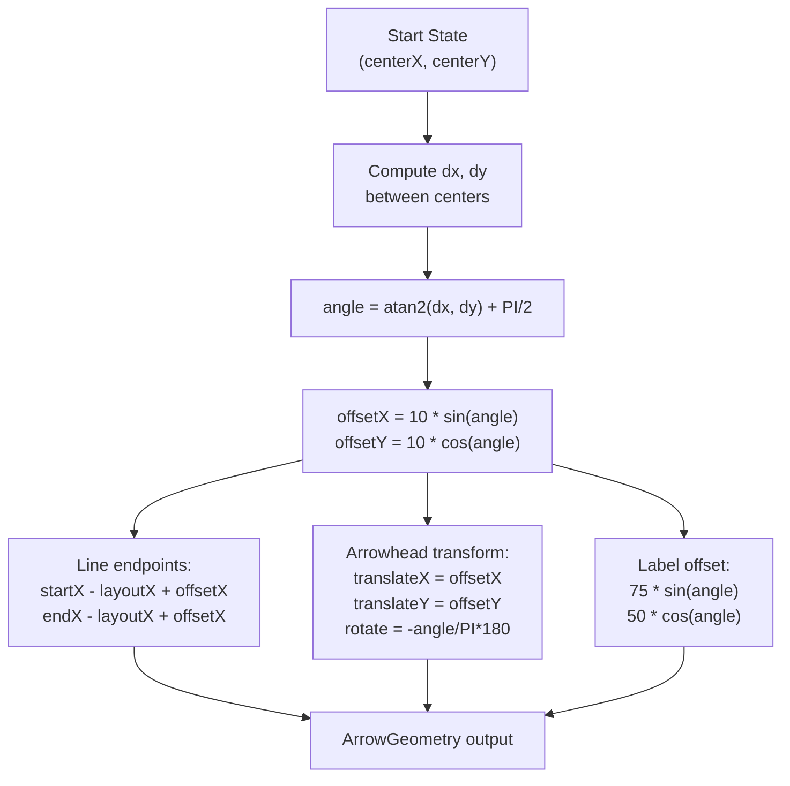
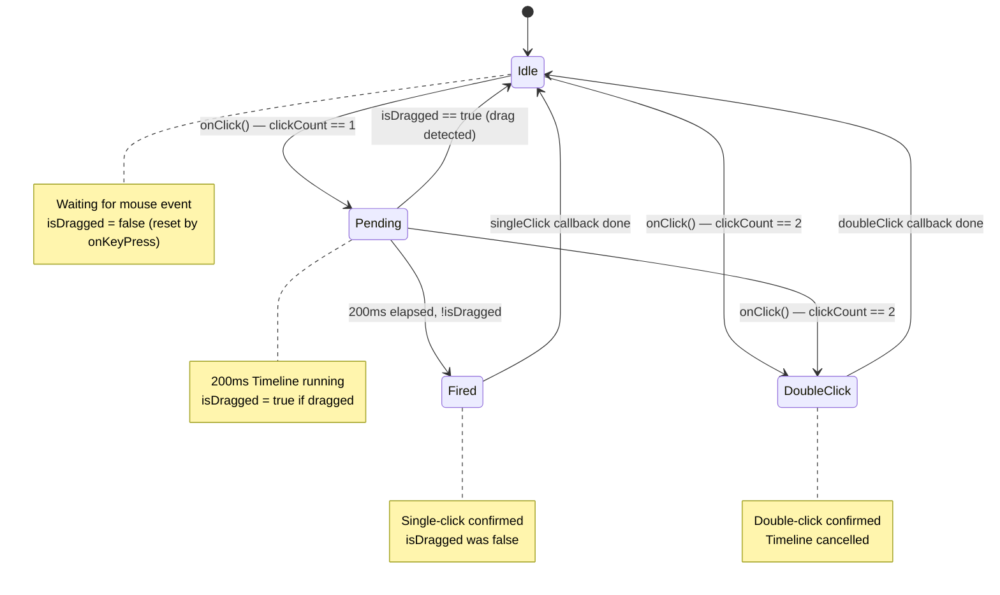

# Blueprint Editor — Algorithms

## NameChangingMonitor

### Purpose

The single name registry for the blueprint editor. `CanvasViewModel` owns one `NameChangingMonitor("State")` instance; it tracks registered names in a `HashSet` and auto-increments the default name counter. Source: `NameChangingMonitor.kt`.

### Fields

| Field | Type | Purpose |
|-------|------|---------|
| `itemDefaultName` | String | Base name prefix (e.g. "New state") |
| `defaultNameRegex` | Regex | Pattern to extract digits from default names: `^${itemDefaultName} (\d+)$` |
| `existedNames` | HashSet<String> | Registry of all registered names |
| `nextNameCounter` | Int | Auto-increment counter (starts at 1) |

### `tryRegister(name)`

1. If `existedNames` contains `name` → return `false` (duplicate)
2. If `name` matches `defaultNameRegex`, extract the digit → set `nextNameCounter = max(nextNameCounter, digit + 1)`
3. Add `name` to `existedNames` → return `true`

**Counter advancement**: When registering a name like "New state 5", the counter advances to at least 6, even if names 1–4 were never registered. This prevents generating names that are already in use.

### `tryUnregister(name)`

1. If `existedNames` contains `name` → remove it → return `true`
2. Otherwise → return `false`

Unregistering does **not** adjust `nextNameCounter` — the counter only moves forward.

### `createNextDefaultName()`

Returns `"$itemDefaultName $nextNameCounter"` and does not advance the counter (advancement happens on the next `tryRegister` call).

### `isRegistered(name)` / `reset()`

`isRegistered(name)` reports whether `name` is in `existedNames` — used by `StateViewModel`'s `isNameUnique` callback. `reset()` clears the registry and resets the counter to 1 — called by `CanvasViewModel.clearAll()`.

## ArrowGeometry

### atan2-Based Perpendicular Offset

The line endpoints are computed in the `updateGeometry()` callback, triggered whenever any of `startXProperty`, `startYProperty`, `endXProperty`, `endYProperty` changes.

The algorithm offsets the arrow line perpendicular to the direction between state centers, avoiding overlap with the state box borders. The function `calculateArrowGeometry(startX, startY, endX, endY, layoutX, layoutY, lineOffset = 10.0, textXOffset = 75.0, textYOffset = 50.0)` returns an `ArrowGeometry` object. See `ArrowGeometry.kt` for the full implementation.

### Calculation Steps

1. `dx = endX - startX` (delta X between state centers), `dy = endY - startY` (delta Y between state centers)
2. `angle = atan2(dx, dy) + PI / 2` (perpendicular angle with swapped args + 90 degrees)
3. `offsetDistance = 10.0`, `offsetX = offsetDistance * sin(angle)`, `offsetY = offsetDistance * cos(angle)`
4. Line endpoints offset from state centers and converted to local coordinates: `lineStartX = startX - layoutX + offsetX`, `lineStartY = startY - layoutY + offsetY`, `lineEndX = endX - layoutX + offsetX`, `lineEndY = endY - layoutY + offsetY`
5. Arrowhead position and rotation: `arrowhead.translateX = offsetX`, `arrowhead.translateY = offsetY`, `arrowhead.rotate = -angle / PI * 180.0` (radians to degrees, negated)
6. Label offset (perpendicular, further out from the line): `labelTextTranslateX = 75.0 * sin(angle)`, `labelTextTranslateY = 50.0 * cos(angle)`



### Why `atan2(dx, dy)` Instead of `atan2(dy, dx)`?

The argument order is swapped compared to the standard polar angle convention. This produces an angle measured from the Y-axis (vertical) rather than the X-axis (horizontal). Adding `PI / 2` then rotates this to get the perpendicular direction. The result is that the arrow line is offset to the "right" of the direction from start to end (when viewing from start toward end).

## ClickDisambiguator

### 200ms Delayed JavaFX Timeline Approach

Distinguishes single-clicks from drag operations using a JavaFX `Timeline`. Source: `ClickDisambiguator.kt` (57 lines).

The flow is: `MOUSE_PRESSED` sets `isDragged = false` and stores the event. `MOUSE_DRAGGED` sets `isDragged = true`. A 200ms `Timeline` is scheduled; if `!isDragged` after the delay, the `singleClick` callback fires; if `isDragged`, the check is skipped (drag already handled). `MOUSE_CLICKED` with `clickCount == 2` cancels the pending `Timeline` and triggers `doubleClick`.

### Implementation Details

The `ClickDisambiguator` class takes `singleClick` ((MouseEvent) -> Unit), `doubleClick` ((MouseEvent) -> Unit), and `clickDelay` (Long, default 200L) in its constructor. It holds `pendingTimeline` (Timeline?), `isDragged` (Boolean), and `lastEvent` (MouseEvent?). The `coroutineScope` parameter was removed — all timing is handled by JavaFX `Timeline` instead of coroutines. See `ClickDisambiguator.kt` for the full implementation.

### Lifecycle



| Event | Action |
|-------|--------|
| `onKeyPress()` | Reset `isDragged = false` |
| `onDragged()` | Set `isDragged = true` |
| `onClick(event)` | Store event, dispatch based on `clickCount` |
| `handleSingleClick()` | Stop any pending timeline, launch 200ms `Timeline`; if `!isDragged` after delay → call `singleClick` |
| `handleDoubleClick()` | Cancel pending timeline → call `doubleClick` |
| `cancel()` | Cancel pending timeline |

### Usage in StateBox

The `StateBox` constructor creates a `ClickDisambiguator` with:
- **singleClick**: Forwards to the `onSingleClick` callback (`IsmaBlueprintViewModel.handleStateClick`), then requests focus on the name `TextArea` if the ViewModel entered edit mode
- **doubleClick**: Forwards to the `onDoubleClick` callback (`IsmaBlueprintViewModel.handleStateDoubleClick` → `OpenStateEditor` event)
- **clickDelay**: 200L (passed directly to constructor, no shared scope needed)

The name `TextArea`'s focus listener forwards committed text via the `onNameCommitted` callback (`IsmaBlueprintViewModel.commitNameEdit`) — the control never writes to the ViewModel directly.

Event handlers route JavaFX mouse events to the disambiguator: `MOUSE_PRESSED` calls `clickDisambiguator.onKeyPress()`, `MOUSE_DRAGGED` calls `clickDisambiguator.onDragged()`, and `MOUSE_CLICKED` calls `clickDisambiguator.onClick(it)`. See `StateBox.kt` for the full implementation.

### Usage in LoopTransactionArrow

The `LoopTransactionArrow` uses its own `ClickDisambiguator` for arrowhead clicks:
- **singleClick**: Forwards to `onArrowheadClicked` (currently a no-op — the PopOver only supports `TransactionViewModel`)
- **doubleClick**: Forwards to `onArrowheadDoubleClicked` (`IsmaBlueprintViewModel.handleLoopArrowheadDoubleClick` → `OpenLoopEditor` event)

The arrow body click (for removal in RemoveTransition mode) is handled separately via `setOnMouseClicked { onBodyClicked(...) }`.

## LISMA Conversion

### Overview

`BlueprintModel.toLismaText()` (app module, `ru.isma.next.app.services.blueprint.LismaCodegen`) transforms the visual statechart into LISMA text. This runs at **compile/snapshot time**, not during editing. The output is a `LismaTextModel` (app module, `ru.isma.next.app.models`) containing the generated LISMA text and `CodeRegion` line mappings. The blueprint-editor module only provides the plain `BlueprintModel` data.

The function signature is `fun BlueprintModel.toLismaText(): LismaTextModel`. The algorithm processes the model in three phases: Phase 1 (Main state text, top-level content), Phase 2 (Regular transactions, grouped by target state + predicate), Phase 3 (Loop transactions, expanded into pseudo-state pairs).

```mermaid
flowchart LR
    BM[BlueprintModel] --> P1[Phase 1: Main state text]
    P1 --> P2[Phase 2: StateBlock grouping]
    P2 --> P3[Phase 3: Loop expansion]
    P3 --> LTM[LismaTextModel]
    LTM --> FT[fullText: LISMA source]
    LTM --> CR[regions: CodeRegion list]

    subgraph P2 Details
        direction TB
        S1[Iterate transactions] --> S2{Block exists\nfor key?}
        S2 -->|No| S3[Create StateBlock\nwith target state]
        S2 -->|Yes| S4[Add start state\nto inputStates]
        S3 --> S5[Output: state key { text } from start1,start2,...;]
        S4 --> S5
    end

    P2 --> P2 Details
```

### Phase 1 — Main State Text

`mainTextFragment = this.main.text`, appended to `resultStringBuilder` via `appendLine()`. `linesCounter = mainTextFragment.lines().count() + 1`. The main state's text is output first as top-level content (not inside a `state` block). The line counter starts after this content.

### Phase 2 — Regular Transactions (StateBlock Grouping)

Transactions targeting the **same state** with the **same predicate** are merged into a single `StateBlock`. A `HashMap<String, StateBlockModel>` is created keyed by `createTransactionKey(targetStateName, predicate.ifBlank { LISMA_TRUE })` where the key format is `"${targetStateName.trim()} (${predicate.trim()})"`. The `statesMap` associates state names to `BlueprintStateModel` objects. For each transaction, if no block exists for the key, a new `StateBlockModel` is created with the target state name, key, and text, and the start state name is added to `inputStates`. If a block already exists, the start state name is added to the existing block's `inputStates`.

**Key insight**: The transaction key combines the target state name and predicate. Transitions from different source states to the same target with the same predicate are merged into output like: `state "TargetState (predicate)" { <target state text> } from StartState1,StartState2,StartState3;`

Empty predicates default to `LISMA_TRUE` = `"1 > 0"` (always true).

### Phase 2 Output Format

`StateBlockModel.toString()` outputs: `"state $transactionKey {\n$text\n} from $startState1,$startState2,...;"`

### Phase 3 — Loop Transaction Expansion

Each loop transaction is expanded into **two pseudo-states** that form a cycle. The `toLisma(states)` function creates `pseudoStateName = "${stateName}_pseudo_1"` and returns a string containing: `state $pseudoStateName (${predicate.trim()}) { $text } from ${stateName};` followed by `state $stateName ($LISMA_TRUE) { ${states[stateName]!!.text} } from ${pseudoStateName};`

**Transformation logic**:
1. Create pseudo-state `<stateName>_pseudo_1` with the loop's predicate and text
2. The pseudo-state transitions **from** the original state
3. The original state gets predicate `1 > 0` (always true) and transitions **from** the pseudo-state
4. This creates a cycle: `State → pseudo_state → State`

**Example**: A loop on state "Work" with predicate `"x > 5"` and loop text `"process()"` generates: `state Work_pseudo_1 (x > 5) { process() } from Work;` followed by `state Work (1 > 0) { <original Work body text> } from Work_pseudo_1;`

```mermaid
flowchart TB
    subgraph Input
        WS[Work state\nbody text]
    end

    subgraph Output
        direction TB
        P1[state Work_pseudo_1 (x > 5) {\n  process()\n} from Work;]
        P2[state Work (1 > 0) {\n  <original Work body text>\n} from Work_pseudo_1;]
    end

    WS --> P1
    WS --> P2

    P1 -.->|transitions from| WS
    P2 -.->|transitions from| P1

    note1[Creates pseudo-state:\n<stateName>_pseudo_1\nwith loop predicate + text]
    note2[Original state gets:\npredicate = 1 > 0\ntransitions from pseudo-state]
    note1 -.-> P1
    note2 -.-> P2
```

```mermaid
graph TD
    subgraph Before
        A[Work] -->|loop arrow| A
    end

    subgraph After
        B[Work] -->|from Work_pseudo_1\npredicate: 1 > 0| C[Work_pseudo_1\npredicate: x > 5\nbody: process()]
        C -->|from Work| B
    end

    Before --> Transformation[Expand into cycle]
    Transformation --> After
```

### Output Order

1. Main state text
2. State blocks from regular transactions (grouped by target + predicate, in first-transaction order via `LinkedHashMap`), followed by one blank line after each block
3. Loop transaction expansions (one pseudo-state pair per loop), followed by two blank lines after each pair

### Line Number Tracking

`appendFragment()` (in `LismaCodegen.kt`) records a `CodeRegion` per fragment using 1-based line numbers:

```kotlin
val startLine = sb.lineCount() + 1          // lineCount() = number of '\n' already in the buffer
sb.appendLine(fragmentText)
repeat(extraBlankLines) { sb.appendLine() } // 1 for state blocks, 2 for loop expansions
val fragmentLines = fragmentText.lines().count() - if (fragmentText.endsWith("\n")) 1 else 0
regions.add(CodeRegion(name, startLine, startLine + fragmentLines - 1))
```

Kotlin's `String.lines()` counts the empty line after a trailing newline, so the `- 1` correction applies only to fragments that end with `"\n"` (loop expansions — `toLisma()` ends with a blank line). State block fragments (`StateBlockModel.toString()`) have no trailing newline and need no correction. `CodeRegion` objects map LISMA compilation errors back to the owning state fragment.

### fragmentNameByLine

`LismaTextModel` provides `fragmentNameByLine(line: Int): String` which returns `regions.firstOrNull { line >= it.startLine && line <= it.endLine }?.name` or `DefaultFragment.name` if no region matches. The companion object defines `DefaultFragment = CodeRegion(name = "Main", startLine = 0, endLine = 0)`. Used by `LismaPdeService` (verify) and `SimulationTaskService` (simulate) to fill the Fragment column of the error list.

## EditorMode

Sealed class hierarchy with four mutually exclusive modes:

| Type | Properties | Purpose |
|------|-----------|---------|
| `EditorMode.Idle` | None | Default mode |
| `EditorMode.AddTransition` | `selectedStates: MutableList<StateViewModel>` | Collects 1-2 states for transition/loop creation |
| `EditorMode.RemoveState` | None | Click states to remove them |
| `EditorMode.RemoveTransition` | None | Click arrows to remove them |

`selectedStates` is a `MutableList` (not a `Set`) so the same state can be recorded twice — a double-click on one state creates a loop arrow instead of a transition. `recordTransitionSource` only accepts `StateKind.USER` states.

## Mode-Aware Click Routing

There is no editable/editMode binding to the editor mode. Instead, `IsmaBlueprintViewModel.handleStateClick(state)` routes user intent by the current mode:

| Mode | State single-click | State double-click | Arrow body click | Arrowhead click |
|------|--------------------|--------------------|------------------|-----------------|
| `Idle` | Inline name edit (USER states) | Open state editor tab | No effect | Open PopOver |
| `AddTransition` | Record transition source | Open state editor tab | No effect | Open PopOver |
| `RemoveState` | Remove state (USER only) | Open state editor tab | No effect | Open PopOver |
| `RemoveTransition` | Inline name edit (USER states) | Open state editor tab | Remove arrow | Remove arrow (no PopOver) |

`handleArrowheadClick(tx)` returns `true` when the View should show the PopOver and `false` when the click was consumed by the current mode (RemoveTransition removes the arrow instead).


