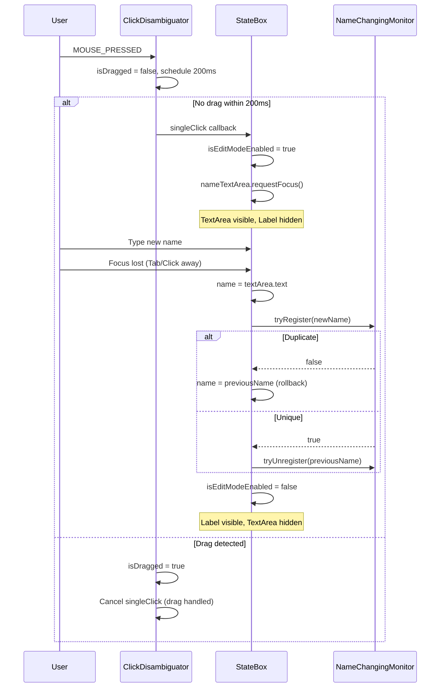

# Blueprint Editor — UX Specification

## State Boxes

### Visual Structure

```
┌────────────────────────────────────┐  ← rounded rectangle, arc = 20px
│                                    │
│        [ State Name Label ]        │  ← Arial 16pt, centered
│                                    │
└────────────────────────────────────┘
```

The state box is a `Group` containing:
1. A `Rectangle` (filled body with rounded corners) — `viewOrder = 3.0`
2. An `HBox` (name label + optional text area) — centered inside the rectangle with `STATE_INSET` (10px) padding

| Property | Default | Notes |
|----------|---------|-------|
| `squareWidth` | 110 | Fixed for user states; Main/Init override to same |
| `squareHeight` | 65 | Main and Init states set this to **60** |
| `arcWidth` / `arcHeight` | 20 | Corner rounding |
| Font | Arial 16pt | State name text |
| HBox size | `stateWidth - 20` × `stateHeight - 20` | Centered inside rectangle |

### State Types

| Type | Color | Position (x, y) | Editable | Edit Button Visible | Draggable |
|------|-------|------------------|----------|---------------------|-----------|
| **Main** | `LIGHTGREEN` (#90EE90) | (20, 0) | No | No | Yes |
| **Init** | `LIGHTBLUE` (#ADD8E6) | (10, 100) | No | No | Yes |
| **User** | `CORAL` (#F08080) | (10, 200) | Yes | Yes | Yes |

**Main state**: Created with `BlueprintStateModel(STATE_INSET, 0.0, MAIN_STATE, "")` in the ViewModel. The constructor applies `layoutXProperty().value = x + STATE_INSET` where `x = STATE_INSET = 10`, resulting in effective position **(20, 0)**.

**Init state**: Created with `BlueprintStateModel(STATE_INSET, 100.0, INIT_STATE, "")`. The constructor applies `layoutYProperty().value = y` where `y = 100.0`, resulting in position **(10, 100)**. The `isEditButtonVisible = false` is set explicitly.

> **Serialization note**: `BlueprintModel.empty` serializes both Main and Init at (10.0, 10.0) as defaults. During construction, the ViewModel applies layout offsets on top of the base positions. On load from a saved model, `layoutX`/`layoutY` are set directly from `canvasPositionX`/`canvasPositionY` without additional offsets.

### Inline Name Editing

When a user single-clicks an editable (user) state box:



1. A 200ms delay begins (coroutine)
2. If the mouse was **not** dragged during that period:
   - A `TextArea` appears inside the state box (replacing the `Label`)
   - The text area is populated with the current `name`
   - Focus is requested on the text area
3. When the text area loses focus:
   - The `name` property is updated from the text area's content
   - The `TextArea` hides, the `Label` reappears
4. The new name is validated against `NameChangingMonitor`:
   - If the name is **already taken**, the old name is **restored** (silent rollback)
   - If unique, the monitor updates its registry

### Double-Click Behavior

Double-clicking any state box (Main, Init, or User) opens a **text editor tab** in the main TabPane:

- Tab name: bound to the state's `nameProperty` (updates when state is renamed)
- Tab content: the state's `text` property (the LISMA body of that state)
- Changes in the text editor write back to `state.text` via `onTextChanged` callback
- Tab close: disposes the text editor instance via `editorFactory.disposeInstance()`

### Drag Interaction

| Event | Handler |
|-------|---------|
| `MOUSE_PRESSED` | Sets `activeStateBox = source`, records `xOffset = -event.x`, `yOffset = -event.y`. Resets `isDragged = false`. |
| `MOUSE_DRAGGED` (on state) | Sets `isDragged = true`. |
| `MOUSE_DRAGGED` (on canvas, global) | If `activeStateBox != null` and NOT in remove-mode: calls `viewModel.onCanvasDrag(event)` which sets `box.layoutX = max(x + xOffset, 0.0)` and `box.layoutY = max(y + yOffset, 0.0)`. |
| `MOUSE_RELEASED` | Calls `onRelease` callback (sets `activeStateBox = null`). |

**Drag is only active when**: primary button is down AND `activeStateBox != null` AND NOT in `isRemoveStateMode`. Position is clamped to non-negative values: `max(pos, 0.0)`.

### Editability Bindings

User state `isEditable` is dynamically bound to the editor mode:

```kotlin
isEditableProperty.bind(editorModeProperty.map { it.isNotEditingMode() })
```

```
isEditable = !(isRemoveStateMode OR isAddTransitionMode)
```

When in add-transition or remove-state mode, inline name editing is disabled. The `isNotEditingMode()` function returns `true` for `Idle` and `RemoveTransition` modes, `false` for `AddTransition` and `RemoveState` modes.

## Transition Arrows (Inter-State)

### Visual Structure

```
StateBox A ────────────────────► StateBox B
              [Predicate/Alias]
```

A straight line from the center of the source state to the center of the target state, with an arrowhead pointing at the target. The line is offset perpendicularly to avoid overlapping the state box borders.

### Arrow Geometry

The line endpoints and arrowhead position are computed dynamically using `atan2`-based perpendicular offset (see `02-algorithms.md`). The arrow's `layoutX` and `layoutY` are bound to the midpoint between the two state centers:

```kotlin
layoutXProperty().bind((endXProperty.subtract(startXProperty)).divide(2).add(startXProperty))
layoutYProperty().bind((endYProperty.subtract(startYProperty)).divide(2).add(startYProperty))
```

### Arrowhead

- **Shape**: `Polygon(ARROWHEAD_WIDTH, -ARROWHEAD_WIDTH, -ARROWHEAD_WIDTH, 0.0, ARROWHEAD_WIDTH, ARROWHEAD_WIDTH)` = `Polygon(7, -7, -7, 0, 7, 7)` — a 14×14 isosceles triangle
- **Stroke width**: 3.0 (`ARROWHEAD_STROKE`)
- **Rotation**: dynamically rotated to match line angle: `-angle / PI * 180.0`
- **Click target**: the arrowhead polygon has its own `setOnMouseClicked { onArrowClick(...) }` handler

### Label Display

The label shows the arrow's alias if present, otherwise the predicate:

```kotlin
predicateText.text = if (alias != "") alias else predicate
```

- **Font**: Arial 16pt (`ARROW_LABEL_FONT_SIZE`)
- **Width**: 120px fixed (`ARROW_LABEL_FIELD_WIDTH`)
- **Position**: centered, offset perpendicular from line midpoint

### Click Handlers

| Target | Action |
|--------|--------|
| Arrow body (group level) | If in `isRemoveTransitionMode` → remove the arrow via `canvasViewModel.removeTransaction()` |
| Arrowhead (polygon level) | Single-click: open `EditArrowPopOver`; no double-click handler |
| Arrow label | Part of the arrow group — handled by the group's click handler |

### Duplication Prevention

`addTransactionArrow()` checks: `canvasViewModel.transactions.any { it.startBox == startBox && it.endBox == endBox }`. If a transition already exists between the two states, it is silently skipped.

## Loop Transition Arrows

### Visual Structure

```
          ┌──────────┐
     ┌────►│  Circle   │─────┐
     │     │ (r=40,    │     │
     │     └──────────┘     │
     │                      │
     └──────────────────────┘
            StateBox
```

A loop arrow draws a **transparent circle** above the state, with a right-pointing arrowhead at the circle's right edge. The circle has no fill (transparent) and a black stroke.

### Properties

| Property | Default | Notes |
|----------|---------|-------|
| Circle radius | 40 (`LOOP_CIRCLE_RADIUS`) | Transparent fill, black stroke, strokeWidth 3 |
| Circle center X | 60 (`LOOP_CIRCLE_CENTER_X`) | Offset within the arrow's local coordinate space |
| Arrowhead X position | 100 (`LOOP_ARROWHEAD_X`) | At the right side of the circle |
| Arrowhead shape | `Polygon(0, -7, 7, 0, -7, 0)` | Points right (different from inter-state arrowhead) |
| Arrowhead stroke | 3 (`ARROWHEAD_STROKE`) | |
| Label X position | 120 (`LOOP_LABEL_X`) | To the right of the circle |
| Label Y offset | -10 (`LOOP_LABEL_Y_OFFSET`) | Slightly above center line |
| Layout X | Bound to `stateBox.centerXProperty()` | Centered horizontally on the state |
| Layout Y | Bound to `stateBox.centerYProperty()` | Centered vertically on the state |
| View order | 4.0 | Same as inter-state arrows |

### Label Display

Same alias-or-predicate logic as inter-state arrows:

```kotlin
text = if (localAlias != "") localAlias else localPredicate
```

### Click Handlers

| Target | Action |
|--------|--------|
| Arrow body (group level) | If in `isRemoveTransitionMode` → remove the arrow via `canvasViewModel.removeLoopTransaction()` |
| Arrowhead (single-click) | Open `EditArrowPopOver` |
| Arrowhead (double-click) | Open text editor tab for loop content, tab name = `"{stateName} (loop)"` |

### Loop Content Text

Unlike inter-state transitions (which have no text content), loop arrows carry a `text` property:

- This is the LISMA body text for the loop pseudo-state
- Double-clicking the arrowhead opens a text editor tab named `"{stateBox.name} (loop)"`
- Changes in the editor write back to `arrow.text`
- The tab title updates when the state is renamed (bound to `stateBox.nameProperty.concat(" (loop)")`)

### Duplication Prevention

`addLoopArrow()` checks: `canvasViewModel.loopTransactions.any { it.stateBox == stateBox }`. Only one loop arrow per state is allowed.

## ITransactionArrowData Interface

Both `TransactionArrow` and `LoopTransactionArrow` implement this interface, enabling the `EditArrowPopOver` to work with either type:

```kotlin
interface ITransactionArrowData {
    val aliasProperty: SimpleStringProperty
    val predicateProperty: SimpleStringProperty
}
```

The `EditArrowPopOver` binds two `TextField`s bidirectionally to these properties.

## Edit Arrow PopOver

### Visual Structure

```
┌──────────────────────────────────────────────────┐
│  Alias (optional)                                │
│  ┌────────────────────────────────────────────┐  │  ← TextField, minWidth 300
│  └────────────────────────────────────────────┘  │
│  Predicate                                       │
│  ┌────────────────────────────────────────────┐  │  ← TextField, minWidth 300
│  └────────────────────────────────────────────┘  │
└──────────────────────────────────────────────────┘
```

| Property | Value |
|----------|-------|
| Layout | `VBox` with default spacing |
| Min width | 300px (`POPOVER_MIN_WIDTH`) |
| Padding | 10px all sides (`POPOVER_PADDING`) |
| Background | White fill, `CornerRadii(5)` (`POPOVER_CORNER_RADIUS`) |
| Effect | `DropShadow(radius=20, color=LIGHTGRAY)` (`POPOVER_SHADOW_RADIUS`) |
| Horizontal position | `translateX = width / -2 + x` (centered on click x) |
| Vertical position | `translateY = y - 2` (2px above cursor) |

### Data Binding

Both text fields use **bidirectional binding** to the arrow's properties:

```kotlin
TextField.textProperty().bindBidirectional(arrow.aliasProperty)
TextField.textProperty().bindBidirectional(arrow.predicateProperty)
```

Changes in either direction propagate immediately. Typing in the PopOver updates the arrow's properties in real-time, and programmatic changes to the arrow are reflected in the PopOver.

### Dismissal

The PopOver is added to `canvasPane.children` (not as a native JavaFX `Popover`). It is removed when `MOUSE_EXITED` fires on the PopOver itself — this is set in `IsmaBlueprintViewModel.createEditPopOver()`:

```kotlin
EditArrowPopOver(arrow, x, y).apply {
    setOnMouseExited { viewAdapter.removeNodeFromCanvas(canvasPane, this) }
}
```

This creates a "click-away" / "hover-away" behavior: moving the mouse outside the PopOver dismisses it.

### Position Coordinate Conversion

The PopOver's x/y coordinates are converted from scene to local before use:

```kotlin
val converted = canvasPane.sceneToLocal(event.sceneX, event.sceneY)
val popover = createEditPopOver(source, converted.x, converted.y)
```

## Toolbar

### Layout

```
┌────────────────────────────────────────────────────────────────────┐
│ [New state] [New transition ▼] | [Remove state ▼] [Remove trans ▼]│
└────────────────────────────────────────────────────────────────────┘
```

The toolbar appears at the **bottom** of the `BorderPane`. It contains 4 buttons separated by a `Separator` between the "add" group and "remove" group.

The toolbar binds to the Diagram tab's visibility:

```kotlin
val visible = tabs.selectionModel.selectedItemProperty().isEqualTo(diagramTab)
visibleProperty().bind(visible)
managedProperty().bind(visible)
```

### Button Behaviors

#### "New state"

| Action | Effect |
|--------|--------|
| Click | 1. `viewModel.resetMode()` → `EditorMode.Idle` |
| | 2. `viewModel.addState()` → creates new `StateBox` at (10, 200) |
| | 3. Auto-generate name via `NameChangingMonitor.createNextDefaultName()` |
| | 4. Register name with monitor |
| | 5. Add to `CanvasViewModel.states` |

**New state properties**:
- Color: `CORAL`
- Name: `"New state N"` where N is the next available integer
- Position: `layoutX=10`, `layoutY=200`
- Editable: yes (bound to `editorModeProperty.map { it.isNotEditingMode() }`)
- Edit button visible: yes
- Initial text: `""`

#### "New transition" / "Stop adding transaction"

Toggle button. Text changes based on `EditorMode`:

| Mode | Text |
|------|------|
| `EditorMode.Idle` | "New transition" |
| `EditorMode.AddTransition` | "Stop adding transaction" |

**Toggle logic**:

```kotlin
if (viewModel.editorMode is EditorMode.AddTransition) {
    viewModel.resetMode()        // Turn off
} else {
    viewModel.toggleAddTransition()  // Turn on
}
```

**When turned ON**:
1. `viewModel.toggleAddTransition()` → `resetMode()` then `editorMode = EditorMode.AddTransition(mutableListOf())`
2. First click on a state → adds to `selectedStates` list (shown in the `AddTransition` data class)
3. Second click on a state → if same state → `addLoopArrow()`, else → `addTransactionArrow()`
4. Mode auto-resets to `Idle` after creating the transition

**During add-transaction mode**:
- User states become non-editable (`isEditable` bound to `editorMode.isNotEditingMode()` → `false`)
- Clicking states triggers `recordTransitionSource()` (not name editing)
- The state box click handler calls both `recordTransitionSource()` and checks `RemoveState` mode

#### "Remove state" / "Stop remove state"

Toggle button.

| Mode | Text |
|------|------|
| `EditorMode.Idle` | "Remove state" |
| `EditorMode.RemoveState` | "Stop remove state" |

**When turned ON**: `viewModel.toggleRemoveState()` → sets `editorMode = EditorMode.RemoveState`

**When turned OFF**: `viewModel.resetMode()` → sets `editorMode = EditorMode.Idle`

**During remove-state mode**:
- Clicking any state box triggers `onClick` handler in `IsmaBlueprintViewModel`
- `removeState(box)` checks `box.name == MAIN_STATE || box.name == INIT_STATE` → returns early (Main/Init protected)
- Otherwise: `canvasViewModel.removeState(box)` removes state + all associated transactions/loops
- `nameChangingMonitor.tryUnregister(box.name)` cleans up the name registry

**`CanvasViewModel.removeState(box)` cascade**:
1. Removes box from `_states`
2. Removes all transactions where `startBox.name == model.name || endBox.name == model.name`
3. Removes all loop transactions where `stateBox.name == model.name`

Matching is by **state name** (not object reference), which handles recreated state boxes after load.

#### "Remove transition" / "Stop remove transition"

Toggle button.

| Mode | Text |
|------|------|
| `EditorMode.Idle` | "Remove transition" |
| `EditorMode.RemoveTransition` | "Stop remove transition" |

**When ON**: clicking the body of any arrow (inter-state or loop) removes it via `canvasViewModel.removeTransaction()` or `canvasViewModel.removeLoopTransaction()`. The arrow body click handler fires at the group level before the arrowhead's individual handler.

**When ON**: clicking an arrowhead does **not** open the PopOver — the arrow body click handler fires first (group-level handler on the arrow's `Group`).

**When OFF**: normal behavior resumes — arrow body clicks have no effect, arrowhead clicks open PopOver.

### Mode Reset

`viewModel.resetMode()` sets `editorMode = EditorMode.Idle`. Every toolbar button action calls `resetMode()` before setting or toggling its own mode. This ensures only one mode is active at a time and prevents stale mode state.

## Interaction Modes Summary

| Mode | `EditorMode` type | Arrow Body Click | Arrowhead Click | State Box Single-Click | State Box Drag |
|------|-------------------|------------------|-----------------|----------------------|----------------|
| **Default** | `EditorMode.Idle` | No effect | Open PopOver | Inline name edit | Yes |
| **Add Transition** | `EditorMode.AddTransition` | No effect | Open PopOver | Record as source/target | No |
| **Remove State** | `EditorMode.RemoveState` | No effect | Open PopOver | Remove state + arrows (Main/Init protected) | No |
| **Remove Transition** | `EditorMode.RemoveTransition` | Remove arrow | Open PopOver | Inline name edit | Yes |

## Known Limitations

| Limitation | Description |
|------------|-------------|
| **No snap-to-grid** | States can be placed at arbitrary pixel coordinates |
| **No auto-routing** | Arrows are straight lines from center to center, may pass through other states |
| **No zoom/pan** | Scrolling only; no magnification |
| **No undo/redo** | All edits are permanent once committed |
| **No arrow label editing on canvas** | Only via PopOver; no inline editing on canvas |
| **No color customization** | All colors are hardcoded (LIGHTGREEN, LIGHTBLUE, CORAL, WHITE, BLACK) |
| **No keyboard shortcuts** | The blueprint editor itself has no keyboard shortcuts; all navigation is mouse-driven |
| **No context menu** | Right-click has no handler |
| **PopOver click-away** | Moving mouse out of the PopOver dismisses it — may accidentally dismiss if cursor slips |
| **No multi-select** | No ability to select and move multiple states simultaneously |
| **No arrow snapping** | Arrow endpoints don't snap to state borders — they connect to center points |
| **Loop duplication guard is reference-based** | Only checks by state box reference, not by state name — could theoretically create duplicates if state boxes are somehow duplicated |

## Color Palette

| Element | Color | JavaFX Name | Hex |
|---------|-------|-------------|-----|
| Main state | Light green | `LIGHTGREEN` | #90EE90 |
| Init state | Light blue | `LIGHTBLUE` | #ADD8E6 |
| User states | Coral | `CORAL` | #F08080 |
| Arrow lines | Black | `BLACK` | #000000 |
| Arrowhead | Black | `BLACK` | #000000 |
| PopOver background | White | `WHITE` | #FFFFFF |
| PopOver shadow | Light gray | `LIGHTGRAY` | #D3D3D3 |
| PopOver arrow text | Default | (black) | #000000 |

## Dimensions Reference

All constants are defined in `BlueprintEditorConstants.kt`.

| Element | Width | Height | Notes |
|---------|-------|--------|-------|
| User state box | 110 (`DEFAULT_STATE_WIDTH`) | 65 (`DEFAULT_STATE_HEIGHT`) | |
| Main/Init state box | 110 (`DEFAULT_STATE_WIDTH`) | 60 (`FIXED_STATE_HEIGHT`) | |
| State box corner radius | 20 (`CORNER_RADIUS`) | 20 (`CORNER_RADIUS`) | Arc width/height |
| State name font size | 16 (`STATE_NAME_FONT_SIZE`) | — | Arial |
| Arrow label font size | 16 (`ARROW_LABEL_FONT_SIZE`) | — | Arial |
| Arrow line stroke width | 3 (`ARROW_LINE_STROKE`) | — | |
| Arrowhead stroke width | 3 (`ARROWHEAD_STROKE`) | — | |
| Arrowhead polygon width | 7 (`ARROWHEAD_WIDTH`) | 7 | Half-width used as coordinates |
| Loop circle radius | 40 (`LOOP_CIRCLE_RADIUS`) | 40 | Transparent fill |
| Loop circle center X | 60 (`LOOP_CIRCLE_CENTER_X`) | — | Offset in local coords |
| Loop arrowhead X pos | 100 (`LOOP_ARROWHEAD_X`) | — | Right side of circle |
| Loop label X pos | 120 (`LOOP_LABEL_X`) | — | Right of circle |
| PopOver min width | 300 (`POPOVER_MIN_WIDTH`) | — | |
| PopOver padding | 10 (`POPOVER_PADDING`) | — | All sides |
| PopOver corner radius | 5 (`POPOVER_CORNER_RADIUS`) | — | |
| PopOver shadow radius | 20 (`POPOVER_SHADOW_RADIUS`) | — | |
| Line perpendicular offset | 10 (`ARROW_LINE_OFFSET`) | — | |
| Arrow text X offset | 75 (`ARROW_TEXT_X_OFFSET`) | — | Perpendicular |
| Arrow text Y offset | 50 (`ARROW_TEXT_Y_OFFSET`) | — | Perpendicular |
| Loop label Y offset | -10 (`LOOP_LABEL_Y_OFFSET`) | — | Slightly above center |
| Name label inset | 10 (`STATE_INSET`) | 10 (`STATE_INSET`) | HBox padding inside rectangle |
| Click delay | 200ms (`CLICK_DELAY_MS`) | — | Single vs drag disambiguation |
| Arrow label field width | 120 (`ARROW_LABEL_FIELD_WIDTH`) | — | Fixed TextField width |
