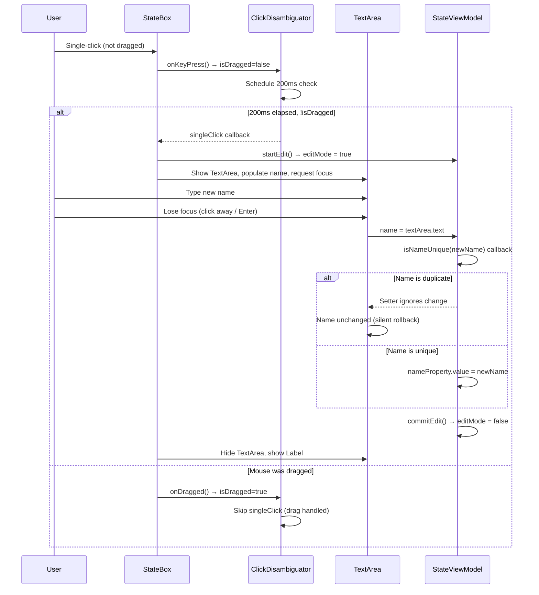

# Blueprint Editor — UX Specification

## State Boxes

### Visual Structure

The state box is a `Group` containing:
1. A `Rectangle` (filled body with rounded corners, arc = 20px) — `viewOrder = 3.0`
2. An `HBox` (name label + optional text area, Arial 16pt centered) — centered inside the rectangle with `STATE_INSET` (10px) padding

| Property | Default | Notes |
|----------|---------|-------|
| `squareWidth` | 110 | Fixed for user states; Main/Init override to same |
| `squareHeight` | 65 | Main and Init states set this to **60** |
| `arcWidth` / `arcHeight` | 20 | Corner rounding |
| Font | Arial 16pt | State name text |
| HBox size | `stateWidth - 20` × `stateHeight - 20` | Centered inside rectangle |

### State Types

| Type | Color | Position (x, y) | Editable | Edit Button Visible | Draggable |
|------|-------|------------------|----------|---------------------|-----------|
| **Main** | `LIGHTGREEN` (#90EE90) | (10, 0) | No | No | Yes |
| **Init** | `LIGHTBLUE` (#ADD8E6) | (10, 100) | No | No | Yes |
| **User** | `CORAL` (#F08080) | (10, 200) | Yes | Yes | Yes |

**Main state**: Created in `IsmaBlueprintViewModel.createMainState()` with `StateViewModel(name = "Main", x = STATE_INSET, y = 0.0, squareHeight = FIXED_STATE_HEIGHT, color = Color.LIGHTGREEN, editable = false)`. Position is **(10, 0)**.

**Init state**: Created in `IsmaBlueprintViewModel.createInitState()` with `StateViewModel(name = "init", x = STATE_INSET, y = 100.0, squareHeight = FIXED_STATE_HEIGHT, color = Color.LIGHTBLUE, editable = false, editButtonVisible = false)`. Position is **(10, 100)**.

> **Serialization note**: `BlueprintModel.empty` serializes both Main and Init at (10.0, 10.0) as defaults. On load from a saved model, `x`/`y` are set directly from `canvasPositionX`/`canvasPositionY`.

### Inline Name Editing

When a user single-clicks an editable (user) state box:

1. A 200ms delay begins via `ClickDisambiguator`. If the mouse was **not** dragged during that period:
    - `StateViewModel.startEdit()` sets `editMode = true`
    - A `TextArea` appears inside the state box (replacing the `Label`)
    - The text area is populated with the current `name`
    - Focus is requested on the text area
2. If the mouse **was** dragged during that period, `isDragged = true` and the singleClick is cancelled (drag is handled instead).
3. When the text area loses focus:
    - The `name` property is updated from the text area's content via `viewModel.name = textArea.text`
    - `StateViewModel.name` setter calls `isNameUnique(value)` callback
    - If the name is **already taken**, the setter ignores the change (silent rollback)
    - If unique, `nameProperty.value` is set to the new value
    - `StateViewModel.commitEdit()` sets `editMode = false`
    - The `TextArea` hides, the `Label` reappears

See `StateBox.kt` and `StateViewModel.kt` for the implementation.

### Double-Click Behavior

Double-clicking any state box (Main, Init, or User) opens a **text editor tab** in the main TabPane:

- Tab name: bound to the state's `nameProperty` (updates when state is renamed)
- Tab content: the state's `text` property (the LISMA body of that state)
- Changes in the text editor write back to `state.text` via `onTextChanged` callback
- Tab close: disposes the text editor instance via `editorFactory.disposeInstance()`

### Drag Interaction

Drag is handled by `CanvasView.setupStateDrag()`, which attaches event handlers directly to `StateBox` nodes:

| Event | Handler |
|-------|---------|
| `MOUSE_PRESSED` (on state) | Records `DragState` with `stateViewModel`, initial scene position, and click offset. |
| `MOUSE_DRAGGED` (on state) | Updates `stateViewModel.xProperty` and `stateViewModel.yProperty` with `max(newPos, 0.0)` clamping. |
| `MOUSE_RELEASED` (on state) | Clears `dragState`. |

Position is clamped to non-negative values: `max(pos, 0.0)`. Drag updates the ViewModel properties directly — `StateBox` layout properties are bound to these ViewModel properties.

### Editability Bindings

User state `isEditable` is dynamically bound to the editor mode: `isEditableProperty.bind(editorModeProperty.map { it.isNotEditingMode() })`.

Equivalently: `isEditable = !(isRemoveStateMode OR isAddTransitionMode)`.

When in add-transition or remove-state mode, inline name editing is disabled. The `isNotEditingMode()` function returns `true` for `Idle` and `RemoveTransition` modes, `false` for `AddTransition` and `RemoveState` modes.

## Transition Arrows (Inter-State)

### Visual Structure

A straight line from the center of `StateViewModel` A to the center of `StateViewModel` B, with an arrowhead pointing at the target. The line is offset perpendicularly to avoid overlapping the state box borders. A label showing `[Predicate/Alias]` is displayed along the line.

### Arrow Geometry

The line endpoints and arrowhead position are computed dynamically using `atan2`-based perpendicular offset (see `02-algorithms.md`). The arrow's `layoutX` and `layoutY` are bound to the midpoint between the two state centers: `layoutXProperty().bind(startViewModel.centerX().add(endViewModel.centerX()).divide(2))` and `layoutYProperty().bind(startViewModel.centerY().add(endViewModel.centerY()).divide(2))`.

When any state property changes (x, y, squareWidth, squareHeight), `updateGeometry()` recalculates line endpoints, arrowhead transform, and label offset.

### ArrowHead

- **Shape**: `Polygon(ARROWHEAD_WIDTH, -ARROWHEAD_WIDTH, -ARROWHEAD_WIDTH, 0.0, ARROWHEAD_WIDTH, ARROWHEAD_WIDTH)` = `Polygon(7, -7, -7, 0, 7, 7)` — a 14×14 isosceles triangle
- **Stroke width**: 3.0 (`ARROWHEAD_STROKE`)
- **Rotation**: dynamically rotated to match line angle: `-angle / PI * 180.0`
- **Click target**: the arrowhead group has its own `setOnMouseClicked { onArrowClick(...) }` handler

### Label Display

The label text is bound to `TransactionViewModel.displayText`: shows alias if non-blank, otherwise predicate.

- **Font**: Arial 16pt (`ARROW_LABEL_FONT_SIZE`)
- **Width**: 120px fixed (`ARROW_LABEL_FIELD_WIDTH`)
- **Position**: centered, offset perpendicular from line midpoint

### Click Handlers

| Target | Action |
|--------|--------|
| Arrow body (group level) | Calls `onClick` callback — used by `CanvasView` in RemoveTransition mode |
| Arrowhead (group level) | Single-click: opens `EditArrowPopOver` via `onArrowClick` |
| Arrow label | Part of the arrow group — handled by the group's click handler |

### Duplication Prevention

`addTransactionArrow()` in `IsmaBlueprintViewModel` checks: `canvasViewModel.transactions.any { it.startStateName == start.name && it.endStateName == end.name }`. If a transition already exists between the two states, it is silently skipped.

## Loop Transition Arrows

### Visual Structure

A loop arrow draws a **transparent circle** centered on the state (radius 40px), with a right-pointing arrowhead at the circle's right edge. The circle has no fill (transparent) and a black stroke.

### Properties

| Property | Default | Notes |
|----------|---------|-------|
| Circle radius | 40 (`LOOP_CIRCLE_RADIUS`) | Transparent fill, black stroke, strokeWidth 3 |
| Circle center X | 60 (`LOOP_CIRCLE_CENTER_X`) | Offset within the arrow's local coordinate space |
| Arrowhead X position | 100 (`LOOP_ARROWHEAD_X`) | At the right side of the circle |
| Arrowhead shape | `Polygon(0, -7, 7, 0, -7, 0)` | Points right (different from inter-state arrowhead) |
| Arrowhead stroke | 3 (`ARROWHEAD_STROKE`) | |
| Label X position | 120 (`LOOP_LABEL_X`) | To the right of the circle |
| Label Y offset | -10 (`LOOP_LABEL_Y_OFFSET`) | Slightly above center line |
| Layout X | Bound to `stateViewModel.centerX()` | Centered horizontally on the state |
| Layout Y | Bound to `stateViewModel.centerY()` | Centered vertically on the state |
| View order | 4.0 | Same as inter-state arrows |

### Label Display

Same alias-or-predicate logic as inter-state arrows: bound to `LoopTransactionViewModel.displayText`.

### Click Handlers

| Target | Action |
|--------|--------|
| Arrow body (group level) | Calls `onClick` callback — used by `CanvasView` in RemoveTransition mode |
| Arrowhead (single-click) | Opens `EditArrowPopOver` via `onArrowClick` |
| Arrowhead (double-click) | Opens text editor tab for loop content via `onArrowDoubleClick`, tab name = `"{stateName} (loop)"` |

### Loop Content Text

Unlike inter-state transitions (which have no text content), loop arrows carry a `text` property:

- This is the LISMA body text for the loop pseudo-state
- Double-clicking the arrowhead opens a text editor tab named `"{stateViewModel.name} (loop)"`
- Changes in the editor write back to `loopTxViewModel.text`
- The tab title updates when the state is renamed (bound to `stateViewModel.nameProperty.concat(" (loop)")`)

### Duplication Prevention

`addLoopArrow()` in `IsmaBlueprintViewModel` checks: `canvasViewModel.loopTransactions.any { it.stateName == state.name }`. Only one loop arrow per state is allowed.

## Edit Arrow PopOver

### Visual Structure

The PopOver is a `VBox` with default spacing, containing an "Alias (optional)" TextField (minWidth 300) and a "Predicate" TextField (minWidth 300).

| Property | Value |
|----------|-------|
| Layout | `VBox` with default spacing |
| Min width | 300px (`POPOVER_MIN_WIDTH`) |
| Padding | 10px all sides (`POPOVER_PADDING`) |
| Background | White fill, `CornerRadii(5)` (`POPOVER_CORNER_RADIUS`) |
| Effect | `DropShadow(radius=20, color=LIGHTGRAY)` (`POPOVER_SHADOW_RADIUS`) |
| Horizontal position | `translateXProperty().bind(widthProperty().divide(-2).add(x))` (centered on click x) |
| Vertical position | `translateY = y - 2` (2px above cursor) |

### Data Binding

The PopOver takes a `TransactionViewModel` and binds both text fields bidirectionally: `TextField.textProperty().bindBidirectional(viewModel.aliasProperty)` and `TextField.textProperty().bindBidirectional(viewModel.predicateProperty)`. Changes in either direction propagate immediately. Typing in the PopOver updates the ViewModel's properties in real-time.

> **Note**: Only `TransactionViewModel` is supported (not `LoopTransactionViewModel`). Loop arrows use `onClick`/`onArrowClick`/`onArrowDoubleClick` callbacks handled at the control level.

### Dismissal

The PopOver is added to `canvas.children` directly. It is removed when `MOUSE_EXITED` fires on the PopOver itself — set in `CanvasView.createTransactionNode()`: `popover.setOnMouseExited { canvas.children.remove(popover) }`. This creates a "click-away" / "hover-away" behavior: moving the mouse outside the PopOver dismisses it.

### Position Coordinate Conversion

The PopOver's x/y coordinates are converted from scene to local before use: `val canvasPos = canvas.sceneToLocal(event.sceneX, event.sceneY)` followed by `val popover = EditArrowPopOver(txViewModel, canvasPos.x, canvasPos.y)`.

## Toolbar

### Layout

The toolbar appears at the **bottom** of the `BorderPane`. It contains 4 buttons: "New state", "New transition ▼" / "Stop adding transaction", "Remove state ▼" / "Stop remove state", "Remove transition ▼" / "Stop remove transition", separated by a `Separator` between the "add" group and "remove" group.

The toolbar binds to the Diagram tab's visibility: `val visible = tabs.selectionModel.selectedItemProperty().isEqualTo(diagramTab)`, then `visibleProperty().bind(visible)` and `managedProperty().bind(visible)`.

### Button Behaviors

#### "New state"

| Action | Effect |
|--------|--------|
| Click | 1. `viewModel.resetMode()` → `EditorMode.Idle` |
| | 2. `viewModel.addState()` → creates new `StateBox` at (10, 200) |
| | 3. Auto-generate name via `NameChangingMonitor.createNextDefaultName()` |
| | 4. Register name with monitor |
| | 5. Add to `CanvasViewModel.states` |

**New state properties**:
- Color: `CORAL`
- Name: `"New state N"` where N is the next available integer
- Position: `layoutX=10`, `layoutY=200`
- Editable: yes (bound to `editorModeProperty.map { it.isNotEditingMode() }`)
- Edit button visible: yes
- Initial text: `""`

#### "New transition" / "Stop adding transaction"

Toggle button. Text changes based on `EditorMode`:

| Mode | Text |
|------|------|
| `EditorMode.Idle` | "New transition" |
| `EditorMode.AddTransition` | "Stop adding transaction" |

**Toggle logic**:

If `viewModel.editorMode is EditorMode.AddTransition`, call `viewModel.resetMode()` (Turn off). Otherwise, call `viewModel.toggleAddTransition()` (Turn on).

**When turned ON**:
1. `viewModel.toggleAddTransition()` → `resetMode()` then `editorMode = EditorMode.AddTransition(mutableSetOf())`
2. First click on a state → adds to `selectedStates` set (shown in the `AddTransition` data class)
3. Second click on a state → if same state → `addLoopArrow()`, else → `addTransactionArrow()`
4. Mode auto-resets to `Idle` after creating the transition

**During add-transaction mode**:
- User states become non-editable (`editable` bound to `editorModeProperty.map { it.isNotEditingMode() }` → `false`)
- Clicking states triggers `recordTransitionSource()` (not name editing)
- The state box click handler calls `recordTransitionSource()` on the ViewModel

#### "Remove state" / "Stop remove state"

Toggle button.

| Mode | Text |
|------|------|
| `EditorMode.Idle` | "Remove state" |
| `EditorMode.RemoveState` | "Stop remove state" |

**When turned ON**: `viewModel.toggleRemoveState()` → sets `editorMode = EditorMode.RemoveState`

**When turned OFF**: `viewModel.resetMode()` → sets `editorMode = EditorMode.Idle`

**During remove-state mode**:
- Clicking any state box triggers `onClick` handler in `IsmaBlueprintViewModel`
- `removeState(stateViewModel)` checks `stateViewModel.name == MAIN_STATE || stateViewModel.name == INIT_STATE` → returns early (Main/Init protected)
- Otherwise: `canvasViewModel.removeState(stateViewModel)` removes state + all associated transactions/loops

**`CanvasViewModel.removeState(stateViewModel)` cascade**:
1. Removes `stateViewModel` from `_states` (object identity)
2. Removes all transactions where `it.startStateName == state.name || it.endStateName == state.name`
3. Removes all loop transactions where `it.stateName == state.name`
4. Calls `tryUnregisterStateName(state.name)` to clean up the name registry

Matching for transactions/loops is by **state name** (not object reference), which handles recreated state ViewModels after load.

#### "Remove transition" / "Stop remove transition"

Toggle button.

| Mode | Text |
|------|------|
| `EditorMode.Idle` | "Remove transition" |
| `EditorMode.RemoveTransition` | "Stop remove transition" |

**When ON**: clicking the body of any arrow (inter-state or loop) removes it via `canvasViewModel.removeTransaction()` or `canvasViewModel.removeLoopTransaction()`. The arrow body click handler fires at the group level before the arrowhead's individual handler.

**When ON**: clicking an arrowhead does **not** open the PopOver — the arrow body click handler fires first (group-level handler on the arrow's `Group`).

**When OFF**: normal behavior resumes — arrow body clicks have no effect, arrowhead clicks open PopOver.

### Mode Reset

`viewModel.resetMode()` sets `editorMode = EditorMode.Idle`. Every toolbar button action calls `resetMode()` before setting or toggling its own mode. This ensures only one mode is active at a time and prevents stale mode state.

## Interaction Modes Summary

| Mode | `EditorMode` type | Arrow Body Click | Arrowhead Click | State Box Single-Click | State Box Drag |
|------|-------------------|------------------|-----------------|----------------------|----------------|
| **Default** | `EditorMode.Idle` | No effect | Open PopOver | Inline name edit | Yes |
| **Add Transition** | `EditorMode.AddTransition` | No effect | Open PopOver | Record as source/target | No |
| **Remove State** | `EditorMode.RemoveState` | No effect | Open PopOver | Remove state + arrows (Main/Init protected) | No |
| **Remove Transition** | `EditorMode.RemoveTransition` | Remove arrow | Open PopOver | Inline name edit | Yes |

## Known Limitations

| Limitation | Description |
|------------|-------------|
| **No snap-to-grid** | States can be placed at arbitrary pixel coordinates |
| **No auto-routing** | Arrows are straight lines from center to center, may pass through other states |
| **No zoom/pan** | Scrolling only; no magnification |
| **No undo/redo** | All edits are permanent once committed |
| **No arrow label editing on canvas** | Only via PopOver; no inline editing on canvas |
| **No color customization** | All colors are hardcoded (LIGHTGREEN, LIGHTBLUE, CORAL, WHITE, BLACK) |
| **No keyboard shortcuts** | The blueprint editor itself has no keyboard shortcuts; all navigation is mouse-driven |
| **No context menu** | Right-click has no handler |
| **PopOver click-away** | Moving mouse out of the PopOver dismisses it — may accidentally dismiss if cursor slips |
| **No multi-select** | No ability to select and move multiple states simultaneously |
| **No arrow snapping** | Arrow endpoints don't snap to state borders — they connect to center points |
| **Loop duplication guard is name-based** | Checks `canvasViewModel.loopTransactions.any { it.stateName == state.name }` — prevents multiple loops on the same state name |

## Color Palette

| Element | Color | JavaFX Name | Hex |
|---------|-------|-------------|-----|
| Main state | Light green | `LIGHTGREEN` | #90EE90 |
| Init state | Light blue | `LIGHTBLUE` | #ADD8E6 |
| User states | Coral | `CORAL` | #F08080 |
| Arrow lines | Black | `BLACK` | #000000 |
| Arrowhead | Black | `BLACK` | #000000 |
| PopOver background | White | `WHITE` | #FFFFFF |
| PopOver shadow | Light gray | `LIGHTGRAY` | #D3D3D3 |
| PopOver arrow text | Default | (black) | #000000 |

## Dimensions Reference

All constants are defined in `BlueprintEditorConstants.kt`.

| Element | Width | Height | Notes |
|---------|-------|--------|-------|
| User state box | 110 (`DEFAULT_STATE_WIDTH`) | 65 (`DEFAULT_STATE_HEIGHT`) | |
| Main/Init state box | 110 (`DEFAULT_STATE_WIDTH`) | 60 (`FIXED_STATE_HEIGHT`) | |
| State box corner radius | 20 (`CORNER_RADIUS`) | 20 (`CORNER_RADIUS`) | Arc width/height |
| State name font size | 16 (`STATE_NAME_FONT_SIZE`) | — | Arial |
| Arrow label font size | 16 (`ARROW_LABEL_FONT_SIZE`) | — | Arial |
| Arrow line stroke width | 3 (`ARROW_LINE_STROKE`) | — | |
| Arrowhead stroke width | 3 (`ARROWHEAD_STROKE`) | — | |
| Arrowhead polygon width | 7 (`ARROWHEAD_WIDTH`) | 7 | Half-width used as coordinates |
| Loop circle radius | 40 (`LOOP_CIRCLE_RADIUS`) | 40 | Transparent fill |
| Loop circle center X | 60 (`LOOP_CIRCLE_CENTER_X`) | — | Offset in local coords |
| Loop arrowhead X pos | 100 (`LOOP_ARROWHEAD_X`) | — | Right side of circle |
| Loop label X pos | 120 (`LOOP_LABEL_X`) | — | Right of circle |
| PopOver min width | 300 (`POPOVER_MIN_WIDTH`) | — | |
| PopOver padding | 10 (`POPOVER_PADDING`) | — | All sides |
| PopOver corner radius | 5 (`POPOVER_CORNER_RADIUS`) | — | |
| PopOver shadow radius | 20 (`POPOVER_SHADOW_RADIUS`) | — | |
| Line perpendicular offset | 10 (`ARROW_LINE_OFFSET`) | — | |
| Arrow text X offset | 75 (`ARROW_TEXT_X_OFFSET`) | — | Perpendicular |
| Arrow text Y offset | 50 (`ARROW_TEXT_Y_OFFSET`) | — | Perpendicular |
| Loop label Y offset | -10 (`LOOP_LABEL_Y_OFFSET`) | — | Slightly above center |
| Name label inset | 10 (`STATE_INSET`) | 10 (`STATE_INSET`) | HBox padding inside rectangle |
| Click delay | 200ms (`CLICK_DELAY_MS`) | — | Single vs drag disambiguation |
| Arrow label field width | 120 (`ARROW_LABEL_FIELD_WIDTH`) | — | Fixed TextField width |
