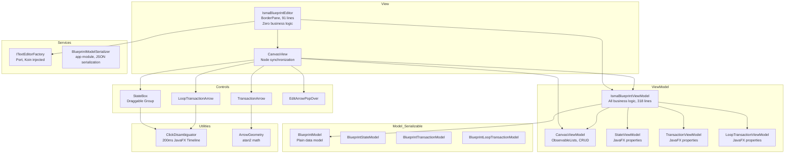
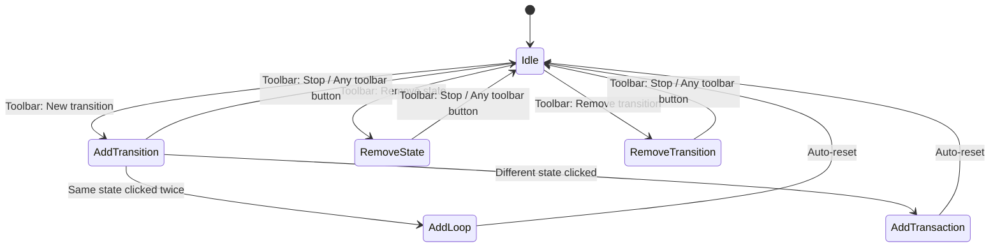

# Blueprint Editor

Visual finite-state machine editor for ISMA. Users create states as draggable boxes on an infinite canvas, draw transitions between them, and define transition predicates (conditions). The module produces a plain `BlueprintModel`; conversion into LISMA text (`BlueprintModel.toLismaText()`) lives in the app module (`ru.isma.next.app.services.blueprint.LismaCodegen`) together with the `LismaTextModel`/`CodeRegion` output types.

## Architecture Overview



The architecture follows an MVVM pattern with these layers:

- **View:** `IsmaBlueprintEditor` — a `BorderPane` with zero business logic, `CanvasView` — handles JavaFX node synchronization with `CanvasViewModel` via `ListChangeListener`
- **ViewModel:** `IsmaBlueprintViewModel` — all business logic, `CanvasViewModel` — runtime observable lists with CRUD operations, `StateViewModel` / `TransactionViewModel` / `LoopTransactionViewModel` — JavaFX property-backed view models
- **Model (plain data):** `BlueprintModel`, `BlueprintStateModel`, `BlueprintTransactionModel`, `BlueprintLoopTransactionModel` — plain data classes, no serialization annotations. LISMA code generation (`toLismaText()`, `LismaTextModel`, `CodeRegion`) lives in the app module (`ru.isma.next.app.services.blueprint.LismaCodegen` + `ru.isma.next.app.models.LismaTextModel`)
- **Controls:** `StateBox` (draggable Group), `TransactionArrow` (inter-state), `LoopTransactionArrow` (self-loop), `EditArrowPopOver` (edit dialog)
- **Utilities:** `ClickDisambiguator` (200ms JavaFX `Timeline`: single-click vs drag vs double-click), `ArrowGeometry` (atan2 math), `NameChangingMonitor` (unique name registry — owned by `CanvasViewModel`, consulted by `StateViewModel`'s `isNameUnique` callback)
- **Services:** `ITextEditorFactory` / `ITextEditor` (port, Koin injected — see "Text Editor Port"), `BlueprintModelSerializer` (JSON serialization, located in app module)

The `IsmaBlueprintEditor` depends on `IsmaBlueprintViewModel`, `CanvasView`, and `ITextEditorFactory`. `CanvasView` depends on `IsmaBlueprintViewModel` (commands) and `CanvasViewModel` (observable lists) and manages JavaFX node lifecycle. `IsmaBlueprintViewModel` depends on `CanvasViewModel`, `StateViewModel`, `TransactionViewModel`, `LoopTransactionViewModel`, `BlueprintModel`, `BlueprintEvent`, and `EditorMode` — no `javafx.scene.*` types. The controls (`StateBox`, `TransactionArrow`, `LoopTransactionArrow`, `EditArrowPopOver`) are instantiated by `CanvasView` and forward user intent to ViewModel commands. `StateBox` uses `ClickDisambiguator`, `TransactionArrow` uses `ArrowGeometry`, and `LoopTransactionArrow` uses `ClickDisambiguator`.

## Module Structure

The module source lives in `blueprint-editor/src/main/kotlin/ru/isma/next/editor/blueprint/` and contains: `IsmaBlueprintEditor.kt` (View — BorderPane layout, event subscription, zero business logic), `viewmodels/IsmaBlueprintViewModel.kt` (ViewModel — all business logic, mode-aware click routing, `BlueprintEvent` channel), `viewmodels/CanvasViewModel.kt` (Runtime: ObservableList CRUD with cascade removal, 110 lines), `viewmodels/StateViewModel.kt` (JavaFX property-backed state model, 110 lines), `viewmodels/TransactionViewModel.kt` (JavaFX property-backed transaction model, 49 lines), `viewmodels/LoopTransactionViewModel.kt` (JavaFX property-backed loop model, 58 lines), `viewmodels/EditorMode.kt` (Sealed class: Idle, AddTransition(selectedStates), RemoveState, RemoveTransition, 10 lines), `views/CanvasView.kt` (Node synchronization via ListChangeListener, 194 lines), `EditorMode.kt` (Sealed class: Idle, AddTransition, RemoveState, RemoveTransition, 10 lines), `NameChangingMonitor.kt` (Unique name registry — owned by `CanvasViewModel`), `constants/BlueprintEditorConstants.kt` (All magic numbers: dimensions, offsets, colors, 35 lines), `constants/StateNames.kt` (MAIN_STATE = "Main", INIT_STATE = "init", 4 lines), `controls/StateBox.kt` (Draggable Group bound to StateViewModel, 112 lines), `controls/TransactionArrow.kt` (Inter-state transition arrow with atan2 geometry, 117 lines), `controls/LoopTransactionArrow.kt` (Self-loop arrow with circle + arrowhead, 66 lines), `controls/EditArrowPopOver.kt` (Floating VBox with alias/predicate TextField bidirectional binding, 45 lines),  `models/BlueprintModel.kt` (Plain data model, 22 lines), `models/BlueprintStateModel.kt` (Plain data state: position, name, text, 8 lines), `models/BlueprintTransactionModel.kt` (Plain data transition: start/end names, predicate, alias, 8 lines), `models/BlueprintLoopTransactionModel.kt` (Plain data loop: state name, predicate, alias, text, 8 lines), `services/ITextEditorFactory.kt` (Port: `ITextEditorFactory` + `ITextEditor`, 16 lines), `utilities/ClickDisambiguator.kt` (200ms JavaFX Timeline: single-click vs drag vs double-click, 60 lines), `utilities/ArrowGeometry.kt` (atan2-based perpendicular offset calculation, 50 lines), `utilities/NameChangingMonitor.kt` (Unique name enforcement, 33 lines), `utilities/JavaFxExtensions.kt` (getValue/setValue delegates for JavaFX Properties — legacy, 23 lines). Tests live in `src/test/kotlin/ru/isma/next/editor/blueprint/`.t interface decoupling ViewModel from JavaFX, 41 lines), and `views/JavaFxBlueprintViewAdapter.kt` (JavaFX implementation: canvas.children.add/remove, 67 lines).

## MVVM Pattern

| Role | Class | Responsibility |
|------|-------|----------------|
| **View** | `IsmaBlueprintEditor` | Pure UI — `BorderPane` layout with `TabPane` and `ToolBar`. Subscribes to `BlueprintEvent`s to open text editor tabs. Exposes `getBlueprintModel()` and `setBlueprintModel()`. Zero business logic. |
| **View** | `CanvasView` | Node synchronization — listens to `CanvasViewModel` ObservableLists via `ListChangeListener` and creates/removes JavaFX nodes (`StateBox`, `TransactionArrow`, `LoopTransactionArrow`). Handles drag events. Forwards user intent to `IsmaBlueprintViewModel` commands. |
| **ViewModel** | `IsmaBlueprintViewModel` | All business logic — state management, canvas operations, editor modes, mode-aware click routing (`handle*Click`), one-shot events via `eventProperty` (`BlueprintEvent`), serialization/deserialization. |
| **ViewModel** | `CanvasViewModel` | Runtime observable lists of `StateViewModel`, `TransactionViewModel`, `LoopTransactionViewModel`. Provides CRUD with cascade removal, `stateByName()` lookup, and name registration via `NameChangingMonitor`. |
| **ViewModel** | `StateViewModel` | JavaFX property-backed state model with `nameProperty`, `textProperty`, `xProperty`, `yProperty`, `kind: StateKind`, `editModeProperty`, `centerX()`/`centerY()` bindings, and `isNameUnique` callback. |
| **ViewModel** | `TransactionViewModel` | JavaFX property-backed transaction with `startStateName`, `endStateName`, `predicate`, `alias`, and computed `displayText` binding. |
| **ViewModel** | `LoopTransactionViewModel` | JavaFX property-backed loop with `stateName`, `predicate`, `alias`, `text`, and computed `displayText` binding. |
| **Model (plain data)** | `BlueprintModel`, `BlueprintStateModel`, `BlueprintTransactionModel`, `BlueprintLoopTransactionModel` | Plain data classes — no serialization annotations. JSON serialization handled by `BlueprintModelSerializer` in the app module. LISMA code generation and the `LismaTextModel`/`CodeRegion` output types live in the app module. |

## Container Hierarchy

`IsmaBlueprintEditor` (BorderPane) — View contains:
- **center:** `TabPane` with a single "Diagram" tab (non-closable) containing a `ScrollPane` with a `Pane` canvas (absolute positioning, no layout manager). `CanvasView` synchronizes JavaFX nodes with `CanvasViewModel` — it listens to ObservableLists and creates/removes `StateBox`, `TransactionArrow`, and `LoopTransactionArrow` nodes. The canvas contains: `StateBox` instances (bound to StateViewModel properties), `TransactionArrow` instances (bound to TransactionViewModel and source/target StateViewModel), `LoopTransactionArrow` instances (bound to LoopTransactionViewModel and StateViewModel), and `EditArrowPopOver` (floating VBox, transient).
- **bottom:** `ToolBar` bound to Diagram tab visibility. Buttons: "New state" → viewModel.addState(), "New transition" / "Stop adding transaction" → viewModel.toggleAddTransition(), Separator, "Remove state" / "Stop remove state" → viewModel.toggleRemoveState(), "Remove transition" / "Stop remove transition" → viewModel.toggleRemoveTransition().

The toolbar binds to the Diagram tab's visibility via `visibleProperty().bind(visible)` and `managedProperty().bind(visible)`. When the Diagram tab is inactive, the toolbar is invisible and unmanaged.

## CanvasView Node Synchronization

`CanvasView` eliminates the `BlueprintViewAdapter` abstraction layer. Instead of a factory-based adapter pattern, `CanvasView` directly manages JavaFX node lifecycle by observing `CanvasViewModel`'s `ObservableList`s:

- **ObservableList listeners:** `ListChangeListener` on `states`, `transactions`, and `loopTransactions` triggers `syncStates()`, `syncTransactions()`, and `syncLoopTransactions()` respectively.
- **Sync strategy:** Each sync method iterates the current list and adds nodes for new entries, then routes stale entries through `removeState`/`removeTransaction`/`removeLoopTransaction`, which remove both the map entry and the node from the canvas.
- **Node-to-ViewModel maps:** `stateNodeMap`, `transactionNodeMap`, and `loopTransactionNodeMap` track the relationship between ViewModel instances and their corresponding JavaFX nodes.
- **Drag handling:** `CanvasView` directly handles `MOUSE_PRESSED`, `MOUSE_DRAGGED`, and `MOUSE_RELEASED` events on state boxes, updating `stateViewModel.xProperty` and `stateViewModel.yProperty` with clamped coordinates (`max(pos, 0.0)`).
- **Arrow geometry:** `TransactionArrow` and `LoopTransactionArrow` bind their visual properties directly to ViewModel properties — no adapter indirection.

## Data Model Summary

### Serializable Models (JSON persistence)

`BlueprintModel` contains `main` (BlueprintStateModel), `init` (BlueprintStateModel), `states` (Array of BlueprintStateModel), `transactions` (Array of BlueprintTransactionModel), and `loopTransactions` (Array of BlueprintLoopTransactionModel).

`BlueprintStateModel` has `canvasPositionX` (Double, layoutX on canvas), `canvasPositionY` (Double, layoutY on canvas), `name` (String, display name), and `text` (String, LISMA body text).

`BlueprintTransactionModel` has `startStateName` (String, reference by name), `endStateName` (String, reference by name), `predicate` (String, transition condition), and `alias` (String, default empty, display label shown instead of predicate when non-empty).

`BlueprintLoopTransactionModel` has `stateName` (String, state with the loop), `predicate` (String, transition condition), `alias` (String, default empty), and `text` (String, LISMA body text for the loop pseudo-state).

**LISMA output types (app module):** `LismaTextModel` (`ru.isma.next.app.models`) has `fullText` (String, generated LISMA source code) and `regions` (List of `CodeRegion`, line number mappings for error highlighting). `CodeRegion` has `name` (String, fragment name), `startLine` (Int), and `endLine` (Int). Both are produced by `BlueprintModel.toLismaText()` in `ru.isma.next.app.services.blueprint.LismaCodegen` — the blueprint-editor module no longer contains LISMA code generation.

### Editor-Only Models (runtime, not serializable)

`StateViewModel` — JavaFX property-backed model with `nameProperty`, `textProperty`, `xProperty`, `yProperty`, `squareWidthProperty`, `squareHeightProperty`, `editModeProperty`, `kind: StateKind` (MAIN/INIT/USER), `centerX()`/`centerY()` DoubleBinding, and `isNameUnique` callback for uniqueness validation.

`TransactionViewModel` — JavaFX property-backed model with `startStateName`, `endStateName`, `predicate`, `alias`, and computed `displayText` binding (shows alias if non-blank, otherwise predicate).

`LoopTransactionViewModel` — JavaFX property-backed model with `stateName`, `predicate`, `alias`, `text`, and computed `displayText` binding.
`CanvasViewModel` — Holds `ObservableList<StateViewModel>`, `ObservableList<TransactionViewModel>`, `ObservableList<LoopTransactionViewModel>`. Provides CRUD methods with cascade removal, `stateByName()` lookup, and name registration/unregistration via `NameChangingMonitor`.

## CanvasViewModel Operations

### Cascade Removal

Removing a `StateViewModel` automatically removes all associated transitions. The `removeState(state)` function removes from `_states` where `it == state` (object identity), removes from `_transactions` where `it.startStateName == state.name || it.endStateName == state.name`, and removes from `_loopTransactions` where `it.stateName == state.name`. Also calls `nameMonitor.tryUnregister(state.name)` to clean up the name registry. See `CanvasViewModel.kt` for the full implementation.

### Name Registration

`CanvasViewModel` delegates name uniqueness to a single `NameChangingMonitor("State")` instance. `addState` registers the name, `removeState` unregisters it, `clearAll` resets the monitor, and `createNextDefaultStateName()` generates `"State N"` names with an auto-incrementing counter. `StateViewModel`'s `isNameUnique` callback consults the monitor.

### Observable Lists

All three lists (`states`, `transactions`, `loopTransactions`) are exposed as immutable `ObservableList` wrappers around private `FXCollections.observableArrayList`. External code can observe changes but cannot directly modify the lists — all mutations go through the provided CRUD methods.


## Editor Modes



The editor has four mutually exclusive modes:

- **Idle** (default): Arrow body click has no effect, arrowhead click opens PopOver, state box single-click triggers inline name edit (USER states), state box drag is enabled
- **AddTransition**: Arrow body click has no effect, arrowhead click opens PopOver, state box single-click records as source/target (first click records source, second click creates transition or loop), state box drag is enabled
- **RemoveState**: Arrow body click has no effect, arrowhead click opens PopOver, state box single-click removes state and its arrows (Main/Init protected), state box drag is enabled
- **RemoveTransition**: Arrow body click removes the arrow, arrowhead click removes the arrow (no PopOver), state box single-click triggers inline name edit (USER states), state box drag is enabled

The toolbar toggle commands are self-contained — each checks the current mode and toggles between it and `Idle`, so only one mode is ever active. `addState()` resets the mode internally.

| Mode | `EditorMode` type | Arrow Body Click | Arrowhead Click | State Box Single-Click | State Box Drag |
|------|-------------------|------------------|-----------------|----------------------|----------------|
| **Default** | `EditorMode.Idle` | No effect | Open PopOver | Inline name edit (USER states) | Yes |
| **Add Transition** | `EditorMode.AddTransition(selectedStates)` | No effect | Open PopOver | Add to selectedStates list (creates transition or loop on 2nd click) | Yes |
| **Remove State** | `EditorMode.RemoveState` | No effect | Open PopOver | Remove state + arrows (Main/Init protected) | Yes |
| **Remove Transition** | `EditorMode.RemoveTransition` | Remove arrow | Remove arrow (no PopOver) | Inline name edit (USER states) | Yes |

## Module Declaration

The module `isma.ui.editor.blueprint` requires: `kotlin.stdlib`, `javafx.graphics`, `javafx.controls`, `javafx.fxml`. It exports: `ru.isma.next.editor.blueprint`, `ru.isma.next.editor.blueprint.constants`, `ru.isma.next.editor.blueprint.controls`, `ru.isma.next.editor.blueprint.models`, `ru.isma.next.editor.blueprint.services`, `ru.isma.next.editor.blueprint.utilities`, `ru.isma.next.editor.blueprint.viewmodels`, `ru.isma.next.editor.blueprint.views`. See `module-info.java` for the full declaration.

## Text Editor Port

The blueprint editor never sees a concrete text editor. It depends only on the port declared in `services/ITextEditorFactory.kt`:

```kotlin
interface ITextEditor {
    val node: Node            // docked into a Tab
    val text: Property<String> // two-way bindable text
    fun dispose()
}

interface ITextEditorFactory {
    fun createEditor(): ITextEditor
}
```

`ITextEditorFactory` is registered as a Koin `single` in the app module (`appServicesModule`) and injected into `IsmaBlueprintEditor` via `ProjectEditorPortImpl`. The app-module adapter `TextEditorFactory` (`app/src/main/kotlin/ru/isma/next/app/services/editors/TextEditorFactory.kt`) wraps `IsmaTextEditor` instances; the text-editor and blueprint-editor modules do not reference each other.

`IsmaBlueprintEditor` binds the editor to a state/loop ViewModel with `editor.text.bindBidirectional(viewModel.textProperty)`, so edits flow both ways without callbacks. One tab per state/loop is kept open (re-opening activates the existing tab); closing a tab unbinds and disposes the editor, and `IsmaBlueprintEditor.dispose()` removes all editor tabs and disposes their editors.

## JSON Serialization

JSON serialization was moved from the blueprint-editor module to the app module. `BlueprintModelSerializer` in `ru.isma.next.app.services.blueprint` handles conversion between `BlueprintModel` and JSON strings using `kotlinx.serialization`. The blueprint-editor models are plain data classes without `@Serializable` annotations. See `BlueprintModelSerializer.kt` in the app module for the full implementation.

## Index

| File | Content |
|------|---------|
| `01-architecture.md` | Canvas properties, rendering order, coordinate system, data flow (save/load), CanvasView node synchronization, project lifecycle, ViewModel classes, text editor integration |
| `02-algorithms.md` | ArrowGeometry, ClickDisambiguator, LISMA conversion algorithm, CodeRegion tracking, EditorMode, name uniqueness |
| `03-ux-spec.md` | State boxes, transition arrows, loop arrows, PopOver, toolbar, interaction modes, known limitations, color palette, dimensions reference |
