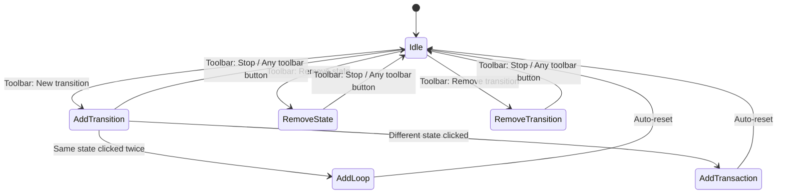

# Blueprint Editor

Visual finite-state machine editor for ISMA. Users create states as draggable boxes on an infinite canvas, draw transitions between them, and define transition predicates (conditions). The visual statechart compiles into LISMA text at build time via `BlueprintModel.toLismaText()`.

## Architecture Overview

```mermaid
graph TB
    subgraph View
        Editor[IsmaBlueprintEditor<br/>BorderPane, 112 lines<br/>Zero business logic]
    end

    subgraph ViewModel
        VM[IsmaBlueprintViewModel<br/>All business logic, 461 lines]
    end

    subgraph ViewAdapter
        VA[BlueprintViewAdapter interface<br/>JavaFxBlueprintViewAdapter impl]
    end

    subgraph Model_Serializable
        BM[BlueprintModel<br/>@Serializable JSON model]
        BSM[BlueprintStateModel]
        BTM[BlueprintTransactionModel]
        BLTM[BlueprintLoopTransactionModel]
    end

    subgraph Model_Runtime
        CVM[CanvasViewModel<br/>ObservableLists]
        LTM[LismaTextModel<br/>Generated LISMA output]
    end

    subgraph Controls
        SB[StateBox<br/>Draggable Group]
        TA[TransactionArrow]
        LTA[LoopTransactionArrow]
        EAP[EditArrowPopOver]
    end

    subgraph Utilities
        CD[ClickDisambiguator<br/>200ms coroutine]
        AG[ArrowGeometry<br/>atan2 math]
    end

    subgraph Services
        IEF[ITextEditorFactory<br/>SPI, Koin injected]
    end

    Editor --> VM
    VM --> VA
    VM --> CVM
    VM --> BM
    VM --> IEF
    VM --> CD

    VA --> SB
    VA --> TA
    VA --> LTA
    VA --> EAP

    SB --> CD
    TA --> AG
    LTA --> CD
```

The architecture follows an MVVM pattern with these layers:

- **View:** `IsmaBlueprintEditor` — a `BorderPane` with zero business logic
- **ViewModel:** `IsmaBlueprintViewModel` — all business logic
- **ViewAdapter:** `BlueprintViewAdapter` interface and `JavaFxBlueprintViewAdapter` implementation — abstraction over JavaFX canvas operations
- **Model (serializable):** `BlueprintModel`, `BlueprintStateModel`, `BlueprintTransactionModel`, `BlueprintLoopTransactionModel` — `@Serializable` data classes for JSON persistence
- **Model (runtime):** `CanvasViewModel` — runtime observable lists, `LismaTextModel` + `CodeRegion` for generated LISMA output
- **Controls:** `StateBox` (draggable Group), `TransactionArrow` (inter-state), `LoopTransactionArrow` (self-loop), `EditArrowPopOver` (edit dialog)
- **Utilities:** `ClickDisambiguator` (200ms coroutine), `ArrowGeometry` (atan2 math), `JavaFxExtensions` (property delegates)
- **Services:** `ITextEditorFactory` (SPI, Koin injected)

The `IsmaBlueprintEditor` depends on `IsmaBlueprintViewModel`, which depends on `CanvasViewModel`, `BlueprintModel`, `BlueprintViewAdapter`, `ITextEditorFactory`, and `NameChangingMonitor`. The `BlueprintViewAdapter` is implemented by `JavaFxBlueprintViewAdapter`. The controls (`StateBox`, `TransactionArrow`, `LoopTransactionArrow`, `EditArrowPopOver`) are used by the ViewModel. `StateBox` uses `ClickDisambiguator`, `TransactionArrow` uses `ArrowGeometry`, and `LoopTransactionArrow` uses `ClickDisambiguator`.

## Module Structure

The module source lives in `blueprint-editor/src/main/kotlin/ru/isma/next/editor/blueprint/` and contains: `IsmaBlueprintEditor.kt` (View — BorderPane layout, zero business logic, 112 lines), `IsmaBlueprintViewModel.kt` (ViewModel — all business logic, 461 lines), `EditorMode.kt` (Sealed class: Idle, AddTransition, RemoveState, RemoveTransition, 12 lines), `NameChangingMonitor.kt` (Unique name enforcement, 33 lines), `constants/BlueprintEditorConstants.kt` (All magic numbers: dimensions, offsets, colors, 35 lines), `constants/StateNames.kt` (MAIN_STATE = "Main", INIT_STATE = "init", 4 lines), `controls/StateBox.kt` (Draggable state box: Rectangle + HBox + inline name edit, 118 lines), `controls/TransactionArrow.kt` (Inter-state transition arrow with atan2 geometry, 137 lines), `controls/LoopTransactionArrow.kt` (Self-loop arrow with circle + arrowhead, 84 lines), `controls/EditArrowPopOver.kt` (Floating VBox with alias/predicate TextField bidirectional binding, 44 lines), `controls/CoroutineScopeProvider.kt` (Shared CoroutineScope(Dispatchers.JavaFx) singleton, 12 lines), `models/BlueprintModel.kt` (@Serializable JSON model + toLismaText() converter, 125 lines), `models/BlueprintStateModel.kt` (Serializable state: position, name, text, 11 lines), `models/BlueprintTransactionModel.kt` (Serializable transition: start/end names, predicate, alias, 11 lines), `models/BlueprintLoopTransactionModel.kt` (Serializable loop: state name, predicate, alias, text, 11 lines), `models/CanvasViewModel.kt` (Runtime: ObservableList of EditorState/EditorTransaction/EditorLoopTransaction, 69 lines), `models/LismaTextModel.kt` (Generated LISMA output: fullText + CodeRegion list, 23 lines), `services/ITextEditorFactory.kt` (SPI: createTextEditor() + disposeInstance(), 9 lines), `utilities/ClickDisambiguator.kt` (200ms delayed coroutine: single-click vs drag vs double-click, 53 lines), `utilities/ArrowGeometry.kt` (atan2-based perpendicular offset calculation, 50 lines), `utilities/JavaFxExtensions.kt` (getValue/setValue delegates for JavaFX Properties, 23 lines), `views/BlueprintViewAdapter.kt` (Abstract interface decoupling ViewModel from JavaFX, 41 lines), and `views/JavaFxBlueprintViewAdapter.kt` (JavaFX implementation: canvas.children.add/remove, 67 lines).

## MVVM Pattern

| Role | Class | Responsibility |
|------|-------|----------------|
| **View** | `IsmaBlueprintEditor` | Pure UI — `BorderPane` layout with `TabPane` and `ToolBar`. Exposes `getBlueprintModel()` and `setBlueprintModel()`. Zero business logic. |
| **ViewModel** | `IsmaBlueprintViewModel` | All business logic — state management, canvas operations, editor modes, serialization/deserialization, text editor tab lifecycle. |
| **ViewAdapter** | `BlueprintViewAdapter` / `JavaFxBlueprintViewAdapter` | Abstraction layer over JavaFX `Pane.children` operations. Enables testability and future view implementations. |
| **Model (serializable)** | `BlueprintModel`, `BlueprintStateModel`, `BlueprintTransactionModel`, `BlueprintLoopTransactionModel` | `@Serializable` data classes for JSON persistence via `kotlinx.serialization`. |
| **Model (runtime)** | `CanvasViewModel` | Holds `ObservableList<EditorState>`, `ObservableList<EditorTransaction>`, `ObservableList<EditorLoopTransaction>`. Provides CRUD with cascade removal. |
| **Model (output)** | `LismaTextModel`, `CodeRegion` | Generated LISMA text with line number mappings for error highlighting. |

## Container Hierarchy

`IsmaBlueprintEditor` (BorderPane) — View contains:
- **center:** `TabPane` with a single "Diagram" tab (non-closable) containing a `ScrollPane` with a `Pane` canvas (absolute positioning, no layout manager). The canvas contains: `mainStateBox` (fixed, LIGHTGREEN, from ViewModel), `initStateBox` (fixed, LIGHTBLUE, from ViewModel), `userStateBox[]` (from CanvasViewModel.states), `transactionArrow[]` (from CanvasViewModel.transactions), `loopTransactionArrow[]` (from CanvasViewModel.loopTransactions), and `EditArrowPopOver` (floating VBox, transient).
- **bottom:** `ToolBar` bound to Diagram tab visibility. Buttons: "New state" → viewModel.addState(), "New transition" / "Stop adding transaction" → viewModel.toggleAddTransition(), Separator, "Remove state" / "Stop remove state" → viewModel.toggleRemoveState(), "Remove transition" / "Stop remove transition" → viewModel.toggleRemoveTransition().

The toolbar binds to the Diagram tab's visibility via `visibleProperty().bind(visible)` and `managedProperty().bind(visible)`. When the Diagram tab is inactive, the toolbar is invisible and unmanaged.

## Data Model Summary

### Serializable Models (JSON persistence)

`BlueprintModel` contains `main` (BlueprintStateModel), `init` (BlueprintStateModel), `states` (Array of BlueprintStateModel), `transactions` (Array of BlueprintTransactionModel), and `loopTransactions` (Array of BlueprintLoopTransactionModel).

`BlueprintStateModel` has `canvasPositionX` (Double, layoutX on canvas), `canvasPositionY` (Double, layoutY on canvas), `name` (String, display name), and `text` (String, LISMA body text).

`BlueprintTransactionModel` has `startStateName` (String, reference by name), `endStateName` (String, reference by name), `predicate` (String, transition condition), and `alias` (String, default empty, display label shown instead of predicate when non-empty).

`BlueprintLoopTransactionModel` has `stateName` (String, state with the loop), `predicate` (String, transition condition), `alias` (String, default empty), and `text` (String, LISMA body text for the loop pseudo-state).

`LismaTextModel` has `fullText` (String, generated LISMA source code) and `regions` (List of CodeRegion, line number mappings for error highlighting).

`CodeRegion` has `name` (String, fragment name), `startLine` (Int), and `endLine` (Int).

### Editor-Only Models (runtime, not serializable)

`CanvasViewModel.EditorState` pairs `model` (BlueprintStateModel) with `node` (StateBox JavaFX node). `CanvasViewModel.EditorTransaction` pairs `startBox` (StateBox), `endBox` (StateBox), `arrow` (TransactionArrow), and `node` (Node). `CanvasViewModel.EditorLoopTransaction` pairs `stateBox` (StateBox), `arrow` (LoopTransactionArrow), and `node` (Node).

## Editor Modes



The editor has four mutually exclusive modes:

- **Idle** (default): Arrow body click has no effect, arrowhead click opens PopOver, state box single-click triggers inline name edit, state box drag is enabled
- **AddTransition**: Arrow body click has no effect, arrowhead click opens PopOver, state box single-click records as source/target (first click records source, second click creates transition or loop), state box drag is disabled
- **RemoveState**: Arrow body click has no effect, arrowhead click opens PopOver, state box single-click removes state and its arrows (Main/Init protected), state box drag is disabled
- **RemoveTransition**: Arrow body click removes the arrow, arrowhead click opens PopOver, state box single-click triggers inline name edit, state box drag is enabled

Every toolbar button action calls `resetMode()` before setting or toggling its own mode.

| Mode | `EditorMode` type | Arrow Body Click | Arrowhead Click | State Box Single-Click | State Box Drag |
|------|-------------------|------------------|-----------------|----------------------|----------------|
| **Default** | `EditorMode.Idle` | No effect | Open PopOver | Inline name edit | Yes |
| **Add Transition** | `EditorMode.AddTransition` | No effect | Open PopOver | Record as source/target | No |
| **Remove State** | `EditorMode.RemoveState` | No effect | Open PopOver | Remove state + arrows (Main/Init protected) | No |
| **Remove Transition** | `EditorMode.RemoveTransition` | Remove arrow | Open PopOver | Inline name edit | Yes |

## Module Declaration

The module `isma.ui.editor.blueprint` requires: `kotlin.stdlib`, `kotlinx.serialization.core`, `kotlinx.serialization.json`, `javafx.graphics`, `javafx.controls`, `javafx.fxml`, `kotlinx.coroutines.core`, `kotlinx.coroutines.javafx`. It exports: `ru.isma.next.editor.blueprint`, `ru.isma.next.editor.blueprint.constants`, `ru.isma.next.editor.blueprint.controls`, `ru.isma.next.editor.blueprint.models`, `ru.isma.next.editor.blueprint.services`, `ru.isma.next.editor.blueprint.utilities`, `ru.isma.next.editor.blueprint.views`. See `module-info.java` for the full declaration.

## Text Editor Factory SPI

`ITextEditorFactory` is injected via Koin at the `IsmaBlueprintEditor` construction site (app module). Each blueprint project gets its own Koin scope and factory instance with an editor pool. The interface declares `createTextEditor(text: String, onTextChanged: (String) -> Unit): Node` and `disposeInstance(node: Node)`. The implementation wraps `IsmaTextEditor` instances. Changes in the editor write back to `state.text` or `arrow.text` via the `onTextChanged` callback. See `ITextEditorFactory.kt` for the full interface.

## Index

## Index

| File | Content |
|------|---------|
| `01-architecture.md` | Canvas properties, rendering order, coordinate system, data flow (save/load), ViewAdapter pattern, project lifecycle, editor-only data classes, text editor integration |
| `02-algorithms.md` | NameChangingMonitor, ArrowGeometry, ClickDisambiguator, LISMA conversion algorithm, CodeRegion tracking, editability bindings |
| `03-ux-spec.md` | State boxes, transition arrows, loop arrows, PopOver, toolbar, interaction modes, known limitations, color palette, dimensions reference |
