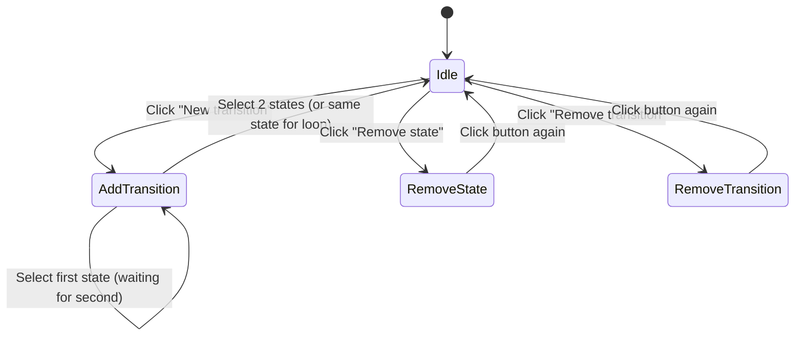

# Blueprint Editor

Visual finite-state machine editor for ISMA. Users create states as draggable boxes on an infinite canvas, draw transitions between them, and define transition predicates (conditions). The visual statechart compiles into LISMA text at build time via `BlueprintModel.toLismaText()`.

## Architecture Overview

```mermaid
graph TB
    subgraph View
        IsmaBlueprintEditor["IsmaBlueprintEditor<br/>(BorderPane — UI only)"]
    end

    subgraph ViewModel
        IsmaBlueprintViewModel["IsmaBlueprintViewModel<br/>(all business logic)"]
    end

    subgraph ViewAdapter
        BlueprintViewAdapter["BlueprintViewAdapter<br/>(interface)"]
        JavaFxBlueprintViewAdapter["JavaFxBlueprintViewAdapter<br/>(JavaFX impl)"]
    end

    subgraph Model
        BlueprintModel["BlueprintModel<br/>(@Serializable)"]
        BlueprintStateModel["BlueprintStateModel"]
        BlueprintTransactionModel["BlueprintTransactionModel"]
        BlueprintLoopTransactionModel["BlueprintLoopTransactionModel"]
        CanvasViewModel["CanvasViewModel<br/>(runtime observable lists)"]
        LismaTextModel["LismaTextModel + CodeRegion"]
    end

    subgraph Controls
        StateBox["StateBox<br/>(draggable Group)"]
        TransactionArrow["TransactionArrow<br/>(inter-state)"]
        LoopTransactionArrow["LoopTransactionArrow<br/>(self-loop)"]
        EditArrowPopOver["EditArrowPopOver<br/>(edit dialog)"]
    end

    subgraph Utilities
        ClickDisambiguator["ClickDisambiguator<br/>(200ms coroutine)"]
        ArrowGeometry["ArrowGeometry<br/>(atan2 math)"]
        JavaFxExtensions["JavaFxExtensions<br/>(property delegates)"]
    end

    subgraph Services
        ITextEditorFactory["ITextEditorFactory<br/>(SPI — Koin injected)"]
    end

    IsmaBlueprintEditor --> IsmaBlueprintViewModel
    IsmaBlueprintViewModel --> CanvasViewModel
    IsmaBlueprintViewModel --> BlueprintModel
    IsmaBlueprintViewModel --> BlueprintViewAdapter
    IsmaBlueprintViewModel --> ITextEditorFactory
    IsmaBlueprintViewModel --> NameChangingMonitor["NameChangingMonitor"]

    BlueprintViewAdapter --> JavaFxBlueprintViewAdapter

    IsmaBlueprintViewModel --> StateBox
    IsmaBlueprintViewModel --> TransactionArrow
    IsmaBlueprintViewModel --> LoopTransactionArrow
    IsmaBlueprintViewModel --> EditArrowPopOver

    StateBox --> ClickDisambiguator
    TransactionArrow --> ArrowGeometry
    LoopTransactionArrow --> ClickDisambiguator
```



## Module Structure

```
blueprint-editor/src/main/kotlin/ru/isma/next/editor/blueprint/
├── IsmaBlueprintEditor.kt              # View — BorderPane layout, zero business logic (112 lines)
├── IsmaBlueprintViewModel.kt           # ViewModel — all business logic (461 lines)
├── EditorMode.kt                       # Sealed class: Idle, AddTransition, RemoveState, RemoveTransition (12 lines)
├── NameChangingMonitor.kt              # Unique name enforcement (33 lines)
├── constants/
│   ├── BlueprintEditorConstants.kt     # All magic numbers: dimensions, offsets, colors (35 lines)
│   └── StateNames.kt                   # MAIN_STATE = "Main", INIT_STATE = "init" (4 lines)
├── controls/
│   ├── StateBox.kt                     # Draggable state box: Rectangle + HBox + inline name edit (118 lines)
│   ├── TransactionArrow.kt             # Inter-state transition arrow with atan2 geometry (137 lines)
│   ├── LoopTransactionArrow.kt         # Self-loop arrow with circle + arrowhead (84 lines)
│   ├── EditArrowPopOver.kt             # Floating VBox with alias/predicate TextField bidirectional binding (44 lines)
│   └── CoroutineScopeProvider.kt       # Shared CoroutineScope(Dispatchers.JavaFx) singleton (12 lines)
├── models/
│   ├── BlueprintModel.kt               # @Serializable JSON model + toLismaText() converter (125 lines)
│   ├── BlueprintStateModel.kt          # Serializable state: position, name, text (11 lines)
│   ├── BlueprintTransactionModel.kt    # Serializable transition: start/end names, predicate, alias (11 lines)
│   ├── BlueprintLoopTransactionModel.kt# Serializable loop: state name, predicate, alias, text (11 lines)
│   ├── CanvasViewModel.kt              # Runtime: ObservableList<EditorState/EditorTransaction/EditorLoopTransaction> (69 lines)
│   └── LismaTextModel.kt               # Generated LISMA output: fullText + CodeRegion list (23 lines)
├── services/
│   └── ITextEditorFactory.kt           # SPI: createTextEditor() + disposeInstance() (9 lines)
├── utilities/
│   ├── ClickDisambiguator.kt           # 200ms delayed coroutine: single-click vs drag vs double-click (53 lines)
│   ├── ArrowGeometry.kt                # atan2-based perpendicular offset calculation (50 lines)
│   └── JavaFxExtensions.kt             # getValue/setValue delegates for JavaFX Properties (23 lines)
└── views/
    ├── BlueprintViewAdapter.kt          # Abstract interface decoupling ViewModel from JavaFX (41 lines)
    └── JavaFxBlueprintViewAdapter.kt    # JavaFX implementation: canvas.children.add/remove (67 lines)
```

## MVVM Pattern

| Role | Class | Responsibility |
|------|-------|----------------|
| **View** | `IsmaBlueprintEditor` | Pure UI — `BorderPane` layout with `TabPane` and `ToolBar`. Exposes `getBlueprintModel()` and `setBlueprintModel()`. Zero business logic. |
| **ViewModel** | `IsmaBlueprintViewModel` | All business logic — state management, canvas operations, editor modes, serialization/deserialization, text editor tab lifecycle. |
| **ViewAdapter** | `BlueprintViewAdapter` / `JavaFxBlueprintViewAdapter` | Abstraction layer over JavaFX `Pane.children` operations. Enables testability and future view implementations. |
| **Model (serializable)** | `BlueprintModel`, `BlueprintStateModel`, `BlueprintTransactionModel`, `BlueprintLoopTransactionModel` | `@Serializable` data classes for JSON persistence via `kotlinx.serialization`. |
| **Model (runtime)** | `CanvasViewModel` | Holds `ObservableList<EditorState>`, `ObservableList<EditorTransaction>`, `ObservableList<EditorLoopTransaction>`. Provides CRUD with cascade removal. |
| **Model (output)** | `LismaTextModel`, `CodeRegion` | Generated LISMA text with line number mappings for error highlighting. |

## Container Hierarchy

```
IsmaBlueprintEditor (BorderPane) — View
├── center: TabPane
│   └── Tab "Diagram" (non-closable)
│       └── ScrollPane
│           └── Pane (canvas — absolute positioning, no layout manager)
│               ├── mainStateBox (fixed, LIGHTGREEN, from ViewModel)
│               ├── initStateBox (fixed, LIGHTBLUE, from ViewModel)
│               ├── userStateBox[] (from CanvasViewModel.states)
│               ├── transactionArrow[] (from CanvasViewModel.transactions)
│               ├── loopTransactionArrow[] (from CanvasViewModel.loopTransactions)
│               └── EditArrowPopOver (floating VBox, transient)
└── bottom: ToolBar (bound to Diagram tab visibility)
    ├── "New state" → viewModel.addState()
    ├── "New transition" / "Stop adding transaction" → viewModel.toggleAddTransition()
    ├── Separator
    ├── "Remove state" / "Stop remove state" → viewModel.toggleRemoveState()
    └── "Remove transition" / "Stop remove transition" → viewModel.toggleRemoveTransition()
```

The toolbar binds to the Diagram tab's visibility: `visibleProperty().bind(visible)` and `managedProperty().bind(visible)`. When the Diagram tab is inactive, the toolbar is invisible and unmanaged.

## Data Model Summary

### Serializable Models (JSON persistence)

```
BlueprintModel
├── main: BlueprintStateModel              # Fixed main state
├── init: BlueprintStateModel              # Fixed init state
├── states: Array<BlueprintStateModel>     # User-created states
├── transactions: Array<BlueprintTransactionModel>  # Inter-state transitions
└── loopTransactions: Array<BlueprintLoopTransactionModel>  # Self-loop transitions

BlueprintStateModel
├── canvasPositionX: Double                # layoutX on canvas
├── canvasPositionY: Double                # layoutY on canvas
├── name: String                           # Display name
└── text: String                           # LISMA body text for this state

BlueprintTransactionModel
├── startStateName: String                 # Reference by name (not object)
├── endStateName: String                   # Reference by name
├── predicate: String                      # Transition condition
└── alias: String = ""                     # Display label (if non-empty, shown instead of predicate)

BlueprintLoopTransactionModel
├── stateName: String                      # State with the loop
├── predicate: String                      # Transition condition
├── alias: String = ""                     # Display label
└── text: String                           # LISMA body text for the loop pseudo-state

LismaTextModel
├── fullText: String                       # Generated LISMA source code
└── regions: List<CodeRegion>              # Line number mappings for error highlighting

CodeRegion
├── name: String                           # Fragment name
├── startLine: Int
└── endLine: Int
```

### Editor-Only Models (runtime, not serializable)

```
CanvasViewModel.EditorState
├── model: BlueprintStateModel
└── node: Node                             # StateBox JavaFX node

CanvasViewModel.EditorTransaction
├── startBox: StateBox
├── endBox: StateBox
├── arrow: TransactionArrow
└── node: Node

CanvasViewModel.EditorLoopTransaction
├── stateBox: StateBox
├── arrow: LoopTransactionArrow
└── node: Node
```

## Editor Modes



| Mode | `EditorMode` type | Arrow Body Click | Arrowhead Click | State Box Single-Click | State Box Drag |
|------|-------------------|------------------|-----------------|----------------------|----------------|
| **Default** | `EditorMode.Idle` | No effect | Open PopOver | Inline name edit | Yes |
| **Add Transition** | `EditorMode.AddTransition` | No effect | Open PopOver | Record as source/target | No |
| **Remove State** | `EditorMode.RemoveState` | No effect | Open PopOver | Remove state + arrows (Main/Init protected) | No |
| **Remove Transition** | `EditorMode.RemoveTransition` | Remove arrow | Open PopOver | Inline name edit | Yes |

## Module Declaration

```java
module isma.ui.editor.blueprint {
    requires kotlin.stdlib;
    requires kotlinx.serialization.core;
    requires kotlinx.serialization.json;
    requires javafx.graphics;
    requires javafx.controls;
    requires javafx.fxml;
    requires kotlinx.coroutines.core;
    requires kotlinx.coroutines.javafx;

    exports ru.isma.next.editor.blueprint;
    exports ru.isma.next.editor.blueprint.constants;
    exports ru.isma.next.editor.blueprint.controls;
    exports ru.isma.next.editor.blueprint.models;
    exports ru.isma.next.editor.blueprint.services;
    exports ru.isma.next.editor.blueprint.utilities;
    exports ru.isma.next.editor.blueprint.views;
}
```

## Text Editor Factory SPI

`ITextEditorFactory` is injected via Koin at the `IsmaBlueprintEditor` construction site (app module). Each blueprint project gets its own Koin scope and factory instance with an editor pool:

```kotlin
interface ITextEditorFactory {
    fun createTextEditor(text: String, onTextChanged: (String) -> Unit): Node
    fun disposeInstance(node: Node)
}
```

The implementation wraps `IsmaTextEditor` instances. Changes in the editor write back to `state.text` or `arrow.text` via the `onTextChanged` callback.

## Index

| File | Content |
|------|---------|
| `01-architecture.md` | Canvas properties, rendering order, coordinate system, data flow (save/load), ViewAdapter pattern, project lifecycle, editor-only data classes, text editor integration |
| `02-algorithms.md` | NameChangingMonitor, ArrowGeometry, ClickDisambiguator, LISMA conversion algorithm, CodeRegion tracking, editability bindings |
| `03-ux-spec.md` | State boxes, transition arrows, loop arrows, PopOver, toolbar, interaction modes, known limitations, color palette, dimensions reference |
