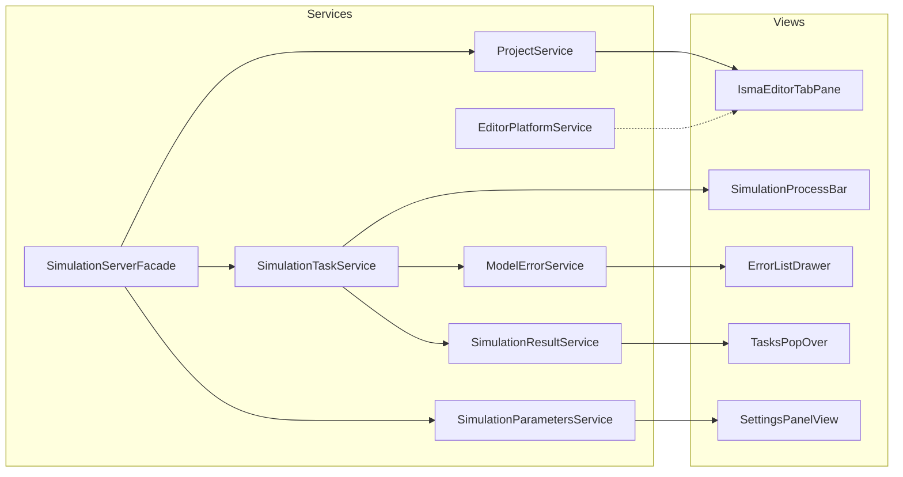
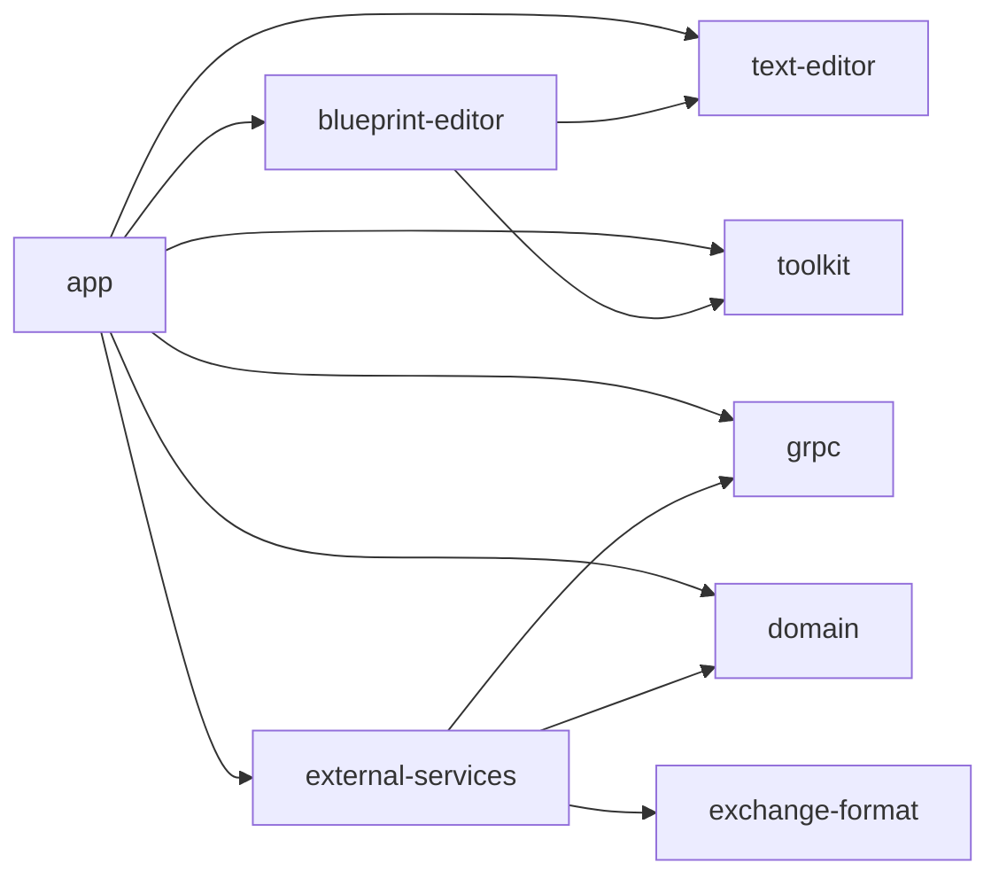

# Architecture

## Purpose

The `app` module is the application layer — it contains the JavaFX UI components, business logic services, project models, view models, and the application entry point. It wires together the domain models, external services, and editor modules into a cohesive desktop application.

## Module Structure

```
app/src/main/kotlin/ru/isma/next/app/
├── launcher/                     # IsmaApplication, Koin DI root, GrinProcessLauncher
├── di/                           # Koin DI module definitions (services + views)
│   ├── serviceModules.kt         # service-layer DI (replaces services/koin/KoinExtentions.kt)
│   └── viewModules.kt            # view-layer DI (replaces views/koin/KoinExtensions.kt)
├── models/
│   ├── ErrorViewModel.kt
│   ├── preferences/              # PreferencesModel, WindowPreferencesModel
│   ├── projects/                 # IProjectModel, LismaProjectModel, BlueprintProjectModel
│   │   └── LismaTextModel.kt     # CodeRegion for error line tracking
│   └── simulation/               # SimulationParametersModel, CompletedSimulationModel
│       ├── SaveTarget.kt         # MEMORY / FILE enum
│       ├── SimulationTask.kt     # Task model with status/progress/error/result
│       └── CompletedSimulationModel.kt
├── services/
│   ├── ModelErrorService.kt
│   ├── editors/                  # SyntaxHighlighterService, TextEditorFactory
│   ├── preferences/              # PreferencesProvider
│   ├── project/                  # IProjectService, ProjectService, ProjectFileService, LismaPdeService
│   │   └── LismaPdeTranslationResult.kt  # Success/Failed sealed interface
│   └── simulation/               # ISimulationService, ISimulationTaskService, SimulationService, SimulationResultService, SimulationParametersService
├── viewmodels/                   # Plain JavaFX property-based view models for settings
├── extensions/                   # ButtonExtensions.kt
└── constants/                    # FileExtensions.kt (file type constants)
├── views/
│   ├── MainView.kt               # Main BorderPane layout
│   ├── dialogs/                  # ItemsPickerDialog
│   ├── layout/                   # Drawer
│   ├── settings/                 # Settings panel views
│   ├── tabpane/                  # IsmaEditorTabPane
│   └── toolbars/                 # MenuBar, ToolBar, ErrorList, ProcessBar
```

## Module Configuration

**File:** [`build.gradle.kts`](../../app/build.gradle.kts)

Applies plugins: `kotlin.jvm`, `kotlin.serialization`, `java.modules`, `javafx`, `application`. Sets `mainModule` to `isma.ui.app.main` and `mainClass` to `ru.isma.next.app.launcher.IsmaApplication`. JVM args include `--enable-native-access=javafx.graphics` and `--enable-native-access=io.netty.common`.

JavaFX modules: `javafx.controls`, `javafx.fxml`. Key dependencies: Koin, ControlsFX, fxmisc.richtext, Ikonli (Material2 icons), gRPC-Netty with Linux Epoll, Kotlinx Coroutines (JavaFX + serialization).

## Application Entry Point

**File:** [`IsmaApplication.kt`](../../app/src/main/kotlin/.../launcher/IsmaApplication.kt)

JavaFX `Application` entry point with Koin DI root. Resolves 4 dependencies via injection: `ProjectFileService`, `PreferencesProvider`, `MainView`, `SimulationServerFacade`.

**Lifecycle:**

1. `init` block — starts Koin DI, warms up the server (starts process + creates clients)
2. `start()` — creates `Scene(mainView)`, initializes window from saved preferences, opens last projects
3. `stop()` — saves window state + last opened file paths to preferences, shuts down server

**File:** [`Launcher.kt`](../../app/src/main/kotlin/.../launcher/Launcher.kt)

Simple `main()` entry point that calls `Application.launch(IsmaApplication::class.java)`.

**File:** [`GrinProcessLauncher.kt`](../../app/src/main/kotlin/.../launcher/GrinProcessLauncher.kt)

Launches the GRIN chart viewer as a child process. Resolves script path from `ISMA_GRIN_SCRIPT` env var or `isma.grin.script` system property. Arguments: `--result-file`, `--x-axis`, `--charts`.

## DI Dependency Graph



## DI Wiring

### Service Module

**File:** [`serviceModules.kt`](../../app/src/main/kotlin/.../di/serviceModules.kt)

Defines `simulationServerModule` (SimulationServerManager, SimulationServerFacade) and `appServicesModule` (UiThreadExecutor, EditorPlatformService, ProjectService, ProjectFileService, ModelErrorService, LismaPdeService, SimulationParametersService, ISimulationTaskService, SimulationResultService, ISimulationService, PreferencesProvider).

All registrations use `single()` (singleton) lifecycle.

**Key patterns:**
- `SimulationTaskService` takes 4 parameters (includes `UiThreadExecutor`)
- `SimulationResultService` takes 3 parameters (includes `UiThreadExecutor`)
- `SimulationService` takes 3 parameters (`projectService`, `simulationTaskService`, `simulationParametersService`)
- Interfaces are registered (`ISimulationTaskService`, `ISimulationService`, `IProjectService`) rather than concrete classes
- `UiThreadExecutor` provides JavaFX thread execution abstraction

### Launcher Module

**File:** [`DependencyInjectionRootModule.kt`](../../app/src/main/kotlin/.../launcher/DependencyInjectionRootModule.kt)

Defines `ismaKoinStart()` which starts Koin with modules in order: `simulationServerModule`, `appServicesModule`, `grinProcessLauncherModule`, then view modules (`toolbarsModule`, `mainViewModule`, `settingsPanelModule`, `editorTabPaneModule`, `lismaTextEditorModule`, `blueprintEditorModule`).

### View Module

**File:** [`viewModules.kt`](../../app/src/main/kotlin/.../di/viewModules.kt)

Defines editor modules, toolbar components, settings panel views, and main view.

- `editorModule` — SyntaxHighlighterService, RemoteLismaHighlightingService
- `lismaTextEditorModule` — scoped `LismaProjectDataProvider`, scoped `IsmaTextEditor` (onClose dispose), Node qualifier
- `blueprintEditorModule` — scoped `ITextEditorFactory` (TextEditorFactory), factory `IsmaTextEditor` (onClose dispose), scoped `BlueprintProjectDataProvider`, scoped `IsmaBlueprintEditor`, Node qualifier
- `toolbarsModule` — singletons for MenuBar, ToolBar, ProcessBar, ErrorListTable, ErrorListDrawer; factory for TasksPopOver
- `editorTabPaneModule` — single `IsmaEditorTabPane`
- `settingsPanelModule` — singletons for CauchyInitialsView, EventDetectionView, MethodSettingsView, ResultSavingView, SettingsPanelView
- `mainViewModule` — single `MainView`

All registrations use `single()` (singleton) except `TasksPopOver` which uses `factory()` (created each time). Editor components within project scopes use `scopedOf(::)` for per-project lifecycle.

**Key distinction:** `lismaTextEditorModule` uses `scopedOf(::IsmaTextEditor)` (one instance per LISMA project scope), while `blueprintEditorModule` uses `factoryOf(::IsmaTextEditor)` (new instance each time) because blueprint projects need multiple text editor tabs (one per state/loop content editor).

**New in `toolbarsModule`:** `ErrorListDrawer` is now registered as a singleton, injected into `MainView`.

## Component Dependency Graph



The `app` module depends on all other isma-ui modules. `external-services` depends on `grpc` and `domain`. The `domain` module is the leaf — pure Kotlin with only kotlinx-coroutines as a dependency.

## Java Module System

Each module declares a `module-info.java` with appropriate `exports`:

| Module | Module Name | Exports |
| --- | --- | --- |
| `app` | `isma.ui.app.main` | `ru.isma.next.app.launcher` |
| `domain` | `isma.ui.domain` | `ru.isma.next.domain.models` |
| `external-services` | `isma.ui.external.services` | `ru.isma.next.external`, `ru.isma.next.external.dtos` |
| `grpc` | `isma.ui.grpc` | `ru.nstu.isma.contracts.v1.simulation_service`, `ru.nstu.isma.contracts.v1.compiler_service` |
| `text-editor` | `isma.ui.editor.text` | `ru.isma.next.editor.text`, `services`, `services.contracts` |
| `blueprint-editor` | `isma.ui.editor.blueprint` | `ru.isma.next.editor.blueprint`, `ru.isma.next.editor.blueprint.constants`, `ru.isma.next.editor.blueprint.controls`, `ru.isma.next.editor.blueprint.models`, `ru.isma.next.editor.blueprint.services`, `ru.isma.next.editor.blueprint.utilities`, `ru.isma.next.editor.blueprint.views` |
| `toolkit` | `isma.ui.toolkit` | `ru.isma.javafx.extensions.controls`, `ru.isma.javafx.extensions.coroutines`, `ru.isma.javafx.extensions.coroutines.flow`, `ru.isma.javafx.extensions.helpers`, `ru.isma.javafx.extensions.viewmodel` |

**Requires notes:**
- `text-editor` requires `javafx.graphics` (not `javafx.controls`)
- `external-services` requires `io.netty.transport.unix.common`, `io.netty.common`, `io.netty.buffer`, `io.netty.codec`

**Opens declarations (app module):**
The `app` module uses `opens` (not `exports`) for packages that need reflection access:
- `opens ru.isma.next.app.models.preferences to kotlinx.serialization` — required for JSON serialization of `WindowPreferencesModel` and `DefaultFilesPreferencesModel`
- `opens ru.isma.next.app.models to javafx.base` — required for JavaFX property binding reflection

## Toolkit — Shared JavaFX Helpers

The `toolkit` module provides shared JavaFX utilities used across modules. These are helpers, not infrastructure.

| Helper | Package | Purpose |
| --- | --- | --- |
| `UiThreadExecutor` | `coroutines/` | Abstraction over `Platform.runLater` |
| `JavaFxUiThreadExecutor` | `coroutines/` | JavaFX implementation |
| `TestUiThreadExecutor` | `coroutines/` | Test implementation |
| `CollectionsExtensions` | `coroutines/flow/` | `ObservableList/Set` → `Flow` bridges (`addedAsFlow`, `changeAsFlow`) |
| `PropertiesGrid` | `controls/` | Reusable label + control layout |
| `ComboBox` extensions | `controls/` | Custom ComboBox extensions |
| `ListView` cell factory | `controls/` | ListView cell factory |
| `Properties` | `helpers/` | Property utility helpers |
| `BaseViewModel` | `viewmodel/` | Abstract base VM with `StateFlow` lifecycle tracking |

**Source structure:**
```
toolkit/src/main/kotlin/ru/isma/javafx/extensions/
├── controls/
│   ├── PropertiesGrid.kt       # Reusable property grid (label + control layout)
│   ├── ComboBox.kt             # Custom ComboBox extensions
│   └── ListViewExtensions.kt   # ListView cell factory
├── coroutines/
│   ├── UiThreadExecutor.kt     # UI thread execution interface
│   ├── JavaFxUiThreadExecutor.kt  # JavaFX implementation
│   ├── TestUiThreadExecutor.kt   # Test implementation
│   └── flow/
│       └── CollectionsExtensions.kt  # ObservableList/Set → Flow bridges
├── helpers/
│   └── Properties.kt           # Property utility helpers
└── viewmodel/
    └── BaseViewModel.kt        # Abstract base VM with StateFlow lifecycle tracking
```
