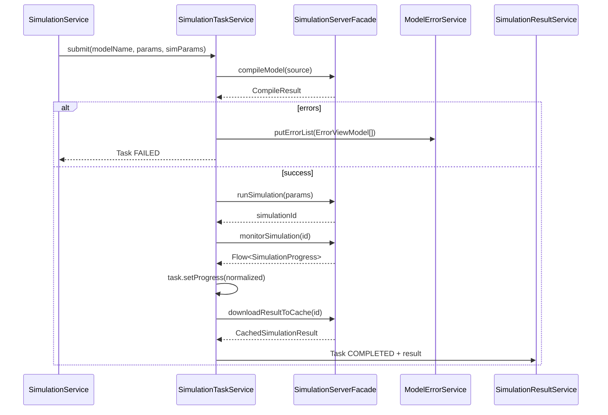
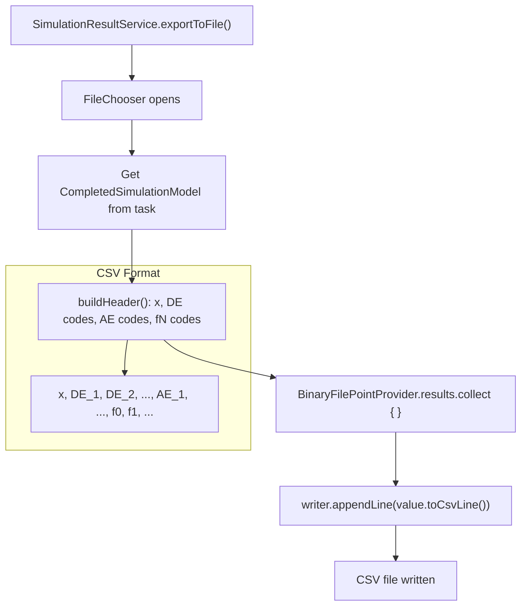
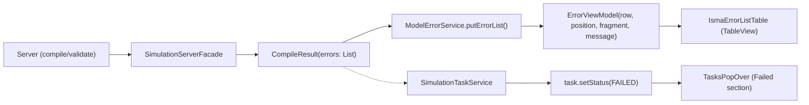

# Services

## Purpose

This document covers service algorithms, data flows, component lifecycle, error propagation, and default configuration values. Services form the business logic layer between the UI views and the external server communication layer.

## Service Overview

### IProjectService / ProjectService

**File:** [`IProjectService.kt`](../../app/src/main/kotlin/.../services/project/IProjectService.kt)

Interface declares: `projects: ObservableSet<IProjectModel>`, `activeProject: IProjectModel?`, `createNewBlueprint()`, `createNew()`, `addText()`, `addBlueprint()`, `close()`, `closeAll()`, `getAllProjects()`.

`ProjectService` implements `IProjectService`. The `getAllProjects()` method returns all projects as a snapshot array. Manages the observable set of projects. `IsmaEditorTabPane` observes this set to create/delete tabs.

### ProjectFileService

**File:** [`ProjectFileService.kt`](../../app/src/main/kotlin/.../services/project/ProjectFileService.kt)

FileChooser-based open/save operations. Supports three file types:
- `*.im2` — legacy ISMA project (marked TODO for backward compatibility)
- `*.iscm2` — text-based LISMA project → `LismaProjectModel`
- State chart project → `BlueprintProjectModel` (JSON-encoded `BlueprintModel`)

Save operations write `project.lismaText` or `Json.encodeToString(project.blueprint)` to file.

### ISimulationService / SimulationService (thin coordinator)

**File:** [`ISimulationService.kt`](../../app/src/main/kotlin/.../services/simulation/ISimulationService.kt)

A 36-line thin wrapper that delegates to `SimulationTaskService`. Constructor takes `projectService`, `simulationTaskService`, `simulationParametersService`. Methods: `simulate()` (snaps parameters, resolves active project, calls `SimulationTaskService.submit()`), `stopSimulation()` (cancels task). Companion exposes `SimulationScope` from `SimulationTaskService`.

### ISimulationTaskService / SimulationTaskService (full lifecycle)

**File:** [`ISimulationTaskService.kt`](../../app/src/main/kotlin/.../services/simulation/ISimulationTaskService.kt)

The complete simulation pipeline (151 lines). Constructor takes `serverFacade`, `modelErrorService`, `projectService`, `uiThreadExecutor`. Owns `val tasks: ObservableList<SimulationTask> = SimulationTask.ALL` and manages the 4-phase lifecycle:

| Phase | Method | Description |
|-------|--------|-------------|
| Compile | `serverFacade.compileModel(sourceCode)` | Populates `ModelErrorService` with errors; fails fast if errors exist |
| Run | `serverFacade.runSimulation(runParams)` | Starts simulation, adds task to `tasks` list |
| Monitor | `serverFacade.monitorSimulation(simulationId, 0.01)` | Collects `Flow<SimulationProgress>`, normalizes to 0.0–1.0, calls `task.setProgress()` |
| Download | `serverFacade.downloadResultToCache(simulationId)` | Creates `CompletedSimulationModel`, sets `task.result` and `task.setStatus(COMPLETED)` |

Uses `SimulationScope` — a global `CoroutineScope` backed by `Executors.newVirtualThreadPerTaskExecutor().asCoroutineDispatcher()` with `SupervisorJob()`. Each job is tracked in `currentJobs: MutableMap<SimulationTask, Job>`. Methods: `submit(modelName, params, simulationParameters)`, `cancelTask(task)`.

### ISimulationResultService / SimulationResultService

**File:** [`ISimulationResultService.kt`](../../app/src/main/kotlin/.../services/simulation/ISimulationResultService.kt)

Manages completed simulation results. Constructor takes `SimulationTaskService`, `GrinProcessLauncher`, and `UiThreadExecutor` (3 params).

| Method | Description |
| --- | --- |
| `removeResult(task)` | Removes task from `SimulationTask.ALL`, clears `task.result` |
| `showChart(task)` | Opens Grin chart viewer with axis picker dialog |
| `exportToFile(task, file)` | Exports to CSV asynchronously |

CSV export uses `BinaryFilePointProvider` to stream points via coroutine flow, writing to a buffered `Writer` on `Dispatchers.IO`. Uses `ResultServiceScope` (`CoroutineScope(Dispatchers.Default)`).

### LismaPdeService

**File:** [`LismaPdeService.kt`](../../app/src/main/kotlin/.../services/project/LismaPdeService.kt)

Validates LISMA source code via `serverFacade.validateModel()` and populates `ModelErrorService` with `ErrorViewModel` entries. Returns a sealed interface: `LismaPdeTranslationResult` with implementations `SuccessTranslation` and `FailedTranslation` (both data objects).

### SyntaxHighlighterService

**File:** [`editors/SyntaxHighlighterService.kt`](../../app/src/main/kotlin/.../services/editors/SyntaxHighlighterService.kt)

Provides syntax highlighting for the text editor. Delegates to `RemoteLismaHighlightingService` which calls `serverFacade.highlightSource()` to get token positions and kinds from the server.

### TextEditorFactory

**File:** [`editors/TextEditorFactory.kt`](../../app/src/main/kotlin/.../services/editors/TextEditorFactory.kt)

Factory for creating and disposing `IsmaTextEditor` instances. Used by the blueprint editor to create text editor tabs for state/loop content editing. Implements `ITextEditorFactory` interface from the blueprint-editor module.

### ModelErrorService

**File:** [`ModelErrorService.kt`](../../app/src/main/kotlin/.../services/ModelErrorService.kt)

Tracks compilation and validation errors in an `ObservableList<ErrorViewModel>`. Populated by `LismaPdeService` (validation) and `SimulationService` (compilation errors). Consumed by `IsmaErrorListTable` for display.

### SimulationParametersService

**File:** [`SimulationParametersService.kt`](../../app/src/main/kotlin/.../services/simulation/SimulationParametersService.kt)

Manages simulation parameter view models and provides store/load persistence as JSON files.

| Property | Type | Default |
| --- | --- | --- |
| `cauchyInitials` | `CauchyInitialsViewModel` | start=0.0, end=10.0, step=0.1 |
| `integrationMethod` | `IntegrationMethodParametersViewModel` | accuracy=0.1, server="localhost", port=7890, selectedMethod=first from list |
| `eventDetection` | `EventDetectionParametersViewModel` | gamma=0.8, lowBorder=0.001 |
| `resultSaving` | `ResultSavingParametersViewModel` | target=MEMORY |
| `resultProcessing` | `ResultProcessingParametersViewModel` | tolerance=20.0, selectedSimplifyMethod="Radial-Distance" |
| `integrationMethods` | `ObservableList<String>` | From server |
| `simplifyMethods` | `ObservableList<String>` | "Radial-Distance", "Douglas-Peucker" |

**Methods:**
- `store()` — opens FileChooser, serializes snapshot to JSON
- `load()` — opens FileChooser, deserializes JSON into view models
- `snapshot()` — captures current view model state into `SimulationParametersModel`
- `commit(model)` — applies `SimulationParametersModel` to all view models

File extension filter: `*.params.json` (constant from `FileExtentions.kt`).

### PreferencesProvider

**File:** [`PreferencesProvider.kt`](../../app/src/main/kotlin/.../services/preferences/PreferencesProvider.kt)

JSON file persistence using `kotlinx.serialization`. Constructor takes `settingsFilePath`. Property `preferences: PreferencesModel` with private setter, initialized via `load()`. Methods: `commit(windowPreferences)`, `commit(defaultFilesPreferences)`. Stores `WindowPreferencesModel` (geometry) and `DefaultFilesPreferencesModel` (last opened paths).

## Service Data Flow



## CSV Export Algorithm



CSV header: `x, [DE column names], [AE column names], f0, f1, ..., fN`. Each subsequent row = one simulation time step. Runs on `Dispatchers.IO` via `ResultServiceScope` (`CoroutineScope(Dispatchers.Default)`).

## Parameter Snapshot / Commit Pattern

```mermaid
flowchart LR
    subgraph ViewModel Layer
        VM1["CauchyInitialsViewModel"]
        VM2["IntegrationMethodParametersViewModel"]
        VM3["EventDetectionParametersViewModel"]
        VM4["ResultSavingParametersViewModel"]
    end

    subgraph Service Layer
        ParamsSvc["SimulationParametersService"]
    end

    subgraph Model Layer
        SimModel["SimulationParametersModel"]
        RunParams["RunSimulationParams"]
    end

    VM1 -->|snapshot()| SimModel
    VM2 -->|snapshot()| SimModel
    VM3 -->|snapshot()| SimModel
    VM4 -->|snapshot()| SimModel

    SimModel -->|toRunSimulationParams()| RunParams

    SimModel -->|commit(model)| VM1
    SimModel -->|commit(model)| VM2
    SimModel -->|commit(model)| VM3
    SimModel -->|commit(model)| VM4
```

- **Snapshot flow (ViewModel → Model → Server):** `snapshot()` on each ViewModel captures `Simple*Property` values into data class → `SimulationParametersService.snapshot()` assembles `SimulationParametersModel` → `toRunSimulationParams()` converts to `RunSimulationParams` → sent to server via gRPC
- **Commit flow (Model → ViewModel):** `commit(model)` on each ViewModel applies values from `SimulationParametersModel` to `Simple*Property` instances

## Error Propagation Flow



Error sources:
- **Compilation errors** (Phase 1 of simulation): `CompilationErrorDto[]` → `ErrorViewModel[]` → `ModelErrorService` → `IsmaErrorListTable`
- **Validation errors** (Verify button): `LismaPdeService` → `ModelErrorService` → `IsmaErrorListTable`
- **Simulation failures** (any phase): `task.setStatus(FAILED)` → `task.setError(message)` → `TasksPopOver` (Failed section)

## Component Lifecycle

```mermaid
stateDiagram-v2
    [*] --> Created: ProjectService.createNew() / createNewBlueprint()
    Created --> ScopeCreated: KoinScopeComponent.createScope()
    ScopeCreated --> Injected: scopedOf(::LismaProjectDataProvider)\nscopedOf(::IsmaTextEditor)
    Injected --> TabCreated: IsmaEditorTabPane observes addedAsFlow()
    TabCreated --> Active: Tab selection → activeProject = project
    Active --> Closed: Tab closeRequest → projectService.close()
    Closed --> Disposed: scope.close()\n→ IsmaTextEditor.dispose()
    Disposed --> [*]

    state ScopeCreated {
        [*] --> LISMA: LismaProjectModel\n→ LismaProjectDataProvider\n→ IsmaTextEditor (scoped)\n→ Node qualifier
        [*] --> Blueprint: BlueprintProjectModel\n→ BlueprintProjectDataProvider\n→ IsmaBlueprintEditor (scoped)\n→ ITextEditorFactory (scoped)\n→ IsmaTextEditor (factory)\n→ Node qualifier
    }
```

**Project creation:**
1. `ProjectService.createNew()` → `LismaProjectModel` or `ProjectService.createNewBlueprint()` → `BlueprintProjectModel`
2. Project model implements `KoinScopeComponent` — creates its own Koin scope
3. Scoped dependencies injected: data provider, editor instance, editor node qualifier
4. `IsmaEditorTabPane` observes `projects.addedAsFlow()` and creates a `Tab`

**Project close:**
1. Tab close request → `projectController.close(project)`
2. `projects.remove(project)` + `project.dispose()`
3. `scope.close()` → triggers `onClose` callbacks for all scoped instances
4. `IsmaTextEditor.dispose()` called on scoped factory instances

## Error Handling

| Scenario | Behavior |
| --- | --- |
| Compilation errors | `CompilationErrorDto[]` → `ErrorViewModel[]` → `ModelErrorService.errors` → `IsmaErrorListTable` |
| Simulation compile failure | `task.setStatus(FAILED)`, `task.setError("Compilation failed: ...")` |
| Simulation run failure | `task.setStatus(FAILED)`, `task.setError("Monitor error: ...")` |
| Simulation download failure | `task.setStatus(FAILED)`, `task.setError("Download error: ...")` |
| No active project | `task.setStatus(FAILED)`, `task.setError("No active project")` |
| Server process not found | `IllegalStateException` — "isma-server script not found at: $scriptPath" |
| Missing env/property | `IllegalStateException` — "Neither environment variable ... nor system property ... is set" |
