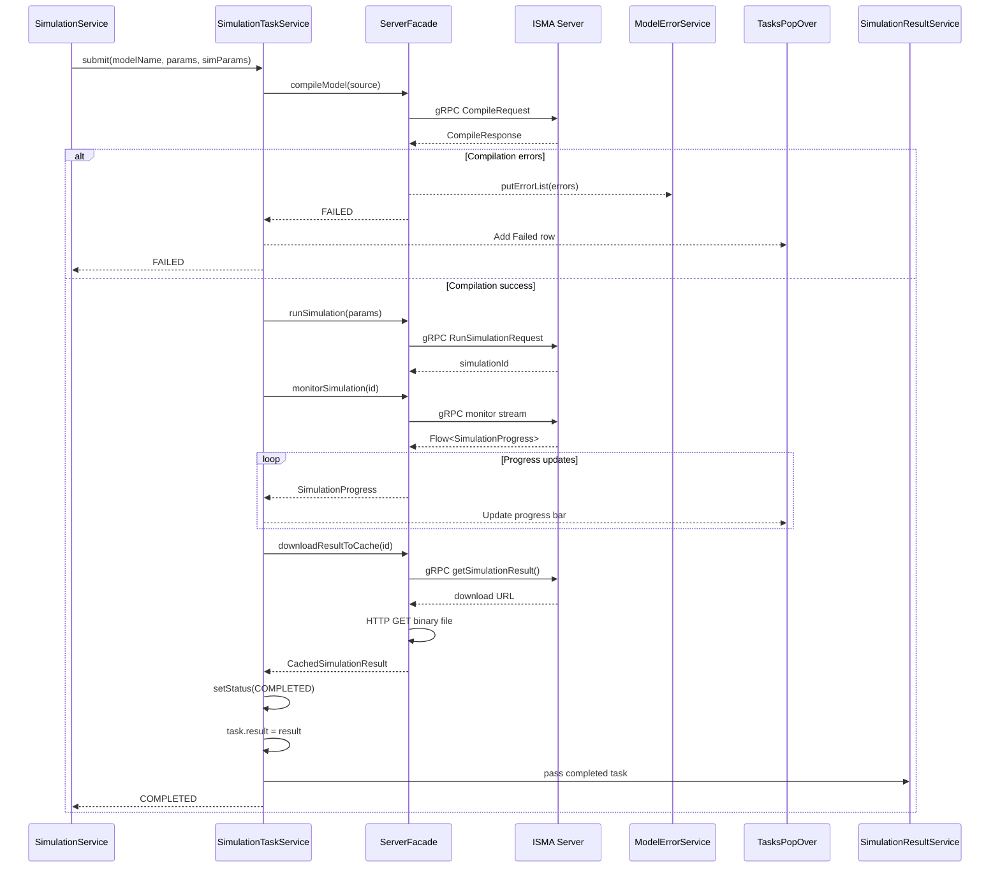
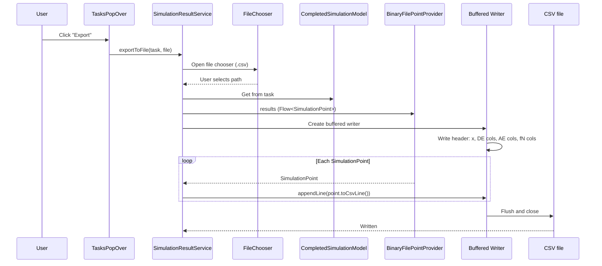

# Services

## Purpose

This document covers service algorithms, data flows, component lifecycle, error propagation, and default configuration values. Services form the business logic layer between the UI views and the external server communication layer.

## Service Overview

### IProjectService / ProjectService

**File:** [`IProjectService.kt`](../../app/src/main/kotlin/.../services/project/IProjectService.kt)

Interface declares: `projects: ObservableSet<IProjectModel>`, `activeProject: IProjectModel?`, `createNewBlueprint()`, `createNew()`, `addText()`, `addBlueprint()`, `close()`, `closeAll()`, `getAllProjects()`.

`ProjectService` implements `IProjectService`. The `getAllProjects()` method returns all projects as a snapshot array. Manages the observable set of projects. `IsmaEditorTabPane` observes this set to create/delete tabs.

### ProjectFileService

**File:** [`ProjectFileService.kt`](../../app/src/main/kotlin/.../services/project/ProjectFileService.kt)

FileChooser-based open/save operations. Supports three file types:
- `*.im2` — legacy ISMA project (marked TODO for backward compatibility)
- `*.iscm2` — text-based LISMA project → `LismaProjectModel`
- State chart project → `BlueprintProjectModel` (JSON-encoded `BlueprintModel`)

Save operations write `project.lismaText` or `Json.encodeToString(project.blueprint)` to file.

### ISimulationService / SimulationService (thin coordinator)

**File:** [`ISimulationService.kt`](../../app/src/main/kotlin/.../services/simulation/ISimulationService.kt)

A 36-line thin wrapper that delegates to `SimulationTaskService`. Constructor takes `projectService`, `simulationTaskService`, `simulationParametersService`. Methods: `simulate()` (snaps parameters, resolves active project, calls `SimulationTaskService.submit()`), `stopSimulation()` (cancels task). Companion exposes `SimulationScope` from `SimulationTaskService`.

### ISimulationTaskService / SimulationTaskService (full lifecycle)

**File:** [`ISimulationTaskService.kt`](../../app/src/main/kotlin/.../services/simulation/ISimulationTaskService.kt)

The complete simulation pipeline (151 lines). Constructor takes `serverFacade`, `modelErrorService`, `projectService`, `uiThreadExecutor`. Owns `val tasks: ObservableList<SimulationTask> = SimulationTask.ALL` and manages the 4-phase lifecycle:

| Phase | Method | Description |
|-------|--------|-------------|
| Compile | `serverFacade.compileModel(sourceCode)` | Populates `ModelErrorService` with errors; fails fast if errors exist |
| Run | `serverFacade.runSimulation(runParams)` | Starts simulation, adds task to `tasks` list |
| Monitor | `serverFacade.monitorSimulation(simulationId, 0.01)` | Collects `Flow<SimulationProgress>`, normalizes to 0.0–1.0, calls `task.setProgress()` |
| Download | `serverFacade.downloadResultToCache(simulationId)` | Creates `CompletedSimulationModel`, sets `task.result` and `task.setStatus(COMPLETED)` |

Uses `SimulationScope` — a global `CoroutineScope` backed by `Executors.newVirtualThreadPerTaskExecutor().asCoroutineDispatcher()` with `SupervisorJob()`. Each job is tracked in `currentJobs: MutableMap<SimulationTask, Job>`. Methods: `submit(modelName, params, simulationParameters)`, `cancelTask(task)`.

### ISimulationResultService / SimulationResultService

**File:** [`ISimulationResultService.kt`](../../app/src/main/kotlin/.../services/simulation/ISimulationResultService.kt)

Manages completed simulation results. Constructor takes `SimulationTaskService`, `GrinProcessLauncher`, and `UiThreadExecutor` (3 params).

| Method | Description |
| --- | --- |
| `removeResult(task)` | Removes task from `SimulationTask.ALL`, clears `task.result` |
| `showChart(task)` | Opens Grin chart viewer with axis picker dialog |
| `exportToFile(task, file)` | Exports to CSV asynchronously |

CSV export uses `BinaryFilePointProvider` to stream points via coroutine flow, writing to a buffered `Writer` on `Dispatchers.IO`. Uses `ResultServiceScope` (`CoroutineScope(Dispatchers.Default)`).

### LismaPdeService

**File:** [`LismaPdeService.kt`](../../app/src/main/kotlin/.../services/project/LismaPdeService.kt)

Validates LISMA source code via `serverFacade.validateModel()` and populates `ModelErrorService` with `ErrorViewModel` entries. Returns a sealed interface: `LismaPdeTranslationResult` with implementations `SuccessTranslation` and `FailedTranslation` (both data objects).

### SyntaxHighlighterService

**File:** [`editors/SyntaxHighlighterService.kt`](../../app/src/main/kotlin/.../services/editors/SyntaxHighlighterService.kt)

Provides syntax highlighting for the text editor. Delegates to `RemoteLismaHighlightingService` which calls `serverFacade.highlightSource()` to get token positions and kinds from the server.

### TextEditorFactory

**File:** [`editors/TextEditorFactory.kt`](../../app/src/main/kotlin/.../services/editors/TextEditorFactory.kt)

Factory for creating and disposing `IsmaTextEditor` instances. Used by the blueprint editor to create text editor tabs for state/loop content editing. Implements `ITextEditorFactory` interface from the blueprint-editor module.

### ModelErrorService

**File:** [`ModelErrorService.kt`](../../app/src/main/kotlin/.../services/ModelErrorService.kt)

Tracks compilation and validation errors in an `ObservableList<ErrorViewModel>`. Populated by `LismaPdeService` (validation) and `SimulationService` (compilation errors). Consumed by `IsmaErrorListTable` for display.

### SimulationParametersService

**File:** [`SimulationParametersService.kt`](../../app/src/main/kotlin/.../services/simulation/SimulationParametersService.kt)

Manages simulation parameter view models and provides store/load persistence as JSON files.

| Property | Type | Default |
| --- | --- | --- |
| `cauchyInitials` | `CauchyInitialsViewModel` | start=0.0, end=10.0, step=0.1 |
| `integrationMethod` | `IntegrationMethodParametersViewModel` | accuracy=0.1, server="localhost", port=7890, selectedMethod=first from list |
| `eventDetection` | `EventDetectionParametersViewModel` | gamma=0.8, lowBorder=0.001 |
| `resultSaving` | `ResultSavingParametersViewModel` | target=MEMORY |
| `resultProcessing` | `ResultProcessingParametersViewModel` | tolerance=20.0, selectedSimplifyMethod="Radial-Distance" |
| `integrationMethods` | `ObservableList<String>` | From server |
| `simplifyMethods` | `ObservableList<String>` | "Radial-Distance", "Douglas-Peucker" |

**Methods:**
- `store()` — opens FileChooser, serializes snapshot to JSON
- `load()` — opens FileChooser, deserializes JSON into view models
- `snapshot()` — captures current view model state into `SimulationParametersModel`
- `commit(model)` — applies `SimulationParametersModel` to all view models

File extension filter: `*.params.json` (constant from `FileExtentions.kt`).

### PreferencesProvider

**File:** [`PreferencesProvider.kt`](../../app/src/main/kotlin/.../services/preferences/PreferencesProvider.kt)

JSON file persistence using `kotlinx.serialization`. Constructor takes `settingsFilePath`. Property `preferences: PreferencesModel` with private setter, initialized via `load()`. Methods: `commit(windowPreferences)`, `commit(defaultFilesPreferences)`. Stores `WindowPreferencesModel` (geometry) and `DefaultFilesPreferencesModel` (last opened paths).

## Service Data Flow



The service data flow follows this sequence: `SimulationService` calls `SimulationTaskService.submit(modelName, params, simParams)`. `SimulationTaskService` calls `Facade.compileModel(source)`. If errors, they are sent to `ModelErrorService.putErrorList(ErrorViewModel[])` and the task returns FAILED to `SimulationService`. If success: `runSimulation(params)` returns a `simulationId`, then `monitorSimulation(id)` returns a `Flow<SimulationProgress>` which is used to call `task.setProgress(normalized)`, then `downloadResultToCache(id)` returns a `CachedSimulationResult`, and finally the task is marked COMPLETED with the result and passed to `SimulationResultService`.

## CSV Export Algorithm



`SimulationResultService.exportToFile()` opens a FileChooser, gets the `CompletedSimulationModel` from the task, builds a CSV header with `x, DE codes, AE codes, fN codes`, streams `BinaryFilePointProvider.results` and writes each value via `writer.appendLine(value.toCsvLine())`. CSV header: `x, [DE column names], [AE column names], f0, f1, ..., fN`. Each subsequent row = one simulation time step. Runs on `Dispatchers.IO` via `ResultServiceScope` (`CoroutineScope(Dispatchers.Default)`).

## Parameter Snapshot / Commit Pattern

```mermaid
graph LR
    subgraph Snapshot Flow → Server
        subgraph ViewModels
            Cauchy[CauchyInitialsViewModel<br/>snapshot()]
            Integration[IntegrationMethodParametersViewModel<br/>snapshot()]
            Event[EventDetectionParametersViewModel<br/>snapshot()]
            ResultSaving[ResultSavingParametersViewModel<br/>snapshot()]
        end
        ParamsSvc[SimulationParametersService<br/>snapshot() + toRunSimulationParams()]
        RunParams[RunSimulationParams]
        Server[ISMA Server gRPC]

        Cauchy --> ParamsSvc
        Integration --> ParamsSvc
        Event --> ParamsSvc
        ResultSaving --> ParamsSvc
        ParamsSvc --> RunParams
        RunParams --> Server
    end

    subgraph Commit Flow ← Preset
        ParamsModel[SimulationParametersModel]
        ParamsSvc2[SimulationParametersService<br/>commit(model)]
        Cauchy2[CauchyInitialsViewModel<br/>commit(model)]
        Integration2[IntegrationMethodParametersViewModel<br/>commit(model)]
        Event2[EventDetectionParametersViewModel<br/>commit(model)]
        ResultSaving2[ResultSavingParametersViewModel<br/>commit(model)]

        ParamsModel --> ParamsSvc2
        ParamsSvc2 --> Cauchy2
        ParamsSvc2 --> Integration2
        ParamsSvc2 --> Event2
        ParamsSvc2 --> ResultSaving2
    end
```

The snapshot/commit pattern has two flows:

- **Snapshot flow (ViewModel → Model → Server):** `snapshot()` on each ViewModel (CauchyInitialsViewModel, IntegrationMethodParametersViewModel, EventDetectionParametersViewModel, ResultSavingParametersViewModel) captures `Simple*Property` values into data class → `SimulationParametersService.snapshot()` assembles `SimulationParametersModel` → `toRunSimulationParams()` converts to `RunSimulationParams` → sent to server via gRPC
- **Commit flow (Model → ViewModel):** `commit(model)` on each ViewModel applies values from `SimulationParametersModel` to `Simple*Property` instances

## Error Propagation Flow

```mermaid
graph TB
    subgraph Server Side
        Server[ISMA Server<br/>Compile/Validate]
    end

    subgraph Client Side
        Facade[SimulationServerFacade<br/>CompileResult<br/>errors: List<CompilationErrorDto>]

        subgraph Compile Errors
            STS[SimulationTaskService<br/>setStatus(FAILED)]
            Tasks[TasksPopOver<br/>Failed section]
        end

        subgraph Validation Errors
            LismaPde[LismaPdeService<br/>LismaPdeTranslationResult]
        end

        ErrorSvc[ModelErrorService<br/>putErrorList()]
        ErrorVM[ErrorViewModel<br/>row, position, fragment, message]
        ErrorTable[IsmaErrorListTable<br/>TableView<ErrorViewModel>]
    end

    Server --> Facade
    Facade --> STS
    STS --> Tasks
    Facade --> ErrorSvc
    LismaPde --> ErrorSvc
    ErrorSvc --> ErrorVM
    ErrorVM --> ErrorTable
```

The error propagation flow: Server (compile/validate) → `SimulationServerFacade` → `CompileResult(errors: List<CompilationErrorDto>)` → `ModelErrorService.putErrorList()` → `ErrorViewModel(row, position, fragment, message)` → `IsmaErrorListTable` (TableView). The `CompileResult` also flows to `SimulationTaskService` which sets `task.setStatus(FAILED)` and then to `TasksPopOver` (Failed section).

Error sources:
- **Compilation errors** (Phase 1 of simulation): `CompilationErrorDto[]` → `ErrorViewModel[]` → `ModelErrorService` → `IsmaErrorListTable`
- **Validation errors** (Verify button): `LismaPdeService` → `ModelErrorService` → `IsmaErrorListTable`
- **Simulation failures** (any phase): `task.setStatus(FAILED)` → `task.setError(message)` → `TasksPopOver` (Failed section)

## Component Lifecycle

```mermaid
stateDiagram-v2
    [*] --> Created: ProjectService.createNew() / createNewBlueprint()

    Created --> ScopeCreated: KoinScopeComponent.createScope()

    ScopeCreated --> Injected: scopedOf(::LismaProjectDataProvider / ::IsmaTextEditor)

    Injected --> TabCreated: IsmaEditorTabPane observes addedAsFlow()

    TabCreated --> Active: Tab selection → activeProject = project

    Active --> Closed: Tab closeRequest → projectService.close()

    Closed --> Disposed: scope.close() → IsmaTextEditor.dispose()

    Disposed --> [*]

    note right of ScopeCreated
        LISMA path: LismaProjectModel →
        LismaProjectDataProvider →
        IsmaTextEditor (scoped) → Node qualifier

        Blueprint path: BlueprintProjectModel →
        BlueprintProjectDataProvider →
        IsmaBlueprintEditor (scoped) →
        ITextEditorFactory (scoped) →
        IsmaTextEditor (factory) → Node qualifier
    end note
```

The component lifecycle follows this state diagram:

`[*]` → `Created` (ProjectService.createNew() / createNewBlueprint()) → `ScopeCreated` (KoinScopeComponent.createScope()) → `Injected` (scopedOf(::LismaProjectDataProvider) / scopedOf(::IsmaTextEditor)) → `TabCreated` (IsmaEditorTabPane observes addedAsFlow()) → `Active` (Tab selection → activeProject = project) → `Closed` (Tab closeRequest → projectService.close()) → `Disposed` (scope.close() → IsmaTextEditor.dispose()) → `[*]`.

In the `ScopeCreated` state:
- **LISMA path:** LismaProjectModel → LismaProjectDataProvider → IsmaTextEditor (scoped) → Node qualifier
- **Blueprint path:** BlueprintProjectModel → BlueprintProjectDataProvider → IsmaBlueprintEditor (scoped) → ITextEditorFactory (scoped) → IsmaTextEditor (factory) → Node qualifier

**Project creation:**
1. `ProjectService.createNew()` → `LismaProjectModel` or `ProjectService.createNewBlueprint()` → `BlueprintProjectModel`
2. Project model implements `KoinScopeComponent` — creates its own Koin scope
3. Scoped dependencies injected: data provider, editor instance, editor node qualifier
4. `IsmaEditorTabPane` observes `projects.addedAsFlow()` and creates a `Tab`

**Project close:**
1. Tab close request → `projectController.close(project)`
2. `projects.remove(project)` + `project.dispose()`
3. `scope.close()` → triggers `onClose` callbacks for all scoped instances
4. `IsmaTextEditor.dispose()` called on scoped factory instances

## Error Handling

| Scenario | Behavior |
| --- | --- |
| Compilation errors | `CompilationErrorDto[]` → `ErrorViewModel[]` → `ModelErrorService.errors` → `IsmaErrorListTable` |
| Simulation compile failure | `task.setStatus(FAILED)`, `task.setError("Compilation failed: ...")` |
| Simulation run failure | `task.setStatus(FAILED)`, `task.setError("Monitor error: ...")` |
| Simulation download failure | `task.setStatus(FAILED)`, `task.setError("Download error: ...")` |
| No active project | `task.setStatus(FAILED)`, `task.setError("No active project")` |
| Server process not found | `IllegalStateException` — "isma-server script not found at: $scriptPath" |
| Missing env/property | `IllegalStateException` — "Neither environment variable ... nor system property ... is set" |
