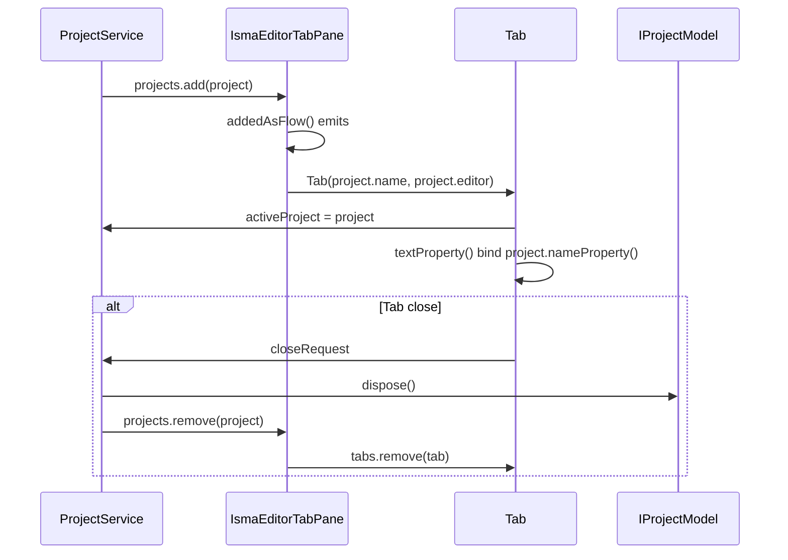

# UI Layout

## Main Window

```
┌────────────────────────────────────────────────────────────────────┐
│ Menu Bar: [File] [Edit] [Simulation]                              │
├────────────────────────────────────────────────────────────────────┤
│ Toolbar: [New] [Blueprint] [Open] [Save] [SaveAll] │ [Cut] [Copy] │
│          [Paste] │ [Verify] │ [Store] [Load]                      │
├──────────────────────────────────────────┬────────────────────────┤
│                                          │ ┌────────────────────┐ │
│                                          │ │ Settings Panel     │ │
│                                          │ │ [Initials]         │ │
│                                          │ │ [Integration]      │ │
│                                          │ │ [Event detection]  │ │
│                                          │ │ [Result saving]    │ │
│                                          │ └────────────────────┘ │
│  ┌─────────────────────────────────────┐ │                        │
│  │  Editor Area (TabPane)              │ │                        │
│  │  [New project | Tab 2 | ...]        │ │                        │
│  │  ┌───────────────────────────────┐  │ │                        │
│  │  │  Text Editor or               │ │ │                        │
│  │  │  Blueprint Canvas             │ │ │                        │
│  │  │                               │ │ │                        │
│  │  └───────────────────────────────┘  │ │                        │
│  ├─────────────────────────────────────┤ │                        │
│  │ Error List (collapsible)            │ │                        │
│  │ ┌────┬────┬─────────┬───────────┐  │ │                        │
│  │ │Row │Pos │Fragment │Message    │  │ │                        │
│  │ └────┴────┴─────────┴───────────┘  │ │                        │
│  ├─────────────────────────────────────┤ │                        │
│  │ [▶ Play] [Tasks ▼]                  │ │                        │
│  └─────────────────────────────────────┘ │                        │
└──────────────────────────────────────────┴────────────────────────┘
```

The left drawer (`Drawer`) is commented out. The error list is a dedicated `ErrorListDrawer` in the bottom area (above the simulation process bar).

## Toolbar Layout

```
┌──────────────────────────────────────────────────────────────────────┐
│ [add_circle_outline] [add_box] [folder_open] [save] [save_alt] │ [cut]│
│ [copy] [paste] │ [check_circle] │ [bookmark] [bookmark_border]       │
└──────────────────────────────────────────────────────────────────────┘
  New   Blueprint  Open   Save   SaveAll  Cut  Copy Paste Verify Store Load
```

| # | Icon Glyph | Tooltip | Action |
|---|-----------|---------|--------|
| 1 | `add_circle_outline` | "New model" | Same as File → New text |
| 2 | `add_box` | "New statechart" | Same as File → New Statechart |
| 3 | `folder_open` | "Open model" | Same as File → Open |
| 4 | `save` | "Save current model" | Same as File → Save |
| 5 | `save_alt` | "Save all models" | Same as File → Save all |
| — | *(separator)* | — | — |
| 6 | `content_cut` | "Cut" | Same as Edit → Cut |
| 7 | `content_copy` | "Copy" | Same as Edit → Copy |
| 8 | `content_paste` | "Paste" | Same as Edit → Paste |
| — | *(separator)* | — | — |
| 9 | `check_circle` | "Verify" | Same as Simulation → Verify |
| — | *(separator)* | — | — |
| 10 | `bookmark` | "Store Settings" | Same as Simulation → Store Settings |
| 11 | `bookmark_border` | "Load Settings" | Same as Simulation → Load Settings |

Icons use Material Design glyphs.

## Settings Panel Accordion

```
┌──────────────────────────────┐
│ ▼ Initials                   │
│ ┌──────────────────────────┐ │
│ │ Start:    [_____]        │ │
│ │ End:      [_____]        │ │
│ │ Step:     [_____]        │ │
│ └──────────────────────────┘ │
│ ▼ Integration                │
│ ┌──────────────────────────┐ │
│ │ Method:   [Euler    ▼]   │ │
│ │ Accurate: [☐]            │ │
│ │ Accuracy: [_____]        │ │
│ │ Stable:   [☐]            │ │
│ │ Parallel:[☐]             │ │
│ │ Server:   [localhost]    │ │
│ │ Port:     [7890    ]     │ │
│ └──────────────────────────┘ │
│ ▼ Event Detection            │
│ ┌──────────────────────────┐ │
│ │ In use:   [☐]            │ │
│ │ Gamma:    [_____]        │ │
│ │ Step limit:[☐]           │ │
│ │ Low border:[_____]       │ │
│ └──────────────────────────┘ │
│ ▼ Result Saving              │
│ ┌──────────────────────────┐ │
│ │ Save result: [MEMORY ▼]  │ │
│ └──────────────────────────┘ │
└──────────────────────────────┘
```

The settings panel extends `PropertiesAccordion` (from toolkit) with 4 sub-views wrapped in `VBox` with `styleClass = "settings-box"` and `prefWidth = 240.0`. Each sub-view contains a `ScrollPane` with a `propertiesGrid` layout (label on the left, control on the right).

## Tab Lifecycle



`IsmaEditorTabPane` observes `ProjectService.projects` via coroutine flow. Creates a `Tab` for each project with `Tab(it.name, it.editor)`. On tab close, calls `projectController.close(project)` which removes from the set and disposes the project scope. Tab text is bound to `project.nameProperty()`. Tab selection sets `projectController.activeProject = project`.
