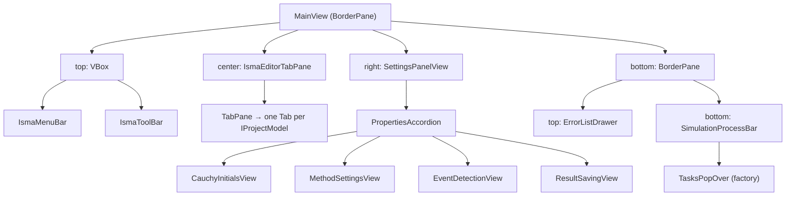
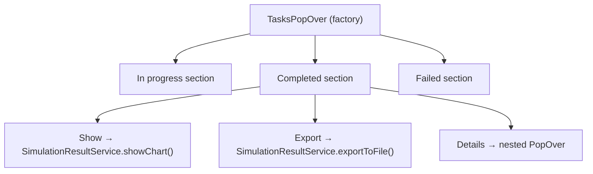

# Views

## View Hierarchy

## MainView

**File:** [`MainView.kt`](../../app/src/main/kotlin/.../views/MainView.kt)

`BorderPane` layout with 4 regions:
- **top:** `VBox` containing `IsmaMenuBar` + `IsmaToolBar`
- **center:** `IsmaEditorTabPane`
- **right:** `SettingsPanelView`
- **bottom:** nested `BorderPane` with `ErrorListDrawer` (top) + `SimulationProcessBar` (bottom)

Constructor takes 6 dependencies: `SimulationProcessBar`, `ErrorListDrawer`, `IsmaMenuBar`, `IsmaToolBar`, `IsmaEditorTabPane`, `SettingsPanelView`.

## Toolbars

| Component | File | Description |
| --- | --- | --- |
| `IsmaMenuBar` | [`IsmaMenuBar.kt`](../../app/src/main/kotlin/.../views/toolbars/IsmaMenuBar.kt) | File (New/Open/Save/Close/Exit), Edit (Cut/Copy/Paste), Simulation (Verify/Run/Store/Load Settings) |
| `IsmaToolBar` | [`IsmaToolBar.kt`](../../app/src/main/kotlin/.../views/toolbars/IsmaToolBar.kt) | Same commands as buttons: New model, New statechart, Open, Save, Save all, Cut, Copy, Paste, Verify, Store/Load Settings |
| `SimulationProcessBar` | [`SimulationProcessBar.kt`](../../app/src/main/kotlin/.../views/toolbars/SimulationProcessBar.kt) | Play button (triggers `simulate()`) + Tasks button (opens `TasksPopOver`) |
| `IsmaErrorListTable` | [`IsmaErrorListTable.kt`](../../app/src/main/kotlin/.../views/toolbars/IsmaErrorListTable.kt) | `TableView<ErrorViewModel>` with Row/Position/Fragment/Message columns |
| `TasksPopOver` | [`TasksPopOver.kt`](../../app/src/main/kotlin/.../views/toolbars/TasksPopOver.kt) | `PopOver` with 3 sections (In progress, Completed, Failed) bound to `SimulationTaskService.tasks` via `changeAsFlow()` |

## ErrorListDrawer

**File:** [`ErrorListDrawer.kt`](../../app/src/main/kotlin/.../views/layout/ErrorListDrawer.kt)

A `TitledPane("Error list", ismaErrorListTable)` that wraps `IsmaErrorListTable` in a collapsible panel. `isCollapsible = true`, `isExpanded = false` by default. Used in the bottom area of `MainView`.

## IsmaEditorTabPane

**File:** [`IsmaEditorTabPane.kt`](../../app/src/main/kotlin/.../views/tabpane/IsmaEditorTabPane.kt)

Observes `ProjectService.projects` via coroutine flow. In `init` block: launches coroutine that merges `projectController.projects.asFlow()` and `projectController.projects.addedAsFlow()`, cancels on removal, and collects to call `addTabAndSelect(Tab(it.name, it.editor).apply { initProjectTab(it) })`. Creates a `Tab` for each project. On tab close, calls `projectController.close(project)` which removes from the set and disposes the project scope.

## Settings Panel

**File:** [`SettingsPanelView.kt`](../../app/src/main/kotlin/.../views/settings/SettingsPanelView.kt)

Extends `PropertiesAccordion` (from toolkit) with 4 sub-views wrapped in `VBox` with `styleClass = "settings-box"` and `prefWidth = 240.0`:

| View | ViewModel | Purpose |
| --- | --- | --- |
| `CauchyInitialsView` | `CauchyInitialsViewModel` | Start time, end time, initial step |
| `MethodSettingsView` | `IntegrationMethodParametersViewModel` | Method, accuracy, stability, parallel, server/port |
| `EventDetectionView` | `EventDetectionParametersViewModel` | Event detection, gamma, step limit, low border |
| `ResultSavingView` | `ResultSavingParametersViewModel` | Save target (MEMORY/FILE only — Simplify/Tolerance not yet in UI) |

`MethodSettingsView` includes `Accurate` checkbox (with `Accuracy` field disabled unless enabled), `Stable` checkbox, `Parallel` checkbox (with `Server` and `Port` fields disabled unless enabled).

## ViewModel → View Bindings

All view models use plain JavaFX `Simple*Property` classes with Kotlin property delegation (`getValue`/`setValue` from toolkit). No TornadoFX `bind` helpers.

### CauchyInitialsViewModel

**File:** [`CauchyInitialsViewModel.kt`](../../app/src/main/kotlin/.../viewmodels/CauchyInitialsViewModel.kt)

Uses `SimpleDoubleProperty` for `startTime`, `endTime`, `step` with Kotlin property delegation. Methods: `commit(model: CauchyInitialsModel)`, `snapshot() → CauchyInitialsModel`.

Defaults: `startTime=0.0`, `endTime=10.0`, `step=0.1`.

### IntegrationMethodParametersViewModel

**File:** [`IntegrationMethodParametersViewModel.kt`](../../app/src/main/kotlin/.../viewmodels/IntegrationMethodParametersViewModel.kt)

Uses `SimpleStringProperty` for `selectedMethod` and `server`, `SimpleDoubleProperty` for `accuracy`, `SimpleIntegerProperty` for `port`, `SimpleBooleanProperty` for `isAccuracyInUse`, `isStableAllowedInUse`, `isStableInUse`, `isParallelInUse`. Methods: `commit(model: IntegrationMethodParametersModel)`, `snapshot() → IntegrationMethodParametersModel`.

Defaults: `accuracy=0.1`, `server="localhost"`, `port=7890`. `selectedMethod` set to first item from `integrationMethods` list.

### EventDetectionParametersViewModel

**File:** [`EventDetectionParametersViewModel.kt`](../../app/src/main/kotlin/.../viewmodels/EventDetectionParametersViewModel.kt)

Uses `SimpleBooleanProperty` for `isEventDetectionInUse` and `isStepLimitInUse`, `SimpleDoubleProperty` for `gamma` and `lowBorder`. Methods: `commit(model: EventDetectionParametersModel)`, `snapshot() → EventDetectionParametersModel`.

Defaults: `gamma=0.8`, `lowBorder=0.001`.

### ResultSavingParametersViewModel

**File:** [`ResultSavingParametersViewModel.kt`](../../app/src/main/kotlin/.../viewmodels/ResultSavingParametersViewModel.kt)

Uses `SimpleObjectProperty<SaveTarget>` initialized to `SaveTarget.MEMORY` with Kotlin property delegation. Methods: `commit(model: ResultSavingParametersModel)`, `snapshot() → ResultSavingParametersModel(savingTarget)`.

### ResultProcessingParametersViewModel

**File:** [`ResultProcessingParametersViewModel.kt`](../../app/src/main/kotlin/.../viewmodels/ResultProcessingParametersViewModel.kt)

Uses `SimpleBooleanProperty` for `isSimplifyInUse`, `SimpleStringProperty` for `selectedSimplifyMethod`, `SimpleDoubleProperty` for `tolerance`.

Defaults: `tolerance=20.0`, `selectedSimplifyMethod` set to first item from `simplifyMethods` list ("Radial-Distance").

## View → ViewModel Binding Table

| View | ViewModel | Bound Properties |
| --- | --- | --- |
| `CauchyInitialsView` | `CauchyInitialsViewModel` | `startTime`, `endTime`, `step` |
| `MethodSettingsView` | `IntegrationMethodParametersViewModel` | `selectedMethod`, `accuracy`, `isAccuracyInUse`, `isStableInUse`, `isParallelInUse`, `server`, `port` |
| `EventDetectionView` | `EventDetectionParametersViewModel` | `isEventDetectionInUse`, `isStepLimitInUse`, `gamma`, `lowBorder` |
| `ResultSavingView` | `ResultSavingParametersViewModel` | `savingTarget` |

**Conditional bindings:**
- `accuracy` field disabled when `isAccuracyInUse` unchecked: `disableProperty().bind(isAccuracyInUseProperty.not())`
- `server` / `port` fields disabled when `isParallelInUse` unchecked: `disableProperty().bind(isParallelInUseProperty.not())`
- `gamma` field disabled when `isEventDetectionInUse` unchecked
- `lowBorder` field disabled when `isStepLimitInUse` unchecked

## Error List Table

**File:** [`IsmaErrorListTable.kt`](../../app/src/main/kotlin/.../views/toolbars/IsmaErrorListTable.kt)

`TableView<ErrorViewModel>` bound to `ModelErrorService.errors` observable list.

| Column | Width | Content |
| --- | --- | --- |
| Row | 5% | Line number where the error occurred |
| Position | 5% | Character position on the line |
| Fragment | 10% | Name of the code fragment/region |
| Message | 80% | Human-readable error description |

Populated by:
- **Compile errors:** When "Run" is clicked, compilation errors from the server appear here
- **Verify results:** When "Verify" is clicked, validation errors appear here
- Each new run/verify clears the previous error list and shows fresh errors

## Tasks PopOver

**File:** [`TasksPopOver.kt`](../../app/src/main/kotlin/.../views/toolbars/TasksPopOver.kt)

A floating panel that opens from the "Tasks" button. Shows running and completed simulations. Bound to `SimulationTaskService.tasks` via `changeAsFlow()`.

**In progress section:** Task label, progress bar, Abort button. Removed on completion or abort.

**Completed section:** Task label, Show button (opens chart), Export button (CSV), Remove button, Details chevron (nested PopOver with simulation metadata).

**Failed section:** Task label, error message in red text, Remove button. Populated on compile/run/download failure or cancellation.

## Dialogs

### Select Variables Dialog (Axis Picker)

**File:** [`ItemsPickerDialog.kt`](../../app/src/main/kotlin/.../views/dialogs/ItemsPickerDialog.kt)

Opens when the user clicks "Show" on a completed simulation. Used to select which axes/variables to plot.

**Elements:**
- **X Axis ComboBox:** Dropdown listing all available columns. One item selectable. Default: "TIME" column pre-selected.
- **Y Axis ListView:** Scrollable list with checkboxes next to each column name. Multiple items selectable.
- **Select all / Unselect all:** Bulk checkbox toggles
- **Ok / Close:** Confirm or cancel

**Behavior:** `NamedPickerItem` wraps column name + index. `NamedPickerModel` holds X-axis default and Y-axis options. On confirmation, returns `PickedAxisVariables(xAxisItem, yAxisItems)`.
