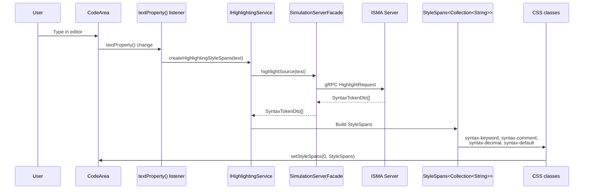
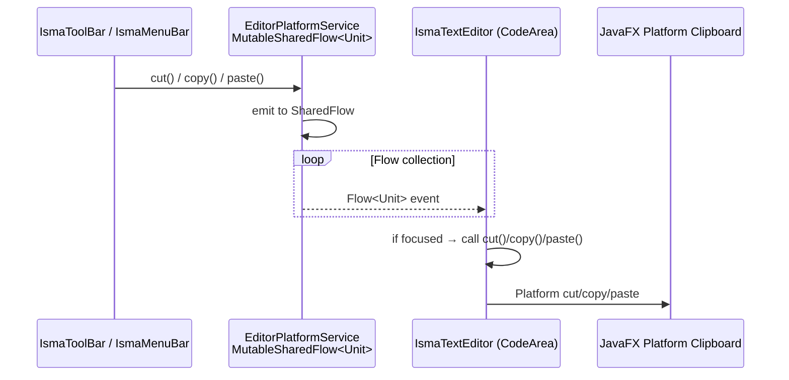

# Editors

## Text Editor Module

### Architecture

The text editor module provides a rich text editing component with server-driven syntax highlighting and clipboard event propagation. It is a reusable JavaFX control injected into project models.

### IsmaTextEditor

**File:** [`IsmaTextEditor.kt`](../../text-editor/src/main/kotlin/.../IsmaTextEditor.kt)

`BorderPane` wrapping `fxmisc.richtext.CodeArea` with:
- Consolas 12pt font
- Line numbers via `LineNumberFactory`
- Remote syntax highlighting via `IHighlightingService` (delegates to server's `highlightSource()`)
- Cut/copy/paste event propagation from `IEditorPlatformService`

Constructor takes `textEditorService: IEditorPlatformService` and `highlightingService: IHighlightingService`. In `init`: creates `CodeArea` with CSS font style, subscribes to `cutEvent`/`copyEvent`/`pasteEvent` flows (propagates only if focused), adds `textProperty()` listener that calls `highlightingService.createHighlightingStyleSpans()` and applies via `setStyleSpans(0, highlighting)`.

### Syntax Highlighting Pipeline



The syntax highlighting pipeline: User types in `CodeArea` → `textProperty()` change → `IHighlightingService.createHighlightingStyleSpans()` → `SimulationServerFacade.highlightSource()` → `SyntaxTokenDto[]` → back to `IHighlightingService` → `StyleSpans<Collection<String>>` → CSS classes (`syntax-keyword`, `syntax-comment`, `syntax-decimal`, `syntax-default`) → `CodeArea.setStyleSpans(0, StyleSpans)`.

CSS classes applied: `syntax-keyword`, `syntax-comment`, `syntax-decimal`, `syntax-default`.

### Clipboard Propagation



The clipboard propagation flow: `IsmaToolBar` / `IsmaMenuBar` calls `cut()` / `copy()` / `paste()` on `EditorPlatformService` → `EditorPlatformService` emits to `MutableSharedFlow<Unit>` → the flow is collected by `IsmaTextEditor` (CodeArea) which calls `cut()` if focused → Platform cut/copy/paste is performed.

**File:** [`EditorPlatformService.kt`](../../text-editor/src/main/kotlin/.../services/EditorPlatformService.kt)

Coroutine-based service that propagates cut/copy/paste events via `MutableSharedFlow<Unit>`. Constructor creates a `CoroutineScope(Dispatchers.Default)`. Three internal `MutableSharedFlow<Unit>` instances exposed as read-only `SharedFlow`. Methods `cut()`, `copy()`, `paste()` each launch a coroutine to emit to their respective flow.

### Contracts

**File:** [`IEditorPlatformService.kt`](../../text-editor/src/main/kotlin/.../services/contracts/IEditorPlatformService.kt)

Interface declares: `cutEvent: Flow<Unit>`, `copyEvent: Flow<Unit>`, `pasteEvent: Flow<Unit>`, `cut()`, `copy()`, `paste()`.

**File:** [`IHighlightingService.kt`](../../text-editor/src/main/kotlin/.../services/contracts/IHighlightingService.kt)

Interface declares: `createHighlightingStyleSpans(text: String): StyleSpans<Collection<String>>`.

**File:** [`RemoteLismaHighlightingService.kt`](../../text-editor/src/main/kotlin/.../services/RemoteLismaHighlightingService.kt)

Implementation of `IHighlightingService` that delegates to `SimulationServerFacade.highlightSource()`. Converts `SyntaxTokenDto[]` from the server into `StyleSpans<Collection<String>>` with CSS class mappings.

## Blueprint Editor Module

### MVVM Split

```mermaid
graph TB
    subgraph View
        Editor[IsmaBlueprintEditor<br/>BorderPane, 112 lines<br/>UI only, zero business logic]
        Canvas[Pane<br/>Canvas]
        ToolBar[ToolBar<br/>Bottom]
        TabPane[TabPane<br/>Diagram tab]
    end

    subgraph ViewModel
        VM[IsmaBlueprintViewModel<br/>All business logic, 461 lines]
    end

    subgraph Model_Serializable
        BM[BlueprintModel<br/>@Serializable]
        CVM[CanvasViewModel<br/>ObservableLists]
    end

    subgraph Controls
        SB[StateBox[]]
        TA[TransactionArrow[]]
        LTA[LoopTransactionArrow[]]
        EAP[EditArrowPopOver<br/>Floating]
    end

    Editor --> VM
    Editor --> Canvas
    Editor --> ToolBar
    Editor --> TabPane

    VM --> BM
    VM --> CVM
    VM --> SB
    VM --> TA
    VM --> LTA
    VM --> EAP
```

The MVVM split: `IsmaBlueprintEditor` (View, UI only, 112 lines) depends on `IsmaBlueprintViewModel` (ViewModel, all logic, 461 lines), which depends on `BlueprintModel` / `CanvasViewModel` (Model). The View also depends on `Pane` (canvas), `ToolBar` (bottom), and `TabPane` (Diagram tab). The ViewModel depends on `StateBox[]`, `TransactionArrow[]` / `LoopTransactionArrow[]`, and `EditArrowPopOver` (floating).

**File:** [`IsmaBlueprintEditor.kt`](../../blueprint-editor/src/main/kotlin/.../IsmaBlueprintEditor.kt) (112 lines)

Pure UI component — a `BorderPane` that creates the canvas, toolbar, and delegates all logic to `IsmaBlueprintViewModel`. 100% Kotlin, no FXML files. Constructor takes `editorFactory: ITextEditorFactory`, creates `Pane` canvas and `IsmaBlueprintViewModel` instance. Toolbar buttons and canvas events delegate to viewModel methods. Accessor methods: `getBlueprintModel()`, `setBlueprintModel(model)`.

**File:** [`IsmaBlueprintViewModel.kt`](../../blueprint-editor/src/main/kotlin/.../IsmaBlueprintViewModel.kt) (461 lines)

Contains all editor logic: state management, arrow creation/removal, canvas operations, serialization, and name monitoring.

| Method | Description |
|--------|-------------|
| `resetMode()` | Sets `editorMode = EditorMode.Idle` |
| `toggleAddTransition()` | Sets mode to `AddTransition`, resets counter |
| `toggleRemoveState()` | Sets mode to `RemoveState` |
| `toggleRemoveTransition()` | Sets mode to `RemoveTransition` |
| `addState(x, y, text)` | Creates new `StateBox`, registers name |
| `removeState(box)` | Removes state + associated arrows (protects Main/Init) |
| `recordTransitionSource(box)` | Records first/second click for transition creation |
| `addTransactionArrow(start, end, pred, alias)` | Creates `TransactionArrow` with geometry bindings |
| `addLoopArrow(box, text, pred, alias)` | Creates `LoopTransactionArrow` with geometry bindings |
| `toBlueprintModel()` | Serializes canvas to `BlueprintModel` |
| `fromBlueprintModel(model)` | Rebuilds canvas from serialized model |
| `openStateTextEditor(state)` | Creates text editor tab for state content |
| `openLoopTextEditor(arrow, state)` | Creates text editor tab for loop content |
| `onStatePress/release/drag` | Drag interaction handlers |

### Canvas Architecture

```mermaid
graph TB
    subgraph Canvas Pane
        Scroll[ScrollPane]
        subgraph CanvasContent[Pane - Absolute Positioning]
            MainState[Main state box<br/>fixed, LightGreen<br/>position (20, 0)]
            InitState[Init state box<br/>fixed, LightBlue<br/>position (10, 100)]
            UserStates[User states []<br/>Coral, draggable]
            TransArrows[Transaction arrows []<br/>center-to-center]
            LoopArrows[Loop arrows []<br/>circle + arrowhead]
            EditPopOver[EditArrowPopOver<br/>transient, floating]
        end
    end

    UserStates -.->|referenced by| TransArrows
    UserStates -.->|referenced by| LoopArrows
```

The canvas is a `Pane` (scrollable via `ScrollPane`) containing: `Main state box` (fixed, LightGreen), `Init state box` (fixed, LightBlue), `User states []` (Coral, draggable), `Transaction arrows []` (center-to-center), `Loop arrows []` (circle + arrowhead), and `EditArrowPopOver` (transient). User states are referenced by arrows and loops.

**File:** [`CanvasViewModel.kt`](../../blueprint-editor/src/main/kotlin/.../models/CanvasViewModel.kt) (69 lines)

Holds observable lists of canvas elements with editor-specific wrapper classes: `states: ObservableList<StateBox>`, `transactions: ObservableList<EditorTransaction>`, `loopTransactions: ObservableList<EditorLoopTransaction>`.

Inner data classes:
- `EditorTransaction(startBox, endBox, arrow: TransactionArrow)`
- `EditorLoopTransaction(stateBox, arrow: LoopTransactionArrow)`

### Editor Factory SPI

**File:** [`ITextEditorFactory.kt`](../../blueprint-editor/src/main/kotlin/.../services/ITextEditorFactory.kt)

Interface for creating/disposing text editor nodes. Injected via Koin to decouple the blueprint editor from the text-editor module. Declares: `createTextEditor(text: String, onTextChanged: (String) -> Unit): Node`, `disposeInstance(node: Node)`.

The implementation (in app module) wraps `IsmaTextEditor` instances and provides per-project Koin scopes. Each blueprint project gets its own factory and editor pool.

### Editor Mode State Machine

**File:** [`EditorMode.kt`](../../blueprint-editor/src/main/kotlin/.../EditorMode.kt)

Sealed class hierarchy defining the editor's interaction modes: `Idle`, `AddTransition(selectedStates: MutableList<StateBox>)`, `RemoveState`, `RemoveTransition`.

Modes are mutually exclusive. Every toolbar button action calls `resetMode()` before setting or toggling its own mode.

## Deep Specification

For detailed specification of the blueprint editor (state boxes, transitions, popover, toolbar modes, geometry algorithms, LISMA conversion, dimensions), see [`blueprint-editor/README.md`](../blueprint-editor/README.md).
